# Architecture diagrams

This is the single source of truth for **how `local_scribe` is wired
together**, rendered in [Mermaid](https://mermaid.js.org/) so GitHub
displays each diagram inline. Companion to:

- [`README.md`](README.md) — feature overview + operator guide
- [`SECURITY.md`](SECURITY.md) — threat model + defence layers in prose
- [`CHAR_REVIEW.md`](CHAR_REVIEW.md) — Char binary audit + network egress evidence
- [`TODO.md`](TODO.md) — open mitigations

> **Diagram-vs-reality note.** A few of these diagrams describe
> architecture that is implemented in code but **not yet wired into
> `./run.sh bootstrap`** on every install — specifically the
> Keychain master key, the sparse-bundle vault, and the YubiKey
> escrow path. Where this matters, the prose says so. See
> [`TODO.md`](TODO.md) for the remaining wiring work.

## Contents

1. [System overview](#1-system-overview)
2. [Component dependencies](#2-component-dependencies)
3. [Bootstrap flow](#3-bootstrap-flow)
4. [At-rest encryption (designed)](#4-at-rest-encryption-designed)
5. [Service authentication (HKDF tokens)](#5-service-authentication-hkdf-tokens)
6. [Outbound network firewall](#6-outbound-network-firewall)
7. [Char privacy audit](#7-char-privacy-audit)
8. [Live transcription (Deepgram-shape)](#8-live-transcription-deepgram-shape)
9. [Batch transcription (OpenAI-shape)](#9-batch-transcription-openai-shape)
10. [Diarization pipeline](#10-diarization-pipeline)
11. [Transcript history lifecycle](#11-transcript-history-lifecycle)
12. [Inspector UI flow](#12-inspector-ui-flow)
13. [Destructive-action confirmation (typed-DELETE)](#13-destructive-action-confirmation-typed-delete)
14. [Threat model × defence layers](#14-threat-model--defence-layers)
15. [Vault & key lifecycle](#15-vault--key-lifecycle)

### Legend

| shape | meaning |
|---|---|
| `[ rectangle ]` | code module / running service |
| `( rounded )` | external CLI command or human action |
| `(( circle ))` | actor (user / external) |
| `{ diamond }` | decision branch |
| `{{ hexagon }}` | OS-level control (Keychain, `/etc/hosts`, Touch ID, etc.) |
| `[( cylinder )]` | persistent storage |
| solid `-->` | active data / control flow |
| dashed `-.->` | optional / blocked / external attempt |
| crossed `-.X.->` | request that is *intentionally refused* by a defence layer |

---

## 1. System overview

The whole pipeline on one screen: how user audio reaches a finished
note, and which boundary the firewall enforces against any external
provider attempting to receive that audio.

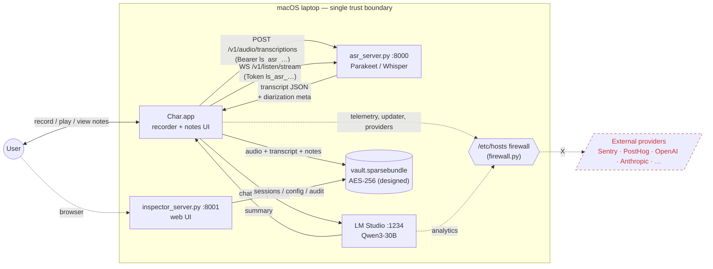

---

## 2. Component dependencies

File-level dependency graph. Anything in the **crypto / auth** column
roots at the Keychain master key; anything in **pipeline** is pure
data processing that doesn't see secrets.

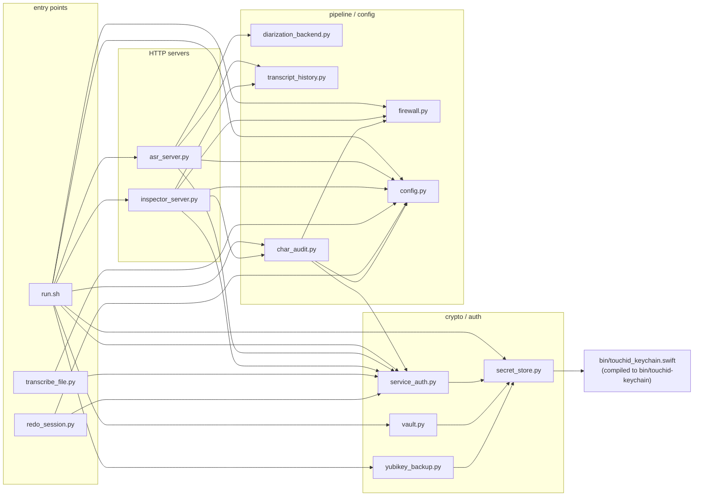

---

## 3. Bootstrap flow

What `./run.sh bootstrap` actually does on a fresh clone. The numbers
match the section headers printed at runtime.


---

## 4. At-rest encryption (designed)

The full key + data graph as it lives in code. Hot (in-memory only)
items are red; cold (on-disk ciphertext) items are blue. The bytes
inside `secret_store.MasterKey` are the only ones that must never
touch argv, env vars, or any file other than the Keychain item or
the YubiKey-encrypted backup.

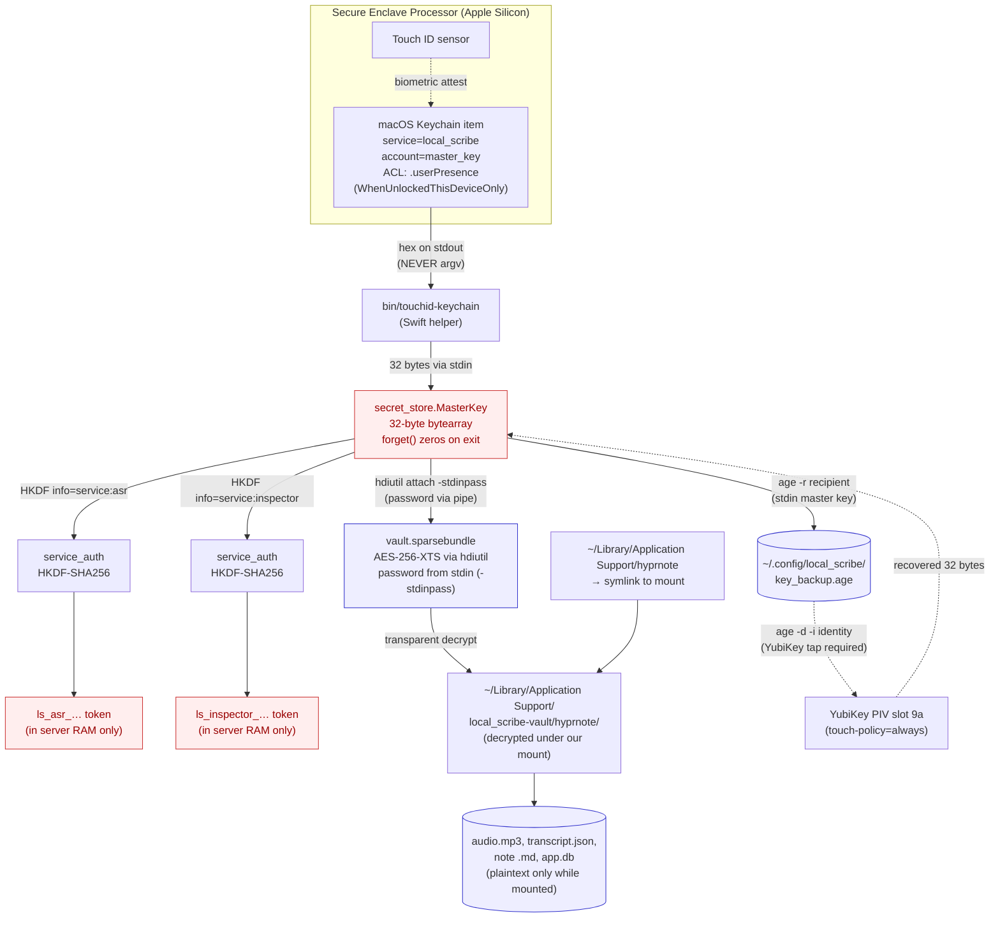

---

## 5. Service authentication (HKDF tokens)

How a Char "Generate" click winds up authenticated against the ASR
server, end-to-end. Read this top to bottom and you have the whole
auth contract.

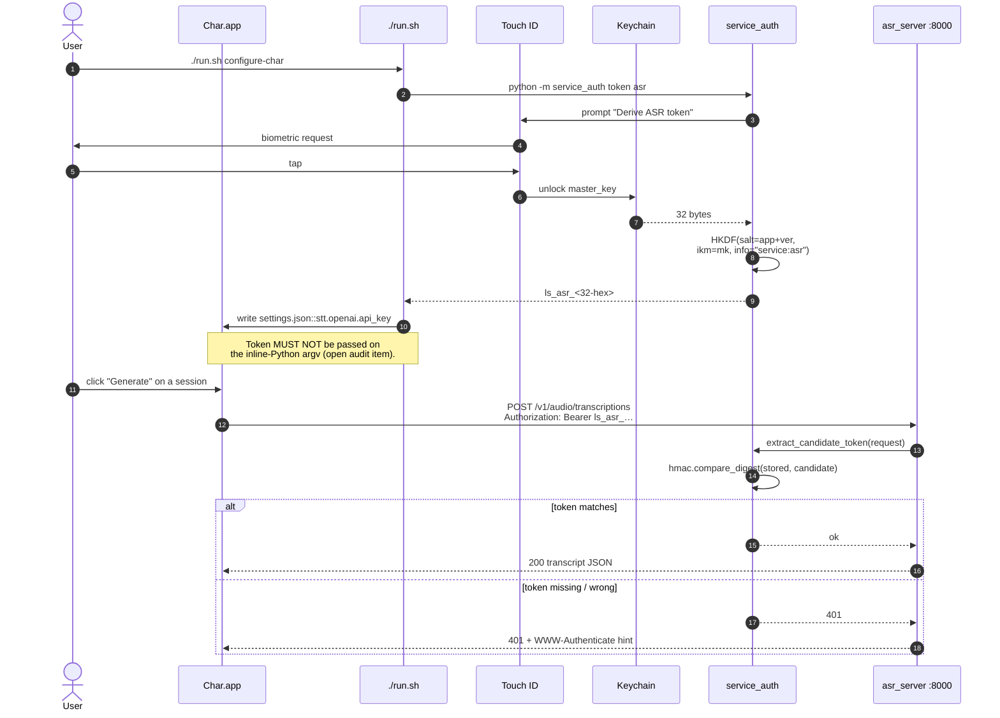

---

## 6. Outbound network firewall

`firewall.py` writes a marker-delimited block into `/etc/hosts` that
blackholes every host in `BLOCK_CATALOG` to `0.0.0.0` (IPv4) and `::`
(IPv6). Categories are independently togglable. The block is
idempotent; reapply with `./run.sh firewall enable`.

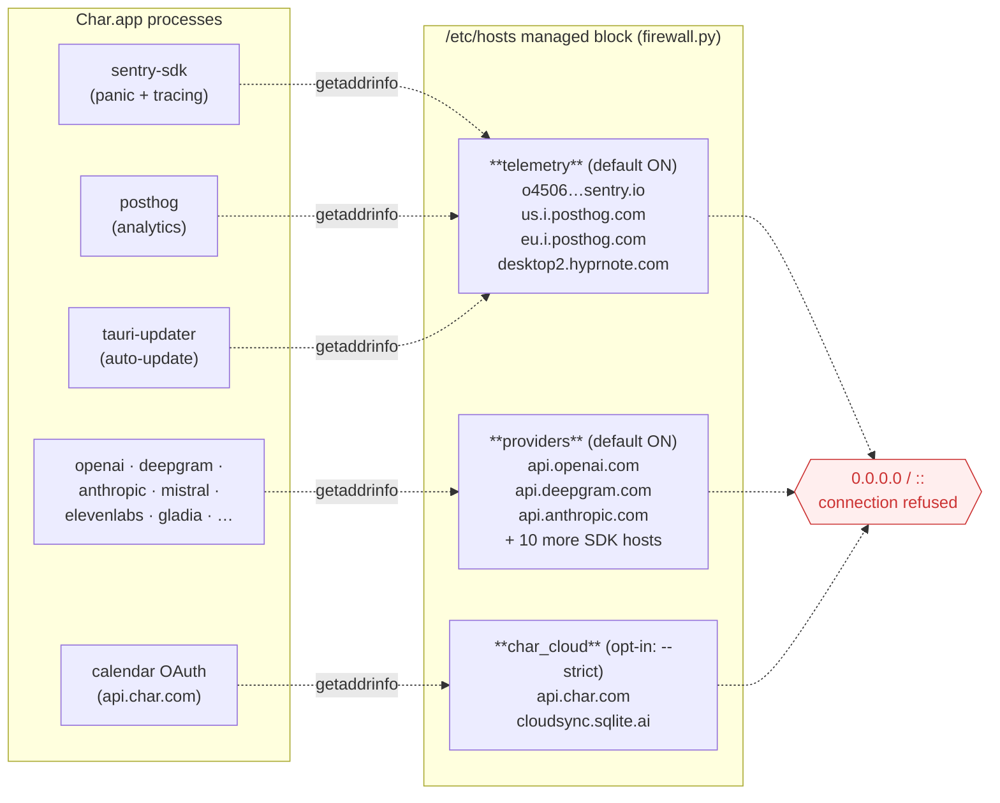

---

## 7. Char privacy audit

What `./run.sh doctor` and `python -m char_audit` actually check.
Every check returns OK / INFO / WARN / FAIL, with a hint for how to
remediate. The endpoint `/api/char/audit` returns the same data as
JSON to the inspector.


---

## 8. Live transcription (Deepgram-shape)

The path Char takes when it's recording in real time. The ASR server
emits Deepgram-shaped JSON deltas over a WebSocket because that's
what Char's `Custom` provider expects.

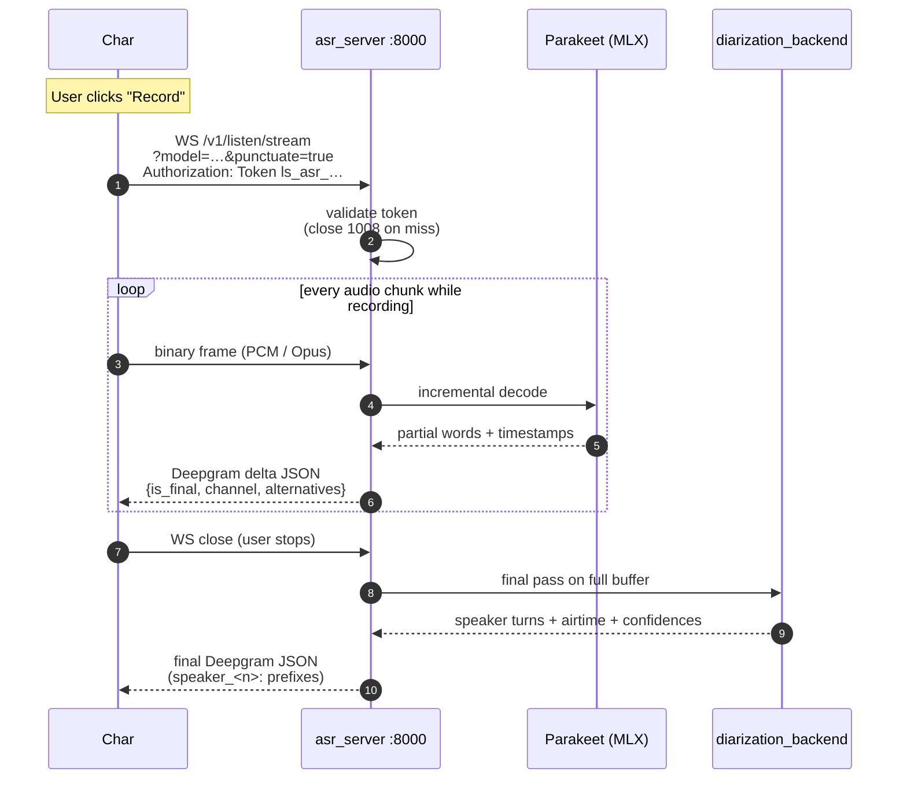

---

## 9. Batch transcription (OpenAI-shape)

The path Char takes when the user clicks **Generate** on a session
that already has an `audio.mp3` on disk. ASR + diarization run in
parallel; SSE heartbeats every 5 seconds keep Char's 60-second batch
timeout from firing.

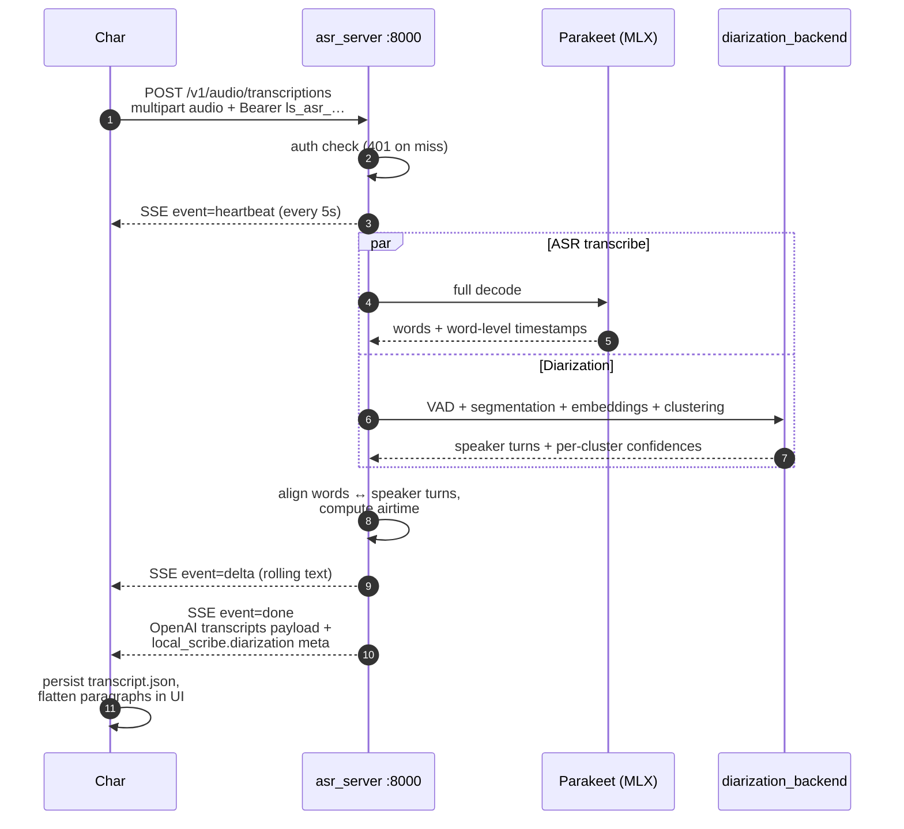

---

## 10. Diarization pipeline

What `diarization_backend.py` does internally on a finished audio
buffer to attach `speaker_<n>` labels to ASR words.

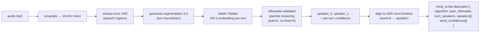

---

## 11. Transcript history lifecycle

Every retranscription archives the previous result with a
timestamped + SHA-prefixed filename so nothing is ever silently
overwritten. The inspector surfaces both the live transcript and the
archive list, with one-click `.txt` download from any of them.

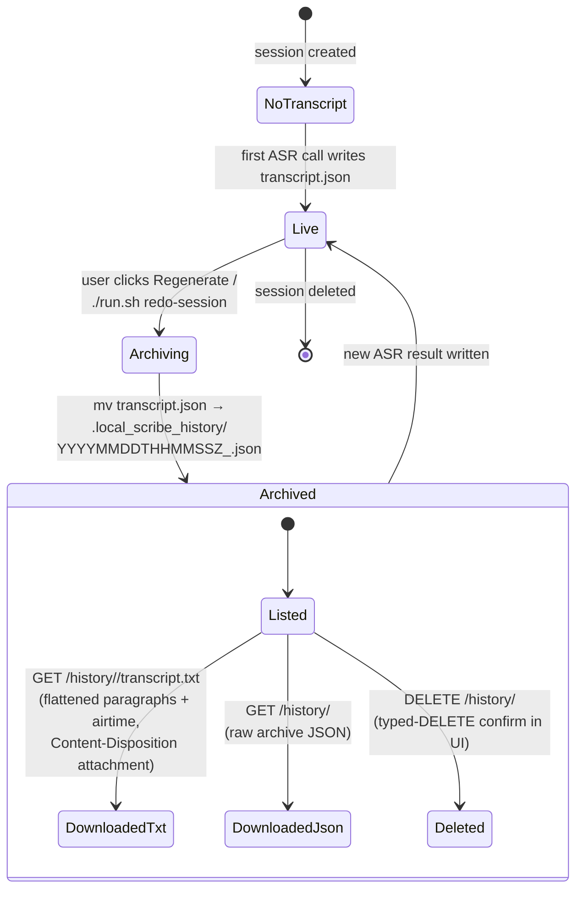

---

## 12. Inspector UI flow

Browser-side flow for an authenticated session. The cookie set by
`/auth?token=…` is `HttpOnly; SameSite=Strict` and survives
inspector restarts. Today the underlying disk is plaintext; once the
vault wiring lands, the same endpoint paths serve decrypted bytes
from the mounted sparse bundle.

```mermaid
sequenceDiagram
    autonumber
    participant Browser
    participant Insp as inspector_server :8001
    participant SA as service_auth
    participant Disk as on-disk session data<br/>(plaintext today / vault later)

    Note over Browser: User cmd-clicks the URL printed by<br/>./run.sh status (one-time per device)
    Browser->>Insp: GET /auth?token=ls_inspector_…
    Insp->>SA: validate against ServiceToken
    SA-->>Insp: ok
    Insp-->>Browser: Set-Cookie: ls_inspector=…<br/>HttpOnly; SameSite=Strict<br/>302 → /
    Browser->>Insp: GET /api/sessions  (cookie)
    Insp->>Disk: scan hyprnote/sessions
    Disk-->>Insp: meta + history_count
    Insp-->>Browser: [{id, title, has_audio, history_count, …}]
    Browser->>Insp: GET /api/sessions/{id}
    Browser->>Insp: GET /api/sessions/{id}/history
    Browser->>Insp: GET /api/sessions/{id}/transcript.txt
    Note right of Insp: Content-Disposition: attachment<br/>filename=transcript-<id>.txt
    Browser->>Insp: GET /api/sessions/{id}/history/<f>/transcript.txt
    Browser->>Insp: DELETE /api/sessions/{id}/audio
    Note right of Insp: only fires after the user typed<br/>"DELETE" in the modal (see § 13)
```

---

## 13. Destructive-action confirmation (typed-DELETE)

Both archive deletion and audio deletion go through the same
two-step modal. The danger button stays disabled until the input
matches `"DELETE"` exactly (case-sensitive); Enter submits when
valid, Escape / Cancel / backdrop click all resolve `false`.

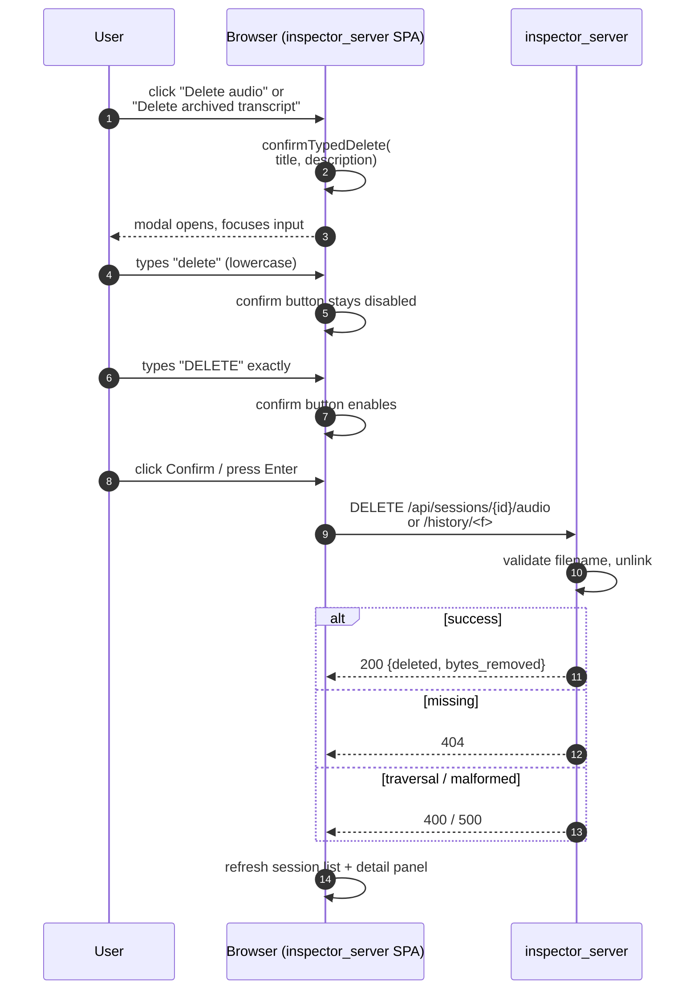

---

## 14. Threat model × defence layers

Which adversary tier is mitigated by which control. The same
information lives in
[`SECURITY.md § Threat model`](SECURITY.md#threat-model) as a table;
the diagram is the navigable view. Dashed edges are partial
mitigations called out in prose.

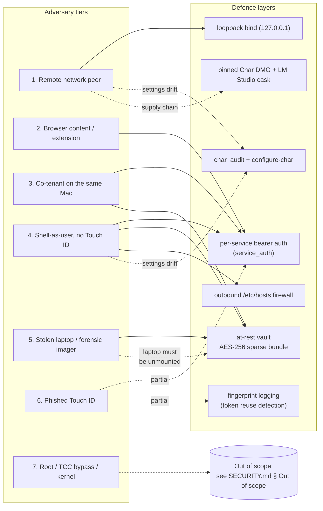

---

## 15. Vault & key lifecycle

The complete state machine for the master key from
"freshly cloned repo" through compromise / loss / recovery.
`./run.sh vault init`, `./run.sh vault lock`, `./run.sh yubikey
enroll`, and `./run.sh vault rotate` are the operator-facing
transitions. The "Compromised → Rotated" path is the one we exercise
when a Touch ID phish is suspected — re-generating the master key
invalidates every derived bearer token in one step.

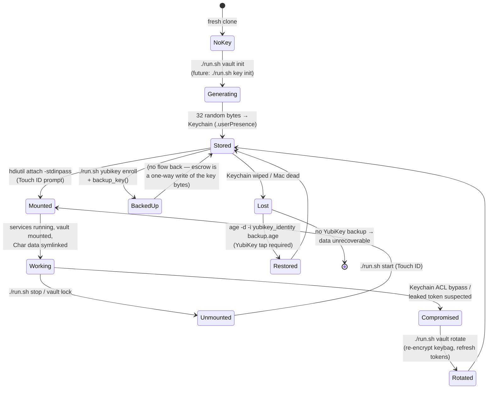

---

### Updating these diagrams

If you change behaviour that one of these diagrams describes, update
both the diagram **and** the prose intro for the section. The
ARCHITECTURE.md is part of the doctor-checked surface: drift between
diagram and code is a documentation bug.

The companion text-based ASCII diagram at the top of `README.md` is
intentionally kept in sync with diagram **§ 1 (System overview)** —
they describe the same thing, the Mermaid version is just clickable.
