# Architecture diagrams

This is the single source of truth for **how `local_scribe` is wired
together**, rendered in [Mermaid](https://mermaid.js.org/) so GitHub
displays each diagram inline. Companion to:

- [`README.md`](README.md) — feature overview + operator guide
- [`SECURITY.md`](SECURITY.md) — threat model + defence layers in prose
- [`CHAR_REVIEW.md`](CHAR_REVIEW.md) — Char binary audit + network egress evidence
- [`TODO.md`](TODO.md) — open mitigations

> **Diagram-vs-reality note.** A few of these diagrams describe
> architecture that is implemented in code but **not yet wired into
> `./run.sh bootstrap`** on every install — specifically the
> Keychain master key, the sparse-bundle vault, and the YubiKey
> escrow path. Where this matters, the prose says so. See
> [`TODO.md`](TODO.md) for the remaining wiring work.

## Contents

### Part I — top-level flows

1. [System overview](#1-system-overview)
2. [Component dependencies](#2-component-dependencies)
3. [Bootstrap flow](#3-bootstrap-flow)
4. [At-rest encryption (designed)](#4-at-rest-encryption-designed)
5. [Service authentication (HKDF tokens)](#5-service-authentication-hkdf-tokens)
6. [Outbound network firewall](#6-outbound-network-firewall)
7. [Char privacy audit](#7-char-privacy-audit)
8. [Live transcription (Deepgram-shape)](#8-live-transcription-deepgram-shape)
9. [Batch transcription (OpenAI-shape)](#9-batch-transcription-openai-shape)
10. [Diarization pipeline](#10-diarization-pipeline)
11. [Transcript history lifecycle](#11-transcript-history-lifecycle)
12. [Inspector UI flow](#12-inspector-ui-flow)
13. [Destructive-action confirmation (typed-DELETE)](#13-destructive-action-confirmation-typed-delete)
14. [Threat model × defence layers](#14-threat-model--defence-layers)
15. [Vault & key lifecycle](#15-vault--key-lifecycle)

### Part II — deep dives (CLIs, APIs, internals, data shapes)

16. [`./run.sh` subcommand map](#16-runsh-subcommand-map)
17. [`./run.sh start` orchestration](#17-runsh-start-orchestration)
18. [`./run.sh stop` orchestration](#18-runsh-stop-orchestration)
19. [`transcribe_file.py` flow](#19-transcribe_filepy-flow)
20. [`redo_session.py` flow](#20-redo_sessionpy-flow)
21. [ASR HTTP API surface](#21-asr-http-api-surface)
22. [Inspector HTTP API surface](#22-inspector-http-api-surface)
23. [Touch ID Swift helper subcommands](#23-touch-id-swift-helper-subcommands)
24. [HKDF-SHA256 derivation visual](#24-hkdf-sha256-derivation-visual)
25. [age + YubiKey PIV decryption chain](#25-age--yubikey-piv-decryption-chain)
26. [Char data directory layout](#26-char-data-directory-layout)
27. [Transcript JSON data model](#27-transcript-json-data-model)
28. [LM Studio summary flow](#28-lm-studio-summary-flow)
29. [Char telemetry channels (3 separate concerns)](#29-char-telemetry-channels-3-separate-concerns)
30. [Key rotation flow](#30-key-rotation-flow)

### Legend

| shape | meaning |
|---|---|
| `[ rectangle ]` | code module / running service |
| `( rounded )` | external CLI command or human action |
| `(( circle ))` | actor (user / external) |
| `{ diamond }` | decision branch |
| `{{ hexagon }}` | OS-level control (Keychain, `/etc/hosts`, Touch ID, etc.) |
| `[( cylinder )]` | persistent storage |
| solid `-->` | active data / control flow |
| dashed `-.->` | optional / blocked / external attempt |
| crossed `-.X.->` | request that is *intentionally refused* by a defence layer |

---

## 1. System overview

The whole pipeline on one screen: how user audio reaches a finished
note, and which boundary the firewall enforces against any external
provider attempting to receive that audio.

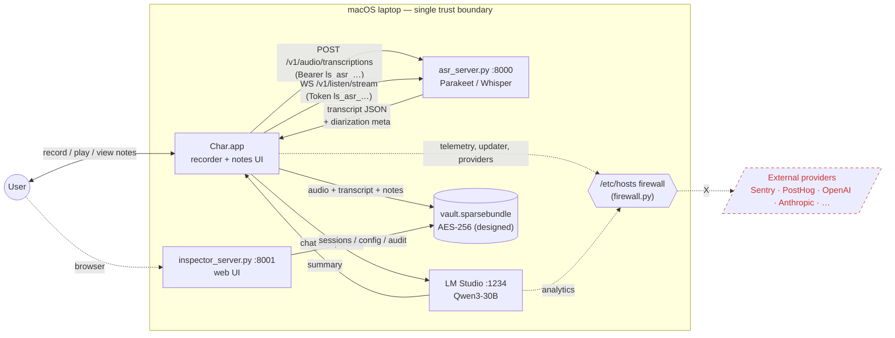
```mermaid
flowchart LR
    User((User))

    subgraph Mac["macOS laptop — single trust boundary"]
      Char["Char.app<br/>recorder + notes UI"]
      ASR["asr_server.py :8000<br/>Parakeet / Whisper"]
      LMS["LM Studio :1234<br/>Qwen3-30B"]
      Insp["inspector_server.py :8001<br/>web UI"]
      Vault[("vault.sparsebundle<br/>AES-256 (designed)")]
      Fw{{"/etc/hosts firewall<br/>(firewall.py)"}}
    end

    Cloud[/"External providers<br/>Sentry · PostHog · OpenAI · Anthropic · …"/]:::blocked

    User <-->|"record / play / view notes"| Char
    User -.->|"browser"| Insp
    Char -->|"POST /v1/audio/transcriptions<br/>(Bearer ls_asr_…)"| ASR
    Char -->|"WS /v1/listen/stream<br/>(Token ls_asr_…)"| ASR
    ASR -->|"transcript JSON<br/>+ diarization meta"| Char
    Char -->|"chat completions"| LMS
    LMS -->|"summary"| Char
    Char -->|"audio + transcript + notes"| Vault
    Insp -->|"sessions / config / audit"| Vault
    Char -.->|"telemetry, updater, providers"| Fw
    LMS -.->|"analytics"| Fw
    Fw -.X.-> Cloud

    classDef blocked stroke-dasharray:5 5,stroke:#c33,color:#c33
```

---

## 2. Component dependencies

File-level dependency graph. Anything in the **crypto / auth** column
roots at the Keychain master key; anything in **pipeline** is pure
data processing that doesn't see secrets.

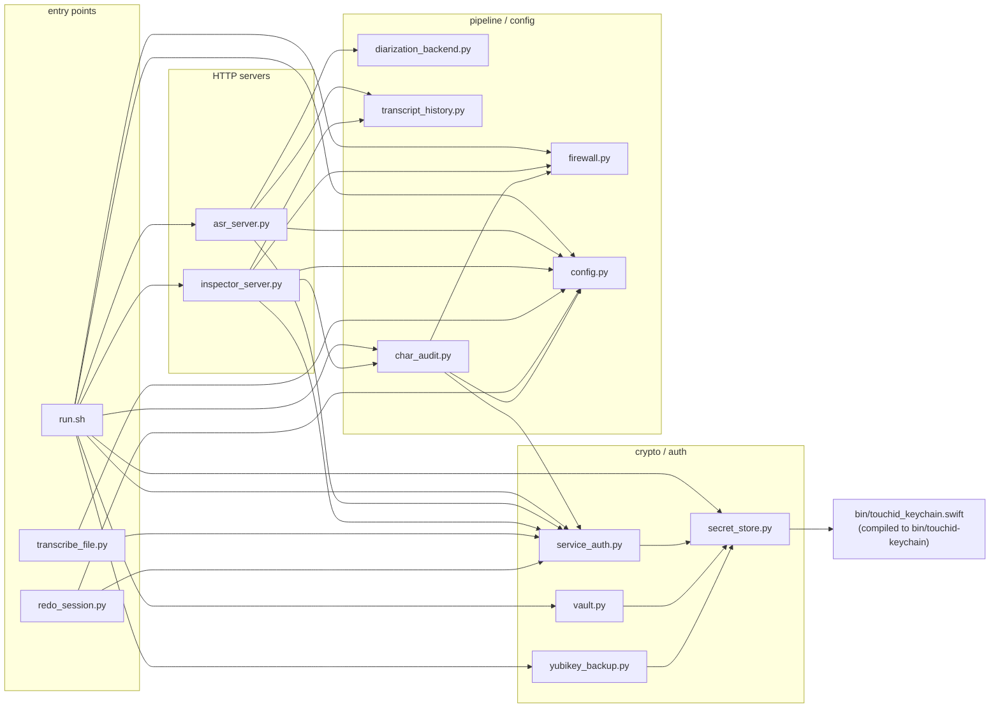
```mermaid
flowchart LR
    subgraph entry["entry points"]
      runsh["run.sh"]
      tf["transcribe_file.py"]
      rs["redo_session.py"]
    end
    subgraph servers["HTTP servers"]
      ASR["asr_server.py"]
      INS["inspector_server.py"]
    end
    subgraph crypto["crypto / auth"]
      SS["secret_store.py"]
      SA["service_auth.py"]
      VT["vault.py"]
      YK["yubikey_backup.py"]
    end
    subgraph pipe["pipeline / config"]
      DB["diarization_backend.py"]
      TH["transcript_history.py"]
      CA["char_audit.py"]
      FW["firewall.py"]
      CFG["config.py"]
    end
    swift["bin/touchid_keychain.swift<br/>(compiled to bin/touchid-keychain)"]

    runsh --> SS
    runsh --> SA
    runsh --> VT
    runsh --> YK
    runsh --> FW
    runsh --> CA
    runsh --> CFG
    runsh --> ASR
    runsh --> INS
    SA --> SS
    VT --> SS
    YK --> SS
    SS --> swift
    ASR --> SA
    ASR --> DB
    ASR --> TH
    ASR --> CFG
    INS --> SA
    INS --> TH
    INS --> CA
    INS --> FW
    INS --> CFG
    tf --> SA
    tf --> CFG
    rs --> SA
    rs --> CFG
    CA --> SA
    CA --> FW
    CA --> CFG
```

---

## 3. Bootstrap flow

What `./run.sh bootstrap` actually does on a fresh clone. The numbers
match the section headers printed at runtime.

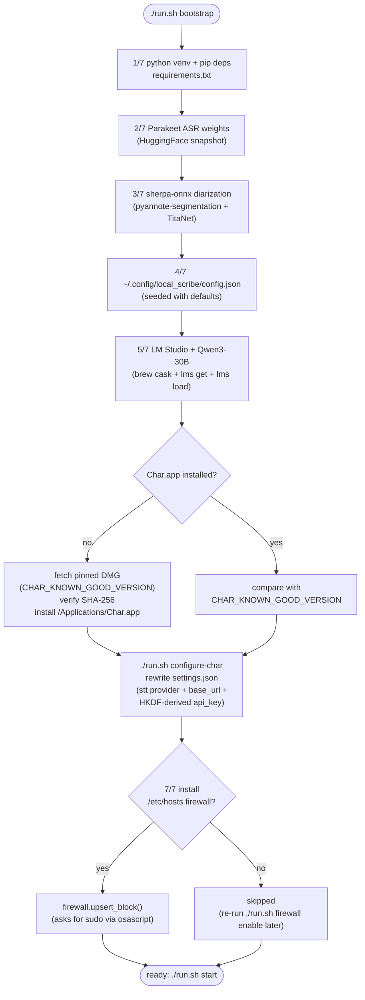
```mermaid
flowchart TD
    Start(["./run.sh bootstrap"]) --> S1
    S1["1/7 python venv + pip deps<br/>requirements.txt"] --> S2
    S2["2/7 Parakeet ASR weights<br/>(HuggingFace snapshot)"] --> S3
    S3["3/7 sherpa-onnx diarization<br/>(pyannote-segmentation + TitaNet)"] --> S4
    S4["4/7 ~/.config/local_scribe/config.json<br/>(seeded with defaults)"] --> S5
    S5["5/7 LM Studio + Qwen3-30B<br/>(brew cask + lms get + lms load)"] --> S6
    S6{"Char.app installed?"}
    S6 -->|"no"| S6a["fetch pinned DMG<br/>(CHAR_KNOWN_GOOD_VERSION)<br/>verify SHA-256<br/>install /Applications/Char.app"]
    S6 -->|"yes"| S6b["compare with<br/>CHAR_KNOWN_GOOD_VERSION"]
    S6a --> S6cfg["./run.sh configure-char<br/>rewrite settings.json<br/>(stt provider + base_url +<br/>HKDF-derived api_key)"]
    S6b --> S6cfg
    S6cfg --> S7{"7/7 install<br/>/etc/hosts firewall?"}
    S7 -->|"yes"| S7y["firewall.upsert_block()<br/>(asks for sudo via osascript)"]
    S7 -->|"no"| S7n["skipped<br/>(re-run ./run.sh firewall enable later)"]
    S7y --> Done([ready: ./run.sh start])
    S7n --> Done
```

---

## 4. At-rest encryption — Option C split-key (implemented)

The master key is split via XOR into two independent 32-byte halves;
**both** factors are required to unlock the vault.

```
    master_key = kc_half  XOR  yk_half
```

`kc_half` lives in the macOS Keychain under `account=master_key_kc_half_v2`,
gated by Touch ID (`.userPresence` ACL). `yk_half` lives on disk as
an `age` file encrypted to one or more enrolled YubiKey PIV recipients
(touch-policy = `always`, so every decrypt requires a fresh physical
tap). Either factor on its own yields uniform-random bytes — the XOR
construction is information-theoretic, not just computationally hard.

Hot (in-memory only) items are red; cold (on-disk ciphertext) items
are blue. The bytes inside `secret_store.MasterKey` and the two halves
during XOR reconstitution are the **only** master-key-derived bytes
in process memory at any one time.

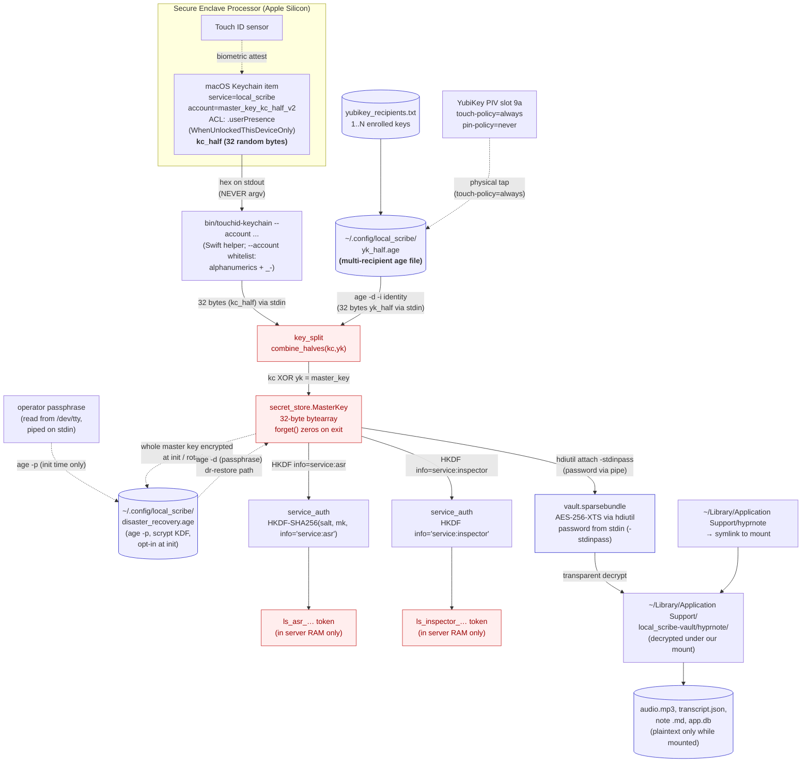
```mermaid
flowchart TD
    subgraph SEP["Secure Enclave Processor (Apple Silicon)"]
        TouchID["Touch ID sensor"]
        KCh["macOS Keychain item<br/>service=local_scribe<br/>account=master_key_kc_half_v2<br/>ACL: .userPresence<br/>(WhenUnlockedThisDeviceOnly)<br/><b>kc_half (32 random bytes)</b>"]
    end
    Swift["bin/touchid-keychain --account ...<br/>(Swift helper; --account whitelist:<br/>alphanumerics + _-)"]
    YK["YubiKey PIV slot 9a<br/>touch-policy=always<br/>pin-policy=never"]
    YKHalf[("~/.config/local_scribe/<br/>yk_half.age<br/><b>(multi-recipient age file)</b>")]
    Recipients[("yubikey_recipients.txt<br/>1..N enrolled keys")]
    DR[("~/.config/local_scribe/<br/>disaster_recovery.age<br/>(age -p, scrypt KDF,<br/>opt-in at init)")]

    KS["key_split<br/>combine_halves(kc,yk)"]
    SS["secret_store.MasterKey<br/>32-byte bytearray<br/>forget() zeros on exit"]

    SA["service_auth<br/>HKDF-SHA256(salt, mk, info='service:asr')"]
    AsrTok["ls_asr_… token<br/>(in server RAM only)"]
    SA2["service_auth<br/>HKDF info='service:inspector'"]
    InsTok["ls_inspector_… token<br/>(in server RAM only)"]

    Vault["vault.sparsebundle<br/>AES-256-XTS via hdiutil<br/>password from stdin (-stdinpass)"]
    Mount["~/Library/Application Support/<br/>local_scribe-vault/hyprnote/<br/>(decrypted under our mount)"]
    Symlink["~/Library/Application Support/hyprnote<br/>→ symlink to mount"]
    Data[("audio.mp3, transcript.json,<br/>note .md, app.db<br/>(plaintext only while mounted)")]

    Passphrase["operator passphrase<br/>(read from /dev/tty,<br/>piped on stdin)"]

    TouchID -.->|"biometric attest"| KCh
    KCh -->|"hex on stdout<br/>(NEVER argv)"| Swift
    Swift -->|"32 bytes (kc_half) via stdin"| KS
    Recipients --> YKHalf
    YK -.->|"physical tap<br/>(touch-policy=always)"| YKHalf
    YKHalf -->|"age -d -i identity<br/>(32 bytes yk_half via stdin)"| KS
    KS -->|"kc XOR yk = master_key"| SS

    SS -->|"HKDF info=service:asr"| SA
    SA --> AsrTok
    SS -->|"HKDF info=service:inspector"| SA2
    SA2 --> InsTok
    SS -->|"hdiutil attach -stdinpass<br/>(password via pipe)"| Vault
    Vault -->|"transparent decrypt"| Mount
    Mount --> Data
    Symlink --> Mount

    Passphrase -.->|"age -p (init time only)"| DR
    SS -.->|"whole master key encrypted<br/>at init / rotation"| DR
    DR -.->|"age -d (passphrase)<br/>dr-restore path"| SS

    classDef hot fill:#fee,stroke:#c33,color:#900
    classDef cold fill:#eef,stroke:#33c
    class SS,AsrTok,InsTok,KS hot
    class Vault,YKHalf,DR,Data,Recipients cold
```

Key threat-model properties this construction buys:

* **Keychain pwn alone** (TCC bypass, malicious admin) yields 32 bytes
  of uniform-random `kc_half`. Without the YubiKey, no `yk_half`,
  no master key. `2^256` brute-force, not `2^128`.
* **YubiKey theft alone** yields an opaque `age` file. Without the
  Keychain, no `kc_half`, no master key. The attacker also needs
  Touch ID / passcode to recover from the same Mac.
* **Either factor lost** (Mac wiped, every YubiKey destroyed) is
  recoverable via the optional `disaster_recovery.age` file — but
  only if the operator opted into one at `init` and remembers the
  passphrase. We surface this trade-off in the prompt copy.
* **Adding a second YubiKey** (`./run.sh key add-yubikey RECIPIENT`)
  decrypts `yk_half` with the current YubiKey, then re-encrypts to
  the union of recipients. Either YubiKey then unlocks; we never
  need to write the cleartext to disk in between.

All key bytes flow over **Keychain ACL → stdin → in-process buffers**.
Never argv, never env, never logs. The argv-leak property is asserted
by `tests/test_key_lifecycle.py::ThreatModelInvariantTests::test_master_key_never_in_subprocess_argv`.

---

## 5. Service authentication (HKDF tokens)

How a Char "Generate" click winds up authenticated against the ASR
server, end-to-end. Read this top to bottom and you have the whole
auth contract.

```mermaid
sequenceDiagram
    autonumber
    actor User
    participant Char as Char.app
    participant RunSh as ./run.sh
    participant TouchID as Touch ID
    participant Keychain
    participant SA as service_auth
    participant ASR as asr_server :8000

    User->>RunSh: ./run.sh configure-char
    RunSh->>SA: python -m service_auth token asr
    SA->>TouchID: prompt "Derive ASR token"
    TouchID->>User: biometric request
    User->>TouchID: tap
    TouchID->>Keychain: unlock master_key
    Keychain-->>SA: 32 bytes
    SA->>SA: HKDF(salt=app+ver,<br/>ikm=mk, info="service:asr")
    SA-->>RunSh: ls_asr_<32-hex>
    RunSh->>Char: write settings.json::stt.openai.api_key
    Note over RunSh,Char: Token passed via stdin to<br/>python -m char_settings_writer<br/>(never argv; tested by<br/>test_char_settings_writer.py).
    User->>Char: click "Generate" on a session
    Char->>ASR: POST /v1/audio/transcriptions<br/>Authorization: Bearer ls_asr_…
    ASR->>SA: extract_candidate_token(request)
    SA->>SA: hmac.compare_digest(stored, candidate)
    alt token matches
        SA-->>ASR: ok
        ASR-->>Char: 200 transcript JSON
    else token missing / wrong
        SA-->>ASR: 401
        ASR-->>Char: 401 + WWW-Authenticate hint
    end
```

---

## 6. Outbound network firewall

`firewall.py` writes a marker-delimited block into `/etc/hosts` that
blackholes every host in `BLOCK_CATALOG` to `0.0.0.0` (IPv4) and `::`
(IPv6). Categories are independently togglable. The block is
idempotent; reapply with `./run.sh firewall enable`.

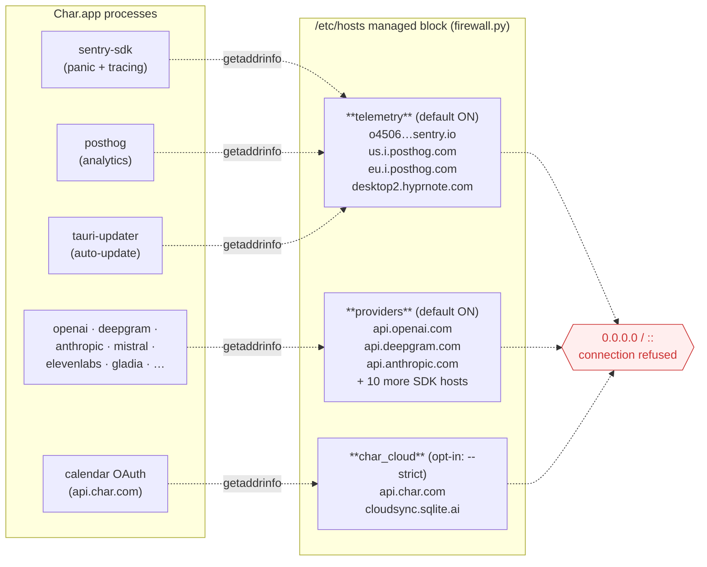
```mermaid
flowchart LR
    subgraph CharBin["Char.app processes"]
      Sentry["sentry-sdk<br/>(panic + tracing)"]
      PostHog["posthog<br/>(analytics)"]
      Updater["tauri-updater<br/>(auto-update)"]
      Providers["openai · deepgram ·<br/>anthropic · mistral ·<br/>elevenlabs · gladia · …"]
      Calendar["calendar OAuth<br/>(api.char.com)"]
    end

    subgraph Hosts["/etc/hosts managed block (firewall.py)"]
      Cat1["**telemetry** (default ON)<br/>o4506…sentry.io<br/>us.i.posthog.com<br/>eu.i.posthog.com<br/>desktop2.hyprnote.com"]
      Cat2["**providers** (default ON)<br/>api.openai.com<br/>api.deepgram.com<br/>api.anthropic.com<br/>+ 10 more SDK hosts"]
      Cat3["**char_cloud** (opt-in: --strict)<br/>api.char.com<br/>cloudsync.sqlite.ai"]
    end

    Sink{{"0.0.0.0 / ::<br/>connection refused"}}

    Sentry -.->|"getaddrinfo"| Cat1
    PostHog -.->|"getaddrinfo"| Cat1
    Updater -.->|"getaddrinfo"| Cat1
    Providers -.->|"getaddrinfo"| Cat2
    Calendar -.->|"getaddrinfo"| Cat3
    Cat1 -.-> Sink
    Cat2 -.-> Sink
    Cat3 -.-> Sink

    classDef refused fill:#fee,stroke:#c33,color:#c33
    class Sink refused
```

---

## 7. Char privacy audit

What `./run.sh doctor` and `python -m char_audit` actually check.
Every check returns OK / INFO / WARN / FAIL, with a hint for how to
remediate. The endpoint `/api/char/audit` returns the same data as
JSON to the inspector.

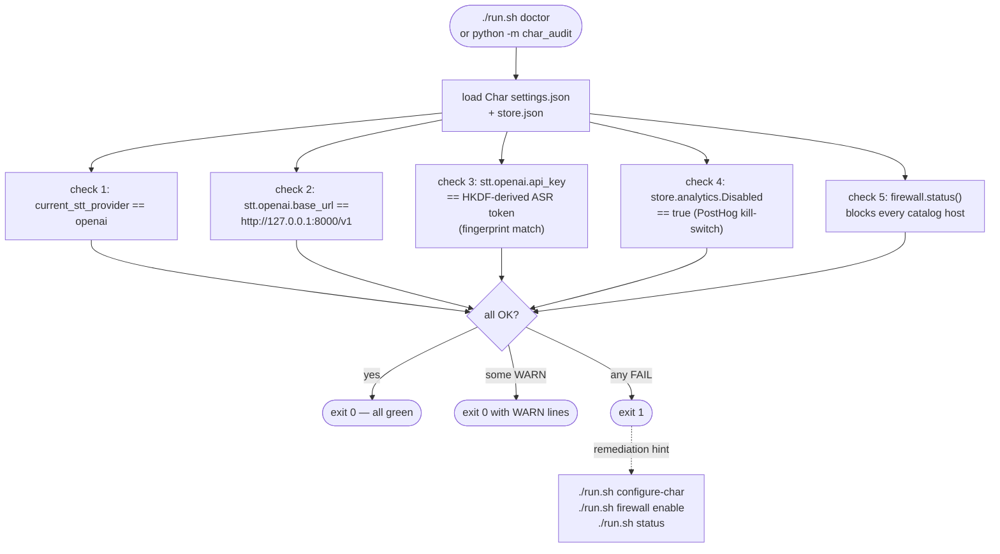
```mermaid
flowchart TD
    Run(["./run.sh doctor<br/>or python -m char_audit"]) --> Load["load Char settings.json<br/>+ store.json"]
    Load --> C1["check 1: current_stt_provider == openai"]
    Load --> C2["check 2: stt.openai.base_url ==<br/>http://127.0.0.1:8000/v1"]
    Load --> C3["check 3: stt.openai.api_key<br/>== HKDF-derived ASR token<br/>(fingerprint match)"]
    Load --> C4["check 4: store.analytics.Disabled<br/>== true (PostHog kill-switch)"]
    Load --> C5["check 5: firewall.status()<br/>blocks every catalog host"]
    C1 --> Score
    C2 --> Score
    C3 --> Score
    C4 --> Score
    C5 --> Score
    Score{"all OK?"}
    Score -->|"yes"| Green(["exit 0 — all green"])
    Score -->|"some WARN"| Yellow(["exit 0 with WARN lines"])
    Score -->|"any FAIL"| Red(["exit 1"])
    Red -.->|"remediation hint"| Fix["./run.sh configure-char<br/>./run.sh firewall enable<br/>./run.sh status"]
```

---

## 8. Live transcription (Deepgram-shape)

The path Char takes when it's recording in real time. The ASR server
emits Deepgram-shaped JSON deltas over a WebSocket because that's
what Char's `Custom` provider expects.

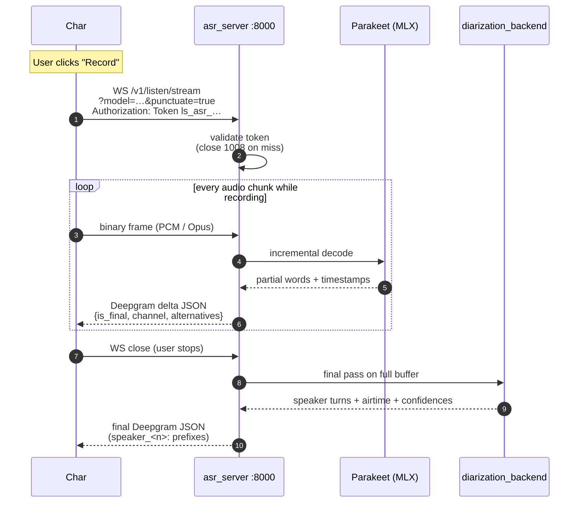
```mermaid
sequenceDiagram
    autonumber
    participant Char
    participant ASR as asr_server :8000
    participant P as Parakeet (MLX)
    participant D as diarization_backend

    Note over Char: User clicks "Record"
    Char->>ASR: WS /v1/listen/stream<br/>?model=…&punctuate=true<br/>Authorization: Token ls_asr_…
    ASR->>ASR: validate token<br/>(close 1008 on miss)
    loop every audio chunk while recording
        Char->>ASR: binary frame (PCM / Opus)
        ASR->>P: incremental decode
        P-->>ASR: partial words + timestamps
        ASR-->>Char: Deepgram delta JSON<br/>{is_final, channel, alternatives}
    end
    Char->>ASR: WS close (user stops)
    ASR->>D: final pass on full buffer
    D-->>ASR: speaker turns + airtime + confidences
    ASR-->>Char: final Deepgram JSON<br/>(speaker_<n>: prefixes)
```

---

## 9. Batch transcription (OpenAI-shape)

The path Char takes when the user clicks **Generate** on a session
that already has an `audio.mp3` on disk. ASR + diarization run in
parallel; SSE heartbeats every 5 seconds keep Char's 60-second batch
timeout from firing.

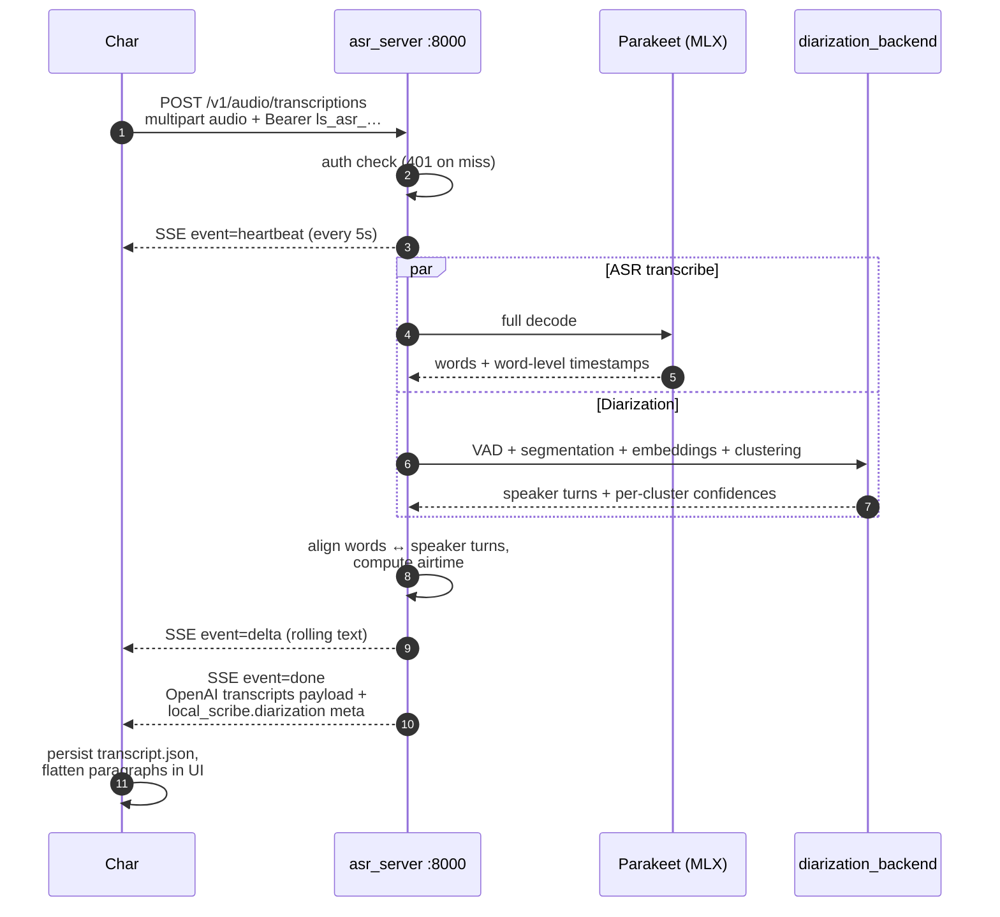
```mermaid
sequenceDiagram
    autonumber
    participant Char
    participant ASR as asr_server :8000
    participant P as Parakeet (MLX)
    participant D as diarization_backend

    Char->>ASR: POST /v1/audio/transcriptions<br/>multipart audio + Bearer ls_asr_…
    ASR->>ASR: auth check (401 on miss)
    ASR-->>Char: SSE event=heartbeat (every 5s)
    par ASR transcribe
      ASR->>P: full decode
      P-->>ASR: words + word-level timestamps
    and Diarization
      ASR->>D: VAD + segmentation + embeddings + clustering
      D-->>ASR: speaker turns + per-cluster confidences
    end
    ASR->>ASR: align words ↔ speaker turns,<br/>compute airtime
    ASR-->>Char: SSE event=delta (rolling text)
    ASR-->>Char: SSE event=done<br/>OpenAI transcripts payload +<br/>local_scribe.diarization meta
    Char->>Char: persist transcript.json,<br/>flatten paragraphs in UI
```

---

## 10. Diarization pipeline

What `diarization_backend.py` does internally on a finished audio
buffer to attach `speaker_<n>` labels to ASR words.

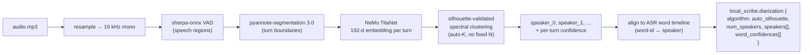
```mermaid
flowchart LR
    A["audio.mp3"] --> R["resample → 16 kHz mono"]
    R --> V["sherpa-onnx VAD<br/>(speech regions)"]
    V --> SEG["pyannote-segmentation 3.0<br/>(turn boundaries)"]
    SEG --> EMB["NeMo TitaNet<br/>192-d embedding per turn"]
    EMB --> CLU["silhouette-validated<br/>spectral clustering<br/>(auto-K, no fixed N)"]
    CLU --> LBL["speaker_0, speaker_1, …<br/>+ per-turn confidence"]
    LBL --> ALN["align to ASR word timeline<br/>(word-id ↔ speaker)"]
    ALN --> OUT["local_scribe.diarization {<br/>  algorithm: auto_silhouette,<br/>  num_speakers, speakers[],<br/>  word_confidences[]<br/>}"]
```

---

## 11. Transcript history lifecycle

Every retranscription archives the previous result with a
timestamped + SHA-prefixed filename so nothing is ever silently
overwritten. The inspector surfaces both the live transcript and the
archive list, with one-click `.txt` download from any of them.

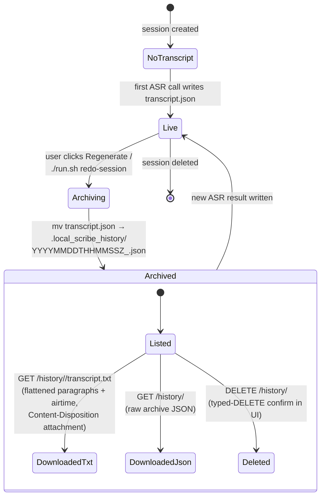
```mermaid
stateDiagram-v2
    [*] --> NoTranscript : session created

    NoTranscript --> Live : first ASR call writes transcript.json

    Live --> Archiving : user clicks Regenerate /<br/>./run.sh redo-session
    Archiving --> Archived : mv transcript.json →<br/>.local_scribe_history/<br/>YYYYMMDDTHHMMSSZ_<sha7>.json
    Archived --> Live : new ASR result written
    Live --> [*] : session deleted

    state Archived {
        [*] --> Listed
        Listed --> DownloadedTxt : GET /history/<f>/transcript.txt<br/>(flattened paragraphs + airtime,<br/>Content-Disposition attachment)
        Listed --> DownloadedJson : GET /history/<f><br/>(raw archive JSON)
        Listed --> Deleted : DELETE /history/<f><br/>(typed-DELETE confirm in UI)
    }
```

---

## 12. Inspector UI flow

Browser-side flow for an authenticated session. The cookie set by
`/auth?token=…` is `HttpOnly; SameSite=Strict` and survives
inspector restarts. Today the underlying disk is plaintext; once the
vault wiring lands, the same endpoint paths serve decrypted bytes
from the mounted sparse bundle.

```mermaid
sequenceDiagram
    autonumber
    participant Browser
    participant Insp as inspector_server :8001
    participant SA as service_auth
    participant Disk as on-disk session data<br/>(plaintext today / vault later)

    Note over Browser: User cmd-clicks the URL printed by<br/>./run.sh status (one-time per device)
    Browser->>Insp: GET /auth?token=ls_inspector_…
    Insp->>SA: validate against ServiceToken
    SA-->>Insp: ok
    Insp-->>Browser: Set-Cookie: ls_inspector=…<br/>HttpOnly; SameSite=Strict<br/>302 → /
    Browser->>Insp: GET /api/sessions  (cookie)
    Insp->>Disk: scan hyprnote/sessions
    Disk-->>Insp: meta + history_count
    Insp-->>Browser: [{id, title, has_audio, history_count, …}]
    Browser->>Insp: GET /api/sessions/{id}
    Browser->>Insp: GET /api/sessions/{id}/history
    Browser->>Insp: GET /api/sessions/{id}/transcript.txt
    Note right of Insp: Content-Disposition: attachment<br/>filename=transcript-<id>.txt
    Browser->>Insp: GET /api/sessions/{id}/history/<f>/transcript.txt
    Browser->>Insp: DELETE /api/sessions/{id}/audio
    Note right of Insp: only fires after the user typed<br/>"DELETE" in the modal (see § 13)
```

---

## 13. Destructive-action confirmation (typed-DELETE)

Both archive deletion and audio deletion go through the same
two-step modal. The danger button stays disabled until the input
matches `"DELETE"` exactly (case-sensitive); Enter submits when
valid, Escape / Cancel / backdrop click all resolve `false`.

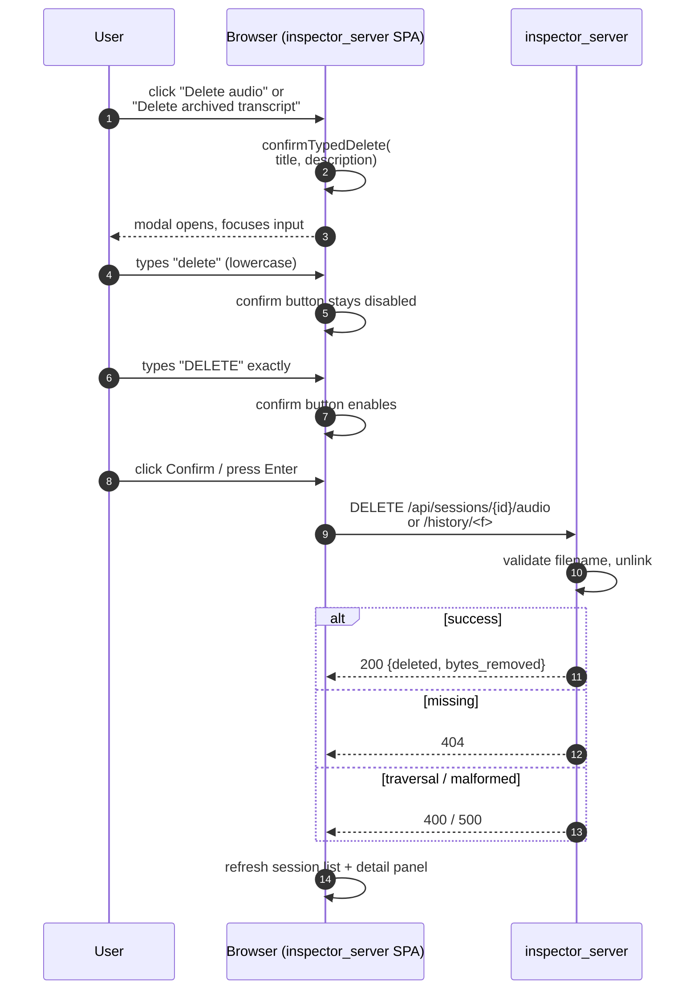
```mermaid
sequenceDiagram
    autonumber
    participant U as User
    participant UI as Browser (inspector_server SPA)
    participant API as inspector_server

    U->>UI: click "Delete audio" or<br/>"Delete archived transcript"
    UI->>UI: confirmTypedDelete(<br/>  title, description)
    UI-->>U: modal opens, focuses input
    U->>UI: types "delete" (lowercase)
    UI->>UI: confirm button stays disabled
    U->>UI: types "DELETE" exactly
    UI->>UI: confirm button enables
    U->>UI: click Confirm / press Enter
    UI->>API: DELETE /api/sessions/{id}/audio<br/>or /history/<f>
    API->>API: validate filename, unlink
    alt success
      API-->>UI: 200 {deleted, bytes_removed}
    else missing
      API-->>UI: 404
    else traversal / malformed
      API-->>UI: 400 / 500
    end
    UI->>UI: refresh session list + detail panel
```

---

## 14. Threat model × defence layers

Which adversary tier is mitigated by which control. The same
information lives in
[`SECURITY.md § Threat model`](SECURITY.md#threat-model) as a table;
the diagram is the navigable view. Dashed edges are partial
mitigations called out in prose.

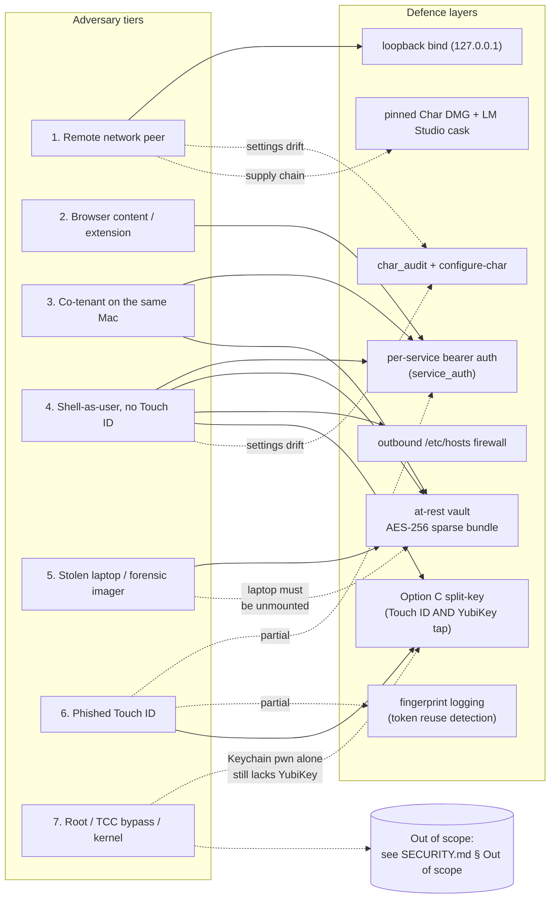
```mermaid
flowchart LR
    subgraph adv["Adversary tiers"]
      A1["1. Remote network peer"]
      A2["2. Browser content / extension"]
      A3["3. Co-tenant on the same Mac"]
      A4["4. Shell-as-user, no Touch ID"]
      A5["5. Stolen laptop / forensic imager"]
      A6["6. Phished Touch ID"]
      A7["7. Root / TCC bypass / kernel"]
    end

    subgraph defence["Defence layers"]
      D1["loopback bind (127.0.0.1)"]
      D2["per-service bearer auth<br/>(service_auth)"]
      D3["at-rest vault<br/>AES-256 sparse bundle"]
      D4["outbound /etc/hosts firewall"]
      D5["char_audit + configure-char"]
      D6["pinned Char DMG + LM Studio cask"]
      D7["fingerprint logging<br/>(token reuse detection)"]
      D8["Option C split-key<br/>(Touch ID AND YubiKey tap)"]
    end

    Out[(Out of scope:<br/>see SECURITY.md § Out of scope)]

    A1 --> D1
    A2 --> D2
    A3 --> D2
    A3 --> D3
    A4 --> D2
    A4 --> D3
    A4 --> D4
    A4 --> D8
    A5 --> D3
    A5 -.->|"laptop must<br/>be unmounted"| D3
    A6 -.->|"partial"| D2
    A6 -.->|"partial"| D7
    A6 --> D8
    A1 -.->|"settings drift"| D5
    A4 -.->|"settings drift"| D5
    A1 -.->|"supply chain"| D6
    A7 -.->|"Keychain pwn alone<br/>still lacks YubiKey"| D8
    A7 -.-> Out
```

**D8 — Option C split-key**: the master key is XOR-split across the
Keychain (Touch ID-gated `kc_half`) and a YubiKey-encrypted `yk_half`.
For an attacker on tier 4–7 to derive the master key they need
**both** factors, not just biometric unlock. This is the strongest
new mitigation in the current release; see §4 for the construction
diagram and §15 for the full lifecycle.

---

## 15. Vault & key lifecycle (Option C)

The complete state machine for the **split-key** master key from
"freshly cloned repo" through compromise / loss / recovery. The
operator-facing transitions all live behind `./run.sh key <verb>`:

| transition | command |
|---|---|
| `NoKey → SplitStored` | `./run.sh key init [--no-dr]` |
| `SplitStored → Unlocked` | `./run.sh key unlock` (or app startup) |
| `SplitStored → SplitStored'` | `./run.sh key rotate` |
| `SplitStored → SplitStored` (add 2nd YubiKey) | `./run.sh key add-yubikey RECIPIENT` |
| `LegacyV1 → SplitStored` | `./run.sh key migrate` (auto-runs on first unlock) |
| `KcHalfLost → SplitStored` | `./run.sh key dr-restore` |
| `BothFactorsLost → Empty` | `./run.sh key dr-restore` (requires DR passphrase) |
| `* → NoKey` | `./run.sh key destroy` (typed-DESTROY confirm) |

The "Compromised → Rotated" path stays the same as before: generate
a fresh master key, write the new halves, and every derived bearer
token (HKDF over the master) becomes a 401 in one step. Rotation
also re-writes the DR file if the operator supplies a passphrase.

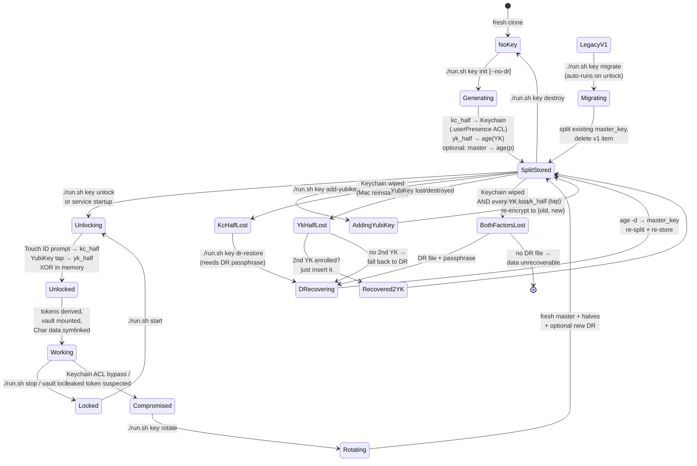
```mermaid
stateDiagram-v2
    [*] --> NoKey : fresh clone

    NoKey --> Generating : ./run.sh key init [--no-dr]
    Generating --> SplitStored : kc_half → Keychain<br/>(.userPresence ACL)<br/>yk_half → age(YK)<br/>optional: master → age(p)

    LegacyV1 --> Migrating : ./run.sh key migrate<br/>(auto-runs on unlock)
    Migrating --> SplitStored : split existing master_key,<br/>delete v1 item

    SplitStored --> Unlocking : ./run.sh key unlock<br/>or service startup
    Unlocking --> Unlocked : Touch ID prompt → kc_half<br/>YubiKey tap → yk_half<br/>XOR in memory

    Unlocked --> Working : tokens derived,<br/>vault mounted,<br/>Char data symlinked
    Working --> Locked : ./run.sh stop / vault lock
    Locked --> Unlocking : ./run.sh start

    SplitStored --> AddingYubiKey : ./run.sh key add-yubikey
    AddingYubiKey --> SplitStored : decrypt yk_half (tap)<br/>re-encrypt to {old, new}

    Working --> Compromised : Keychain ACL bypass /<br/>leaked token suspected
    Compromised --> Rotating : ./run.sh key rotate
    Rotating --> SplitStored : fresh master + halves<br/>+ optional new DR

    SplitStored --> KcHalfLost : Keychain wiped<br/>(Mac reinstall, etc.)
    KcHalfLost --> DRecovering : ./run.sh key dr-restore<br/>(needs DR passphrase)
    DRecovering --> SplitStored : age -d → master_key<br/>re-split + re-store

    SplitStored --> YkHalfLost : YubiKey lost/destroyed
    YkHalfLost --> Recovered2YK : 2nd YK enrolled?<br/>just insert it
    Recovered2YK --> SplitStored
    YkHalfLost --> DRecovering : no 2nd YK →<br/>fall back to DR

    SplitStored --> BothFactorsLost : Keychain wiped<br/>AND every YK lost
    BothFactorsLost --> DRecovering : DR file + passphrase
    BothFactorsLost --> [*] : no DR file →<br/>data unrecoverable

    SplitStored --> NoKey : ./run.sh key destroy
```

**Invariant**: the master-key bytes only ever live as a bytearray
inside `secret_store.MasterKey`, for the lifetime of a single API
call or a single CLI subcommand. Everything else on disk is one of:

* `kc_half` (random; cleartext only inside the Keychain item)
* `yk_half` (random; ciphertext-only outside the YubiKey)
* `disaster_recovery.age` (master-key ciphertext under scrypt-derived KDF)
* `vault.sparsebundle` (data ciphertext under AES-256-XTS, hdiutil-managed)

---

---

# Part II — deep dives

These are reference / internals diagrams: where the top-level Part I
flows compress an entire user-facing path into one picture, Part II
zooms in on a single CLI, API surface, crypto primitive, or data
shape. Skip ahead to the one you want.

---

## 16. `./run.sh` subcommand map

Which subcommand maps to which handler. Tells you where to look in
`run.sh` for a given behaviour, and which Python module it delegates
to.

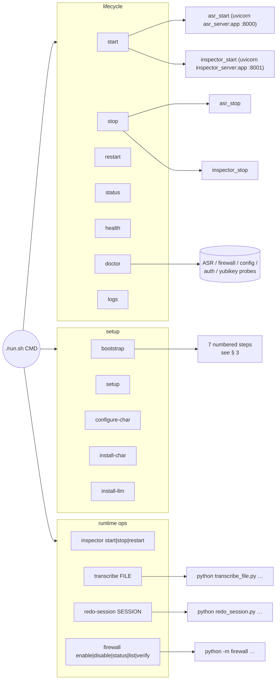
```mermaid
flowchart LR
    User(("./run.sh CMD"))

    subgraph lifecycle["lifecycle"]
      start["start"]
      stop["stop"]
      restart["restart"]
      status["status"]
      health["health"]
      doctor["doctor"]
      logs["logs"]
    end
    subgraph setup["setup"]
      bootstrap["bootstrap"]
      setupcmd["setup"]
      configure_char["configure-char"]
      install_char["install-char"]
      install_llm["install-llm"]
    end
    subgraph runtime["runtime ops"]
      inspector["inspector start|stop|restart"]
      transcribe["transcribe FILE"]
      redo["redo-session SESSION"]
      firewall["firewall enable|disable|status|list|verify"]
    end

    User --> lifecycle
    User --> setup
    User --> runtime

    start --> asr_start["asr_start (uvicorn asr_server:app :8000)"]
    start --> inspector_start["inspector_start (uvicorn inspector_server:app :8001)"]
    stop  --> asr_stop["asr_stop"]
    stop  --> inspector_stop["inspector_stop"]
    transcribe --> tf["python transcribe_file.py …"]
    redo  --> rs["python redo_session.py …"]
    firewall --> fwpy["python -m firewall …"]
    doctor --> probes[(ASR / firewall / config /<br/>auth / yubikey probes)]
    bootstrap --> seven[7 numbered steps<br/>see § 3]
```

---

## 17. `./run.sh start` orchestration

What `./run.sh start` actually does, in order. Useful when something
goes wrong: each box is a check that can fail independently and the
script bails with a labelled error if it does.

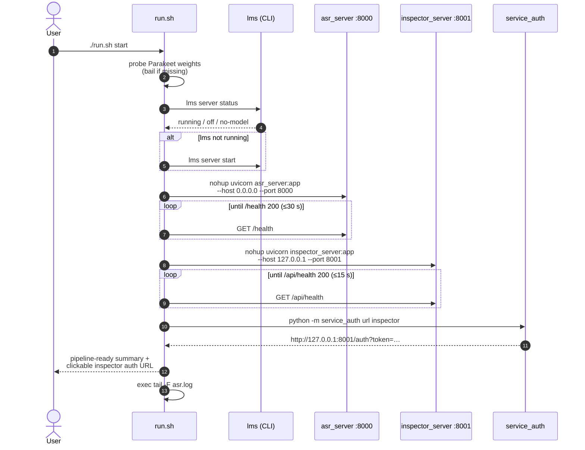
```mermaid
sequenceDiagram
    autonumber
    actor U as User
    participant Rs as run.sh
    participant LMS as lms (CLI)
    participant ASR as asr_server :8000
    participant INS as inspector_server :8001
    participant SA as service_auth

    U->>Rs: ./run.sh start
    Rs->>Rs: probe Parakeet weights<br/>(bail if missing)
    Rs->>LMS: lms server status
    LMS-->>Rs: running / off / no-model
    alt lms not running
        Rs->>LMS: lms server start
    end
    Rs->>ASR: nohup uvicorn asr_server:app<br/>--host 0.0.0.0 --port 8000
    loop until /health 200 (≤30 s)
        Rs->>ASR: GET /health
    end
    Rs->>INS: nohup uvicorn inspector_server:app<br/>--host 127.0.0.1 --port 8001
    loop until /api/health 200 (≤15 s)
        Rs->>INS: GET /api/health
    end
    Rs->>SA: python -m service_auth url inspector
    SA-->>Rs: http://127.0.0.1:8001/auth?token=…
    Rs-->>U: pipeline-ready summary +<br/>clickable inspector auth URL
    Rs->>Rs: exec tail -F asr.log
```

---

## 18. `./run.sh stop` orchestration

The shutdown side. Each server gets a polite `TERM`, a 7.5 s grace
window, then a forceful `KILL -9` if it's still alive. LM Studio is
**not** stopped — that's deliberate, so its model stays warm in GPU
memory for the next start.

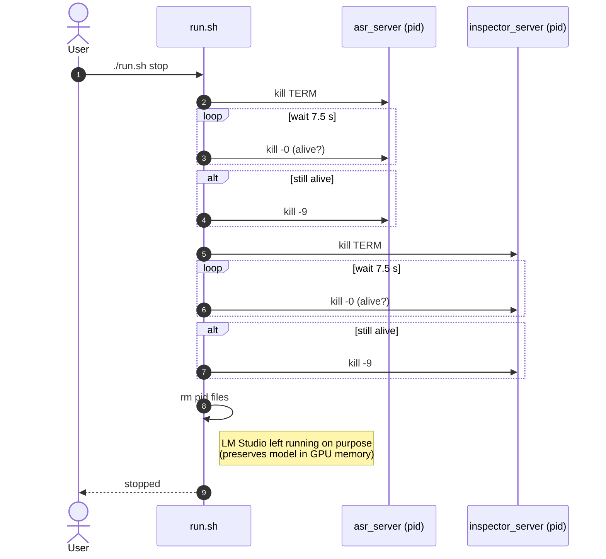
```mermaid
sequenceDiagram
    autonumber
    actor U as User
    participant Rs as run.sh
    participant ASR as asr_server (pid)
    participant INS as inspector_server (pid)

    U->>Rs: ./run.sh stop
    Rs->>ASR: kill TERM
    loop wait 7.5 s
        Rs->>ASR: kill -0 (alive?)
    end
    alt still alive
        Rs->>ASR: kill -9
    end
    Rs->>INS: kill TERM
    loop wait 7.5 s
        Rs->>INS: kill -0 (alive?)
    end
    alt still alive
        Rs->>INS: kill -9
    end
    Rs->>Rs: rm pid files
    Note right of Rs: LM Studio left running on purpose<br/>(preserves model in GPU memory)
    Rs-->>U: stopped
```

---

## 19. `transcribe_file.py` flow

The manual one-shot CLI for files Char didn't pick up automatically.
Caches by audio SHA-256 (so LLM iteration is fast), runs the full
ASR + diarization + LLM-summary stack, and lets you steer output to
stdout, a markdown file, or the clipboard.

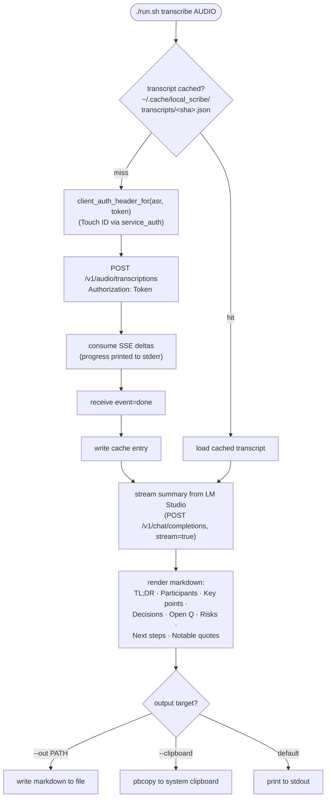
```mermaid
flowchart TD
    Start(["./run.sh transcribe AUDIO"]) --> Cache{transcript cached?<br/>~/.cache/local_scribe/<br/>transcripts/&lt;sha&gt;.json}
    Cache -->|hit| LoadCache["load cached transcript"]
    Cache -->|miss| Auth["client_auth_header_for(asr, token)<br/>(Touch ID via service_auth)"]
    Auth --> Post["POST /v1/audio/transcriptions<br/>Authorization: Token <token>"]
    Post --> SSE["consume SSE deltas<br/>(progress printed to stderr)"]
    SSE --> Done["receive event=done"]
    Done --> SaveCache["write cache entry"]
    SaveCache --> LLM
    LoadCache --> LLM["stream summary from LM Studio<br/>(POST /v1/chat/completions, stream=true)"]
    LLM --> Format["render markdown:<br/>TL;DR · Participants · Key points ·<br/>Decisions · Open Q · Risks ·<br/>Next steps · Notable quotes"]
    Format --> Output{output target?}
    Output -->|--out PATH| WriteFile["write markdown to file"]
    Output -->|--clipboard| Pbcopy["pbcopy to system clipboard"]
    Output -->|default| Stdout["print to stdout"]
```

---

## 20. `redo_session.py` flow

Re-runs ASR + diarization on an existing Char session and overwrites
its `transcript.json` in place. The previous transcript is **always**
archived to `.local_scribe_history/` first — see § 11.

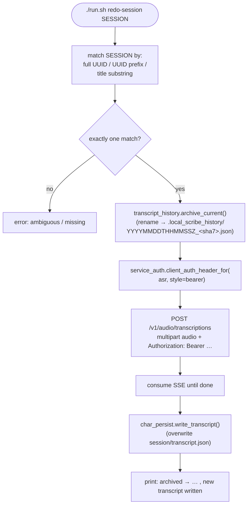
```mermaid
flowchart TD
    Start(["./run.sh redo-session SESSION"]) --> Match["match SESSION by:<br/>full UUID / UUID prefix /<br/>title substring"]
    Match --> Found{exactly one match?}
    Found -->|"no"| Err["error: ambiguous / missing"]
    Found -->|"yes"| Archive["transcript_history.archive_current()<br/>(rename → .local_scribe_history/<br/>YYYYMMDDTHHMMSSZ_&lt;sha7&gt;.json)"]
    Archive --> Auth["service_auth.client_auth_header_for(<br/>  asr, style=bearer)"]
    Auth --> Post["POST /v1/audio/transcriptions<br/>multipart audio + Authorization: Bearer …"]
    Post --> Wait["consume SSE until done"]
    Wait --> Persist["char_persist.write_transcript()<br/>(overwrite session/transcript.json)"]
    Persist --> Done["print: archived → … , new transcript written"]
```

---

## 21. ASR HTTP API surface

Every route the ASR server exposes, the contract each one
implements, and which response shape it emits. The auth column tells
you which gating dependency runs on entry.

```mermaid
flowchart LR
    subgraph Public["public (no auth)"]
      Hp["GET /health<br/>→ {asr_backend, model, ready}"]
    end
    subgraph Gated["bearer-token gated"]
      A1["POST /v1/audio/transcriptions<br/>multipart audio<br/>(OpenAI Whisper shape)"]
      A2["POST /v1/listen<br/>multipart audio<br/>(Deepgram batch shape)"]
      A3["WS /v1/listen/stream<br/>binary PCM/Opus frames<br/>(Deepgram streaming shape)"]
    end

    A1 --> R1["SSE event=heartbeat (5 s)<br/>SSE event=delta (rolling text)<br/>SSE event=done<br/>(transcripts[] + local_scribe.diarization)"]
    A2 --> R2["single Deepgram JSON<br/>(results.channels[0].alternatives[0])"]
    A3 --> R3["per-chunk JSON deltas →<br/>final close-frame JSON<br/>(speaker_<n>: tags)"]

    classDef pub fill:#efe,stroke:#393
    classDef gated fill:#fee,stroke:#c33
    class Hp pub
    class A1,A2,A3 gated
```

---

## 22. Inspector HTTP API surface

Same idea, inspector side. The cookie set by `/auth?token=…`
satisfies the gate for every `/api/…` route subsequently.

```mermaid
flowchart LR
    subgraph Public["public"]
      H["GET /api/health"]
      Au["GET /auth?token=…<br/>(sets HttpOnly cookie, 302 → /)"]
      Idx["GET /<br/>(HTML SPA)"]
    end
    subgraph Gated["cookie / bearer gated"]
      S1["GET /api/sessions<br/>→ list, with history_count"]
      S2["GET /api/sessions/{id}<br/>→ meta + flattened transcript"]
      S3["GET /api/sessions/{id}/audio<br/>→ audio.mp3 stream"]
      Sx["DELETE /api/sessions/{id}/audio<br/>→ {deleted, bytes_removed}"]
      ST["GET /api/sessions/{id}/transcript.txt<br/>(Content-Disposition attachment)"]
      H1["GET /api/sessions/{id}/history<br/>→ archive list with metadata"]
      H2["GET /api/sessions/{id}/history/{f}<br/>→ raw archive JSON"]
      H3["GET /api/sessions/{id}/history/{f}/transcript.txt<br/>(Content-Disposition attachment)"]
      Hx["DELETE /api/sessions/{id}/history/{f}"]
      C1["GET /api/config"]
      C2["PUT /api/config<br/>(validates + auto-backup)"]
      CA["GET /api/char/audit"]
    end

    classDef pub fill:#efe,stroke:#393
    classDef gated fill:#fee,stroke:#c33
    class H,Au,Idx pub
    class S1,S2,S3,Sx,ST,H1,H2,H3,Hx,C1,C2,CA gated
```

---

## 23. Touch ID Swift helper subcommands

Internals of `bin/touchid-keychain` — the four CLI subcommands and
the stdin/stdout contract each one uses. The key bytes flow only via
stdin (for `store`) and stdout (for `load`). They are **never** on
argv, which is the whole point of having a Swift wrapper instead of
shelling out to `security`.

```mermaid
flowchart LR
    Stdin[("stdin")]
    Stdout[("stdout")]
    Bin["bin/touchid-keychain &lt;subcommand&gt;"]

    Stdin --> Bin
    Bin --> Op{subcommand?}
    Op -->|exists| Exists["SecItemCopyMatching<br/>kSecUseAuthenticationUISkip<br/>(no Touch ID prompt)"]
    Op -->|store|  Store["read 64-hex from stdin<br/>SecItemAdd(<br/>  SecAccessControl=userPresence,<br/>  Accessible=WhenUnlockedThisDeviceOnly)"]
    Op -->|load|   Load["LAContext.localizedReason set<br/>SecItemCopyMatching<br/>(Touch ID prompt fires)"]
    Op -->|delete| Del["SecItemDelete<br/>(no Touch ID prompt)"]
    Exists --> Rc1["exit 0 (present) /<br/>exit 2 (not found)"]
    Store  --> Rc2["exit 0 (stored) /<br/>exit 2 (key not stored on miss-followup)"]
    Load   --> Rc3
    Rc3["exit 0 + 64-hex to stdout (ok) /<br/>exit 3 (Touch ID cancelled)"] --> Stdout
    Del    --> Rc4["exit 0 / exit 2 (already gone)"]
```

---

## 24. HKDF-SHA256 derivation visual

`service_auth.derive_service_token` step by step. RFC 5869 extract +
expand, with `salt` versioned by `DERIVATION_VERSION` so we can bump
the construction later without recovering tokens from
already-rotated installations.

```mermaid
flowchart LR
    MK["master_key<br/>(32 bytes, from Keychain)"]
    Salt["salt =<br/>b'local_scribe.service_auth.v1'"]
    InfoA["info = b'service:asr'"]
    InfoI["info = b'service:inspector'"]

    MK --> Extract
    Salt --> Extract
    Extract["RFC 5869 §2.2 extract:<br/>PRK = HMAC-SHA256(salt, IKM=master_key)"]
    Extract --> PRK["PRK (32 bytes)"]

    PRK --> ExpA
    InfoA --> ExpA
    PRK --> ExpI
    InfoI --> ExpI

    ExpA["RFC 5869 §2.3 expand:<br/>T(1) = HMAC-SHA256(PRK, info || 0x01)"]
    ExpI["RFC 5869 §2.3 expand:<br/>T(1) = HMAC-SHA256(PRK, info || 0x01)"]
    ExpA --> Trim1["first TOKEN_BYTES (16) bytes"]
    ExpI --> Trim2["first TOKEN_BYTES (16) bytes"]
    Trim1 --> Tok1["ls_asr_&lt;32 hex&gt;"]
    Trim2 --> Tok2["ls_inspector_&lt;32 hex&gt;"]
```

---

## 25. age + YubiKey PIV decryption chain

What actually happens during `age -d -i identity backup.age` —
useful when something fails ("no YubiKey" / "wrong slot" / "touch
timeout") and you need to know which layer surfaced the error.

```mermaid
sequenceDiagram
    autonumber
    participant CLI as age -d -i identity backup.age
    participant Plugin as age-plugin-yubikey
    participant SC as scdaemon / libpcsc
    participant YK as YubiKey PIV slot 9a

    CLI->>Plugin: hand off identity stub<br/>(age plugin protocol)
    Plugin->>SC: open PIV session
    SC->>YK: SELECT AID + serial check
    Plugin->>Plugin: parse age ciphertext header,<br/>extract ephemeral pubkey
    Plugin->>YK: GENERAL AUTHENTICATE<br/>(ECDH with PIV slot 9a private key)
    YK-->>Plugin: REQUIRES TOUCH<br/>(touch-policy=always)
    Plugin-->>CLI: stderr: "please touch your YubiKey"
    Note over YK: user taps the metal contact
    YK-->>Plugin: shared secret bytes
    Plugin->>Plugin: HKDF(shared_secret) → file key
    Plugin-->>CLI: file key
    CLI->>CLI: ChaCha20-Poly1305 body decrypt
    CLI-->>+stdout: 32-byte plaintext master key
```

---

## 26. Char data directory layout

Filesystem tree of Char's data dir as it lives on disk today
(plaintext). Once vault wiring lands, the same tree lives **inside
the mounted sparse bundle** and the canonical path is a symlink to
it — readers up the stack are unchanged.

```mermaid
flowchart TD
    Root["~/Library/Application Support/<br/>hyprnote/"]
    Root --> Settings["settings.json<br/>(stt provider / api_key / base_url<br/>+ .bak.&lt;ts&gt; on each rewrite)"]
    Root --> Store["store.json<br/>(analytics.Disabled · tauri-plugin-store2)"]
    Root --> DB["app.db<br/>(SQLite session catalog)"]
    Root --> Sessions["sessions/"]
    Sessions --> S1["<uuid>/"]
    S1 --> Sa["audio.mp3"]
    S1 --> St["transcript.json<br/>(current)"]
    S1 --> Sn["<TemplateName>.md<br/>(LLM-generated note)"]
    S1 --> Sm["_meta.json<br/>(title, created_at, …)"]
    S1 --> SH[".local_scribe_history/"]
    SH --> Sh1["20260510T120000Z_&lt;sha7&gt;.json"]
    SH --> Sh2["20260510T140000Z_&lt;sha7&gt;.json"]
    SH --> Sh3["20260510T180000Z_&lt;sha7&gt;.json"]
```

---

## 27. Transcript JSON data model

The shape Char's `transcript.json` actually carries on disk. Char
itself only writes `transcripts[]`; we attach `local_scribe.…` on
top with our diarization output + provenance metadata.
`_flatten_transcript` in the inspector consumes both halves.

```mermaid
classDiagram
    class TranscriptJson {
        +transcripts: Transcript[]
        +local_scribe: LocalScribeMeta
    }
    class Transcript {
        +id: str
        +session_id: str
        +words: Word[]
        +speaker_hints: SpeakerHint[]
    }
    class Word {
        +id: str
        +text: str
        +start: float
        +end: float
    }
    class SpeakerHint {
        +id: str
        +type: name_or_provider_speaker_index
        +value: str
        +word_id: str_or_str_list
    }
    class LocalScribeMeta {
        +asr_model: str
        +audio_sha256: str
        +transcribed_at: ISO8601
        +diarization: DiarizationMeta
    }
    class DiarizationMeta {
        +algorithm: auto_silhouette
        +num_speakers: int
        +speakers: SpeakerAirtime[]
        +word_confidences: float[]
    }
    class SpeakerAirtime {
        +label: str
        +seconds: float
        +percent: float
        +mean_confidence: float
    }
    TranscriptJson "1" --o "many" Transcript
    TranscriptJson "1" --o "1" LocalScribeMeta
    Transcript "1" --o "many" Word
    Transcript "1" --o "many" SpeakerHint
    LocalScribeMeta "1" --o "1" DiarizationMeta
    DiarizationMeta "1" --o "many" SpeakerAirtime
```

---

## 28. LM Studio summary flow

How a finished transcript becomes a structured markdown summary.
We use the OpenAI-compatible `/v1/chat/completions` endpoint LM
Studio exposes; both Char's note generator and our standalone
`transcribe_file.py` go through this same path.

```mermaid
sequenceDiagram
    autonumber
    participant Caller as transcribe_file.py / Char
    participant LMS as LM Studio :1234
    participant Qwen as Qwen3-30B (MLX)

    Caller->>LMS: POST /v1/chat/completions<br/>{model: qwen3-30b, stream: true,<br/>messages: [system prompt, user (transcript)]}
    LMS->>Qwen: ensure loaded (lms load if not)
    LMS->>Qwen: run inference
    loop streaming tokens
        Qwen-->>LMS: token
        LMS-->>Caller: data: {choices:[{delta:{content:…}}]}
    end
    LMS-->>Caller: data: [DONE]
    Caller->>Caller: render markdown sections:<br/>TL;DR · Context & Purpose · Discussion ·<br/>Decisions · Open Questions · Risks ·<br/>Next steps · Notable quotes
```

---

## 29. Char telemetry channels (3 separate concerns)

Char's three always-on outbound channels are handled by **three
independent controls**. Sentry and the auto-updater have no in-app
toggle so the firewall is the only line of defence; PostHog is also
short-circuited in-app via `store.json::analytics.Disabled=true`.

```mermaid
flowchart LR
    subgraph CharBin["Char binary"]
      Sentry["sentry-sdk init<br/>(DSN compile-time baked)"]
      PostHog["analytics dispatcher<br/>(reads store.json::analytics.Disabled)"]
      Updater["tauri-updater<br/>(updater.active=true in tauri.conf.stable.json)"]
    end
    subgraph Mitigations["our mitigations"]
      F["firewall.py blackhole<br/>(category=telemetry)"]
      S["configure-char rewrites store.json<br/>analytics.Disabled = true"]
    end

    Sentry --> SH["o4506…sentry.io"] --> F --> R1[(connection refused)]
    PostHog --> Check{Disabled=true?}
    Check -->|"yes (we set it)"| Short[("short-circuit before fetch")]
    Check -.->|"no"| PH["us.i.posthog.com"] --> F --> R2[(connection refused — belt+suspenders)]
    Updater --> UH["desktop2.hyprnote.com"] --> F --> R3[(connection refused)]
    S --> Check
```

---

## 30. Key rotation flow

`./run.sh vault rotate` (forward-looking — see TODO.md): when a
Touch ID phish is suspected or a token leak has been observed,
rotating the master key invalidates every derived bearer token in
one shot. The sparse-bundle keybag is re-encrypted (O(few KB), not
O(disk)); Char is reconfigured and the services restarted.

```mermaid
sequenceDiagram
    autonumber
    actor U as User
    participant Rs as run.sh
    participant SS as secret_store
    participant SA as service_auth
    participant V as vault.py
    participant Char as Char.app

    U->>Rs: ./run.sh vault rotate
    Rs->>SS: load_master_key() (Touch ID)
    SS-->>Rs: old_key
    Rs->>SS: generate_master_key()
    SS-->>Rs: new_key
    Rs->>V: rotate_password(old_key, new_key)
    V->>V: hdiutil chpass -stdinpass -newstdinpass<br/>(stdin payload: old\nnew\nnew\n)
    V-->>Rs: ok
    Rs->>SS: store_master_key(new_key)
    Rs->>SA: derive new asr / inspector tokens<br/>(HKDF on new_key)
    SA-->>Rs: new tokens
    Rs->>Char: configure-char (rewrite settings.json<br/>with new api_key)
    Rs->>Rs: restart ASR + inspector
    Rs-->>U: rotated; old tokens invalid;<br/>YubiKey backup also re-encrypted
```

---

### Updating these diagrams

If you change behaviour that one of these diagrams describes, update
both the diagram **and** the prose intro for the section. The
ARCHITECTURE.md is part of the doctor-checked surface: drift between
diagram and code is a documentation bug.

The companion text-based ASCII diagram at the top of `README.md` is
intentionally kept in sync with diagram **§ 1 (System overview)** —
they describe the same thing, the Mermaid version is just clickable.
