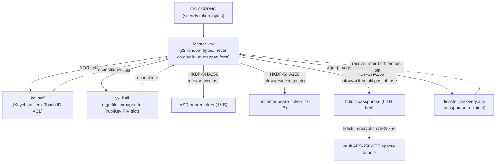

# CRYPTO.md — every cryptographic choice in `local_scribe`, contrasted

> **Scope.** This document enumerates every cryptographic primitive
> `local_scribe` uses, *why* that primitive was chosen over the
> obvious alternatives, what it does *not* protect against, and which
> upgrades are worth making. It complements [`SECURITY.md`](SECURITY.md)
> (which speaks to threat models and defense layers) and
> [`KEY_SAFETY.md`](docs/KEY_SAFETY.md) (which speaks to operational safety
> around key state changes). Where they overlap, this is the
> authoritative source for the *cryptographic engineering decisions*.
>
> **TL;DR.** Defaults are deliberately boring: AES-256-XTS for at-rest
> volume encryption (macOS `hdiutil`), ChaCha20-Poly1305 inside
> [`age`](https://github.com/FiloSottile/age) for everything wrapped
> to a YubiKey or a passphrase, HKDF-SHA256 (RFC 5869) for every key
> derived from the master, HMAC-SHA256 with `hmac.compare_digest` for
> bearer-token verification, OS CSPRNG (`secrets.token_bytes`) for
> every random value, information-theoretic XOR for the two-factor
> master-key split, and `codesign`/`spctl` for binary identity. We
> deliberately do **not** ship any hand-rolled AEAD, our own MITM TLS
> proxy, or any post-quantum primitives yet — the [§ Future
> improvements](#future-improvements) section discusses each gap and
> what closing it would buy.

## Contents

- [Trust hierarchy — where every key comes from](#1-trust-hierarchy)
- [Random number generation](#2-random-number-generation)
- [Key derivation — HKDF-SHA256](#3-key-derivation)
- [At-rest encryption — AES-256-XTS via `hdiutil`](#4-at-rest-encryption)
- [Key wrapping — `age` + X25519 + ChaCha20-Poly1305](#5-key-wrapping)
- [Secret sharing — XOR two-of-two split key](#6-secret-sharing)
- [Disaster-recovery — `age -p` (scrypt + ChaCha)](#7-disaster-recovery)
- [Bearer-token auth — HMAC + constant-time compare](#8-bearer-token-auth)
- [Binary + script integrity — CDHash, SHA-256, git SHA-1](#9-binary--script-integrity)
- [Transport — explicit non-use of TLS internally](#10-transport)
- [Memory hygiene — `bytearray` zeroisation](#11-memory-hygiene)
- [What we deliberately don't ship](#what-we-deliberately-dont-ship)
- [Future improvements](#future-improvements)
- [Document history](#document-history)

---

## 1. Trust hierarchy

Every key in the system derives from, or is wrapped by, the single
**master key** (32 uniformly-random bytes). Losing the master
deterministically loses every derived key; rotating the master
deterministically rotates every derived key. There is no parallel
key in the system that an attacker could compromise to bypass the
master.

Each arrow is a one-way derivation or wrap. The dotted edges back to
the master are the only paths that *yield* the master: they require
the operator to present (Touch ID + YubiKey tap) or (the
disaster-recovery passphrase). No bytes flow against the solid arrows.

For the per-operation lifecycle of the master key itself — when it's
in memory, when it's zeroed, what guards each transition — see
[`key_lifecycle.py`](local_scribe/security/key_lifecycle.py) and
[`SECURITY.md` Defense layer 4](SECURITY.md#defense-layer-4--option-c-split-key-touch-id-and-yubikey).

---

## 2. Random number generation

**Choice.** `secrets.token_bytes()` exclusively, for *every* random
value: the master key, both halves on (re-)split, every per-`init`
operation-id, every test fixture's master. Same source as
`secrets.token_hex()` (used for the test-only token form
`ls_test_<hex>`) and `uuid.uuid4()` (used for the `launch_id` in
[`launch_session.py`](local_scribe/common/launch_session.py)).

**Where in the codebase.**
[`key_split.generate_split_key`](local_scribe/security/key_split.py),
[`secret_store.generate_master_key`](local_scribe/security/secret_store.py),
[`key_split.split_existing_key`](local_scribe/security/key_split.py),
[`service_auth._test_token`](local_scribe/security/service_auth.py).

**Why.** `secrets` is the Python stdlib wrapper documented by PEP 506
as "for managing data such as passwords, account authentication,
security tokens, and related secrets." It calls `os.urandom`, which on
macOS calls `getentropy(2)`, which is a wrapper around the kernel
CSPRNG seeded from the Apple Secure Enclave's TRNG at boot. The same
source ships AES session keys for every TLS connection on the machine
— so if it's broken, the laptop has bigger problems than our 32
bytes.

**Alternatives considered.**

| Alternative | Why not |
| --- | --- |
| `random.SystemRandom` | Identical underlying source but a thinner API surface and a confusing name (the rest of `random` is **not** crypto-safe). `secrets` was added to avoid that footgun. |
| `os.urandom` directly | Works, but loses the higher-level helpers (`token_bytes(n)`, `token_hex(n)`, `compare_digest`) and forces every callsite to remember the same size constants. |
| Hardware TRNG (YubiKey) | Possible via the YubiKey's onboard TRNG, but adds a hardware dependency for a step we want to be available *before* the user has set up the YubiKey (e.g. demo / CI / tests). The OS CSPRNG already seeds from the Secure Enclave's TRNG so the benefit is marginal. |
| `/dev/random` | Identical to `/dev/urandom` on modern macOS; the historical "blocking entropy pool" distinction doesn't exist on Darwin. |

**Residual risk.** Boot-time entropy weakness on freshly imaged VMs;
not relevant on a developer's laptop that's been up for more than a
few seconds.

---

## 3. Key derivation

**Choice.** HKDF-SHA256 (RFC 5869), hand-implemented in
[`service_auth.hkdf_sha256`](local_scribe/security/service_auth.py) (~15 lines). Versioned
salts: `b"local_scribe.service_auth.v1"` for tokens,
`b"local_scribe.vault.passphrase.v1"` for the vault passphrase. Per-use
`info` labels: `b"service:asr"`, `b"service:inspector"`,
`b"vault.hdiutil.passphrase"`.

**Where in the codebase.**
[`service_auth.derive_service_token`](local_scribe/security/service_auth.py) (bearer tokens),
[`vault_unlock.derive_password`](local_scribe/security/vault_unlock.py) (hdiutil passphrase).

**Why HKDF-SHA256.** RFC 5869 is the textbook "extract-then-expand"
KDF for the exact pattern we have — one high-entropy secret (32-byte
master from the OS CSPRNG), many domain-separated derived keys — and
NIST SP 800-108 endorses it. SHA-256 is hardware-accelerated on Apple
Silicon via the SHA-NI extensions (real cost: tens of nanoseconds per
derivation). HKDF gives us domain separation (different `info` ⇒
independent outputs) and version separation (different `salt` ⇒
independent outputs at the same `info`) at trivial cost, which is what
lets us safely add new services later without reusing a token.

**Why we hand-rolled it.** HKDF is 15 lines of code over
`hmac.new(_, _, hashlib.sha256).digest()`. The alternative is pulling
in [`pyca/cryptography`](https://cryptography.io/), which ships ~14 MB
of wheels (an embedded copy of OpenSSL, a Rust toolchain at build time,
a maintained C ABI surface) just to expose
`cryptography.hazmat.primitives.kdf.hkdf.HKDF`. Our entire
non-ML/ASR dependency surface is ~12 lightweight packages; adding
`cryptography` would more than double our crypto-relevant attack
surface for a function we already implement correctly in code that's
fully unit-tested and matches the RFC 5869 test vectors. This is a
deliberate trade-off — see [§ Future
improvements](#future-improvements) for the counter-argument.

**Why `info` and `salt` are both used.** RFC 5869 §2.1 explicitly
allows both; `salt` carries the *application + version* (so we can
rotate the construction by bumping the salt), `info` carries the
*per-use label* (so the same master derives independent tokens for
different services). Mis-using only one is the classic HKDF mis-use
mode where every derived key shares one degree of freedom.

**Alternatives considered.**

| Alternative | Why not |
| --- | --- |
| PBKDF2-HMAC-SHA256 | Designed for *low-entropy passwords*, not high-entropy keys. The 100k iteration count would add ~30 ms per service-auth derivation for no security gain — the master already has 256 bits of entropy. |
| Argon2id | Same reason: it's a *memory-hard password* KDF; using it as a key-from-key KDF wastes resources. We **do** want Argon2id when the input is a passphrase (see [§ 7 — Disaster recovery](#7-disaster-recovery)). |
| BLAKE3 | Faster than SHA-256 on architectures without SHA-NI; on Apple Silicon SHA-256 is already memory-bandwidth-bound, not compute-bound. Adds a non-stdlib dependency. |
| KMAC256 | Same security properties, requires a SHA-3 implementation we don't otherwise need. Strictly worse trade-off. |
| Hard-coded keys per service | Eliminates rotation; if any one service's key leaks, you've leaked a key that ships in the binary. The whole point of HKDF here is "rotate the master and every derived key rotates with it." |

**Residual risk.** If SHA-256 collisions become tractable (no
credible attack today), the construction degrades to "the security of
HMAC-SHA-256," which is even more robust than the hash itself — HMAC's
proof of security doesn't require collision-resistance, only PRF
behaviour. This is one of HMAC's celebrated properties and a reason
we're comfortable depending on it for the long term.

---

## 4. At-rest encryption

**Choice.** AES-256-XTS via macOS `hdiutil`, applied to an APFS
sparse-bundle disk image. The passphrase is derived from the master
key via HKDF-SHA256 (see [§ 3](#3-key-derivation)) and piped in via
`-stdinpass`.

**Where in the codebase.** [`vault.create`](local_scribe/security/vault.py),
[`vault.mount`](local_scribe/security/vault.py), [`vault.rotate_password`](local_scribe/security/vault.py),
[`vault_unlock._hold_password`](local_scribe/security/vault_unlock.py).

**Why a sparse-bundle disk image.** macOS has a 25-year-old, kernel-
mode, hardware-accelerated, audited primitive for "encrypted blob
that Foundation file APIs follow transparently." Char (a Tauri app
using bog-standard Foundation FS APIs) follows the mount-point symlink
into the vault without any code change on its side. The alternative —
a userspace overlay (FUSE) doing per-file AEAD — would require code
changes in *both* Char and our backends to handle decrypt-on-read /
encrypt-on-write, and would carry the bug-fix surface of a userspace
filesystem that has to behave indistinguishably from APFS to apps
that care about atomic-rename semantics, `O_EXCL`, extended
attributes, sparse-file truncation, and a dozen other corners. We
chose the boring primitive.

**Why XTS, not GCM/SIV.** XTS is the IEEE 1619 standard for *block-
oriented full-disk encryption*. It tolerates arbitrary block-write
patterns and accepts ciphertext-stealing for the tail block. It does
*not* provide authentication — a malicious or corrupt ciphertext
block decrypts to garbage rather than an error. For disk encryption
that's actually a feature (random ciphertext writes are normal at the
filesystem layer; an AEAD would force the whole disk image to be
re-MAC'd on every write). For file-level encryption it would be a
bug; we use AEAD (ChaCha20-Poly1305) wherever the granularity is per-
file (see [§ 5](#5-key-wrapping)).

**Why AES-256, not AES-128.** The performance gap on Apple Silicon's
AES instructions is sub-1% (both run at hardware speed). Specifying
AES-256 buys margin against future cryptanalytic improvements and
maps cleanly onto the 32-byte master key without truncation. Cost-
free upgrade.

**Why a sparse *bundle* (banded), not a flat `.dmg`.** Time Machine
and rsync handle the banded format gracefully — each 8 MB band that
changes is the only thing copied, instead of the entire image. The
encryption envelope is identical between the two formats.

**Alternatives considered.**

| Alternative | Why not |
| --- | --- |
| `cryptsetup` / LUKS on a macOS file | LUKS is a Linux primitive; macOS lacks the kernel support. Would require running everything in a Linux VM, which destroys the "boring native primitive" benefit. |
| Per-file ChaCha20-Poly1305 via a FUSE overlay | Bug-fix surface as above. Would also break Time Machine / Spotlight in subtle ways. Reconsider only if we ever ship our own session-storage layer. |
| FileVault alone | FileVault encrypts the *whole* volume with a key that's *auto-unlocked on login*. That's a different threat model — protects against stolen-laptop forensics but does nothing against malware running as the logged-in user. Our vault is *additionally* gated by Touch ID + YubiKey, every mount. |
| Plain `openssl enc` on each file | Lacks an AEAD, lacks key derivation, lacks IV management, and pushes the IV-misuse footgun onto every caller. |

**Residual risk.** A vault that is *currently mounted* is exactly as
readable as the rest of the filesystem to any process running as the
operator's UID. This is by design (Char's TaurI process reads
transcripts via standard `open(2)`) and is mitigated by [SIP](SECURITY.md#defense-layer-0--system-integrity-protection-mandatory)
and by `./run.sh stop` unmounting the vault.

---

## 5. Key wrapping

**Choice.** [`age`](https://github.com/FiloSottile/age) with two
recipient modes:

- **`yk_half.age`** — wrapped to one or more YubiKey recipients via
  [`age-plugin-yubikey`](https://github.com/str4d/age-plugin-yubikey).
  The plugin generates an X25519 keypair *inside* the YubiKey's PIV
  slot 9a (Authentication); the public key is the `age1yubikey1...`
  recipient string; the private key never leaves the YubiKey. Each
  decryption is gated by a physical touch (`touch-policy=always`).
- **`disaster_recovery.age`** — wrapped to a passphrase via age's
  built-in scrypt recipient (`age -p`). See [§ 7](#7-disaster-recovery).

Both modes produce age files whose *payload* is ChaCha20-Poly1305
(see RFC 8439 / 7539) framed per the
[age v1 spec](https://age-encryption.org/v1).

**Where in the codebase.**
[`yubikey_backup.enroll`](local_scribe/security/yubikey_backup.py),
[`yubikey_backup.backup_yk_half`](local_scribe/security/yubikey_backup.py),
[`yubikey_backup.decrypt_yk_half`](local_scribe/security/yubikey_backup.py),
[`disaster_recovery.encrypt`](local_scribe/security/disaster_recovery.py),
[`disaster_recovery.decrypt`](local_scribe/security/disaster_recovery.py).

**Why `age` over the alternatives.**

- **`age` is small, audited, and has a tiny attack surface.** The
  reference implementation is ~2k lines of Go; the `rage` Rust port
  has had a formal third-party security review. The spec fits on a
  postcard. Compare to OpenPGP, where a "secure" tool ships ~40k
  lines and has had recurring CVEs (EFAIL, RNP, ROCA, …).
- **The YubiKey integration is already done well.** `age-plugin-yubikey`
  is the de-facto tool for "wrap a small payload to a YubiKey PIV
  slot." Implementing the equivalent ourselves over `ykman piv keys
  decipher` would mean reinventing X25519 wrapping, IV management,
  KDF-from-shared-secret, and AEAD framing — all of which `age`
  already gets right.
- **Multi-recipient files are first-class.** A second YubiKey is just
  another `age1yubikey1...` line in
  `~/.config/local_scribe/yubikey_recipients.txt` and a re-encrypt of
  `yk_half`. No bespoke "key fan-out" code on our side.

**Why touch-policy=always.** The PIV slot can be configured to never
require a touch (the YubiKey acts as a smart card), once-per-session,
or always. We choose `always` so each individual decryption operation
is gated by a fresh physical-presence proof. This is the property
that makes `yk_half` un-stealable: a remote attacker with full code
execution on the laptop cannot quietly extract `yk_half` while you're
asleep with the key in the USB port — they would need the contact
plate touched.

**Why pin-policy=never.** PIV would let us also gate every decrypt
behind a 6-8 digit PIN. We don't, for three reasons: (a) PINs over
USB are subject to keystroke-logging by the same attacker who would
have to attack the rest of the stack to matter, (b) we'd need a
`pinentry` UX which is hard to do well, (c) the touch-policy already
provides "physical user presence" which is the property we actually
care about. The PIN would add a *something-you-know* factor that's
weaker than the Touch ID gate already covers via the Keychain side.

**Why X25519 inside the YubiKey, not Ed25519 or RSA.** `age-plugin-
yubikey` chooses X25519 for the wrapping key because it's a small,
fast, key-agreement-friendly curve that fits comfortably inside the
PIV slot's storage. The plugin handles slot enrolment, recipient
string generation, and the ECDH-derive-and-AEAD-unwrap dance. The
choice is downstream of `age-plugin-yubikey`'s design, not ours; we
just consume the recipient strings.

**Alternatives considered.**

| Alternative | Why not |
| --- | --- |
| Plain `ykman piv keys decipher` | Reinvents what `age-plugin-yubikey` already does correctly. Larger code-base on our side, more chances to introduce a bug. |
| OpenPGP (GnuPG) with YubiKey OpenPGP slot | Massive attack surface (gpg, gpgsm, gpg-agent, scdaemon, the IPC dance). Notorious historical CVEs. The OpenPGP key format pre-dates AEAD; `gpg` defaults to AES-256-CFB with a legacy MDC. We'd be downgrading. |
| WebAuthn `largeBlob` extension | Promising but support is uneven (depends on the authenticator's storage budget); `largeBlob` on a YubiKey 5 caps at ~1024 bytes and the read/write API isn't exposed on macOS without an Apple-private framework. |
| `libsodium` (PyNaCl) directly | Forces us to design our own file format, our own KDF-from-shared-secret, and our own touch-policy enforcement (which doesn't exist — touch policy is a YubiKey PIV concept that the `age-plugin-yubikey` plugin specifically marshals). |
| Apple's Secure Enclave (`SecKey` with `kSecAttrTokenIDSecureEnclave`) | The Secure Enclave can hold a P-256 key that the OS will only let you sign with after a biometric prompt — but only on the *one* Mac that enrolled it. No portability to a second laptop, no recovery if the Mac dies. The YubiKey is *the recovery path*. |

**Residual risk.** A YubiKey enrollment binds `yk_half` to one
physical YubiKey (or to a small set of physically enrolled YubiKeys,
via the multi-recipient flow). Lose all enrolled YubiKeys → `yk_half`
is unrecoverable; the only recovery is the
[disaster-recovery passphrase](#7-disaster-recovery). The OS-level
threat that an attacker reads `yk_half` *after* you've decrypted it
is identical to the threat on the master itself — see
[SECURITY.md Defense layer 0](SECURITY.md#defense-layer-0--system-integrity-protection-mandatory).

---

## 6. Secret sharing

**Choice.** XOR of two uniformly-random 32-byte halves —
`master = kc_half ⊕ yk_half`. Information-theoretic 2-of-2 secret
sharing.

**Where in the codebase.**
[`key_split.generate_split_key`](local_scribe/security/key_split.py),
[`key_split.combine_halves`](local_scribe/security/key_split.py),
[`key_split.split_existing_key`](local_scribe/security/key_split.py).

**Why XOR.** This is the textbook 2-of-2 information-theoretic
secret-sharing construction. Knowing one half tells you *nothing*
(zero bits of mutual information) about the master. Knowing both
halves recovers the master trivially. The construction is its own
inverse, so combining is the same code path as splitting, halving
the audit surface.

**Why not concatenation.** Concat (`kc || yk`) gives the same total
brute-force security (an attacker with one half still needs 2^128
work to find the other), but on a *partial cryptanalytic*
breakthrough — say a side-channel attack that leaks half the AES key
bits — concat leaks a *specific contiguous run* of the master key.
XOR doesn't have that failure mode: each bit of one half is the XOR
of one bit of the master with one bit of the other half, so knowing
half the bits of `kc_half` tells you nothing about any specific
contiguous run of `master`.

**Why not Shamir's Secret Sharing (proper m-of-n).** We don't (yet)
need *m-of-n* — the threat model is "two factors, both required."
SSS becomes interesting if we add a third factor (e.g. "Touch ID OR
any two of three YubiKeys"). Listed in [§ Future
improvements](#future-improvements).

**Alternatives considered.**

| Alternative | Why not |
| --- | --- |
| Concatenation (kc \|\| yk) | Partial-leak risk, above. |
| Encrypt `master` with `kc_half`, store the ciphertext in `yk_half` | Equivalent security, more code, same operational properties. Doesn't generalise to m-of-n. |
| HKDF(master = HKDF(kc_half, info=yk_half)) | Hash both halves into a derived key. Loses the information-theoretic property — if HKDF/HMAC is ever broken (no credible attack today), the master is recoverable from one half plus the HKDF output. XOR has no algorithmic dependency. |

**Residual risk.** XOR is its own inverse, so if both halves are ever
*simultaneously* present in some attacker-readable location, the
master is trivially recoverable. The only place that happens is in
process memory between
[`key_lifecycle.unlock_master_key`](local_scribe/security/key_lifecycle.py) returning and
the caller calling `.forget()`. That window is bounded by SIP (Defense
layer 0) and by the lifecycle invariants in [`key_lifecycle.py`](local_scribe/security/key_lifecycle.py).

---

## 7. Disaster recovery

**Choice.** `age -p` with a passphrase recipient, wrapping the *whole*
32-byte master key in a single file at
`~/.config/local_scribe/disaster_recovery.age`. Age's passphrase mode
uses *scrypt* (RFC 7914) as the password-stretching KDF, then a fresh
random ChaCha20-Poly1305 file key.

**Where in the codebase.**
[`disaster_recovery.encrypt`](local_scribe/security/disaster_recovery.py),
[`disaster_recovery.decrypt`](local_scribe/security/disaster_recovery.py),
invoked from
[`key_lifecycle.init_master_key`](local_scribe/security/key_lifecycle.py) and
[`key_lifecycle.dr_restore`](local_scribe/security/key_lifecycle.py).

**Why scrypt, not Argon2id.** Age's spec mandates scrypt for the
passphrase recipient and we follow the spec. We don't get to pick
the KDF without forking age, which we don't want to do. Scrypt is
fine for the threat model: a stolen `disaster_recovery.age` file +
the passphrase guess space is the only attack, and scrypt's memory-
hard work factor (age default is `logN=18` ≈ 256 MB) bottlenecks
parallel attackers on GPU/ASIC clusters as designed. Argon2id would be
~2x harder per guess for the same memory footprint, but scrypt is
already in the "billion guesses per million dollars per day" regime
for any reasonable user-chosen passphrase. The KDF is not the weakest
link; the passphrase is.

**Why a passphrase, not another key file.** The disaster-recovery
file exists specifically for the case where you've lost the YubiKey
*and* the Mac. A second key file just kicks the problem one
filesystem over. A passphrase is the only artifact you can
realistically write down on paper and put in a sealed envelope at
your parents' house.

**Why the WHOLE master, not just one half.** Split-key recovery would
require two separate DR files (one for `kc_half`, one for `yk_half`)
and the user remembering two passphrases — or worse, one passphrase
that recovers both, which collapses to wrapping the whole master
anyway. Wrapping the whole master makes the recovery procedure
trivially obvious: "run `./run.sh key dr-restore`, paste passphrase,
done."

**Alternatives considered.**

| Alternative | Why not |
| --- | --- |
| Shamir share split across N friends' YubiKeys | Real m-of-n recovery. Interesting future direction (see [§ Future improvements](#future-improvements)). Operationally heavy for a single-user PoC: requires distributing share files, periodic rotation, friend-availability assumptions. |
| Print the master key as 32 hex bytes / a BIP-39 wordlist | Same threat model as the passphrase (paper artefact), but with worse UX: 24 unfamiliar words vs a passphrase the user already knows how to choose. We *should* offer BIP-39 as an option — see [§ Future improvements](#future-improvements). |
| iCloud Keychain backup of the whole master | Defeats the threat model that says "Apple should not be able to read your transcripts." |
| Cloud backup (AWS S3, Backblaze, …) with server-side encryption | Same as above. |
| No DR at all — lose both factors, lose the data | The honest hard-core position. We instead make DR optional (`./run.sh key init --no-dr`) so users who want strict 2-of-2 with no recovery path can have it. |

**Residual risk.** A weak passphrase plus a stolen
`disaster_recovery.age` file plus enough GPU time = the master.
Mitigated by (a) scrypt's memory-hard factor, (b) file-mode
`0o600`, (c) the warning we print at init time. The honest UX
trade-off is documented at length in
[`KEY_SAFETY.md`](docs/KEY_SAFETY.md). A future improvement is to support
**Argon2id-wrapped age** or **PAKE-mediated recovery** so even a
stolen DR file isn't useful without an online step.

---

## 8. Bearer-token auth

**Choice.** Per-service 128-bit bearer tokens, derived via HKDF-SHA256
from the master key (see [§ 3](#3-key-derivation)) with `info=b"service:asr"`
/ `info=b"service:inspector"`. Tokens are 32 lowercase hex characters
plus a service prefix (`ls_asr_…`, `ls_inspector_…`). Verification is
`hmac.compare_digest` for constant-time comparison.

**Where in the codebase.**
[`service_auth.derive_service_token`](local_scribe/security/service_auth.py),
[`service_auth.ServiceToken.matches`](local_scribe/security/service_auth.py),
[`service_auth.is_bypass_enabled`](local_scribe/security/service_auth.py),
[FastAPI gates in `asr_server.py` / `inspector_server.py`](local_scribe/asr/asr_server.py).

**Why 128 bits.** A 128-bit secret has 2^127 average brute-force
work. Every probe is a 401 from a single-threaded uvicorn worker on
loopback. An attacker who can issue 10^6 probes per second (way
beyond realistic on loopback) would still take ~10^25 years to find
the token. We don't need more entropy.

**Why HKDF-derive, not store?** Stored tokens require their own
backup, their own rotation, their own "is this stale?" check. HKDF-
derived tokens inherit *all of those properties for free* from the
master key: rotate the master, the tokens rotate; back up the master,
the tokens come with; export the master to a new machine, the tokens
follow. The trade-off is that "rotate the bearer token" means
"rotate the whole master." Acceptable for a single-user PoC; for an
org deployment we'd want per-service rotation, which is the moment
to introduce stored tokens with their own lifecycle.

**Why prefix the token?** The `ls_asr_` / `ls_inspector_` prefix
isn't crypto; it's an operability feature. A token leaking into a
log line is immediately recognisable as belonging to local_scribe,
and the service name tells the reader which service to rotate. The
*verification* compares the *full string* via `compare_digest`, so
the prefix doesn't introduce a length oracle.

**Why constant-time compare?** `==` on strings short-circuits on the
first mismatched byte, which is a timing oracle for byte-by-byte
recovery if the verification loop is sufficiently noise-free.
`hmac.compare_digest` runs in time proportional to the length of the
inputs regardless of where they differ. The risk over loopback is
small (~microsecond resolution of timing across the local TCP stack
is noise-limited), but using `compare_digest` everywhere is free
defense-in-depth and a clear signal to a future reader.

**Why a single static token per service, not a JWT or per-request
nonce?** A static bearer is enough when (a) the boundary is loopback
and (b) the only thing on the other side is Char (an OAuth-style
flow Char doesn't natively understand). A JWT would add signature
verification we can do with HMAC-SHA256, but the per-request payload
is empty — there's nothing to put in the claims beyond what the
audience already knows. A per-request nonce gives forward-secrecy on
a *replay* attack, but on loopback there's no man-in-the-middle to
replay from. We *do* bind the token to a `launch_id` via
[`launch_session.py`](local_scribe/common/launch_session.py), which gives us per-launch
revocation — the next time `./run.sh start` runs, the previous
launch's bound suffix is invalid even if the underlying HKDF output
hasn't changed.

**Why a bypass switch?** `LOCAL_SCRIBE_DISABLE_AUTH=1` exists for CI
and the screenshot/demo path. It's a deliberate footgun whose state
is logged at WARNING on every service startup and surfaced in the
inspector's About tab. Production code paths don't honour it.

**Alternatives considered.**

| Alternative | Why not |
| --- | --- |
| `cryptography.fernet` | Symmetric AEAD with a built-in token format. Adds the whole `cryptography` package for a primitive we already cover with HKDF + `compare_digest`. |
| `pyjwt` JWT (HS256) | Adds a dependency, adds nothing on loopback. Reconsider when we have a cloud transport. |
| mTLS with client certificates over loopback | Vast machinery — a private CA, certificate provisioning, ALPN/SNI plumbing, certificate rotation — for ~zero security gain over loopback. Reconsider only if the bind ever leaves `127.0.0.1`. |
| HMAC-based request signing (AWS SigV4 style) | The HMAC verification is built on the same primitives as our HKDF; we'd reuse the master key. Worth doing if/when we introduce per-request mutability that needs replay protection. |

**Residual risk.** A bearer token printed into a log is a credential
in plaintext. We mitigate by (a) only logging the
[`token_fingerprint`](local_scribe/security/service_auth.py) (first six hex chars), (b)
running the inspector + ASR servers with `--access-log off` by
default for the production launch path, (c) not echoing the token
back in any HTTP response.

---

## 9. Binary + script integrity

**Choice.** Three layers, each with a different hash function and
different threat model:

1. **Char.app — `codesign` + `spctl` + a pinned CDHash.** SHA-256
   CDHash, pinned to a baseline file. ECDSA-P256 signatures
   verifying the CMS-wrapped CDHash chain to Apple's Developer ID CA.
   See [`char_integrity.py`](local_scribe/char/char_integrity.py).
2. **Our own Python + shell + Swift — `git hash-object` vs.
   `git rev-parse HEAD:<path>`.** Git's blob hash is SHA-1. We use
   it as a *tamper signal*, not as a security-grade integrity check.
   See [`script_integrity.py`](local_scribe/security/script_integrity.py).
3. **Per-file SHA-256.** Inside the Char baseline we record
   SHA-256 of every Mach-O inside the bundle. See
   [`char_integrity._file_sha256`](local_scribe/char/char_integrity.py).

**Why SHA-256 here and git SHA-1 there.** The Char baseline check is
a *security* check — we refuse to start if it fails — so we use a
collision-resistant hash. The script-integrity check is a *change
detection* signal — we want to know if a file in the working tree
differs from `HEAD` so a maintainer can review the diff. We use
whatever hash git computes (SHA-1 today; SHA-256 once
[git's SHA-256 transition](https://git-scm.com/docs/hash-function-transition)
ships) because it lets us reuse `git diff` / `git log` for the
follow-up investigation. We do **not** treat a SHA-1 match as
"the file is unchanged in the security sense" — see [§ Future
improvements](#future-improvements) for the signed-tag flow that
would close that gap.

**Why pin CDHash and not just Team ID + Bundle ID.** Apple's
notarisation pipeline binds a signature to a Team ID + Bundle ID +
the CDHash *of the bundle contents*. Pinning just the Team ID + Bundle
ID would accept any future Char release Apple co-signs, including a
hypothetical compromised release. Pinning the CDHash forces the
maintainer to explicitly run `./run.sh char baseline-update` after
reviewing the new bundle's contents — the per-Mach-O SHA-256 diff
makes it easy to see what changed.

**Why also enumerate every Mach-O's linked libraries.** A pinned
CDHash defends against in-place tampering of an existing binary, but
a dependency-confusion attack could swap a Mach-O's
`@rpath`-resolved library for one from `/opt/homebrew/lib/`. The
allow-list of acceptable library prefixes (`/System/Library/`,
`/usr/lib/`, internal-to-bundle) catches that case at first run.

**Alternatives considered.**

| Alternative | Why not |
| --- | --- |
| GPG-signed git tags + `gpg --verify` on every start | Closes the supply-chain gap that SHA-1 / non-signed git refs leave. Listed in [§ Future improvements](#future-improvements). |
| [Sigstore](https://www.sigstore.dev) keyless signing | Same property, no long-lived signing keys, OIDC-bound. Better target than ad-hoc GPG keys; same gap to close. |
| Bundled reproducible build | Re-run `nitro-cli build-enclave` (or equivalent for Mac PoC) and check the output bundle hash against a pinned manifest. Worth doing for the future cloud-deployment path; overkill for the local PoC where the maintainer can read the source. |
| TPM / Secure Enclave attestation of the running Python interpreter | macOS doesn't expose enclave attestation to userland today; this would require Apple Private Cloud Compute-style APIs that aren't public. |

**Residual risk.** A git-SHA-1 match doesn't prove the working tree
is *identical* to a signed source; only that it matches whatever's
at `HEAD`. A maintainer with write access to the repository (or to
the maintainer's `gh auth` token) could push a malicious commit and
the check would still pass. Closing this fully requires the signed-
tag flow in [§ Future improvements](#future-improvements).

---

## 10. Transport

**Choice.** No TLS internally, on purpose. All `local_scribe` ↔
`local_scribe` traffic is bare HTTP on `127.0.0.1:*` with bearer-
token auth (see [§ 8](#8-bearer-token-auth)). The
[`egress_proxy.py`](local_scribe/egress/egress_proxy.py) handles Char's *outbound* traffic
as a CONNECT *passthrough*, never as a TLS-terminating MITM.

**Why no TLS on loopback.** Loopback is the trust boundary. A process
running on the laptop that can `connect(127.0.0.1, 8000)` is, by
definition, already inside the security perimeter that TLS would have
defended — the operating system has no notion of "trust this loopback
peer, distrust that loopback peer" beyond UID/SIP, which TLS doesn't
help with. Adding TLS would mean (a) generating and trusting a local
CA, (b) provisioning a per-service certificate, (c) plumbing
`--cacert` everywhere, (d) writing the SAN/CN renewal flow, all to
provide zero security against the only attacker (a peer process)
that can reach `127.0.0.1`. The bearer-token check does the *actual*
work of "is this caller authorised?" and is what we test.

**Why a CONNECT passthrough, not a TLS-terminating proxy.** A TLS-
terminating proxy (a `mitmproxy`-style design) would require Char to
trust a local CA we install, would require us to re-encrypt every
upstream connection with our own TLS stack, and would put us in the
business of running a TLS server that has to be at least as
robust as Char's existing one. The CONNECT passthrough sees the
hostname + port from Char's `CONNECT api.openai.com:443` line —
*that's enough* to decide allow/deny — and then byte-bridges the
encrypted bytes between Char and the upstream. We never see TLS
plaintext, never see request headers, never see API keys. The
trade-off is that we cannot inspect the *body* of an allowed
connection — but the destinations on our allow-list are all things
the operator has actively chosen (e.g. their LM Studio loopback), so
body inspection wouldn't add anything.

**Why we don't ship our own TLS for the future cloud path.** When we
do add a cloud transport (the multi-tenant path in [TODO.md](TODO.md#multi-tenant--org-deployments-future-exploratory)),
we should *not* invent our own wire protocol. We should use one of:

- WireGuard via [Tailscale](https://tailscale.com), giving us
  mutual auth + confidentiality + perfect forward secrecy at L3 with
  zero crypto code on our side. Already in the design.
- An ephemeral X25519 + HKDF + ChaCha20-Poly1305 handshake bolted on
  top, **only** if we need per-request forward secrecy stronger than
  Tailscale's per-tunnel forward secrecy already provides — see [§ Future
  improvements](#future-improvements).

**Alternatives considered.**

| Alternative | Why not |
| --- | --- |
| Mandatory TLS on loopback with a local CA | Zero attack-surface reduction; non-trivial UX (`mkcert`, trust-store dance). |
| `socat` UNIX-domain socket between asr_server and inspector | Loopback TCP is fine; UDS would gain ~nothing over `127.0.0.1` and would complicate the WebSocket / SSE plumbing FastAPI / uvicorn already does well over TCP. |
| TLS-terminating MITM for Char | Requires installing our CA into Char's trust store, increases our attack surface (we'd be a TLS *server* now), and complicates the future Network Extension migration. The hostname-based block at the CONNECT layer covers the threats we care about. |
| Tor / I2P / mixnets for the cloud path | Overkill for the threat model (we trust Tailscale ACLs at L3 + WebAuthn-bound device identity at L7). |

**Residual risk.** A loopback peer process running as the same UID
can read every transcript by reading the on-disk vault directly
once it's mounted. TLS would not have prevented this. The defense
against this is [SIP + UID isolation](SECURITY.md#defense-layer-0--system-integrity-protection-mandatory),
not transport crypto.

---

## 11. Memory hygiene

**Choice.** Every callable that holds a key, half, or derived
passphrase keeps the bytes in a `bytearray` and explicitly zeroes the
buffer in the `finally` block of the operation that produced it.
[`key_split.zero_bytes`](local_scribe/security/key_split.py),
[`secret_store.MasterKey.forget`](local_scribe/security/secret_store.py),
[`vault_unlock._hold_password`](local_scribe/security/vault_unlock.py),
[`vault_unlock.rotate_vault_passphrase`](local_scribe/security/vault_unlock.py).

**Why best-effort.** CPython interns short strings, copies bytes
around during GC, and does not provide a guaranteed `mlock(2)`-style
"do not page this memory to swap" API. So "zero the buffer" in
Python means "best-effort: at minimum the next allocation will
overwrite this region; at maximum a coordinated attacker who could
introspect a frame's locals before the `del` won't find a copy in
*this* buffer." We do not claim more than that. The strong
defense against memory-disclosure attackers is
[SIP](SECURITY.md#defense-layer-0--system-integrity-protection-mandatory),
not Python zeroisation.

**Alternatives considered.**

| Alternative | Why not |
| --- | --- |
| `mlock` via `ctypes.cdll.LoadLibrary("/usr/lib/libSystem.dylib").mlock` | Possible on macOS but the per-process `mlock` budget is small (`MEMLOCK_LIMIT` is a soft 64 KB by default), and macOS does not actually swap by default on M-series Macs — the OS uses memory compression. Marginal benefit. |
| C extension that holds key bytes in `mmap`'d memory with `MAP_LOCKED` | Real win in the post-paging-attack threat model. Listed in [§ Future improvements](#future-improvements). |
| Run every key-handling step in a subprocess that exits when the operation completes | Cleanest answer — when the process exits, its address space is reclaimed — but adds IPC overhead to every Touch ID / YubiKey unlock. Plausible direction for a future release. |

**Residual risk.** Any attacker who reaches `task_for_pid()` (i.e., a
SIP-disabled or jailbroken system) can read process memory regardless
of what we do in Python. The defense is one stack-frame up.

---

## What we deliberately don't ship

These are crypto primitives or features the project has deliberately
chosen *not* to add. The rationale is explicit so a future
contributor doesn't reintroduce them without revisiting the trade-
off.

- **Hand-rolled AEAD.** We never implement AES-GCM, ChaCha20-Poly1305,
  or AES-OCB ourselves. The only AEAD constructions in the stack come
  from `hdiutil` (AES-XTS at the volume layer; not technically an
  AEAD but the granularity makes the authentication failure mode
  acceptable) and `age` (ChaCha20-Poly1305 at the file layer).
- **Our own TLS stack.** See [§ 10 — Transport](#10-transport).
- **Post-quantum primitives.** Not in scope for the local PoC. Worth
  considering for the future cloud-transport path; see
  [§ Future improvements](#future-improvements).
- **A custom keyring.** macOS Keychain is the appropriate primitive
  for "store a secret on this Mac, gated by biometric ACL." We
  don't try to replace it.
- **A custom random generator.** `secrets` is the answer. See
  [§ 2](#2-random-number-generation).
- **A custom password hasher.** Age's scrypt is what we use; for any
  future passphrase-protected primitive we'd add Argon2id via a
  vetted library before writing our own.
- **A bring-your-own KDF interface.** HKDF-SHA256 is the only KDF in
  the codebase (other than scrypt-via-age). Adding a second one would
  invite "which one is right for this use?" footgun questions.
- **A "trust-on-first-use" bearer-token negotiation.** Bearer tokens
  derive deterministically from the master; there is no negotiation
  flow that an attacker could MITM.

---

## Future improvements

Concrete, scoped work. Each item is also mirrored in
[`TODO.md`](TODO.md) so the engineering tracking and the design
rationale stay synchronised.

### Crypto-1. Argon2id for the disaster-recovery passphrase

**Today.** `age -p` uses scrypt (RFC 7914) with `logN=18`. Strong
against general-purpose attackers; tractable for state-level
attackers with custom ASIC builds against weak passphrases.

**Improvement.** Wrap the master key *first* in an
Argon2id-stretched key, then `age -p`-wrap that. Argon2id is the
[Password Hashing Competition](https://www.password-hashing.net/)
winner and is materially harder per guess at the same memory budget.

**Cost.** Adds `argon2-cffi` (one Python dep, well-maintained).
~5-10 LoC in [`disaster_recovery.py`](local_scribe/security/disaster_recovery.py).

**Risk if we don't.** Weak DR passphrase + stolen
`disaster_recovery.age` = master compromise. Argon2id pushes the
GPU/ASIC break-cost up by a factor of ~10-100x at the same memory
footprint.

### Crypto-2. BIP-39 wordlist DR backup as an alternative to passphrase

**Today.** The DR passphrase is whatever the user types at `init`
time. UX is poor: users type weak passphrases, then put them on a
sticky note next to the laptop.

**Improvement.** Optionally emit a BIP-39 mnemonic (24 words = 256
bits of entropy) as the DR artefact: the user writes the 24 words
on paper, no passphrase is involved. Restore: type the 24 words.

**Cost.** ~80 LoC: BIP-39 encode/decode (no external deps; the word
list is public-domain), plus a `--bip39` flag on `key init` and
`key dr-restore`. The mnemonic itself is the master key — no scrypt
needed.

**Risk if we don't.** Users pick guessable passphrases. Real-world
crypto failure mode.

### Crypto-3. Hybrid post-quantum wrapping for `yk_half`

**Today.** `yk_half` is wrapped to a YubiKey via X25519 (Curve25519
ECDH). Quantum-secure ECDH does not exist; a Cryptographically
Relevant Quantum Computer would break X25519 in polynomial time.

**Improvement.** Use a hybrid recipient: ML-KEM (NIST FIPS 203,
the Kyber standardisation) *and* X25519, combining the two shared
secrets via HKDF. Either component independently failing leaves the
other intact. The age ecosystem has draft support for hybrid
recipients via [`age-plugin-pq`](https://github.com/keisentraut/age-plugin-pq)
and similar; we'd consume it the same way we consume `age-plugin-
yubikey`.

**Cost.** Wait for age hybrid-recipient support to stabilise (likely
~12 months as of this writing). When it does, this is a one-line
change to the recipient string list.

**Risk if we don't.** "Harvest now, decrypt later" — an attacker
who steals `yk_half.age` today and stores it could decrypt it once
a CRQC exists. Probability inside the next 10 years: low but
nonzero. See [`SECURITY.md` § Beyond the local machine](SECURITY.md#beyond-the-local-machine--why-tls-alone-isnt-enough).

### Crypto-4. Encrypt the local-scribe transcript cache

**Today.** Transcripts are written to the vault (AES-256-XTS) once
they land in Char's session directory. But the *intermediate*
transcript cache at `~/.cache/local_scribe/transcripts/` (keyed by
audio SHA-256) is currently plaintext on disk. If the operator turns
off the vault for any reason, the cache stays plaintext.

**Improvement.** AEAD-wrap each cache entry with a key derived from
the master via HKDF (`info=b"transcript_cache.v1"`). Use ChaCha20-
Poly1305 (via `cryptography` if we ever take the dep, or via a
shelling-out to `age`-with-a-static-recipient for zero-dep).

**Cost.** Decision: bring in `cryptography` for AEAD-from-Python, or
keep shelling out to `age` for everything. The latter is consistent
with current style.

**Risk if we don't.** Vault locked + cache populated = transcripts
in plaintext on disk. Already tracked in
[TODO.md](TODO.md#privacy--security-p0).

### Crypto-5. Sigstore- or GPG-signed git tags for script integrity

**Today.** [`script_integrity.py`](local_scribe/security/script_integrity.py) compares
working-tree blob hashes (SHA-1, via `git hash-object`) against the
hashes pinned at `HEAD`. A maintainer with push access to the
repository can introduce a malicious commit and the check still
passes.

**Improvement.** Maintainer signs release tags with [Sigstore
keyless signing](https://www.sigstore.dev) (OIDC-bound, no long-
lived signing keys to lose) or, as a fallback, GPG. `./run.sh start`
runs `cosign verify-blob` (or `gpg --verify`) against the tag-signed
manifest of expected blob hashes *before* trusting `git hash-object`.

**Cost.** ~150 LoC + a CI workflow that signs tags on release. The
manifest is a sorted list of `(path, sha256)` pairs covered by the
signature.

**Risk if we don't.** A compromised maintainer account is the
weakest link in the supply chain. Mitigated by (a) the small number
of maintainers, (b) [`FORK_CONSIDERATIONS.md` § 11](docs/FORK_CONSIDERATIONS.md)
on what a fork would inherit.

### Crypto-6. Memory-lock the master key bytes

**Today.** The master key sits in a Python `bytearray` and we zero
it on `.forget()`. macOS does not page on M-series hardware by
default (it uses memory compression instead), so swap exposure is
~zero, but a process that's been swapped before a hibernate cycle
could in principle land bytes on disk.

**Improvement.** A tiny C extension (or a `ctypes` wrapper around
`mlock(2)`) that holds the master-key bytes in `mmap`'d anonymous
memory with `MAP_LOCKED`. The Python wrapper exposes the same
"`.as_bytes()` / `.forget()`" API the rest of the codebase already
uses.

**Cost.** ~200 LoC C + bindings, plus a build step. Or ~50 LoC of
`ctypes` with the wart that `RLIMIT_MEMLOCK` is 64 KB by default
(plenty for 32 bytes).

**Risk if we don't.** A hibernate-on-low-battery + cold-boot
attacker could in principle recover the master from disk swap. Low
real-world probability.

### Crypto-7. Subprocess-isolated key operations

**Today.** Every operation that needs the master key reconstitutes
it in the same Python process that serves HTTP requests / shells
out to `hdiutil` / etc. The master lives in that process's address
space for the duration of the operation.

**Improvement.** Spawn a short-lived subprocess (`python -m
key_lifecycle hold-and-yield`) for every operation that needs the
master. The subprocess unlocks, performs the operation, then exits.
The parent process never sees the key bytes directly — only the
operation's output (e.g. an opened FD to the mounted vault). Address-
space reclamation on `exit(2)` is a stronger guarantee than any
zeroisation we can do in-process.

**Cost.** Significant refactor — every callsite that currently
takes a `MasterKey` would take a context manager that spawns the
subprocess. ~500 LoC + careful test coverage of the IPC.

**Risk if we don't.** Long-lived Python processes (the ASR server,
the Inspector) keep the master in memory for many minutes at a
time. A `task_for_pid()`-style attack against either process during
that window dumps the master.

### Crypto-8. m-of-n threshold via Shamir Secret Sharing

**Today.** The split-key model is strict 2-of-2: Touch ID *and*
YubiKey, both required, no exceptions.

**Improvement.** Generalise to a Shamir-SSS m-of-n threshold across
(Touch ID, YubiKey #1, YubiKey #2, …, Printed-Card BIP-39, …) with
the operator picking the threshold. E.g. 2-of-3 across (Touch ID,
YubiKey, printed-card) would let the operator survive losing any
single factor.

**Cost.** Shamir SSS is ~50 LoC of GF(256) arithmetic, well-vetted
implementations exist
([`secretsharing`](https://github.com/blockstack/secret-sharing),
[`sssa-rust`](https://github.com/SSSaaS/sssa-rust)). Operationally
heavier — the operator has to pick a threshold and remember it,
each share has to be backed up separately. Real complexity is in the
UX, not the crypto.

**Risk if we don't.** Single-factor loss (a dropped YubiKey, a
wiped Keychain) ⇒ the DR passphrase is the only recovery path. m-of-
n would give graceful degradation.

### Crypto-9. Ephemeral X25519 + HKDF handshake for the future cloud transport

**Today.** No cloud transport exists. When it does (see [TODO.md
§ multi-tenant](TODO.md#multi-tenant--org-deployments-future-exploratory)),
Tailscale already provides per-tunnel forward secrecy via
WireGuard's Noise handshake.

**Improvement.** Layer on a per-*request* ephemeral X25519 keypair
with HKDF-derived ChaCha20-Poly1305 keys, so a compromised
Tailscale node key six months from now does not retroactively
decrypt today's recorded traffic. Pattern: client generates a fresh
keypair per submission; client sends ephemeral pubkey + (transcript
encrypted to enclave EPK || ephemeral sigma message); enclave
responds encrypted to the client's ephemeral pubkey; both sides
forget the ephemeral private key. Matches Signal's X3DH +
DoubleRatchet conceptually but doesn't need ratcheting because we
have no long-lived session.

**Cost.** Modest: `libsodium` via `pynacl` (~10 MB wheels). ~300 LoC
on each side. Mostly important for the multi-tenant path.

**Risk if we don't.** TLS / Tailscale forward secrecy alone is
solid; not adding this is "good enough" for most threat models.
Reconsider when the cloud path ships.

### Crypto-10. Move HKDF behind `cryptography.hazmat.primitives.kdf.hkdf.HKDF`

**Today.** Hand-rolled HKDF, ~15 LoC, unit-tested against RFC 5869
test vectors.

**Improvement.** Use [`pyca/cryptography`](https://cryptography.io)'s
vetted HKDF implementation. Pulls in `cryptography` (~14 MB of
wheels, Rust toolchain at build time, OpenSSL ABI dependency).

**Cost.** Adds the dep. Removes ~30 LoC of hand-rolled crypto.

**Risk if we don't.** Our HKDF is correct, tested, and 15 LoC over
`hmac` — the surface for a bug is small. The trade-off is whether
"15 LoC of hand-rolled HMAC-based KDF whose tests pass" is more or
less worrying than "depending on PyCA's `cryptography`." Reasonable
people disagree. *Status: deliberately not done; revisit if we
adopt `cryptography` for any other primitive (e.g.
[Crypto-4](#crypto-4-encrypt-the-local-scribe-transcript-cache) AEAD).*

### Crypto-11. AEAD-wrap the Char OpenAI key backup

**Today.** `./run.sh configure-char` writes any real OpenAI key it
finds to
`~/.config/local_scribe/char-openai-key.<ts>.txt` with `chmod 600`.
Plain text on disk.

**Improvement.** Wrap with `age -r <master-derived-recipient>` so
the backup is bound to the master key just like every other secret.
Or — better — refuse to write the backup at all and surface a
"please revoke this key at platform.openai.com" workflow.

**Cost.** Trivial: ~20 LoC + a re-encrypt-on-rotate hook. Already
tracked in [TODO.md](TODO.md#privacy--security-p0).

**Risk if we don't.** A stolen disk image exposes any OpenAI key the
user previously had configured in Char. Bounded blast radius
(financial nuisance, not transcript exposure), but inexcusable to
leave as plaintext.

---

## Cross-reference summary

| Section | Primary file(s) | Threat model entry |
| --- | --- | --- |
| [§ 2 RNG](#2-random-number-generation) | [`key_split.py`](local_scribe/security/key_split.py), [`secret_store.py`](local_scribe/security/secret_store.py) | [SECURITY.md Defense layer 4](SECURITY.md#defense-layer-4--option-c-split-key-touch-id-and-yubikey) |
| [§ 3 KDF](#3-key-derivation) | [`service_auth.py`](local_scribe/security/service_auth.py), [`vault_unlock.py`](local_scribe/security/vault_unlock.py) | [SECURITY.md Defense layer 2](SECURITY.md#defense-layer-2--inter-service-authentication), [SECURITY.md Defense layer 3](SECURITY.md#defense-layer-3--at-rest-encryption) |
| [§ 4 Vault](#4-at-rest-encryption) | [`vault.py`](local_scribe/security/vault.py) | [SECURITY.md Defense layer 3](SECURITY.md#defense-layer-3--at-rest-encryption) |
| [§ 5 Key wrap](#5-key-wrapping) | [`yubikey_backup.py`](local_scribe/security/yubikey_backup.py) | [SECURITY.md Defense layer 4](SECURITY.md#defense-layer-4--option-c-split-key-touch-id-and-yubikey) |
| [§ 6 Split](#6-secret-sharing) | [`key_split.py`](local_scribe/security/key_split.py) | [SECURITY.md Defense layer 4](SECURITY.md#defense-layer-4--option-c-split-key-touch-id-and-yubikey) |
| [§ 7 DR](#7-disaster-recovery) | [`disaster_recovery.py`](local_scribe/security/disaster_recovery.py) | [KEY_SAFETY.md § DR scenarios](docs/KEY_SAFETY.md) |
| [§ 8 Auth](#8-bearer-token-auth) | [`service_auth.py`](local_scribe/security/service_auth.py) | [SECURITY.md Defense layer 2](SECURITY.md#defense-layer-2--inter-service-authentication) |
| [§ 9 Integrity](#9-binary--script-integrity) | [`char_integrity.py`](local_scribe/char/char_integrity.py), [`script_integrity.py`](local_scribe/security/script_integrity.py) | [SECURITY.md Defense layer 5](SECURITY.md#defense-layer-5--char-settings-enforcement) |
| [§ 10 Transport](#10-transport) | [`egress_proxy.py`](local_scribe/egress/egress_proxy.py) | [SECURITY.md Defense layer 1](SECURITY.md#defense-layer-1--network-egress-firewall) |
| [§ 11 Memory](#11-memory-hygiene) | [`key_lifecycle.py`](local_scribe/security/key_lifecycle.py), [`secret_store.py`](local_scribe/security/secret_store.py) | [SECURITY.md Defense layer 0](SECURITY.md#defense-layer-0--system-integrity-protection-mandatory) |

---

## Document history

| Date | Change | Author |
| --- | --- | --- |
| 2026-05-10 | Initial publication. Enumerates every primitive in use, the rationale, the alternatives considered, and the 11 concrete future improvements that are also tracked in [`TODO.md`](TODO.md). | maintainer |
