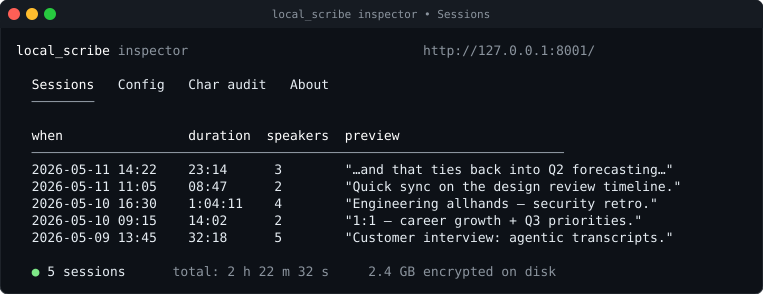

# local_scribe

Local, private, Apple-Silicon-native transcription + summarization pipeline.
Drops in as a Deepgram-compatible endpoint behind [Char](https://char.com) and
uses your local LM Studio + Qwen3 for note generation. Everything runs offline
once the models are downloaded.

> **What this actually is.** `local_scribe` aims to be a secure side-`char`
> (sidecar — pun intended) to the
> [Char](https://github.com/fastrepl/anarlog) project: a thin
> privacy-and-security wrapper around an already-good open-source call
> notetaker, so the recordings, transcripts, and summaries of your day
> never leave the machine without a YubiKey tap saying so. It's a fun
> weekend side project, it offers **no guarantees of any kind**, and
> none of it has been audited by anyone but its author. Overkill?
> Maybe — depends who you are.

```
                 ┌──────────────────────────────────────────────────────┐
   live mic ─►   │                       Char.app                       │
   audio file ─► │  (call UI, file imports, note canvas, summary view)  │
                 └────┬───────────────────────────┬─────────────────────┘
                      │ live recording            │ click "Generate"
                      │ POST /v1/listen           │ POST /v1/audio/transcriptions
                      │ (Deepgram contract,       │ (OpenAI Whisper API contract,
                      │  Custom provider)         │  OpenAI Batch Only provider)
                      ▼                           ▼
       ┌────────────────────────────────────────────────────────────┐
       │  asr_server.py   :8000                                     │
       │    Parakeet-TDT 0.6B v3 (MLX)   default; English; lowest WER
       │    faster-whisper large-v3-turbo  optional multilingual    │
       └─────────────────────────────────┬──────────────────────────┘
                                         │  transcript JSON
                                         ▼
                                 Char ──► LM Studio :1234 ──► Qwen3-30B
                                          (summary in note UI)

       ┌──────────────────────────────────┐
       │  transcribe_file.py              │  manual one-shot CLI
       │  • cache by audio sha256         │   for files Char didn't auto-pick up
       │  • real speaker diarization      │   (sherpa-onnx + LLM speaker naming)
       │  • streaming LLM summary         │
       └──────────────────────────────────┘
```

## What provisioning looks like end-to-end


> _Stylised illustration of the experience._ The exact banners,
> stage numbering, and on-disk paths look slightly different in
> practice — see the [faithful SVG replay](#faithful-svg-replay-of-the-real-bootstrap)
> just below, which is **pinned by the test suite** to every
> string `run.sh::cmd_bootstrap` actually prints.

### Faithful SVG replay of the real bootstrap

A real bootstrap takes 10–30 minutes on a fresh clone (model
downloads + a Touch ID modal + a YubiKey tap + LM Studio install).
The two animated SVGs below are a mocked-but-faithful replay of
what scrolls past in the terminal, generated by
[`tools/make_bootstrap_demo.py`](tools/make_bootstrap_demo.py) and
pinned by [`tests/docs/test_bootstrap_demo.py`](tests/docs/test_bootstrap_demo.py)
so they cannot drift from the real `run.sh` stage banners.

> **How to read these.** SVGs animate on first page-load via SMIL;
> if you scrolled past while they were playing, refresh to replay
> from the top. Every line you see below is a verbatim string from
> `run.sh::cmd_bootstrap` — the test suite asserts that. The
> hardware-prompt banners (yellow / red rules) are the exact same
> banners `touch_prompts.py` prints when the real bootstrap hits a
> Touch ID modal or a YubiKey tap.

**Part 1 — venv, key tools, master key (Touch ID + YubiKey)**



**Part 2 — vault, models, Char, firewall**


**Stop. Then `./run.sh start`. This is what success looks like:**


### What the inspector UI looks like once it's running

These are stylised SVG renderings of three inspector tabs — same
visual language as the bootstrap demo, generated by
[`tools/make_ui_mockups.py`](tools/make_ui_mockups.py) and pinned
against the live `inspector_server.py` template by
[`tests/docs/test_ui_mockups.py`](tests/docs/test_ui_mockups.py),
so the README cannot drift from the actual UI's information
design. For real browser screenshots driven by Playwright against
a disposable demo dataset, see [§ Screenshots](#screenshots) below.

**Sessions tab — every session on disk, encrypted-at-rest in the vault**



**Char audit tab — the full security posture, all green**

![Mock screenshot of the inspector Char audit tab showing two stacked tables. The top one ("Char audit", populated by GET /api/char/audit) lists the six concrete Char settings keys we enforce (STT base_url, api_key, current provider, LLM base_url, analytics killed, firewall block list) with OK status + current values. The bottom one ("Security verification", populated by GET /api/security/audit) lists ten defense-layer rows (SIP, Option C split-key, encrypted vault, Char binary integrity, settings enforcement, signed config, script integrity, egress firewall, pre-commit hook, disaster recovery) all green.](docs/img/inspector_char_audit.svg)

**…and what a finding looks like — plaintext leftovers outside the vault**


The "plaintext leftovers" finding above is real: when a Char
installation pre-dates the vault, its data dir at
`~/Library/Application Support/hyprnote/` is ciphertext-at-rest
only after `./run.sh vault unlock` relocates it. Any pre-relocation
backups left behind are scanned by `vault.find_plaintext_char_data_copies()`
and surfaced in this exact UI so the operator can delete them with
one click (typed-DELETE confirmation; see `SECURITY.md` § F8).

### Regenerating the demo assets

```bash
./venv/bin/python tools/make_bootstrap_demo.py
./venv/bin/python tools/make_ui_mockups.py
```

Both generators are deterministic — same input, byte-identical
output — so running them with no changes leaves `git status`
clean. The pinning tests in `tests/docs/` will fail CI if a
generator output drifts from what's committed in `docs/img/`,
or if a stage banner in `run.sh::cmd_bootstrap` is renamed
without an accompanying mock update.

## Why this exists — the SaaS-AI default and the locally-controlled alternative

The default way to use AI in 2026 is to hand your bytes to a
vendor. **That's not a value judgment; it's the shape of the
industry.** ChatGPT, Claude.ai, Copilot, Notion AI, Gemini, and
their notetaker counterparts — [Granola](https://granola.ai),
[Otter.ai](https://otter.ai), [Fireflies](https://fireflies.ai),
[Fathom](https://fathom.video), [Read.ai](https://read.ai),
[tl;dv](https://tldv.io), [Avoma](https://avoma.com), and so on —
are all SaaS services. You give them your microphone feed, your
calendar, your meeting transcripts, your summaries, the text of
your follow-up emails, and you trust their public commitments
about what happens to that data on the way through. Most of them
are well-intentioned. Several of them publish thoughtful security
white papers. None of them give you the actual primitives to
verify, end-to-end, what they say they do.

What you're trusting when you use a SaaS AI notetaker:

- **The vendor's security posture.** Every well-known SaaS
  product, including the big ones with serious security teams,
  has had a meaningful incident over the last decade. Atlassian,
  Okta, LastPass, MongoDB Atlas, Twilio, Slack, MailChimp — and
  the smaller AI-tool category has had its share too. Breaches
  are not hypothetical; they're a base-rate fact about running
  any sufficiently large service.
- **That the stated data-handling actually matches the running
  code.** Privacy policies describe intent; they don't compile
  into enforcement. There's no public-attestable bridge between
  "we don't train on your data" in a Terms of Service and "the
  actual production binary never sends a logging payload to a
  training-pipeline endpoint." You can't audit it from outside.
- **That the policy won't change.** Acquisition, pivot, new
  investor, new CEO, new monetization model — every one of these
  rewrites the data deal. A product you trusted when it was
  funded by a privacy-aligned investor in year 1 is not
  necessarily the same product when it's owned by a different
  parent in year 4.
- **The sub-processor chain.** Most AI-tool vendors don't run
  their own inference. They route audio through one or more of
  Deepgram / AssemblyAI / Rev.com for ASR, and one or more of
  OpenAI / Anthropic / Azure OpenAI / Bedrock for the LLM. Each
  is a separate trust boundary, governed by its *own* privacy
  policy and *its own* sub-processors, and the chain is rarely
  fully disclosed.
- **The vendor's jurisdiction.** A US-based vendor is one
  national-security-letter away from disclosing data without
  notifying you. A vendor in any jurisdiction is one subpoena
  away from disclosing it to a civil litigant. Whether or not
  this matters to you depends on what your meetings cover; the
  point is that the vendor, not you, is in the loop.
- **Auto-update.** Even when the SaaS app is an "open-source
  client" (the Char model), the client typically auto-updates,
  and the next update can change the network surface, the
  default provider list, the telemetry payload, or the meaning
  of any toggle. Without a binary-pin on the client and an
  outbound firewall around it, "open source" doesn't translate
  into "the build running on my machine right now is the build I
  audited."
- **Tampering and supply-chain risk.** Each vendor depends on
  hundreds of npm / pip / brew / Cargo packages, each with its
  own maintainer set, each with its own credential hygiene.
  Recent supply-chain incidents (`xz-utils`, the dependency-graph
  attacks on `event-stream`, on `ua-parser-js`, on `coa`, on
  `solana/web3.js`, on `@ctrl/tinycolor`, on `polyfill.io`) are
  routine in modern software. A SaaS vendor inherits all of
  these risks on your behalf, and you find out after the fact.

None of those bullets says "SaaS-AI is bad". A small business
without a dedicated security person, an individual user who
doesn't want to think about key management, a team whose
meetings are genuinely low-sensitivity — all of those are fine
fits for SaaS-AI tools, and the vendors really are trying. The
point of the list is that the trust model is **"we promise"**,
not **"here are the primitives that make us promise-able"**, and
a reader should be able to choose which trust model they accept.

### What "locally-controlled" actually buys you

`local_scribe` is the alternative for the user who wants to opt
out of the promise-based model entirely. It is **not** a claim
that local is automatically more secure than SaaS — local trades
vendor-trust for self-trust, and self-trust has its own failure
modes (you can lose a YubiKey, you can configure something wrong,
you can be socially engineered, you become your own IT
department). What local *does* give you is the ability to
verify, on every start, that the trust statements you care about
are true:

- **A specific pinned Char.app build, not "whatever Char ships
  next".** `char_integrity_gate` (see
  [docs/CHAR_REVIEW.md](docs/CHAR_REVIEW.md) and
  [SECURITY.md § Layer 4](SECURITY.md#layer-4--char-binary-integrity--side-load-detection))
  refuses to run if Char's CDHash, Team ID, Bundle ID, or
  linked-library prefix list has drifted from the baseline you
  blessed. An auto-update doesn't slip past — it requires a
  Touch ID + YubiKey re-bless before the next start succeeds.
- **All inference local, full stop.** ASR is
  [Parakeet-TDT 0.6B v3](https://huggingface.co/nvidia/parakeet-tdt-0.6b-v3)
  on MLX (default) or
  [faster-whisper-large-v3-turbo](https://github.com/SYSTRAN/faster-whisper)
  as a fallback. Summarisation is [Qwen3-30B-Instruct via LM
  Studio](https://lmstudio.ai/models/qwen/qwen3-30b). Both
  run on your machine. **There are no Deepgram / AssemblyAI /
  OpenAI / Anthropic / Azure / Bedrock endpoints in the audio
  path.** This is provable, not aspirational — see the next
  bullet.
- **An outbound firewall that enforces it.** Char runs inside a
  `sandbox-exec` profile with `HTTPS_PROXY` pointed at our
  local [`egress_proxy.py`](local_scribe/egress_proxy.py). Every
  outbound connection Char attempts goes through the proxy,
  which enforces a per-host allowlist defaulting to the loopback
  ASR endpoint. Any non-allowlisted host returns 403 with a log
  line surfaced in the inspector. So "everything stays local"
  isn't a promise; it's a property the kernel + the proxy
  enforce on every request, and any deviation shows up in the
  log immediately. See [SECURITY.md § Defense layer 1](SECURITY.md#defense-layer-1--per-char-outbound-firewall).
- **Operator-controlled keys.** The master key is reconstituted
  from a Touch ID-gated Keychain item (`kc_half`) combined with
  a YubiKey-PIV-wrapped age secret (`yk_half`). Per-service
  bearer tokens are HKDF-derived from the master. No bytes of
  the master key, ever, leave your machine. See [CRYPTO.md](CRYPTO.md)
  and [SECURITY.md § Defense layer 2](SECURITY.md#defense-layer-2--option-c-split-key-touch-id--yubikey).
  The forthcoming HSM path
  ([docs/HARDWARE.md](docs/HARDWARE.md)) tightens this to "no
  bytes of the master key, ever, appear in our Python heap"
  — but even today's Keychain + YubiKey model already removes
  any vendor from the custody chain.
- **A documented threat model with a named adversary list.** The
  [SECURITY.md](SECURITY.md) document walks through nine
  defense layers, an explicit threat-model table, an "out of
  scope" list of things we deliberately don't try to defend
  against, and a self-attestation chapter that compares our
  layers honestly against what macOS already does (so we're not
  pretending to reinvent Gatekeeper). The whole point of writing
  it down is that you can read it and disagree with our
  assumptions. You cannot do that with a SaaS vendor's privacy
  policy because there's no published threat model to disagree
  with.
- **No cloud, no sub-processors, no jurisdiction.** Char's
  notes are on your disk, encrypted at rest in an APFS
  AES-256 vault; the master key for that vault never leaves the
  Keychain unless you provide both a Touch ID tap and a YubiKey
  tap. There is no third party in the loop. There is no entity
  to subpoena. There is no telemetry channel to disable. The
  only thing leaving your machine during a Char session is
  whatever Char's own UI explicitly does (calendar OAuth, etc.),
  and that's gated by the egress proxy's allowlist.

### Why this is even possible now

A small but important point: `local_scribe` is feasible today and
wasn't five years ago. The technological inflection point is
real:

- A 30B-parameter instruction-tuned LLM (Qwen3-30B-Instruct,
  released July 2025) at Q5 quantisation fits in 22 GB and runs
  at 30–50 tokens/second on an M-series laptop. In 2020 the
  comparable quality bar required a >100B-parameter model on a
  multi-GPU server.
- A real streaming ASR (Parakeet-TDT 0.6B v3) ships an MLX
  port that runs in real-time on Apple Silicon with a word error
  rate competitive with cloud Deepgram. In 2020 the comparable
  accuracy required a cloud round-trip.
- Apple Silicon's unified memory architecture gives consumer
  laptops the GPU-side memory budget that previously needed a
  workstation GPU. The same model weights run on a laptop and
  on a Mac Studio.

So the framing "local is the privacy-preserving alternative to
SaaS-AI" is only viable *because* the AI capability frontier has
arrived at consumer hardware in the same window that the SaaS-AI
industry has trained the world to hand its data away by default.
It's a coincidence of timing, and it's a small window of
opportunity to demonstrate that fully-locally-controlled AI
tools can be good enough for daily use. That demonstration is
what `local_scribe` is for.

### What this is not

To be clear about what this project *isn't* claiming:

- It is **not** a critique of any specific vendor named above.
  Granola, Otter.ai, Fireflies and the rest are real products
  built by real engineers solving real problems. The
  comparison is structural (SaaS trust model vs operator-trust
  model), not editorial.
- It is **not** a claim that you should never use SaaS-AI.
  Plenty of meetings genuinely don't need this level of
  protection. The right tool depends on the sensitivity of the
  conversation.
- It is **not** a claim of "we are more secure". Same threat-
  modelled diligence on a SaaS service might be more secure
  than this proof-of-concept; we're trading a vendor's
  professional security team for our own scripts. What we're
  trading *for* is verifiability, jurisdiction-elimination, and
  end-to-end operator control.
- It is **not** an "anti-cloud" stance more broadly. Cloud
  infrastructure remains the right answer for vast classes of
  workload. This is specifically about the audio + transcript +
  summary path for one user's meetings on one user's machine.

If you're the kind of operator for whom the trust-vendors model
is unacceptable for your audio specifically — journalist with
source meetings, lawyer with privileged calls, therapist with
patient sessions, security researcher with vulnerability
disclosures, executive with M&A discussions, individual user
who simply doesn't want their voice in someone else's training
pipeline — `local_scribe` is the alternative built for that
threat model. If you're not that operator, a SaaS notetaker is
probably the better tool for you.

## Status — proof of concept

`local_scribe` is a **proof-of-concept secure stack** for recording and
transcribing calls (1:1s, customer interviews, internal meetings, sales
calls) locally on a laptop, with a threat model strong enough to use in a
daily workflow or a small-business setting. The goal is to demonstrate
what a privacy-first, MFA-protected, locally-hosted note-taking pipeline
can look like end-to-end — not to ship a polished 1.0 product. Treat the
security primitives as production-grade-ish (extensively tested,
threat-modeled, documented; see the test suite and
[SECURITY.md](SECURITY.md)) and the UX as research-grade. None of this is
audited by a third-party security firm. If you wouldn't trust a single-
maintainer GitHub project with the recording of your salary
negotiation, don't trust this one either — read the source first.

### Why scaffold around Char rather than fork it?

[Char](https://char.com) is the open-source, local-first AI meeting
notetaker that already solves the hardest macOS plumbing on the client
side: simultaneous system + microphone capture, a polished session UI, a
note canvas, calendar integration, OAuth flows, Apple code signing,
notarization, Tauri auto-update. The source is at
[fastrepl/anarlog](https://github.com/fastrepl/anarlog) (MIT licensed,
~8.4k stars). Unlike closed-source SaaS notetakers like Granola, the
entire client is code you can read, fork, and self-host — and your audio
and notes stay on disk as plain markdown.

Rather than fork that engineering work, `local_scribe` **scaffolds
around** the released Char binary:

- The ASR server speaks Char's existing Deepgram / OpenAI "Custom
  provider" wire format on `127.0.0.1` — no Char code changes needed,
  we just configure it via its own `store.json`.
- A local sandbox + CONNECT proxy restrict Char's outbound network to
  loopback only, so the firewall is *per-Char* rather than machine-wide.
- The encrypted vault relocates Char's `~/Library/Application
  Support/hyprnote` data dir into an AES-256 sparse bundle, transparently
  to Char.
- A binary-integrity check ([`CHAR_REVIEW.md`](docs/CHAR_REVIEW.md)) baselines
  Char's CDHash so a tampered or unexpected update is caught at startup
  before any key is unlocked.

**The Char team is welcome to adopt any of these controls upstream.**
Every primitive — key splitting, vault, sandbox + proxy firewall, binary
integrity baseline, SIP-gated unlock, the inspector UI, the typed-DELETE
gate — is documented in plain English with the design rationale, threat
model, and test coverage spelled out. See
[SECURITY.md](SECURITY.md),
[ARCHITECTURE.md](docs/ARCHITECTURE.md),
[CHAR_REVIEW.md](docs/CHAR_REVIEW.md),
[FORK_CONSIDERATIONS.md](docs/FORK_CONSIDERATIONS.md).

### Threat model in one paragraph

`local_scribe` treats the laptop it runs on as **potentially compromised
in the future** and asks: can an attacker who lands a shell on this
machine — or a forensic analyst who powers it off and clones the disk —
read your call audio or transcripts? The design answer is **not without
all three of:**

1. **Something you have** — the *physical* enrolled YubiKey (the on-disk
   `yk_half.age` is decryptable only by a YubiKey holding the right PIV
   slot identity; an attacker without the hardware token sees only age-
   encrypted ciphertext).
2. **Something you have, and do** — a fresh *touch* on that YubiKey at
   unlock time (`touch-policy=always`, no caching; every unlock requires
   a new physical tap).
3. **Something you know** — your macOS user password, which gated the
   Touch ID enrolment that protects the Keychain half of the split key.

That's MFA in the classical *something you have + something you know*
sense, with an explicit physical-tap requirement layered on top so a
remote attacker who somehow stole both halves still can't perform the
unlock without being at the keyboard. On-disk audio + transcripts live
inside an AES-256 sparse-bundle vault whose passphrase is HKDF-derived
from `kc_half XOR yk_half`; the master key never persists outside
process memory and is zeroized between operations. SIP must be enabled
or `./run.sh start` refuses to launch — without SIP, a userspace process
running as you could read the unlocked master key straight out of our
heap via `task_for_pid()`. See [SECURITY.md](SECURITY.md) for the full
per-adversary breakdown and
[ARCHITECTURE.md § 4](docs/ARCHITECTURE.md#4-at-rest-encryption-designed)
for the key + data graph.

### Future direction — private-cloud transcription over Tailscale

For teams that need bigger context windows than a MacBook can load —
genuinely large meetings, multi-hour customer-research sessions, the
ability to summarize across a quarter of calls at once — the same threat
model extends naturally to **on-prem or private-cloud LLMs** without
giving up the "audio never reaches a multi-tenant SaaS" property:

- **[Tailscale](https://tailscale.com)** as the VPN substrate (peer-to-
  peer WireGuard, no exit-node trust required, ACLs keyed on machine
  identity + tags).
- **AWS Nitro Enclaves** (or Apple Private Cloud Compute, or AMD SEV-SNP,
  or Intel TDX) hosting the LLM inside a hardware-attested TEE, with the
  cloud operator cryptographically unable to read prompts or
  completions even with root on the host VM.
- **CloudHSM / YubiHSM** for the cloud-side keys; mTLS auth keyed on the
  *same* enrolled YubiKey so reaching the private LLM still requires a
  physical tap by the human at the keyboard.

This is **future work** — [`TODO.md`](TODO.md) §
"Multi-tenant / org deployments" has a 350-line design exploration
covering the trade-offs (HSM-mediated key release vs. confidential
compute, self-hosted Mac Studio appliance vs. AWS Nitro, the full TEE
attestation chain), and the final subsection sketches a Terraform
manifest that would stand the AWS Nitro path up end-to-end. For now,
everything runs on your laptop and the only network boundary that
matters is your Wi-Fi router.

### Skeptical? Good.

If you're reading this and thinking *"wait, what about X?"* — that's
the right reaction, and the answer is probably already in
[`QUESTIONS.md`](docs/QUESTIONS.md). It's the FAQ for the questions a
security or developer reader is most likely to have after skimming
the rest, with honest answers (including a *"Where the criticism is
fair"* section that lists 10 known weaknesses we haven't fixed yet).
A few of the questions it addresses:

- **"Why didn't you just fork Char and contribute upstream?"**
  (Q1; tl;dr: we cost-modelled it, it's
  [`FORK_CONSIDERATIONS.md`](docs/FORK_CONSIDERATIONS.md), the sidecar
  wins on every dimension *except* compile-time capability removal.)
- **"If my laptop is compromised, the master key is in process
  memory after Touch ID + YubiKey, so what does the YubiKey
  actually buy me?"** (Q7; tl;dr: pre-unlock confidentiality + per-
  operation physical-presence proof, *not* post-unlock memory
  isolation, which is why SIP is mandatory.)
- **"`sandbox-exec` is Apple-deprecated; you're building on sand."**
  (Q10; tl;dr: yes, acknowledged, the Network Extension is the
  long-term answer, and the system-mode `/etc/hosts` fallback is
  the defense-in-depth.)
- **"Char launched from the Dock bypasses your firewall."**
  (Q11; tl;dr: documented, prominent, and the same Network
  Extension answer as Q10.)
- **"CONNECT proxies don't see TLS — can't Char tunnel anything
  out?"** (Q12; tl;dr: hostname-level enforcement is enough for
  the threats we're targeting; the *strict allowlist* hardening
  is a known migration.)
- **"You talk about AWS Nitro + CloudHSM + Signal-style ratchets +
  Tailscale + private-cloud LLM. None of that is built. Why is it
  in the docs?"** (Q20; tl;dr: it's a design specification, not a
  roadmap commitment, and writing the threat-model continuation
  down lets a reader decide whether the trajectory matches their
  needs.)

22 questions across 6 categories, plus the self-critical list. If
your question isn't there, file it — open a GitHub issue with
`[question]` in the title and the answer will land in that file.

## Security control coverage — Char alone vs. Char + `local_scribe`

The table below summarises which security-relevant controls
[**Char**](https://github.com/fastrepl/anarlog) ships with by default
versus which ones `local_scribe` adds on top of it, **ordered by the
severity of the risk if the control is missing**. Char is an excellent
open-source notetaker — better than every closed-source SaaS competitor
in the same category — and the rows below are *not* a knock on it; Char
simply does not market itself as a security project. `local_scribe`
exists to add the security posture for users who need one.

**Legend.** ✅ control present and working as designed · ❌ control
absent · ⚠️ control partial, user-configurable, or depends on a
separate user action.

| Risk if missing | Security control | Char alone | + `local_scribe` | Where in this repo |
|---|---|:---:|:---:|---|
| **Critical** — audio reaches a third-party STT API | STT endpoint forced to loopback `127.0.0.1` | ⚠️ user-selectable per provider; default is OpenAI cloud unless changed | ✅ enforced + audited every doctor pass + every inspector load | [`char_audit.py`](local_scribe/char/char_audit.py), [`asr_server.py`](local_scribe/asr/asr_server.py) |
| **Critical** — recordings exfiltrated via crash / analytics SDK | No Sentry / PostHog / analytics SDK bundled in the binary | ❌ Tauri plugins for Sentry, PostHog, and an auto-updater ship enabled by default | ⚠️ we cannot *remove* the SDKs without forking (see [`FORK_CONSIDERATIONS.md`](docs/FORK_CONSIDERATIONS.md)); we *can* and do unreachable-by-default their destinations + flip the `analytics.Disabled` toggle | [`firewall.py`](local_scribe/egress/firewall.py), [`char_settings_writer.py`](local_scribe/char/char_settings_writer.py) |
| **Critical** — Char dials out to external AI / telemetry hosts | Per-app outbound egress filter | ❌ no per-app egress control | ✅ `sandbox-exec` containment + local CONNECT proxy with blocklist; Dock/Spotlight bypass documented as known trade-off | [`egress_proxy.py`](local_scribe/egress/egress_proxy.py), [`char_sandbox.py`](local_scribe/egress/char_sandbox.py) |
| **Critical** — auto-updater fetches + runs unexpected code | Updater channel blocked | ❌ updater plugin enabled by default | ✅ updater hostnames blackholed by firewall + Char version pinned by SHA256 in `run.sh` | [`firewall.py`](local_scribe/egress/firewall.py), [`CHAR_REVIEW.md`](docs/CHAR_REVIEW.md) |
| **High** — stolen / imaged disk yields plaintext recordings | At-rest encryption of audio + transcripts | ⚠️ relies entirely on the user having FileVault on; transcripts and audio live as plaintext files in `~/Library/Application Support/hyprnote` | ✅ AES-256 sparse-bundle vault mounted only while running; ciphertext bands on unmount | [`vault.py`](local_scribe/security/vault.py), [`SECURITY.md` Defense layer 3](SECURITY.md#defense-layer-3--at-rest-encryption) |
| **High** — encryption key auto-unlocks on login (no MFA) | Key material hardware-anchored | ⚠️ FileVault auto-unlock if the user enabled it that way | ✅ YubiKey PIV with `touch-policy=always` + Touch ID-gated Keychain half; XOR split-key construction | [`yubikey_backup.py`](local_scribe/security/yubikey_backup.py), [`secret_store.py`](local_scribe/security/secret_store.py), [`key_split.py`](local_scribe/security/key_split.py) |
| **High** — single phishable factor unlocks transcripts | MFA for every key operation (something you have *and* know) | ❌ logging into the laptop is enough | ✅ Touch ID + fresh YubiKey tap per operation, no caching | [`key_lifecycle.py`](local_scribe/security/key_lifecycle.py), [`SECURITY.md` Defense layer 4](SECURITY.md#defense-layer-4--option-c-split-key-touch-id-and-yubikey) |
| **High** — runs on an OS where userspace boundaries are off | System Integrity Protection check at startup | ❌ no SIP check | ✅ refuses to launch unless `csrutil status` reports fully enabled; no operator override | [`sip_check.py`](local_scribe/security/sip_check.py) |
| **High** — tampered / swapped binary silently changes contract | Binary integrity check at every startup | ❌ Char does not self-baseline | ✅ CDHash of `Char.app` + script-integrity baseline of our own files, checked before any key unlocks | [`char_integrity.py`](local_scribe/char/char_integrity.py), [`script_integrity.py`](local_scribe/security/script_integrity.py) |
| **High** — any local process can `curl` the loopback API and read transcripts | Inter-service bearer auth on every `/api/*` route | ❌ Char keeps the `sk-…` API key for its STT provider in `settings.json` as plaintext, and any local process can read it | ✅ HKDF-derived per-service token, never persisted, gates every gated route via FastAPI dependency + WebSocket handshake | [`service_auth.py`](local_scribe/security/service_auth.py), [`SECURITY.md` Defense layer 2](SECURITY.md#defense-layer-2--inter-service-authentication) |
| **High** — settings drift silently re-routes audio to a cloud STT | Settings-contract enforcement | ❌ no runtime contract; Char will use whatever provider is configured | ✅ `char_audit.py` walks `settings.json` + `store.json` on every doctor pass and every inspector page load; any drift is loud | [`char_audit.py`](local_scribe/char/char_audit.py), [`SECURITY.md` Defense layer 5](SECURITY.md#defense-layer-5--char-settings-enforcement) |
| **Medium** — destructive operations have no friction | Typed-confirm body on destructive endpoints | ❌ delete = click | ✅ server-side requires JSON body `{"confirm": "DELETE"}` on every destructive `/api/*` route; SPA modal is UX, server is the gate | [`inspector_server.py`](local_scribe/inspector/inspector_server.py), [`SECURITY.md` § typed-DELETE](SECURITY.md#defense-in-depth-typed-delete-confirm-body) |
| **Medium** — re-transcription silently overwrites previous result | History of transcript revisions preserved | ❌ overwrite-in-place | ✅ `transcript.json` auto-archived to `<session>/.local_scribe_history/<ts>_<sha7>.json` before every overwrite | [`transcript_history.py`](local_scribe/inspector/transcript_history.py) |
| **Medium** — stolen bearer / API key is valid until manually rotated | One-command key rotation that invalidates *every* derived token | ❌ no concept | ✅ `./run.sh key rotate` regenerates the master and re-derives every per-service token in lockstep | [`key_lifecycle.py`](local_scribe/security/key_lifecycle.py) |
| **Medium** — both factors lost ⇒ permanent data loss | Disaster-recovery escrow without trusting a vendor | ❌ no key management | ✅ optional passphrase-encrypted `age` copy of the master at install; passphrase read from `/dev/tty`, never logged | [`disaster_recovery.py`](local_scribe/security/disaster_recovery.py), [`KEY_SAFETY.md`](docs/KEY_SAFETY.md) |
| **Medium** — destructive key op leaves no recovery path | Pre-flight snapshots before every destructive key operation | ❌ no key management | ✅ every `rotate` / `init --force` / `dr-restore` / `add-yubikey` / `destroy` writes a timestamped snapshot first; reversible until explicitly pruned | [`key_safety.py`](local_scribe/security/key_safety.py) |
| **Medium** — no visibility into what's actually on disk | Auditable inspector with a typed API | ⚠️ Char has its own settings UI but no "show me everything stored, by session, with audio + transcript + history" view | ✅ loopback inspector with session grid, audio player, diarized transcript, char-audit, config editor | [`inspector_server.py`](local_scribe/inspector/inspector_server.py) |
| **Medium** — install scripts modified post-install run silently | Operator-script integrity baseline | ❌ N/A | ✅ `script_integrity.py` baselines `run.sh` and the demo / capture scripts; tamper detection fires before key ops | [`script_integrity.py`](local_scribe/security/script_integrity.py) |
| **Low** — fake / malicious binary impersonates Char | Code-signing + notarisation of the upstream binary | ✅ signed by Fastrepl (Team ID `6SLY7V277V`), notarised, hardened-runtime, stapled ticket | ✅ Char DMG SHA256 pinned in `run.sh` *before* `cp -R` to `/Applications` | [`run.sh`](run.sh), [`CHAR_REVIEW.md`](docs/CHAR_REVIEW.md) |
| **Low** — covert recording mode hidden from the user | Visible recording indicator while capturing | ✅ Char shows it | ✅ we inherit Char's behaviour and don't disable it; [`LEGAL.md` § 2](LEGAL.md#2-our-position-on-recording-without-consent) explicitly forbids forking to remove it | (Char UI behaviour) |
| **Low** — no published security stance | Documented threat model + per-adversary defenses | ❌ Char does not publish a formal threat model | ✅ `SECURITY.md` per-adversary breakdown + `ARCHITECTURE.md` § 14 threat-model diagram + `QUESTIONS.md` self-criticism appendix | [`SECURITY.md`](SECURITY.md), [`QUESTIONS.md`](docs/QUESTIONS.md) |
| **Low** — covert recording endorsed in practice | Documented ethical stance against recording without consent | ❌ no published stance | ✅ [`LEGAL.md` § 2](LEGAL.md#2-our-position-on-recording-without-consent) explicitly refuses to endorse covert recording for any reason | [`LEGAL.md`](LEGAL.md) |

### How to read this table

- **Char's column is not a list of bugs** — it's the baseline a
  privacy-aware open-source notetaker reaches without positioning
  itself as a security project. Every Char ✅ above is already an
  improvement over closed-source SaaS notetakers (Granola, Otter,
  Fireflies, Notion AI).
- **The ⚠️ rows are the ones to read carefully.** In Char's
  column, ⚠️ almost always means "the default isn't safe and
  there's no audit." In `local_scribe`'s column, ⚠️ almost always
  means "we can't remove the capability without forking, so we
  constrain it instead" — see
  [`docs/FORK_CONSIDERATIONS.md`](docs/FORK_CONSIDERATIONS.md).
- **The honest weaknesses we already know about** (Dock-launch
  bypass on the firewall row, `sandbox-exec` deprecation risk,
  the lack of a third-party audit, why the two integrity rows
  are software stand-ins for hardware attestation we'd love to
  have, why we layer our own checks on top of Gatekeeper +
  XProtect + notarization) are all written down — see
  [`SECURITY.md`](SECURITY.md), [`docs/QUESTIONS.md § Self-critical
  list`](docs/QUESTIONS.md), and [`docs/HARDWARE.md`](docs/HARDWARE.md)
  for the hardware-attestation path.

## Screenshots

The two showcase shots below are real Playwright captures of the
inspector running against a **disposable demo dataset**
(`tools/seed_demo.py`) — every name, transcript, and note is
synthetic. The four remaining shots (session detail, config tab,
about, customer-discovery) and the full reproducer (`tools/run_demo.sh`,
demo-mode env vars, screenshot capture script) live in
[`docs/INSPECTOR.md`](docs/INSPECTOR.md) so the README stays focused.
For stylised SVG mockups of the same tabs, see
[§ What the inspector UI looks like](#what-the-inspector-ui-looks-like-once-its-running)
at the top of this README.

### Sessions tab — the card grid of every session on disk


### Char audit — every setting we care about, OK / WARN / INFO


Reproduce locally in two commands:

```bash
python3 tools/seed_demo.py --clean        # seed an isolated demo Char data dir
./tools/run_demo.sh start                 # demo inspector on :8765 (auth bypassed)
open http://127.0.0.1:8765/
```

**None of the demo-mode bypasses are honoured by the production
`./run.sh start` path** — they're CI/test hooks. Full explanation +
the `./tools/capture_screenshots.sh` regenerator are in
[`docs/INSPECTOR.md`](docs/INSPECTOR.md).

## Architecture diagrams

Every major flow in this codebase has a Mermaid diagram in
[`docs/ARCHITECTURE.md`](docs/ARCHITECTURE.md) — **30 diagrams**
total, split into Part I (top-level flows) and Part II (CLIs,
APIs, data shapes). GitHub renders them inline, so the file is a
clickable map of the system.

Most-asked-for entry points:

- [1. System overview](docs/ARCHITECTURE.md#1-system-overview) —
  one-screen picture of Char + ASR + LM Studio + inspector + firewall
- [3. Bootstrap flow](docs/ARCHITECTURE.md#3-bootstrap-flow) —
  what the numbered steps of `./run.sh bootstrap` actually do
- [4. At-rest encryption (designed)](docs/ARCHITECTURE.md#4-at-rest-encryption-designed) —
  full key + data graph (Keychain → master → HKDF tokens → vault → YubiKey backup)
- [5. Service authentication](docs/ARCHITECTURE.md#5-service-authentication-hkdf-tokens) —
  how a Char "Generate" click winds up authenticated against the ASR server
- [6. Outbound network firewall](docs/ARCHITECTURE.md#6-outbound-network-firewall) —
  which Char telemetry / providers / cloud hosts get blackholed
- [14. Threat model × defense layers](docs/ARCHITECTURE.md#14-threat-model--defense-layers) —
  which adversary tier is mitigated by which control

The remaining 24 diagrams (the rest of Part I and all of Part II)
have a full index inside [`docs/ARCHITECTURE.md`](docs/ARCHITECTURE.md).

## Privacy and data locality

Every recording, transcript, and summary lives only on your laptop's
disk, processed by models that run locally on Apple Silicon. There's
no "send-to-cloud" toggle hiding somewhere that could flip on. Once
`bootstrap` finishes, you can disable Wi-Fi and the pipeline keeps
working — see **[`docs/PRIVACY.md`](docs/PRIVACY.md)** for the full
breakdown:

- what stays local (table of paths + who writes them)
- what crosses the network (bootstrap vs runtime), with the loopback-
  only data plane
- what you still have to trust (LM Studio's closed-source app,
  Char.app's bundled SDKs, Spotlight, iCloud, Time Machine)
- per-service bearer-token authentication, dev-mode, and CI bypasses
- the per-Char outbound firewall (sandbox + egress proxy on `:8889`)
- master-key management (Option C split-key) + the AES-256 vault
- the YubiKey operator surface

The cross-layer threat model is [`SECURITY.md`](SECURITY.md); the
claim-to-test traceability matrix is [`docs/SECURITY_AUDIT.md`](docs/SECURITY_AUDIT.md).

> **Hard prerequisite: System Integrity Protection must be fully
> enabled.** `local_scribe` refuses to start (no operator override)
> on any macOS host where `csrutil status` reports anything other
> than `enabled.`. Without SIP, the kernel can't enforce the
> user-space process boundaries every other defense in the project
> relies on. Verify with `csrutil status` (or `./venv/bin/python -m
> sip_check status`); fix by booting to Recovery, running `csrutil
> enable`, and rebooting. Full rationale:
> [SECURITY.md § Defense layer 0](SECURITY.md#defense-layer-0--system-integrity-protection-mandatory).

## What's in here

The codebase has a clean responsibility split across ~30
modules (FastAPI services, ASR + diarization backends, the
egress + key machinery, Char-integration glue, the inspector
UI). The full per-module table — every file's role and which
other modules it talks to — lives in
**[`docs/PROJECT_LAYOUT.md`](docs/PROJECT_LAYOUT.md)**.

## How the integration works (a.k.a. "the hack")

Char is a Tauri desktop app ([fastrepl/anarlog](https://github.com/fastrepl/anarlog),
MIT-licensed). We intercept its outbound STT calls by writing
`http://127.0.0.1:8000` into `ai.stt.openai.base_url` (and the
matching api_key fingerprint), so Char talks our ASR over its
native OpenAI-Whisper / Deepgram contracts without knowing
we exist. Same idea for the LLM path: Char posts to
`http://127.0.0.1:1234` and LM Studio answers. The full
reverse-engineering write-up (what Char sends on the wire,
why we chose this over a fork, how `configure-char` patches
settings.json without breaking Char's hash check, and the
live-recording vs file-Generate divergence) lives in
**[`docs/INTEGRATION.md`](docs/INTEGRATION.md)**.

## Hardware requirements

This repo was developed and end-to-end-tested against an **Apple M3 Max,
16-core (12P+4E), 128 GB unified memory, macOS 15.0** — the "comfortable"
tier in the table below. Everything in the pipeline is Apple Silicon
native (Parakeet via MLX, sherpa-onnx via CoreML, Qwen via LM Studio's
MLX runtime); there is no Intel or Linux build.

| tier | CPU / RAM | LLM | what works | trade-offs |
|---|---|---|---|---|
| **Comfortable** *(reference)* | M2 Pro / M3 / M4 family, **64 GB+ unified memory**, ≥40 GB free disk | `qwen3-30b-a3b-instruct-2507` (32 GB MLX) | live recording, batch Generate, full-quality summaries, all `transcribe_file.py` features | none |
| **Acceptable** | M1 / M2 / M3, **24–48 GB unified memory**, ≥10 GB free disk | `qwen/qwen3-4b` (2.3 GB MLX) — auto-selected by bootstrap on this tier | everything works; summaries are visibly less detailed and reasoning steps occasionally falter on long calls | swap pressure during 2h+ recordings |
| **Minimum** | M1, **16 GB unified memory** | (none — Parakeet only) | live transcription via Char, manual `./run.sh transcribe` | summary step in Char will fail (no LLM) — use the LM Studio chat UI manually instead, or skip summaries |
| **Won't run** | Intel Mac, Linux, Windows, M1 with <16 GB | n/a | n/a | Parakeet-MLX is Apple Silicon-only; CoreML diarization same |

Always-on disk usage at "comfortable" tier with everything pulled:

| component | size |
|---|---|
| Parakeet TDT 0.6B v3 (MLX) | 1.2 GB |
| sherpa-onnx diarization (pyannote 3.0 + TitaNet) | 45 MB |
| Qwen3-30B-A3B-Instruct-2507 (MLX) | 32 GB |
| LM Studio.app | 600 MB |
| Char.app | 350 MB |
| Python venv + pip deps | 2.5 GB |
| **Total** | **~37 GB** |

Add ≈1.6 GB if you also opt into faster-whisper (`ASR_BACKEND=whisper`)
as a fallback engine. Recordings + transcripts live in Char's directory
and grow with usage (a 1-hour 192 kbps mp3 is ≈85 MB; transcript JSON
≈2 MB; summary markdown <10 KB).

## Prerequisites — install these manually once

Most prerequisites are now installed automatically by `./run.sh
bootstrap` (see [§ Bootstrap automation](#bootstrap-automation) below).
The two things you still need to bring yourself:

| | what | how | why |
|---|---|---|---|
| 1 | macOS on Apple Silicon | — | Parakeet-MLX, MLX-Qwen, and CoreML diarization are all Apple-Silicon-only |
| 2 | Python 3.12 or 3.14 | `brew install python@3.14` | runs the server + CLI; `bootstrap` auto-builds the venv |
| 3 | [Homebrew](https://brew.sh) (recommended) | `/bin/bash -c "$(curl -fsSL https://raw.githubusercontent.com/Homebrew/install/HEAD/install.sh)"` | how `bootstrap` installs LM Studio.app + Char.app unattended |

Everything else — **LM Studio.app**, the **Qwen3 model**, the **`lms`
CLI**, **Char.app** at the pinned version, **Parakeet ASR weights**,
**sherpa-onnx diarization models**, and the **Python venv** — is
installed by `./run.sh bootstrap` with one or two y/N prompts (one per
multi-GB download you'd want to pre-approve). See the bootstrap section
below for what each step does.

## Quick start

On a freshly cloned repo:

```bash
git clone <this repo>
cd local_scribe
./run.sh bootstrap        # one-shot setup: venv + pip + ASR/diar models +
                          # LM Studio + Qwen LLM + Char.app + auto-config
./run.sh start            # boot ASR server, ensure LM Studio is up + model
                          # loaded, tail the log
```

## Bootstrap automation

Everything a fresh clone needs runs from one entry point:
`./run.sh bootstrap`. It checks SIP, installs the venv +
pinned deps, makes sure age / age-plugin-yubikey / ykman
are present, walks you through the Option C split-key flow
(Touch ID + YubiKey enrollment), creates the AES-256 vault
and relocates Char's data dir into it, fetches the
Parakeet + diarization model weights, writes the default
config, installs/loads LM Studio + Qwen3, installs the
pinned Char.app and patches its settings, and finally
renders + validates the per-Char sandbox profile.

An animated SVG replay of the whole flow sits at the top
of this README ([§ What provisioning looks like end-to-end](#what-provisioning-looks-like-end-to-end)).
Full per-step reference (what each stage runs, idempotency
rules, what to do when a stage fails, manual fallbacks)
is in **[`docs/BOOTSTRAP.md`](docs/BOOTSTRAP.md)**.

## Configure Char

`./run.sh configure-char` is the one-shot that points
Char.app at our local services and disables its bundled
analytics. It rewrites the four `ai.stt.openai.*` keys in
`~/Library/Application Support/hyprnote/settings.json` to
(`base_url=http://127.0.0.1:8000`, `api_key=<HKDF-derived
ASR token>`, `current_stt_provider=openai`, model =
`whisper-1`), writes `store.analytics.Disabled = true`
(the PostHog kill-switch), and backs up any pre-existing
real OpenAI key to `~/.config/local_scribe/char-openai-key.<ts>.txt`
(chmod 600). The full operator surface — flags, drift
detection, the inspector's one-click "Run
configure-char" button, how the api_key flows through
stdin (never argv), and how to undo a configuration —
lives in **[`docs/CONFIGURE_CHAR.md`](docs/CONFIGURE_CHAR.md)**.

## Char version pin

`local_scribe` only auto-configures Char releases it has
been tested against — the pinned version lives in
[`pinned.json`](pinned.json) (HMAC-signed by the master
key) and gets enforced by `./run.sh start` via the Char
binary-integrity check. If you install a different
version, the pipeline still runs but the inspector flags
drift and `./run.sh configure-char` warns before it
writes anything. The full pin/unpin lifecycle (when to
bump, how to re-baseline the CDHash, how to override for
experimentation) is in
**[`docs/CHAR_VERSION_PIN.md`](docs/CHAR_VERSION_PIN.md)**.

## Daily usage

### Live calls (Char-driven)

Just record in Char as usual. After a reboot, one `./run.sh start` is enough.

```bash
./run.sh status      # PIDs, ports, which model
./run.sh logs        # tail Char's incoming POST /v1/listen requests
./run.sh stop        # shut down ASR (LM Studio left running)
./run.sh restart     # stop + start
```

### Files Char didn't auto-pick up

```bash
./run.sh transcribe ~/Desktop/old_call.m4a
```

Default behavior:

- Transcribes with Parakeet (`ASR_BACKEND=parakeet`).
- Caches the transcript by audio sha256 — second run is instant.
- Diarizes with sherpa-onnx and asks Qwen to map speakers to real names.
- Streams the structured Markdown summary to the terminal token-by-token.
- Pass `--copy` to also drop the summary on your clipboard (off by default).

Useful flags (full list: `./run.sh transcribe --help`):

```bash
./run.sh transcribe FILE --save call.md       # markdown summary -> file
./run.sh transcribe FILE --save call.json     # full bundle (transcript + diarization + summary)
./run.sh transcribe FILE --save call.txt      # raw transcript only
./run.sh transcribe FILE --save-transcript diarized.txt   # diarized transcript only
./run.sh transcribe FILE --copy               # also copy summary to clipboard
./run.sh transcribe FILE --no-diarize         # skip speaker labels
./run.sh transcribe FILE --no-cache           # force re-transcribe
./run.sh transcribe FILE --asr-backend whisper      # switch to multilingual whisper
./run.sh transcribe FILE --call-time "2026-05-08T14:30"   # override timestamp
./run.sh transcribe --list-cache              # table of cached transcripts
./run.sh transcribe --clear-cache             # wipe transcript cache
```

## Health & diagnostics

```bash
./run.sh doctor      # full report: python, deps, models, services, Char-config hints (read-only)
./run.sh status      # quick PIDs + ports + which model
./run.sh health      # one-shot HTTP probe of both services (exit non-zero if down)
./run.sh setup       # force reinstall pip deps + redownload models
```

`./run.sh doctor` is the first thing to run if anything misbehaves. It's
read-only and produces a report like:

```
doctor — validating local pipeline

python:
  ● venv at /…/local_scribe/venv (Python 3.14.3)

python packages:
  ● fastapi            0.136.1
  ● uvicorn            0.46.0
  ● parakeet_mlx       ok
  ● faster_whisper     1.2.1
  ● sherpa_onnx        1.13.1
  …

models:
  ● parakeet (parakeet default)   cached at ~/.cache/huggingface/hub/…
  ● pyannote segmentation         ~/.cache/local_scribe/diarization/…/model.onnx
  ● NeMo TitaNet embedding        ~/.cache/local_scribe/diarization/nemo_en_titanet_small.onnx

services:
  ● ASR server   :8000   reachable
  ● LM Studio    :1234   reachable
  ● qwen3-30b-a3b-instruct-2507 loaded

char.app:
  ● Char 1.0.24 installed (matches pinned)
  ● Char transcriber configured for this server
```

Yellow/red dots tell you exactly which piece is broken so you don't have to
guess.

## End-to-end smoke test

To verify the whole stack — Char's wire contract, our endpoint, sherpa-onnx
diarization, the local pipeline, and LM Studio — without touching Char's UI:

```bash
# Pick any audio file you have lying around
AUDIO=~/Desktop/short_call.mp3

# 1. Replay Char's exact "Generate" request to our OpenAI-compatible endpoint
curl -sS http://127.0.0.1:8000/v1/audio/transcriptions \
  -H "Authorization: Bearer local" \
  -F "file=@${AUDIO};type=audio/mpeg" \
  -F "model=gpt-4o-transcribe-diarize" \
  -F "response_format=diarized_json" | jq '.task, .duration, (.segments | length)'

# 2. Drive the full local pipeline (ASR + diarization + Qwen summary)
./run.sh transcribe "$AUDIO" --diarize --save /tmp/smoke.md

# 3. Confirm both calls landed
./run.sh logs | tail -3
```

A passing run looks like this (numbers from a 60s clip on M3 Max,
ASR backend = parakeet, diarization on, Qwen3-30B-Instruct loaded):

| stage | latency | notes |
|---|---|---|
| `/v1/audio/transcriptions` first call after `start` | ~30 s | parakeet-mlx loading into the worker thread |
| `/v1/audio/transcriptions` warm | 2.9–3.3 s | asr 0.7–1.1s + diar 2.2s |
| `./run.sh transcribe` cached ASR + diar + Qwen | ~12 s | LLM dominates: 8s @ 42 tok/s, ttft 0.26 s |
| `./run.sh transcribe` first run on a new file | + ~3 s | added ASR cost vs. cached run |

Log line shape on a successful Generate (or smoke run):

```text
[openai 4d06a121-…] received 946368 bytes (model='gpt-4o-transcribe-diarize',
                  response_format=diarized_json, filename='audio.mp3')
[openai 4d06a121-…] running diarization (sherpa-onnx) ...
[openai 4d06a121-…] done in 2.87s (asr=0.67s, diar=2.20s, speakers=3),
                  58 chars, lang=en, format=diarized_json
```

If the wire test passes but Char still produces hallucinated note bodies on
short/empty audio, that's not the pipeline — that's Char's note-template
LLM step. Pick a less prescriptive template (or turn off "Use template")
and re-Generate. See the [Troubleshooting](#troubleshooting) section.

## Configuration

Operator-tunable settings live in
`~/.config/local_scribe/config.json` (created by
`./run.sh bootstrap`, editable inline through the
Inspector's Config tab). Defaults are picked so a fresh
clone Just Works — the schema, every field's role and
valid range, and the save/reset round-trip semantics are
in **[`docs/CONFIGURATION.md`](docs/CONFIGURATION.md)**.

## Inspector

The Inspector is a small loopback web UI on `:8001`
(`inspector_server.py`). It surfaces sessions, transcript
+ audio downloads, the Char audit (settings drift +
binary integrity + security verification), live config
editing, and the typed-DELETE-gated destructive ops. SVG
mockups of the tabs are at the top of this README
([§ What the inspector UI looks like](#what-the-inspector-ui-looks-like-once-its-running));
real Playwright-driven screenshots are in [§
Screenshots](#screenshots). The complete operator + API
reference (endpoint list, auth handshake via
`/auth?token=…`, cookie semantics, CSRF posture, and the
demo-mode walkthrough) is in
**[`docs/INSPECTOR.md`](docs/INSPECTOR.md)**.

## Project layout

```
local_scribe/      # FastAPI services, CLIs, modules, run.sh
docs/              # ARCHITECTURE.md, SECURITY_AUDIT.md, the
                   #   extracted reference docs, screenshots, SVGs
tests/             # 1000+ hermetic unit tests
tools/             # demo seeder, screenshot capture, SVG generators
```

Full per-module table + per-cache breakdown:
**[`docs/PROJECT_LAYOUT.md`](docs/PROJECT_LAYOUT.md)**.

## API surface (for non-Char clients)

Both ASR endpoints are wire-compatible with the contracts
Char already implements, so any client that speaks them
works: **OpenAI Whisper** (`POST /v1/audio/transcriptions`)
for batch transcription, **Deepgram** (`POST /v1/listen`
and `WS /v1/listen`) for live. Auth is one of
`Authorization: Bearer …`, `Authorization: Token …`,
`X-API-Key`, or `?api_key=…`. The full endpoint list,
request/response shapes, curl recipes, and the
diarization passthrough mode are in
**[`docs/API.md`](docs/API.md)**.

## Development

```bash
./run.sh setup                                  # one-shot reinstall + redownload
venv/bin/python -m unittest discover -s tests   # 246 tests, ~0.5s, no model loads
```

The tests are fully hermetic — they mock all HTTP/MLX/sherpa-onnx so they run
in milliseconds without any models present.

## Troubleshooting

First two things to run when something looks wrong:
`./run.sh status` (one-line health) and `./run.sh doctor`
(full drift report — SIP, master key, integrity, vault,
Char, services, signed config). Recovery flows for the
scary cases (lost YubiKey, lost Touch ID, corrupted
vault, master-key drift, plaintext leftovers outside the
vault, service won't start) are in
**[`docs/TROUBLESHOOTING.md`](docs/TROUBLESHOOTING.md)**
and **[`docs/KEY_SAFETY.md`](docs/KEY_SAFETY.md)**.

## License & legal

**MIT** for the glue code in this repo — full text in [`LICENSE`](LICENSE).
The underlying models have their own licences: Parakeet TDT v3 is CC-BY-4.0
(NVIDIA), Whisper is MIT (OpenAI), sherpa-onnx ONNX models are Apache 2.0
/ MIT, Qwen3 is Apache 2.0.

[`LEGAL.md`](LEGAL.md) is the broader ethics + legal document and is
**required reading before you record anyone other than yourself**. It
covers, in order:

1. What this project is (a proof-of-concept reference architecture, not
   a product or legal advice).
2. The maintainers' explicit position: **we do not endorse recording any
   person without their knowledge or consent, under any circumstance**.
   Two-party-consent laws exist and we understand them; this software
   exists to make consensual recording *secure*, not to enable
   non-consensual recording.
3. A jurisdiction-by-jurisdiction pointer to the recording-consent laws
   you are responsible for complying with (US federal Wiretap Act + state
   one-party/two-party-consent statutes, EU/UK GDPR, Canada, Australia,
   "anywhere else").
4. The MIT licence choice and rationale (Char compatibility + model-
   ecosystem compatibility + minimal friction).
5. A plain-English restatement of the MIT "AS IS" disclaimer:
   **no warranty, no liability, no representation of fitness for
   purpose, no claim that the security primitives have been
   third-party-audited**. Using the software constitutes acceptance.
6. User indemnification of the maintainers against claims arising from
   your use.
7. A good-faith determination on US/EU export-control status of the
   cryptography used.
8. Trademark acknowledgements for every third-party name in the docs
   (Char, Tailscale, AWS, Apple, YubiKey, Signal, etc.).
9. How to report security, licensing, or legal-misuse concerns.

If you have not read [`LEGAL.md`](LEGAL.md), you should assume you have
not understood the terms under which this software is offered.
