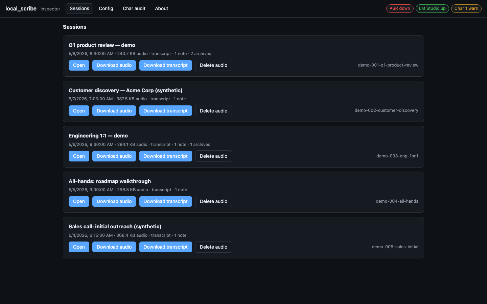
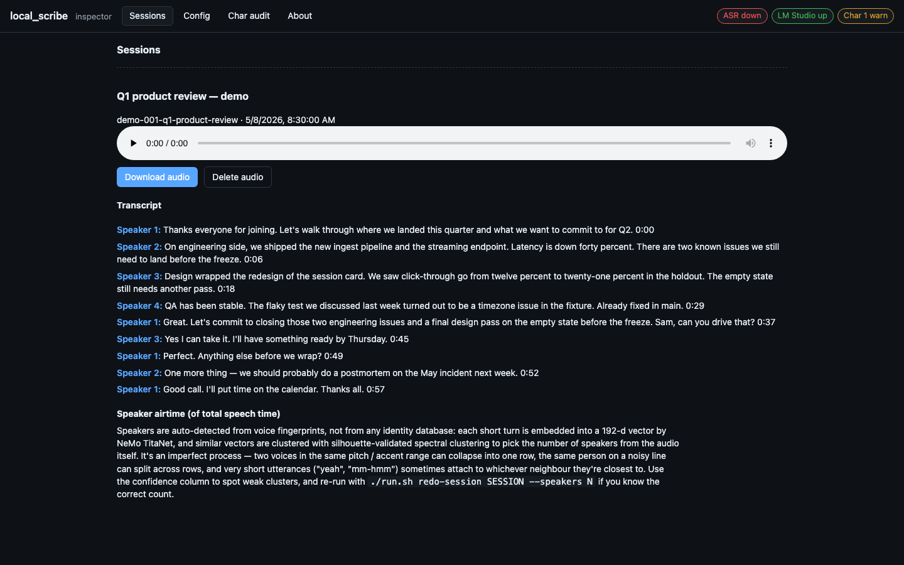
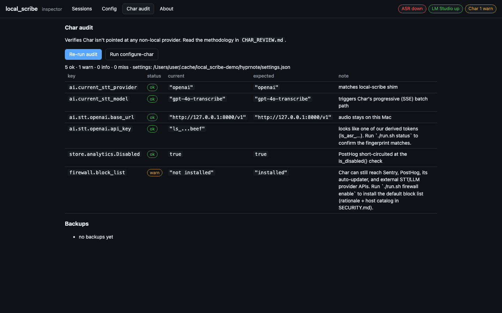
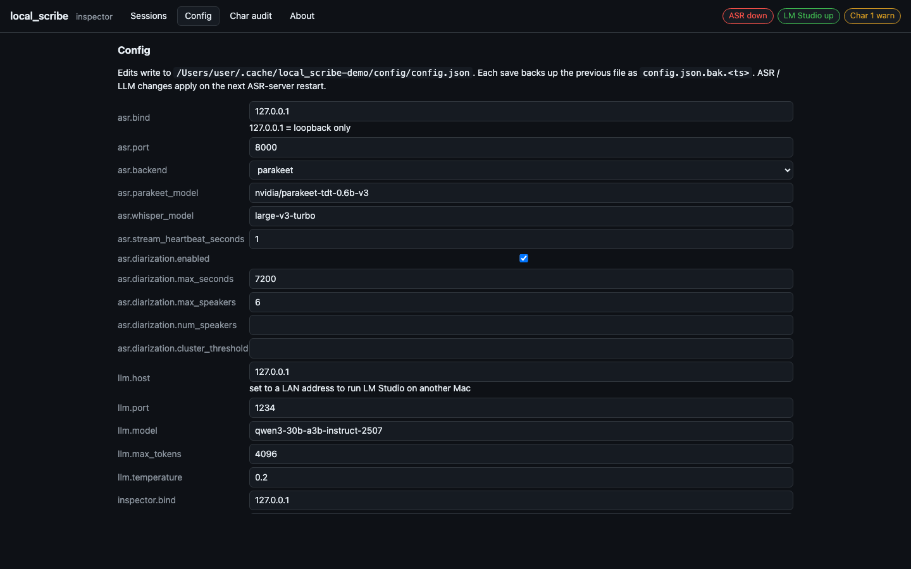

# local_scribe

Local, private, Apple-Silicon-native transcription + summarization pipeline.
Drops in as a Deepgram-compatible endpoint behind [Char](https://char.com) and
uses your local LM Studio + Qwen3 for note generation. Everything runs offline
once the models are downloaded.

> **What this actually is.** `local_scribe` aims to be a secure side-`char`
> (sidecar — pun intended) to the
> [Char](https://github.com/fastrepl/anarlog) project: a thin
> privacy-and-security wrapper around an already-good open-source call
> notetaker, so the recordings, transcripts, and summaries of your day
> never leave the machine without a YubiKey tap saying so. It's a fun
> weekend side project, it offers **no guarantees of any kind**, and
> none of it has been audited by anyone but its author. Overkill?
> Maybe — depends who you are.

```
                 ┌──────────────────────────────────────────────────────┐
   live mic ─►   │                       Char.app                       │
   audio file ─► │  (call UI, file imports, note canvas, summary view)  │
                 └────┬───────────────────────────┬─────────────────────┘
                      │ live recording            │ click "Generate"
                      │ POST /v1/listen           │ POST /v1/audio/transcriptions
                      │ (Deepgram contract,       │ (OpenAI Whisper API contract,
                      │  Custom provider)         │  OpenAI Batch Only provider)
                      ▼                           ▼
       ┌────────────────────────────────────────────────────────────┐
       │  asr_server.py   :8000                                     │
       │    Parakeet-TDT 0.6B v3 (MLX)   default; English; lowest WER
       │    faster-whisper large-v3-turbo  optional multilingual    │
       └─────────────────────────────────┬──────────────────────────┘
                                         │  transcript JSON
                                         ▼
                                 Char ──► LM Studio :1234 ──► Qwen3-30B
                                          (summary in note UI)

       ┌──────────────────────────────────┐
       │  transcribe_file.py              │  manual one-shot CLI
       │  • cache by audio sha256         │   for files Char didn't auto-pick up
       │  • real speaker diarization      │   (sherpa-onnx + LLM speaker naming)
       │  • streaming LLM summary         │
       └──────────────────────────────────┘
```

## Why this exists — the SaaS-AI default and the locally-controlled alternative

The default way to use AI in 2026 is to hand your bytes to a
vendor. **That's not a value judgment; it's the shape of the
industry.** ChatGPT, Claude.ai, Copilot, Notion AI, Gemini, and
their notetaker counterparts — [Granola](https://granola.ai),
[Otter.ai](https://otter.ai), [Fireflies](https://fireflies.ai),
[Fathom](https://fathom.video), [Read.ai](https://read.ai),
[tl;dv](https://tldv.io), [Avoma](https://avoma.com), and so on —
are all SaaS services. You give them your microphone feed, your
calendar, your meeting transcripts, your summaries, the text of
your follow-up emails, and you trust their public commitments
about what happens to that data on the way through. Most of them
are well-intentioned. Several of them publish thoughtful security
white papers. None of them give you the actual primitives to
verify, end-to-end, what they say they do.

What you're trusting when you use a SaaS AI notetaker:

- **The vendor's security posture.** Every well-known SaaS
  product, including the big ones with serious security teams,
  has had a meaningful incident over the last decade. Atlassian,
  Okta, LastPass, MongoDB Atlas, Twilio, Slack, MailChimp — and
  the smaller AI-tool category has had its share too. Breaches
  are not hypothetical; they're a base-rate fact about running
  any sufficiently large service.
- **That the stated data-handling actually matches the running
  code.** Privacy policies describe intent; they don't compile
  into enforcement. There's no public-attestable bridge between
  "we don't train on your data" in a Terms of Service and "the
  actual production binary never sends a logging payload to a
  training-pipeline endpoint." You can't audit it from outside.
- **That the policy won't change.** Acquisition, pivot, new
  investor, new CEO, new monetization model — every one of these
  rewrites the data deal. A product you trusted when it was
  funded by a privacy-aligned investor in year 1 is not
  necessarily the same product when it's owned by a different
  parent in year 4.
- **The sub-processor chain.** Most AI-tool vendors don't run
  their own inference. They route audio through one or more of
  Deepgram / AssemblyAI / Rev.com for ASR, and one or more of
  OpenAI / Anthropic / Azure OpenAI / Bedrock for the LLM. Each
  is a separate trust boundary, governed by its *own* privacy
  policy and *its own* sub-processors, and the chain is rarely
  fully disclosed.
- **The vendor's jurisdiction.** A US-based vendor is one
  national-security-letter away from disclosing data without
  notifying you. A vendor in any jurisdiction is one subpoena
  away from disclosing it to a civil litigant. Whether or not
  this matters to you depends on what your meetings cover; the
  point is that the vendor, not you, is in the loop.
- **Auto-update.** Even when the SaaS app is an "open-source
  client" (the Char model), the client typically auto-updates,
  and the next update can change the network surface, the
  default provider list, the telemetry payload, or the meaning
  of any toggle. Without a binary-pin on the client and an
  outbound firewall around it, "open source" doesn't translate
  into "the build running on my machine right now is the build I
  audited."
- **Tampering and supply-chain risk.** Each vendor depends on
  hundreds of npm / pip / brew / Cargo packages, each with its
  own maintainer set, each with its own credential hygiene.
  Recent supply-chain incidents (`xz-utils`, the dependency-graph
  attacks on `event-stream`, on `ua-parser-js`, on `coa`, on
  `solana/web3.js`, on `@ctrl/tinycolor`, on `polyfill.io`) are
  routine in modern software. A SaaS vendor inherits all of
  these risks on your behalf, and you find out after the fact.

None of those bullets says "SaaS-AI is bad". A small business
without a dedicated security person, an individual user who
doesn't want to think about key management, a team whose
meetings are genuinely low-sensitivity — all of those are fine
fits for SaaS-AI tools, and the vendors really are trying. The
point of the list is that the trust model is **"we promise"**,
not **"here are the primitives that make us promise-able"**, and
a reader should be able to choose which trust model they accept.

### What "locally-controlled" actually buys you

`local_scribe` is the alternative for the user who wants to opt
out of the promise-based model entirely. It is **not** a claim
that local is automatically more secure than SaaS — local trades
vendor-trust for self-trust, and self-trust has its own failure
modes (you can lose a YubiKey, you can configure something wrong,
you can be socially engineered, you become your own IT
department). What local *does* give you is the ability to
verify, on every start, that the trust statements you care about
are true:

- **A specific pinned Char.app build, not "whatever Char ships
  next".** `char_integrity_gate` (see
  [docs/CHAR_REVIEW.md](docs/CHAR_REVIEW.md) and
  [SECURITY.md § Layer 4](SECURITY.md#layer-4--char-binary-integrity--side-load-detection))
  refuses to run if Char's CDHash, Team ID, Bundle ID, or
  linked-library prefix list has drifted from the baseline you
  blessed. An auto-update doesn't slip past — it requires a
  Touch ID + YubiKey re-bless before the next start succeeds.
- **All inference local, full stop.** ASR is
  [Parakeet-TDT 0.6B v3](https://huggingface.co/nvidia/parakeet-tdt-0.6b-v3)
  on MLX (default) or
  [faster-whisper-large-v3-turbo](https://github.com/SYSTRAN/faster-whisper)
  as a fallback. Summarisation is [Qwen3-30B-Instruct via LM
  Studio](https://lmstudio.ai/models/qwen/qwen3-30b). Both
  run on your machine. **There are no Deepgram / AssemblyAI /
  OpenAI / Anthropic / Azure / Bedrock endpoints in the audio
  path.** This is provable, not aspirational — see the next
  bullet.
- **An outbound firewall that enforces it.** Char runs inside a
  `sandbox-exec` profile with `HTTPS_PROXY` pointed at our
  local [`egress_proxy.py`](local_scribe/egress_proxy.py). Every
  outbound connection Char attempts goes through the proxy,
  which enforces a per-host allowlist defaulting to the loopback
  ASR endpoint. Any non-allowlisted host returns 403 with a log
  line surfaced in the inspector. So "everything stays local"
  isn't a promise; it's a property the kernel + the proxy
  enforce on every request, and any deviation shows up in the
  log immediately. See [SECURITY.md § Defense layer 1](SECURITY.md#defense-layer-1--per-char-outbound-firewall).
- **Operator-controlled keys.** The master key is reconstituted
  from a Touch ID-gated Keychain item (`kc_half`) combined with
  a YubiKey-PIV-wrapped age secret (`yk_half`). Per-service
  bearer tokens are HKDF-derived from the master. No bytes of
  the master key, ever, leave your machine. See [CRYPTO.md](CRYPTO.md)
  and [SECURITY.md § Defense layer 2](SECURITY.md#defense-layer-2--option-c-split-key-touch-id--yubikey).
  The forthcoming HSM path
  ([docs/HARDWARE.md](docs/HARDWARE.md)) tightens this to "no
  bytes of the master key, ever, appear in our Python heap"
  — but even today's Keychain + YubiKey model already removes
  any vendor from the custody chain.
- **A documented threat model with a named adversary list.** The
  [SECURITY.md](SECURITY.md) document walks through nine
  defense layers, an explicit threat-model table, an "out of
  scope" list of things we deliberately don't try to defend
  against, and a self-attestation chapter that compares our
  layers honestly against what macOS already does (so we're not
  pretending to reinvent Gatekeeper). The whole point of writing
  it down is that you can read it and disagree with our
  assumptions. You cannot do that with a SaaS vendor's privacy
  policy because there's no published threat model to disagree
  with.
- **No cloud, no sub-processors, no jurisdiction.** Char's
  notes are on your disk, encrypted at rest in an APFS
  AES-256 vault; the master key for that vault never leaves the
  Keychain unless you provide both a Touch ID tap and a YubiKey
  tap. There is no third party in the loop. There is no entity
  to subpoena. There is no telemetry channel to disable. The
  only thing leaving your machine during a Char session is
  whatever Char's own UI explicitly does (calendar OAuth, etc.),
  and that's gated by the egress proxy's allowlist.

### Why this is even possible now

A small but important point: `local_scribe` is feasible today and
wasn't five years ago. The technological inflection point is
real:

- A 30B-parameter instruction-tuned LLM (Qwen3-30B-Instruct,
  released July 2025) at Q5 quantisation fits in 22 GB and runs
  at 30–50 tokens/second on an M-series laptop. In 2020 the
  comparable quality bar required a >100B-parameter model on a
  multi-GPU server.
- A real streaming ASR (Parakeet-TDT 0.6B v3) ships an MLX
  port that runs in real-time on Apple Silicon with a word error
  rate competitive with cloud Deepgram. In 2020 the comparable
  accuracy required a cloud round-trip.
- Apple Silicon's unified memory architecture gives consumer
  laptops the GPU-side memory budget that previously needed a
  workstation GPU. The same model weights run on a laptop and
  on a Mac Studio.

So the framing "local is the privacy-preserving alternative to
SaaS-AI" is only viable *because* the AI capability frontier has
arrived at consumer hardware in the same window that the SaaS-AI
industry has trained the world to hand its data away by default.
It's a coincidence of timing, and it's a small window of
opportunity to demonstrate that fully-locally-controlled AI
tools can be good enough for daily use. That demonstration is
what `local_scribe` is for.

### What this is not

To be clear about what this project *isn't* claiming:

- It is **not** a critique of any specific vendor named above.
  Granola, Otter.ai, Fireflies and the rest are real products
  built by real engineers solving real problems. The
  comparison is structural (SaaS trust model vs operator-trust
  model), not editorial.
- It is **not** a claim that you should never use SaaS-AI.
  Plenty of meetings genuinely don't need this level of
  protection. The right tool depends on the sensitivity of the
  conversation.
- It is **not** a claim of "we are more secure". Same threat-
  modelled diligence on a SaaS service might be more secure
  than this proof-of-concept; we're trading a vendor's
  professional security team for our own scripts. What we're
  trading *for* is verifiability, jurisdiction-elimination, and
  end-to-end operator control.
- It is **not** an "anti-cloud" stance more broadly. Cloud
  infrastructure remains the right answer for vast classes of
  workload. This is specifically about the audio + transcript +
  summary path for one user's meetings on one user's machine.

If you're the kind of operator for whom the trust-vendors model
is unacceptable for your audio specifically — journalist with
source meetings, lawyer with privileged calls, therapist with
patient sessions, security researcher with vulnerability
disclosures, executive with M&A discussions, individual user
who simply doesn't want their voice in someone else's training
pipeline — `local_scribe` is the alternative built for that
threat model. If you're not that operator, a SaaS notetaker is
probably the better tool for you.

## Status — proof of concept

`local_scribe` is a **proof-of-concept secure stack** for recording and
transcribing calls (1:1s, customer interviews, internal meetings, sales
calls) locally on a laptop, with a threat model strong enough to use in a
daily workflow or a small-business setting. The goal is to demonstrate
what a privacy-first, MFA-protected, locally-hosted note-taking pipeline
can look like end-to-end — not to ship a polished 1.0 product. Treat the
security primitives as production-grade-ish (extensively tested,
threat-modeled, documented; see the test suite and
[SECURITY.md](SECURITY.md)) and the UX as research-grade. None of this is
audited by a third-party security firm. If you wouldn't trust a single-
maintainer GitHub project with the recording of your salary
negotiation, don't trust this one either — read the source first.

### Why scaffold around Char rather than fork it?

[Char](https://char.com) is the open-source, local-first AI meeting
notetaker that already solves the hardest macOS plumbing on the client
side: simultaneous system + microphone capture, a polished session UI, a
note canvas, calendar integration, OAuth flows, Apple code signing,
notarization, Tauri auto-update. The source is at
[fastrepl/anarlog](https://github.com/fastrepl/anarlog) (MIT licensed,
~8.4k stars). Unlike closed-source SaaS notetakers like Granola, the
entire client is code you can read, fork, and self-host — and your audio
and notes stay on disk as plain markdown.

Rather than fork that engineering work, `local_scribe` **scaffolds
around** the released Char binary:

- The ASR server speaks Char's existing Deepgram / OpenAI "Custom
  provider" wire format on `127.0.0.1` — no Char code changes needed,
  we just configure it via its own `store.json`.
- A local sandbox + CONNECT proxy restrict Char's outbound network to
  loopback only, so the firewall is *per-Char* rather than machine-wide.
- The encrypted vault relocates Char's `~/Library/Application
  Support/hyprnote` data dir into an AES-256 sparse bundle, transparently
  to Char.
- A binary-integrity check ([`CHAR_REVIEW.md`](docs/CHAR_REVIEW.md)) baselines
  Char's CDHash so a tampered or unexpected update is caught at startup
  before any key is unlocked.

**The Char team is welcome to adopt any of these controls upstream.**
Every primitive — key splitting, vault, sandbox + proxy firewall, binary
integrity baseline, SIP-gated unlock, the inspector UI, the typed-DELETE
gate — is documented in plain English with the design rationale, threat
model, and test coverage spelled out. See
[SECURITY.md](SECURITY.md),
[ARCHITECTURE.md](docs/ARCHITECTURE.md),
[CHAR_REVIEW.md](docs/CHAR_REVIEW.md),
[FORK_CONSIDERATIONS.md](docs/FORK_CONSIDERATIONS.md).

### Threat model in one paragraph

`local_scribe` treats the laptop it runs on as **potentially compromised
in the future** and asks: can an attacker who lands a shell on this
machine — or a forensic analyst who powers it off and clones the disk —
read your call audio or transcripts? The design answer is **not without
all three of:**

1. **Something you have** — the *physical* enrolled YubiKey (the on-disk
   `yk_half.age` is decryptable only by a YubiKey holding the right PIV
   slot identity; an attacker without the hardware token sees only age-
   encrypted ciphertext).
2. **Something you have, and do** — a fresh *touch* on that YubiKey at
   unlock time (`touch-policy=always`, no caching; every unlock requires
   a new physical tap).
3. **Something you know** — your macOS user password, which gated the
   Touch ID enrolment that protects the Keychain half of the split key.

That's MFA in the classical *something you have + something you know*
sense, with an explicit physical-tap requirement layered on top so a
remote attacker who somehow stole both halves still can't perform the
unlock without being at the keyboard. On-disk audio + transcripts live
inside an AES-256 sparse-bundle vault whose passphrase is HKDF-derived
from `kc_half XOR yk_half`; the master key never persists outside
process memory and is zeroized between operations. SIP must be enabled
or `./run.sh start` refuses to launch — without SIP, a userspace process
running as you could read the unlocked master key straight out of our
heap via `task_for_pid()`. See [SECURITY.md](SECURITY.md) for the full
per-adversary breakdown and
[ARCHITECTURE.md § 4](docs/ARCHITECTURE.md#4-at-rest-encryption-designed)
for the key + data graph.

### Future direction — private-cloud transcription over Tailscale

For teams that need bigger context windows than a MacBook can load —
genuinely large meetings, multi-hour customer-research sessions, the
ability to summarize across a quarter of calls at once — the same threat
model extends naturally to **on-prem or private-cloud LLMs** without
giving up the "audio never reaches a multi-tenant SaaS" property:

- **[Tailscale](https://tailscale.com)** as the VPN substrate (peer-to-
  peer WireGuard, no exit-node trust required, ACLs keyed on machine
  identity + tags).
- **AWS Nitro Enclaves** (or Apple Private Cloud Compute, or AMD SEV-SNP,
  or Intel TDX) hosting the LLM inside a hardware-attested TEE, with the
  cloud operator cryptographically unable to read prompts or
  completions even with root on the host VM.
- **CloudHSM / YubiHSM** for the cloud-side keys; mTLS auth keyed on the
  *same* enrolled YubiKey so reaching the private LLM still requires a
  physical tap by the human at the keyboard.

This is **future work** — [`TODO.md`](TODO.md) §
"Multi-tenant / org deployments" has a 350-line design exploration
covering the trade-offs (HSM-mediated key release vs. confidential
compute, self-hosted Mac Studio appliance vs. AWS Nitro, the full TEE
attestation chain), and the final subsection sketches a Terraform
manifest that would stand the AWS Nitro path up end-to-end. For now,
everything runs on your laptop and the only network boundary that
matters is your Wi-Fi router.

### Skeptical? Good.

If you're reading this and thinking *"wait, what about X?"* — that's
the right reaction, and the answer is probably already in
[`QUESTIONS.md`](docs/QUESTIONS.md). It's the FAQ for the questions a
security or developer reader is most likely to have after skimming
the rest, with honest answers (including a *"Where the criticism is
fair"* section that lists 10 known weaknesses we haven't fixed yet).
A few of the questions it addresses:

- **"Why didn't you just fork Char and contribute upstream?"**
  (Q1; tl;dr: we cost-modelled it, it's
  [`FORK_CONSIDERATIONS.md`](docs/FORK_CONSIDERATIONS.md), the sidecar
  wins on every dimension *except* compile-time capability removal.)
- **"If my laptop is compromised, the master key is in process
  memory after Touch ID + YubiKey, so what does the YubiKey
  actually buy me?"** (Q7; tl;dr: pre-unlock confidentiality + per-
  operation physical-presence proof, *not* post-unlock memory
  isolation, which is why SIP is mandatory.)
- **"`sandbox-exec` is Apple-deprecated; you're building on sand."**
  (Q10; tl;dr: yes, acknowledged, the Network Extension is the
  long-term answer, and the system-mode `/etc/hosts` fallback is
  the defense-in-depth.)
- **"Char launched from the Dock bypasses your firewall."**
  (Q11; tl;dr: documented, prominent, and the same Network
  Extension answer as Q10.)
- **"CONNECT proxies don't see TLS — can't Char tunnel anything
  out?"** (Q12; tl;dr: hostname-level enforcement is enough for
  the threats we're targeting; the *strict allowlist* hardening
  is a known migration.)
- **"You talk about AWS Nitro + CloudHSM + Signal-style ratchets +
  Tailscale + private-cloud LLM. None of that is built. Why is it
  in the docs?"** (Q20; tl;dr: it's a design specification, not a
  roadmap commitment, and writing the threat-model continuation
  down lets a reader decide whether the trajectory matches their
  needs.)

22 questions across 6 categories, plus the self-critical list. If
your question isn't there, file it — open a GitHub issue with
`[question]` in the title and the answer will land in that file.

## Security control coverage — Char alone vs. Char + `local_scribe`

The table below summarises which security-relevant controls
[**Char**](https://github.com/fastrepl/anarlog) ships with by default
versus which ones `local_scribe` adds on top of it, **ordered by the
severity of the risk if the control is missing**. Char is an excellent
open-source notetaker — better than every closed-source SaaS competitor
in the same category — and the rows below are *not* a knock on it; Char
simply does not market itself as a security project. `local_scribe`
exists to add the security posture for users who need one.

**Legend.** ✅ control present and working as designed · ❌ control
absent · ⚠️ control partial, user-configurable, or depends on a
separate user action.

| Risk if missing | Security control | Char alone | + `local_scribe` | Where in this repo |
|---|---|:---:|:---:|---|
| **Critical** — audio reaches a third-party STT API | STT endpoint forced to loopback `127.0.0.1` | ⚠️ user-selectable per provider; default is OpenAI cloud unless changed | ✅ enforced + audited every doctor pass + every inspector load | [`char_audit.py`](local_scribe/char/char_audit.py), [`asr_server.py`](local_scribe/asr/asr_server.py) |
| **Critical** — recordings exfiltrated via crash / analytics SDK | No Sentry / PostHog / analytics SDK bundled in the binary | ❌ Tauri plugins for Sentry, PostHog, and an auto-updater ship enabled by default | ⚠️ we cannot *remove* the SDKs without forking (see [`FORK_CONSIDERATIONS.md`](docs/FORK_CONSIDERATIONS.md)); we *can* and do unreachable-by-default their destinations + flip the `analytics.Disabled` toggle | [`firewall.py`](local_scribe/egress/firewall.py), [`char_settings_writer.py`](local_scribe/char/char_settings_writer.py) |
| **Critical** — Char dials out to external AI / telemetry hosts | Per-app outbound egress filter | ❌ no per-app egress control | ✅ `sandbox-exec` containment + local CONNECT proxy with blocklist; Dock/Spotlight bypass documented as known trade-off | [`egress_proxy.py`](local_scribe/egress/egress_proxy.py), [`char_sandbox.py`](local_scribe/egress/char_sandbox.py) |
| **Critical** — auto-updater fetches + runs unexpected code | Updater channel blocked | ❌ updater plugin enabled by default | ✅ updater hostnames blackholed by firewall + Char version pinned by SHA256 in `run.sh` | [`firewall.py`](local_scribe/egress/firewall.py), [`CHAR_REVIEW.md`](docs/CHAR_REVIEW.md) |
| **High** — stolen / imaged disk yields plaintext recordings | At-rest encryption of audio + transcripts | ⚠️ relies entirely on the user having FileVault on; transcripts and audio live as plaintext files in `~/Library/Application Support/hyprnote` | ✅ AES-256 sparse-bundle vault mounted only while running; ciphertext bands on unmount | [`vault.py`](local_scribe/security/vault.py), [`SECURITY.md` Defense layer 3](SECURITY.md#defense-layer-3--at-rest-encryption) |
| **High** — encryption key auto-unlocks on login (no MFA) | Key material hardware-anchored | ⚠️ FileVault auto-unlock if the user enabled it that way | ✅ YubiKey PIV with `touch-policy=always` + Touch ID-gated Keychain half; XOR split-key construction | [`yubikey_backup.py`](local_scribe/security/yubikey_backup.py), [`secret_store.py`](local_scribe/security/secret_store.py), [`key_split.py`](local_scribe/security/key_split.py) |
| **High** — single phishable factor unlocks transcripts | MFA for every key operation (something you have *and* know) | ❌ logging into the laptop is enough | ✅ Touch ID + fresh YubiKey tap per operation, no caching | [`key_lifecycle.py`](local_scribe/security/key_lifecycle.py), [`SECURITY.md` Defense layer 4](SECURITY.md#defense-layer-4--option-c-split-key-touch-id-and-yubikey) |
| **High** — runs on an OS where userspace boundaries are off | System Integrity Protection check at startup | ❌ no SIP check | ✅ refuses to launch unless `csrutil status` reports fully enabled; no operator override | [`sip_check.py`](local_scribe/security/sip_check.py) |
| **High** — tampered / swapped binary silently changes contract | Binary integrity check at every startup | ❌ Char does not self-baseline | ✅ CDHash of `Char.app` + script-integrity baseline of our own files, checked before any key unlocks | [`char_integrity.py`](local_scribe/char/char_integrity.py), [`script_integrity.py`](local_scribe/security/script_integrity.py) |
| **High** — any local process can `curl` the loopback API and read transcripts | Inter-service bearer auth on every `/api/*` route | ❌ Char keeps the `sk-…` API key for its STT provider in `settings.json` as plaintext, and any local process can read it | ✅ HKDF-derived per-service token, never persisted, gates every gated route via FastAPI dependency + WebSocket handshake | [`service_auth.py`](local_scribe/security/service_auth.py), [`SECURITY.md` Defense layer 2](SECURITY.md#defense-layer-2--inter-service-authentication) |
| **High** — settings drift silently re-routes audio to a cloud STT | Settings-contract enforcement | ❌ no runtime contract; Char will use whatever provider is configured | ✅ `char_audit.py` walks `settings.json` + `store.json` on every doctor pass and every inspector page load; any drift is loud | [`char_audit.py`](local_scribe/char/char_audit.py), [`SECURITY.md` Defense layer 5](SECURITY.md#defense-layer-5--char-settings-enforcement) |
| **Medium** — destructive operations have no friction | Typed-confirm body on destructive endpoints | ❌ delete = click | ✅ server-side requires JSON body `{"confirm": "DELETE"}` on every destructive `/api/*` route; SPA modal is UX, server is the gate | [`inspector_server.py`](local_scribe/inspector/inspector_server.py), [`SECURITY.md` § typed-DELETE](SECURITY.md#defense-in-depth-typed-delete-confirm-body) |
| **Medium** — re-transcription silently overwrites previous result | History of transcript revisions preserved | ❌ overwrite-in-place | ✅ `transcript.json` auto-archived to `<session>/.local_scribe_history/<ts>_<sha7>.json` before every overwrite | [`transcript_history.py`](local_scribe/inspector/transcript_history.py) |
| **Medium** — stolen bearer / API key is valid until manually rotated | One-command key rotation that invalidates *every* derived token | ❌ no concept | ✅ `./run.sh key rotate` regenerates the master and re-derives every per-service token in lockstep | [`key_lifecycle.py`](local_scribe/security/key_lifecycle.py) |
| **Medium** — both factors lost ⇒ permanent data loss | Disaster-recovery escrow without trusting a vendor | ❌ no key management | ✅ optional passphrase-encrypted `age` copy of the master at install; passphrase read from `/dev/tty`, never logged | [`disaster_recovery.py`](local_scribe/security/disaster_recovery.py), [`KEY_SAFETY.md`](docs/KEY_SAFETY.md) |
| **Medium** — destructive key op leaves no recovery path | Pre-flight snapshots before every destructive key operation | ❌ no key management | ✅ every `rotate` / `init --force` / `dr-restore` / `add-yubikey` / `destroy` writes a timestamped snapshot first; reversible until explicitly pruned | [`key_safety.py`](local_scribe/security/key_safety.py) |
| **Medium** — no visibility into what's actually on disk | Auditable inspector with a typed API | ⚠️ Char has its own settings UI but no "show me everything stored, by session, with audio + transcript + history" view | ✅ loopback inspector with session grid, audio player, diarized transcript, char-audit, config editor | [`inspector_server.py`](local_scribe/inspector/inspector_server.py) |
| **Medium** — install scripts modified post-install run silently | Operator-script integrity baseline | ❌ N/A | ✅ `script_integrity.py` baselines `run.sh` and the demo / capture scripts; tamper detection fires before key ops | [`script_integrity.py`](local_scribe/security/script_integrity.py) |
| **Low** — fake / malicious binary impersonates Char | Code-signing + notarisation of the upstream binary | ✅ signed by Fastrepl (Team ID `6SLY7V277V`), notarised, hardened-runtime, stapled ticket | ✅ Char DMG SHA256 pinned in `run.sh` *before* `cp -R` to `/Applications` | [`run.sh`](run.sh), [`CHAR_REVIEW.md`](docs/CHAR_REVIEW.md) |
| **Low** — covert recording mode hidden from the user | Visible recording indicator while capturing | ✅ Char shows it | ✅ we inherit Char's behaviour and don't disable it; [`LEGAL.md` § 2](LEGAL.md#2-our-position-on-recording-without-consent) explicitly forbids forking to remove it | (Char UI behaviour) |
| **Low** — no published security stance | Documented threat model + per-adversary defenses | ❌ Char does not publish a formal threat model | ✅ `SECURITY.md` per-adversary breakdown + `ARCHITECTURE.md` § 14 threat-model diagram + `QUESTIONS.md` self-criticism appendix | [`SECURITY.md`](SECURITY.md), [`QUESTIONS.md`](docs/QUESTIONS.md) |
| **Low** — covert recording endorsed in practice | Documented ethical stance against recording without consent | ❌ no published stance | ✅ [`LEGAL.md` § 2](LEGAL.md#2-our-position-on-recording-without-consent) explicitly refuses to endorse covert recording for any reason | [`LEGAL.md`](LEGAL.md) |

### How to read this table

- **Char's column is not a list of bugs.** It's the baseline a privacy-
  aware notetaker reaches without explicitly positioning itself as a
  security product. Compared to closed-source SaaS notetakers
  (Granola, Otter, Fireflies, Notion AI), every Char ✅ in the table
  is already an *improvement* — the entire client is auditable code,
  audio and notes stay on disk as plain markdown, and the recording
  indicator is visible. `local_scribe` is the next ratchet up from
  that baseline.
- **The ⚠️ rows are the ones to read carefully.** They mean *"the
  control is partial or depends on the user doing the right thing."*
  In the Char column, ⚠️ almost always means "the user can configure
  this safely, but the default isn't safe and there's no audit." In
  the `local_scribe` column, ⚠️ almost always means "we cannot remove
  the underlying capability without forking, so we constrain it
  instead — see [`FORK_CONSIDERATIONS.md`](docs/FORK_CONSIDERATIONS.md) for
  the trade-off."
- **Every ✅ in the `local_scribe` column is one of the modules listed
  in [§ "What's in here"](#whats-in-here)**. The "Where in this repo"
  column points at it directly.
- **Everything in this table is also a [`QUESTIONS.md`](docs/QUESTIONS.md)
  entry waiting to be poked at.** The self-criticism appendix at the
  bottom of `QUESTIONS.md` lists the rows we *know* are weakest
  (Dock-launch bypass on the firewall row, `sandbox-exec` deprecation
  risk, lack of third-party audit). If you find another, please file
  an issue.
- **The two integrity rows ("tampered / swapped binary" and
  "install scripts modified post-install") may be deprecated by a
  future trusted execution environment.** The
  [`script_integrity.py`](local_scribe/security/script_integrity.py)
  and operator-HMAC mechanisms backing those rows are software-only
  stand-ins for the hardware-rooted remote attestation we'd run if
  Apple Silicon exposed one to userspace. macOS has no equivalent
  of TPM-style remote attestation today, but
  [Private Cloud Compute](https://security.apple.com/documentation/private-cloud-compute/)
  demonstrates Apple can build attestable enclaves.   If/when an
  equivalent surface lands on the local Mac, these rows simplify
  to a single hardware-attestation check. Until then, hash-on-disk
  + operator HMAC is the best userspace approximation. Full
  framing: [SECURITY.md § "Future direction — trusted execution
  environment"](SECURITY.md#future-direction--trusted-execution-environment).
  The complementary path — moving the LLM-side services onto a
  separate compute box that *does* expose hardware attestation
  (AMD SEV-SNP or Intel TDX), with key custody on a YubiHSM 2 —
  is explored end-to-end in
  [docs/HARDWARE.md](docs/HARDWARE.md). It compares the
  pragmatic Mac Studio + YubiHSM 2 path against the strongest
  bare-metal SEV-SNP path against everything in between, with a
  decision tree by use case + budget.
- **Yes, macOS already runs Gatekeeper + XProtect + notarization.**
  We layer our own integrity checks on top anyway, because Apple's
  stack answers "is this binary signed by *someone* Apple
  recognises?" — not the questions we actually care about, which
  are "is this *the specific* Char.app the operator audited",
  "did anything change since the last start", and "was the
  pinned configuration approved by the operator's YubiKey?".
  Gatekeeper runs **once** per quarantine xattr; we re-verify on
  every `./run.sh start`. Notarization accepts *any* validly
  signed build from Char.dev; we pin to one specific CDHash.
  XProtect catches *known* malware; we catch *any* drift from
  the blessed state. Full pro / con accounting (including the
  honest costs — maintenance overhead, false-positive rate,
  performance cost of the start-time hash) is in
  [SECURITY.md § "Self-attestation — why we layer integrity
  checks on top of macOS's built-ins"](SECURITY.md#self-attestation--why-we-layer-integrity-checks-on-top-of-macoss-built-ins).

## Screenshots

The inspector is a small loopback web UI (`inspector_server.py`) over
the data Char already collects, plus our config + Char-audit + key
diagnostics. Captured against a **disposable demo dataset**
(`tools/seed_demo.py`) — every name, transcript, and note in these
screenshots is synthetic. Reproduce them yourself with two commands
(see § "Run the inspector demo + reproduce these screenshots" below).

### Sessions tab — the card grid of every session on disk



The top-bar status pills (`ASR down · LM Studio up · Char 1 warn`)
show the live state of the data plane; here `ASR down` is expected
because the demo inspector runs alone — `./run.sh start` would bring
ASR up alongside it.

### Session detail — diarised transcript, speaker airtime, audio scrubber



Every paragraph carries a mean per-cluster confidence (joined back
from `local_scribe.diarization.word_confidences` in `transcript.json`).
The `Speaker airtime` footer is the same explanation the
`transcript.txt` download embeds at the bottom of the plain-text
export, so the UI and the file agree.

### Char audit — every setting we care about, OK / WARN / INFO



The audit reads Char's `settings.json` + `store.json`, checks the
four "is Char pointed at our local shim?" keys, the PostHog kill
switch, and whether the outbound firewall is installed. The
`Run configure-char` button is the one-click fix for any drift —
calls into the same code path as `./run.sh configure-char` but
through the inspector's auth-gated POST endpoint.

### Config tab — `~/.config/local_scribe/config.json` with form-bound editing



The save handler round-trips through `config.validate()` so a
malformed save returns a 400 instead of corrupting the file; the
hint under `asr.bind` is the kind of small UX nudge worth pointing
at — every loopback-vs-LAN config gets a one-line explanation
inline.

### Run the inspector demo + reproduce these screenshots

```bash
# 1. Seed an isolated Char data dir at ~/.cache/local_scribe-demo/
python3 tools/seed_demo.py --clean

# 2. Start the demo inspector on a separate port (8765 by default).
#    No Touch ID / YubiKey prompt: the demo uses LOCAL_SCRIBE_DISABLE_AUTH
#    and is deliberately walled off from your real config + Char data.
./tools/run_demo.sh start

# 3. Open in any browser
open http://127.0.0.1:8765/

# 4. (optional) regenerate all six PNGs under docs/screenshots/
./tools/capture_screenshots.sh

# 5. When done
./tools/run_demo.sh stop
```

The demo runner sets:

- `LOCAL_SCRIBE_DISABLE_AUTH=1` — skip the HKDF bearer-token gate,
- `LOCAL_SCRIBE_TEST_CSRUTIL_OUTPUT="System Integrity Protection status: enabled."`
  — pretend SIP is enabled (the real `./run.sh start` correctly
  *refuses* to start without it; the test hook is here just so the
  demo works on dev machines with SIP disabled),
- `LOCAL_SCRIBE_CONFIG_DIR=~/.cache/local_scribe-demo/config` — fully
  isolated config so the demo cannot read or write your real
  `~/.config/local_scribe/`,
- `LOCAL_SCRIBE_CHAR_DATA_DIR=~/.cache/local_scribe-demo/hyprnote` —
  fully isolated Char data so the demo cannot read or write your
  real `~/Library/Application Support/hyprnote/`.

**None of these bypasses are honoured by the production `./run.sh
start` path.** They are test/CI hooks that live in the codebase
specifically so the demo + the test suite + headless-screenshot
tooling can drive the surface without forging a YubiKey tap.

## Architecture diagrams

Every major flow in this codebase has a Mermaid diagram in
[`ARCHITECTURE.md`](docs/ARCHITECTURE.md). **30 diagrams** total, split
into top-level flows (Part I) and reference / internals (Part II).
GitHub renders them inline, so the file is a clickable map of the
system.

**Part I — top-level flows**

| # | diagram | when you want it |
|---|---|---|
| 1 | [System overview](docs/ARCHITECTURE.md#1-system-overview) | one-screen picture of Char + ASR + LM Studio + inspector + firewall |
| 2 | [Component dependencies](docs/ARCHITECTURE.md#2-component-dependencies) | which Python module imports which |
| 3 | [Bootstrap flow](docs/ARCHITECTURE.md#3-bootstrap-flow) | what the 7 numbered steps of `./run.sh bootstrap` actually do |
| 4 | [At-rest encryption (designed)](docs/ARCHITECTURE.md#4-at-rest-encryption-designed) | full key + data graph (Keychain → MasterKey → HKDF tokens → vault → YubiKey backup) |
| 5 | [Service authentication](docs/ARCHITECTURE.md#5-service-authentication-hkdf-tokens) | how a Char "Generate" click winds up authenticated against the ASR server |
| 6 | [Outbound network firewall](docs/ARCHITECTURE.md#6-outbound-network-firewall) | which Char telemetry / providers / cloud hosts get blackholed |
| 7 | [Char privacy audit](docs/ARCHITECTURE.md#7-char-privacy-audit) | what `./run.sh doctor` actually checks about Char's settings |
| 8 | [Live transcription](docs/ARCHITECTURE.md#8-live-transcription-deepgram-shape) | Deepgram-shape WS flow while recording |
| 9 | [Batch transcription](docs/ARCHITECTURE.md#9-batch-transcription-openai-shape) | OpenAI-shape SSE flow for "Generate" on a finished session |
| 10 | [Diarization pipeline](docs/ARCHITECTURE.md#10-diarization-pipeline) | VAD → segmentation → embeddings → silhouette-validated clustering |
| 11 | [Transcript history lifecycle](docs/ARCHITECTURE.md#11-transcript-history-lifecycle) | how retranscriptions archive the previous result |
| 12 | [Inspector UI flow](docs/ARCHITECTURE.md#12-inspector-ui-flow) | cookie auth → sessions list → downloads → deletes |
| 13 | [Destructive-action confirmation](docs/ARCHITECTURE.md#13-destructive-action-confirmation-typed-delete) | the typed-DELETE modal shared by audio + history delete |
| 14 | [Threat model × defense layers](docs/ARCHITECTURE.md#14-threat-model--defense-layers) | which adversary tier is mitigated by which control |
| 15 | [Vault & key lifecycle](docs/ARCHITECTURE.md#15-vault--key-lifecycle) | full state machine for the master key (generate → rotate → backup → restore → lose) |

**Part II — deep dives (CLIs, APIs, internals, data shapes)**

| # | diagram | when you want it |
|---|---|---|
| 16 | [`./run.sh` subcommand map](docs/ARCHITECTURE.md#16-runsh-subcommand-map) | which subcommand maps to which handler / Python module |
| 17 | [`./run.sh start` orchestration](docs/ARCHITECTURE.md#17-runsh-start-orchestration) | full start sequence with timeouts and bail points |
| 18 | [`./run.sh stop` orchestration](docs/ARCHITECTURE.md#18-runsh-stop-orchestration) | shutdown sequence (and why LM Studio is intentionally left alive) |
| 19 | [`transcribe_file.py` flow](docs/ARCHITECTURE.md#19-transcribe_filepy-flow) | the manual one-shot CLI: cache → ASR → LLM → markdown |
| 20 | [`redo_session.py` flow](docs/ARCHITECTURE.md#20-redo_sessionpy-flow) | re-running ASR + diarization on an existing Char session |
| 21 | [ASR HTTP API surface](docs/ARCHITECTURE.md#21-asr-http-api-surface) | every route, its contract, its response shape |
| 22 | [Inspector HTTP API surface](docs/ARCHITECTURE.md#22-inspector-http-api-surface) | same for the inspector |
| 23 | [Touch ID Swift helper subcommands](docs/ARCHITECTURE.md#23-touch-id-swift-helper-subcommands) | `bin/touchid-keychain`'s 4 subcommands and stdin/stdout contracts |
| 24 | [HKDF-SHA256 derivation visual](docs/ARCHITECTURE.md#24-hkdf-sha256-derivation-visual) | master key → salt + info → bearer token, step by step |
| 25 | [age + YubiKey PIV decryption chain](docs/ARCHITECTURE.md#25-age--yubikey-piv-decryption-chain) | what happens inside `age -d -i identity backup.age` |
| 26 | [Char data directory layout](docs/ARCHITECTURE.md#26-char-data-directory-layout) | filesystem tree of `~/Library/Application Support/hyprnote/` |
| 27 | [Transcript JSON data model](docs/ARCHITECTURE.md#27-transcript-json-data-model) | the shape `transcript.json` carries on disk |
| 28 | [LM Studio summary flow](docs/ARCHITECTURE.md#28-lm-studio-summary-flow) | finished transcript → Qwen → structured markdown sections |
| 29 | [Char telemetry channels (3)](docs/ARCHITECTURE.md#29-char-telemetry-channels-3-separate-concerns) | Sentry / PostHog / auto-updater and which control catches each |
| 30 | [Key rotation flow](docs/ARCHITECTURE.md#30-key-rotation-flow) | `./run.sh key rotate` — invalidate every derived token in one shot |

## Privacy and data locality

The whole reason this stack exists: every recording, transcript, and
summary lives only on your laptop's disk, processed by models that run
locally on Apple Silicon. There is no "send-to-cloud" toggle hiding
somewhere that could flip on. Once `bootstrap` finishes pulling code
and models, you can disable Wi-Fi and the pipeline keeps working.

> **Hard prerequisite: System Integrity Protection must be fully
> enabled.** `local_scribe` refuses to start (no operator override)
> on any macOS host where `csrutil status` reports anything other
> than `enabled.`. Without SIP, the kernel can't enforce the
> user-space process boundaries every other defense in the project
> relies on — `task_for_pid()`, `DYLD_INSERT_LIBRARIES`, `dtrace
> -p`, replacing `/usr/bin/codesign`, NVRAM-set `boot-args` — and
> the master key in our process memory becomes trivially
> exfiltrable. Verify with `csrutil status` (or `./venv/bin/python
> -m sip_check status`); fix by booting to Recovery, running
> `csrutil enable`, and rebooting. Full rationale:
> [SECURITY.md § Defense layer 0](SECURITY.md#defense-layer-0--system-integrity-protection-mandatory).

### What stays local

| asset | path | written by |
|---|---|---|
| Audio recording | `~/Library/Application Support/hyprnote/sessions/<uuid>/audio.mp3` | Char.app |
| Transcript JSON (words, speaker hints) | `~/Library/Application Support/hyprnote/sessions/<uuid>/transcript.json` | Char.app, populated from our `/v1/audio/transcriptions` response |
| Generated note / summary (markdown) | `~/Library/Application Support/hyprnote/sessions/<uuid>/<TemplateName>.md` | Char.app, populated from the local LM Studio response |
| Char's session catalog | `~/Library/Application Support/hyprnote/app.db` (SQLite) | Char.app |
| Char settings (auto-config patches go here) | `~/Library/Application Support/hyprnote/settings.json` (+ `.bak.<ts>`) | Char.app + `./run.sh configure-char` |
| Local-scribe transcript cache (sha256→result) | `~/.cache/local_scribe/transcripts/` | `transcribe_file.py` |
| Diarization ONNX models | `~/.cache/local_scribe/diarization/` | `./run.sh bootstrap` |
| Parakeet ASR weights (MLX) | `~/.cache/huggingface/hub/models--mlx-community--parakeet-tdt-0.6b-v3/` | `./run.sh bootstrap` (HuggingFace `snapshot_download`) |
| Qwen LLM weights (MLX) | `~/.cache/lm-studio/models/` | `lms get` (LM Studio.app) |
| Backed-up real OpenAI keys (if you had one in Char) | `~/.config/local_scribe/char-openai-key.<ts>.txt` (chmod 600) | `./run.sh configure-char` |

`local_scribe` never uploads any of this. The repo's
[`.gitignore`](.gitignore) explicitly excludes every audio extension we
know about (`.mp3`, `.m4a`, `.wav`, `.ogg`, `.flac`, `.aac`, `.opus`,
`.aiff`, `.webm`, `.mp4`, `.mov`, `.mkv`) and every transcript /
summary / diarized output (`*.transcript.{json,txt,md}`,
`*.summary.{md,txt}`, `*.diarized.{txt,md}`, `out/`, `outputs/`), so
accidentally `git add`'ing audio or notes from this repo just doesn't
work.

### What crosses the network — and when

Two clearly separated lifecycles. **At install / bootstrap time**, code
and models are downloaded one-shot:

| URL | what's fetched | when |
|---|---|---|
| `pypi.org` (+ wheel mirrors) | Python deps from `requirements.txt` | step (1/5) of `./run.sh bootstrap` |
| `huggingface.co` | Parakeet 0.6B v3 MLX weights (≈1.2 GB) | step (2/5) |
| `github.com/k2-fsa/sherpa-onnx/releases/...` | sherpa-onnx pyannote 3.0 + TitaNet ONNX bundles (≈45 MB) | step (3/5) |
| `formulae.brew.sh` + Homebrew artifact mirrors | LM Studio.app cask | step (4/5), only if `/Applications/LM Studio.app` is missing |
| LM Studio's model hub (HF mirror) | Qwen3 MLX weights (≈32 GB or ≈2.3 GB depending on RAM) | step (4/5), only if missing locally and you confirm the y/N prompt |
| `github.com/fastrepl/anarlog/releases/...` | pinned Char.app DMG | step (5/5), only if Char isn't installed (or you confirm replace) |

After bootstrap is done these URLs are never hit again unless you re-run
bootstrap, `setup`, `install-char`, or `install-llm`.

**At runtime** (every recording, every Generate click, every summary),
the entire data plane is loopback:

| URL | role | what's transmitted |
|---|---|---|
| `http://127.0.0.1:8000/...` | our ASR server (Char's transcription endpoint) | audio in, transcript out |
| `http://127.0.0.1:1234/v1/chat/completions` | LM Studio (running on this Mac) | transcript in, summary out |

That's it. No `api.openai.com`, no `api.deepgram.com`, no
`*.amazonaws.com`, no `*.googleusercontent.com`. You can verify any
time mid-call:

```bash
lsof -nP -i -P | grep -E 'asr_server|LM Studio|Char'
```

…and confirm only `127.0.0.1` connections appear. See
[§ How the integration works](#how-the-integration-works-aka-the-hack)
for why Char ends up on `127.0.0.1` despite thinking it's calling
OpenAI's Whisper API and Deepgram.

### What you still have to trust

Being honest about the parts of the stack that aren't ours:

- **LM Studio.app is closed-source.** It collects basic usage analytics
  by default (app-level metadata; you can opt out under Settings →
  Telemetry). The Qwen3 model itself runs entirely locally; LM Studio
  doesn't transmit your chat content. Disabling LM Studio's telemetry
  by default at bootstrap is on the [TODO](TODO.md).
- **Char.app is open source** ([source](https://github.com/fastrepl/anarlog),
  MIT-licensed). The full audit lives in [CHAR_REVIEW.md](docs/CHAR_REVIEW.md);
  the short version: the data plane (audio / transcripts / notes) stays
  local, but Char ships with **Sentry crash reporting and PostHog product
  analytics enabled by default**, plus a Tauri auto-updater that polls
  `desktop2.hyprnote.com`. `./run.sh configure-char` writes the in-app
  PostHog kill-switch (`store.json::analytics.Disabled = true`); Sentry
  and the auto-updater have **no in-app toggle** and are blocked at the
  network layer by the outbound-firewall feature
  ([§ Outbound firewall](#outbound-firewall) below). Calendar / event
  sync (if you connect a calendar) does talk to your calendar provider —
  orthogonal to recordings, but worth knowing.
- **`asr_server.py` currently binds to `0.0.0.0:8000`**, not
  `127.0.0.1:8000`. macOS's firewall blocks incoming connections by
  default, but if you've allowed Python through the firewall and you're
  on a public Wi-Fi, in principle a peer on the same network could hit
  the endpoint. Even so, **every endpoint other than `/health` now
  requires a per-service bearer token** (see
  [§ Service authentication](#service-authentication) below) so a
  non-local probe gets a 401 rather than access to the API. Tightening
  the default bind to loopback (with an explicit `BIND_ALL=1` opt-in
  for "I want this reachable from another machine on my LAN") is a
  [TODO.md](TODO.md) item — meanwhile, run on trusted networks or
  behind a firewall.
- **macOS Spotlight indexes audio files** by default. To exclude Char's
  session directory:
  ```bash
  mdutil -i off "$HOME/Library/Application Support/hyprnote"
  ```
- **iCloud Drive sync** of `~/Library/Application Support/` is off by
  default but if you've enabled Optimize Mac Storage / iCloud Drive →
  Library, your recordings will sync. Check **System Settings → Apple
  ID → iCloud → iCloud Drive → "Library"**.
- **Time Machine snapshots** include the session directory by default.
  Your call recordings end up in your local backups too — usually what
  you want for safety, but it does mean they exist in more than one
  place on disk.

### Verified end-to-end

The full reproducible check-list lives in
[SECURITY.md § Verified end-to-end](SECURITY.md#verified-end-to-end-last-full-check).
Headline numbers from the most recent run:

- `pytest -q` → **498 passed, 13 subtests** (auth gate, typed-DELETE
  confirm body, argv-leak invariant, Option C lifecycle, firewall
  round-trip, char_settings_writer, transcript-history…).
- ASR `/v1/audio/transcriptions` — 401 without bearer, 401 with wrong
  bearer, 200 with correct bearer; `/health` stays open for liveness.
- Inspector — 401 on `/api/*` without auth, 302 + `HttpOnly;
  SameSite=strict` cookie from `/auth?token=…`, attachment headers on
  the audio + `.txt` transcript download endpoints.
- `DELETE /api/sessions/{id}/audio` and `DELETE /history/{name}` —
  both require `{"confirm":"DELETE"}` in the JSON body in addition to
  the bearer cookie/header. Empty body → 400 (file untouched), wrong
  word → 400 (file untouched). A stolen bearer alone is not enough to
  destroy data.
- `ps auxww` over the live ASR + inspector + `run.sh configure-char`
  processes — no ASR token, no inspector token, no master-key hex on
  any argv.

### Service authentication

Loopback-bind alone isn't enough: anyone who lands a shell on the Mac
(malicious browser extension making CORS requests, a different user on
the same machine, a Tauri app that isn't Char) can `curl
http://127.0.0.1:8000/v1/audio/transcriptions` and start submitting
audio or scraping the inspector's session list. Since v0.5 every
exposed endpoint requires a **per-service bearer token** derived from
the Keychain master key.

#### The model

There is one root secret: a 256-bit AES master key, but it is **never
stored whole**. It is split into two halves (Option C — see
[§ Master key management](#master-key-management-option-c-touch-id-and-yubikey)
below for the full lifecycle):

- `kc_half` — 32 random bytes in the macOS Keychain under
  `service=local_scribe / account=master_key_kc_half_v2` with
  `.userPresence` ACL (Touch ID, passcode fallback).
- `yk_half` — 32 random bytes encrypted with `age` to one or more
  enrolled YubiKeys (`touch-policy=always`), stored at
  `~/.config/local_scribe/yk_half.age`.

Either half on its own is uniform random and reveals nothing about
the master. Unlocking requires **both** factors in the same shell
session; the reconstituted master sits in process memory only for
the duration of the unlock + token derivation.

From that single root, each service derives its own bearer token via
HKDF-SHA256:

```
kc_half (Keychain, Touch ID)   yk_half (age + YubiKey tap)
        │                              │
        └────────── XOR ───────────────┘
                    │
            master_key (32 bytes, in process memory only)
                    │
    ├─ HKDF(info=b"service:asr") ───────► ls_asr_<32hex>        ◄── ASR :8000
    ├─ HKDF(info=b"service:inspector") ─► ls_inspector_<32hex>  ◄── Inspector :8001
    └─ HKDF(info=b"service:future") ───►  ls_future_<32hex>     ◄── future services
```

Why HKDF instead of separately-stored tokens:

- **One root to manage.** Rotate it (`./run.sh key rotate`) and every
  per-service token rolls in lockstep with no extra ceremony.
- **Deterministic.** Same master key → same tokens. Char's saved
  OpenAI `api_key` stays valid across server restarts / vault
  remounts.
- **No extra ciphertext on disk.** There's nothing for an attacker to
  scrape — the tokens only exist in the running server's memory and
  in Char's `settings.json` (the latter is written via stdin to
  `python -m char_settings_writer`, never via argv).

#### How the gate enforces it

Every gated endpoint demands a token via any of these headers
(checked constant-time):

```
Authorization: Bearer ls_asr_<token>     # OpenAI clients, Char's batch
Authorization: Token  ls_asr_<token>     # Deepgram clients, Char's live
X-API-Key:            ls_asr_<token>     # curl-friendly
?api_key=<token>                         # query-string fallback
Cookie: ls_inspector=<token>             # inspector browser (set by /auth)
```

Endpoints that **stay open** by design:

- `GET /health` on the ASR server — liveness probe used by
  `./run.sh status` and `./run.sh doctor`.
- `GET /api/health` on the inspector — same role.
- `GET /` on the inspector — the SPA HTML loads without auth so the
  browser can render the "click here to authenticate" prompt before
  the cookie has been set. The page exposes no session data.
- `GET /auth?token=…` on the inspector — the cookie-setting handshake.

Everything else returns **HTTP 401** with a `WWW-Authenticate`
header if the token is missing or wrong.

#### Where each client gets its token

| Client | How it sends the token |
|---|---|
| **Char** (file Generate + live recording) | `./run.sh configure-char` writes the ASR token into `ai.stt.openai.api_key`. Char sends it as `Authorization: Bearer …`. |
| **transcribe_file.py** (CLI) | Prompts Touch ID on first run, derives the ASR token in-process, sends as `Authorization: Token …`. |
| **redo_session.py** (CLI) | Same. |
| **Browser** (inspector UI) | Visits `http://127.0.0.1:8001/auth?token=…` once — `./run.sh status` prints the full URL. Cookie persists 30 days (HttpOnly + SameSite=Strict). |
| **`curl` (you)** | Same headers as any other client. Run `./venv/bin/python -m service_auth token asr` to print the current token. |

#### One-shot operations

```bash
./run.sh status                     # prints token fingerprints + inspector auth URL
./run.sh doctor                     # full health + drift report
./run.sh configure-char             # rewrite Char's settings.json with current ASR token
./venv/bin/python -m service_auth token asr           # print ASR token (prompts Touch ID)
./venv/bin/python -m service_auth fingerprint asr     # safe-to-log first 6 hex chars
./venv/bin/python -m service_auth url inspector       # clickable browser auth URL
```

#### Token rotation

Rotating a per-service token = rotating the master key
(`./run.sh key rotate` re-randomises both halves; tokens are
re-derived from the new master). After a rotation:

1. Restart the services so they pick up the new derivations:
   `./run.sh restart`.
2. Re-run `./run.sh configure-char` so Char's saved `api_key` matches
   the new ASR token. (`./run.sh doctor` flags drift loudly if you
   forget.)
3. Reopen the inspector with the new auth URL printed by
   `./run.sh status` — the old cookie is silently ignored.

#### What this defends — and what it doesn't

It defends against:

- A malicious browser extension making CORS requests to
  `http://127.0.0.1:8000`. Without the token it gets 401.
- A second user on the same Mac (different UID) probing your
  loopback. Same 401.
- An attacker who's gained code execution as your user but does
  **not** have a Touch ID session yet — they can read tokens out of
  `ps -E` env vars (we don't pass tokens through env) or process
  memory, **but only after physically tapping the sensor**. The
  Keychain item itself is unreadable without `.userPresence`.

It does **not** defend against:

- An attacker who has compromised your user account *and* successfully
  prompts Touch ID by impersonating one of our binaries. macOS doesn't
  pin the prompt to a specific process. This is the soft underbelly
  of any "TouchID-gated Keychain item" — defense-in-depth needs full
  app sandboxing, which we don't have on a non-Mac-App-Store install.
- An attacker with root. Root reads everything.

#### Bypass for CI / scripted tests

`LOCAL_SCRIBE_DISABLE_AUTH=1` short-circuits every check. The servers
log a loud warning on startup when this is active. Never set this in
production; only used for the pre-auth-era test suite and for
unattended bootstrap automation.

#### Dev mode — explicit, loud SIP-gate bypass for development

`LOCAL_SCRIBE_DEV_MODE=1` (or `./run.sh start --dev`) is the one
documented operator override of the System Integrity Protection
gate. Production operators must never set it. Concretely it lets
the pipeline start on a host where SIP is off, partially off, or
unverifiable — at the cost of the kernel boundary that normally
keeps the reconstituted master key out of cohabiting processes'
heaps.

The bypass surfaces on every UI:

- `./run.sh sip_gate` prints a coloured `[DEV MODE] sip_gate
  bypassed` line on every gated verb.
- `./run.sh doctor` shows a four-line red block at the top of
  its output.
- `./run.sh status` and `python -m local_scribe status` print a
  `[DEV MODE]` marker above the service table.
- The ASR + Inspector services emit the full red banner once per
  process to their log + a `WARNING`-level log line.
- The inspector web UI renders a **sticky, non-dismissible red
  banner across the top of every page**, pulsing slowly,
  driven by the unauthenticated `GET /api/dev_mode/status`
  endpoint (so the banner shows even on the `/auth`
  cold-landing view before any token is typed in).

Dev mode bypasses *only* the SIP gates. Every other layer
(script integrity, Char integrity, pinned-config HMAC,
service-auth bearer tokens, master-key unlock via Touch ID +
YubiKey) still applies in full. The full threat-model walkthrough
(what dev mode actually costs you, what the strict-no-matter-what
caller is, and how to exit dev mode) is in [SECURITY.md § 'Dev
mode'](SECURITY.md#dev-mode--explicit-sip-bypass-for-development).

#### Threat-model summary

The full table — assets, adversaries, capabilities — lives in
[CHAR_REVIEW.md § Threat model](docs/CHAR_REVIEW.md#threat-model), and
the cross-layer security posture document is
[SECURITY.md](SECURITY.md).

### Outbound firewall (per-Char, by default)

Loopback + bearer-token auth defends our *own* services. The
**outbound** problem is different: Char has three always-on channels
with no in-app toggle — its Sentry DSN (panic + 100%-rate tracing),
the Tauri auto-updater (`desktop2.hyprnote.com` proxied through
Scarf), and the Sentry browser CDN — plus a long catalog of external
STT/LLM provider plugins (`api.openai.com`, `api.deepgram.com`,
`api.anthropic.com`, …) that a settings drift could silently
re-enable.

#### Why a custom proxy?

macOS doesn't ship a CLI-installable per-app outbound firewall.

- The **macOS Application Firewall** (System Settings → Network →
  Firewall) is **inbound-only**.
- **`pf`** supports per-user rules but not per-app — Apple's port
  stripped FreeBSD's `pid` / `binary` keywords.
- **Network Extension** (`NEContentFilterProvider`, what Little
  Snitch / LuLu use) is the right answer, but it requires an
  Apple-granted entitlement that an open-source repo can't ship.
- **`sandbox-exec`** can deny network egress but only by IP, not
  hostname (DNS rotation defeats hostname pins).

So we compose the two primitives Apple **does** give us into a
per-Char egress filter:

1. **Containment** — `sandbox-exec` restricts Char's network reach to
   loopback only.
2. **Policy** — Char's `HTTPS_PROXY` env var points at a local
   asyncio CONNECT proxy that consults `firewall.BLOCK_CATALOG` and
   refuses blocked hostnames with `403`.

Together, Char's only network path is the local proxy, and the
proxy enforces our hostname-level allow/deny rules. **Other apps on
the same Mac are completely unaffected.**

This is the **default**. The legacy machine-wide `/etc/hosts` mode
is still available as `--mode system` for operators who explicitly
want it.

#### Block catalog

| category | default | example hosts | rationale |
|---|---|---|---|
| `telemetry` | **on** | `o4506190168522752.ingest.us.sentry.io`, `us.i.posthog.com`, `desktop2.hyprnote.com`, `gateway.scarf.sh` | no in-app toggle exists — block at the network layer or accept the leak |
| `providers` | **on** | `api.openai.com`, `api.deepgram.com`, `api.anthropic.com`, `api.mistral.ai`, … | fail-safe — if a settings change ever re-points STT/LLM off-loopback, the connection fails fast instead of silently exfiltrating |
| `char_cloud` | off | `api.char.com`, `cloudsync.sqlite.ai` | Char's hosted backend for calendar OAuth + integrations. Off by default so calendar sync keeps working; opt in with `--strict` |

#### Operator commands

```bash
# Default per-Char mode (no sudo)
./run.sh start                    # also starts the egress proxy on :8889
./run.sh char launch              # launches Char under sandbox-exec + HTTPS_PROXY
./run.sh char firewall-status     # is the proxy up? is Char going through us?
./run.sh proxy verify             # send CONNECT api.openai.com:443; assert 403
./run.sh proxy recent             # last 20 DENY/ALLOW/ERROR decisions

# Inspect / configure
./run.sh firewall mode            # show effective mode + proxy port
./run.sh firewall list            # print the host catalog (no sudo)
./run.sh firewall verify          # DNS-probe every catalog host

# Opt-in machine-wide mode
./run.sh firewall enable --mode system    # asks for admin password
./run.sh firewall disable --mode system   # asks for admin password
```

`./run.sh bootstrap` (step 10/10) writes + validates the SBPL profile
and prints how to launch Char. It does **not** ask for sudo — the
system-hosts mode is left as an explicit opt-in. The egress proxy
auto-starts alongside the ASR + Inspector services on every
`./run.sh start`. `./run.sh doctor` reports both layers (proxy
running? sandbox profile valid?) plus the system-hosts state if it
is also installed.

#### Caveat: Dock / Spotlight launches bypass the firewall

This is the trade-off of the wrapper-based approach. A Char
launched from the Dock inherits neither `sandbox-exec` nor the
`HTTPS_PROXY` env, so its traffic is **not** filtered.
`./run.sh char firewall-status` and `./run.sh doctor` both detect
and flag this; the only mitigation is to kill the bypassed process
and relaunch via `./run.sh char launch`. A future Network Extension
build signed under our own Developer ID would close this gap (see
[TODO.md](TODO.md)).

#### Removal

- **Process mode**: `./run.sh stop` (stops the proxy). The sandbox
  profile is harmless on disk; delete it with
  `rm ~/.config/local_scribe/char.sb` if you want.
- **System mode**: `./run.sh firewall disable --mode system`
  (clean, asks for admin password) or `sudo $EDITOR /etc/hosts`
  (delete the lines between the `>>> local_scribe firewall` and
  `<<< local_scribe firewall` markers). Either way the backup at
  `/etc/hosts.local_scribe.bak.<latest>` is the pre-change
  reference for diffs.

Catalog source of truth: [`firewall.py`](local_scribe/egress/firewall.py) →
`BLOCK_CATALOG`. Full rationale + per-host reasons + threat model
in [SECURITY.md § Defense layer 1](SECURITY.md#defense-layer-1--network-egress-firewall).

### Air-gap mode

Once `./run.sh bootstrap` reports success and `./run.sh doctor` is all
green, you can disable Wi-Fi + Bluetooth and the pipeline keeps working
indefinitely: live recording, batch Generate, summaries, all of it.
Bootstrap downloads are the only network dependency.

### Full security policy

The cross-layer threat model — what we're defending, against whom,
which module enforces what, and how to verify it all on your own
machine — lives in [SECURITY.md](SECURITY.md). Read that for the
single document covering the firewall, per-service auth, at-rest
vault, YubiKey escrow, Char-settings enforcement, the third-party
audit methodology, and the continuous-audit checklist.

### Master key management (Option C: Touch ID **and** YubiKey)

The master key that every other secret in the system is derived from
lives behind **two factors**: a Keychain item (Touch ID-gated) and a
YubiKey-encrypted age file. **Both are required** to unlock; either
factor on its own yields uniform-random bytes via the XOR
construction. See [SECURITY.md § Defense layer 4](SECURITY.md#defense-layer-4--option-c-split-key-touch-id-and-yubikey)
for the construction details and threat-model invariants, and
[ARCHITECTURE.md §4](docs/ARCHITECTURE.md#4-at-rest-encryption--option-c-split-key-implemented)
for the diagram.

Operator commands:

```bash
./run.sh key init                 # first-time setup; enroll YubiKey + DR backup
./run.sh key status               # JSON snapshot; no Touch ID / no YubiKey
./run.sh key unlock               # smoke test; prints token fingerprints
./run.sh key rotate               # fresh master + halves; typed ROTATE + YK tap + auto-snapshot
./run.sh key add-yubikey RECIP    # enroll a second YubiKey (paste its age recipient)
./run.sh key dr-restore           # recover via passphrase; auto-detects live v2 + typed gate
./run.sh key migrate              # walk a legacy v1 install over to v2 (idempotent)
./run.sh key destroy              # typed DESTROY + YK tap + auto-snapshot (reversible)
./run.sh key destroy --purge-everything  # typed DESTROY *and* PURGE-EVERYTHING — irreversible
./run.sh key backups list         # list pre-flight snapshots written before destructive ops
./run.sh key backups prune <id>   # delete one snapshot (typed DELETE)
./run.sh key backups restore-kc-half <account>   # roll back kc_half from a backup account
```

**The pipeline refuses to start without a master key.** `./run.sh
start` checks the Keychain for a `kc_half` (Option C) or a legacy v1
whole-key item before any service comes up; absent both, it prints a
red banner pointing at `./run.sh bootstrap` (first install) or
`./run.sh key dr-restore` (recovery) and exits non-zero. This is the
master-key start-guard — there is no override, because starting with
no master key would mean services come up with no bearer-token auth
and on-disk artefacts would be unencrypted.

**Every destructive op is two-factor + reversible by default.** A
YubiKey tap is required to prove physical possession before any
state changes, and a pre-flight snapshot of the about-to-be-replaced
material is written to `~/.config/local_scribe/key-backups/<ts>-<op>/`
so the operation can be rolled back. Snapshots are NEVER auto-pruned
— see [`KEY_SAFETY.md`](docs/KEY_SAFETY.md) for the full enumeration of
data-loss scenarios and recovery flowcharts.

All passphrases are read from `/dev/tty` (no echo, never on argv).
All master-key bytes flow via Keychain ACL → stdin → in-process
buffers — never argv, never env, never logs.

### Encrypted vault (AES-256 sparse bundle, master-key-derived)

The canonical at-rest container for Char's session data and our
transcripts is an `hdiutil` AES-256 sparse bundle whose passphrase is
**HKDF-SHA256-derived from the master key** (label
`local_scribe.vault.passphrase.v1`). That means:

- The passphrase is never written to disk and never shown to the
  operator. It lives in process memory between
  `key_lifecycle.unlock_master_key()` and the `hdiutil -stdinpass`
  call.
- Unlocking the vault is the same operation as unlocking the master:
  Touch ID **and** a YubiKey tap.
- Rotating the master key (`./run.sh key rotate`) re-keys the vault
  envelope automatically via `vault.rotate_password(old, new)`.

`./run.sh bootstrap` creates the vault and relocates Char's data dir
into it as part of the default-install flow. The vault subcommands:

```bash
./run.sh vault init                # create the AES-256 sparse bundle (one-time)
./run.sh vault unlock              # mount + relocate Char's data into the vault
./run.sh vault unlock --no-relocate  # mount only (don't move Char's data)
./run.sh vault lock                # detach the mounted volume
./run.sh vault status              # JSON snapshot (no prompts)
```

### YubiKey operator surface

The full lifecycle (`init`, `rotate`, `add-yubikey`, etc.) lives under
`./run.sh key …`. The `./run.sh yubikey` subcommand is the smaller
convenience surface for tap-test and backup-restore work:

```bash
./run.sh yubikey status            # JSON: tools, key inserted, enrollment, recipient count
./run.sh yubikey list              # one line per enrolled age recipient
./run.sh yubikey enroll            # generate identity on inserted YubiKey
                                   #   - if no master yet: chains into `key init`
                                   #   - if master exists: prints recipient + tells you
                                   #     to run `key add-yubikey <recipient>` (backup key)
./run.sh yubikey verify            # round-trip tap test: decrypts yk_half.age
./run.sh yubikey restore <snap>    # re-instate yk_half.age from a key-safety snapshot
                                   #   (typed RESTORE confirmation required)
```

### Future privacy work

See [TODO.md](TODO.md) for planned hardening — vault auto-purge
policies, a `./run.sh wipe` command for one-shot panic-mode rotation,
and the planned multi-tenant / org confidential-compute deployments
backed by AWS Nitro Enclaves + CloudHSM-managed attestation keys.

## What's in here

| | what | role |
|---|---|---|
| `asr_server.py` | FastAPI service on `:8000`. Speaks **two** transcription contracts so both of Char's flows work: Deepgram (`/v1/listen` POST + WebSocket) for live recording, and OpenAI Whisper (`/v1/audio/transcriptions`) for "Generate" on existing audio. Routes both through Parakeet (default) or faster-whisper. | Char's transcription endpoint |
| `parakeet_backend.py` | parakeet-mlx wrapper. Merges sub-word BPE tokens into clean words, shapes output to Deepgram's word/timing schema. | Default ASR engine |
| `diarization_backend.py` | sherpa-onnx (pyannote 3.0 segmentation + NeMo TitaNet embedding) with **silhouette-validated auto-K** spectral clustering on top (the same approach AWS Transcribe and pyannote.audio v3.1+ use) — picks the speaker count from the data itself, plus an LLM pass that maps `SPEAKER_00/01/...` to real names. | Speaker labeling |
| `transcribe_file.py` | CLI for files Char didn't auto-pick up. Streams a structured Markdown summary (TL;DR, Participants, Key points, Decisions, Open questions, Risks, Next steps, Notable quotes), with optional diarization. Caches results by audio sha256. | Manual workflow |
| `redo_session.py` | Re-runs ASR + diarization on an existing Char session and overwrites its `transcript.json` via `char_persist.py`. Used when the original Generate produced the wrong number of speakers (1:1 came back as one blob, or a long meeting over-clustered). Match by full UUID, UUID prefix, or session-title substring. Invoked via `./run.sh redo-session …`. | Per-session re-do |
| `transcript_history.py` | Auto-archives `transcript.json` before each overwrite into `<session>/.local_scribe_history/<timestamp>_<sha7>.json`. Each archive is the previous file verbatim plus a `local_scribe` metadata block (ASR model, diarization algorithm, K, audio sha256, timestamps). The inspector exposes list/view/download/delete per archive. | Re-transcription history |
| `firewall.py` | Block catalog + dual-mode firewall manager. Default `process` mode is a no-op at the OS layer — enforcement lives in `egress_proxy.py` + `char_sandbox.py`. Opt-in `system` mode rewrites `/etc/hosts` machine-wide. Exposes `is_blocked()` for cross-module use. Driven by `./run.sh firewall …`. | Outbound egress control (policy) |
| `egress_proxy.py` | Pure-stdlib asyncio CONNECT proxy on `127.0.0.1:8889`. Refuses CONNECT requests for any host in `firewall.BLOCK_CATALOG` with a `403` + JSON deny body. Ring-buffer audit log. CLI: `python -m egress_proxy {start,status,verify,recent}`. Auto-starts from `./run.sh start`. | Outbound egress control (enforcement, policy half) |
| `char_sandbox.py` | Renders the SBPL `sandbox-exec` profile that `./run.sh char launch` applies to Char. `(allow default)` + `(deny network-outbound)` + re-allow loopback only. Validates against `sandbox-exec -f profile /usr/bin/true` before launch. Profile lives at `~/.config/local_scribe/char.sb`. | Outbound egress control (enforcement, containment half) |
| `sip_check.py` | Parses `csrutil status` and refuses to let the project start when System Integrity Protection isn't fully on. Gated from `run.sh` (start, bootstrap, every key command, configure-char, redo-session) and from every FastAPI service lifespan. No operator override. | Mandatory SIP gate |
| `service_auth.py` | HKDF-SHA256 per-service bearer tokens derived from the master key. Enforced by every gated FastAPI route. | Inter-service authentication |
| `key_split.py` | Pure XOR construction (`master_key = kc_half XOR yk_half`). Stdlib only. | Split-key crypto primitive |
| `secret_store.py` | macOS Keychain bridge via the Swift Touch ID helper. Holds the `kc_half` item (and the legacy v1 whole-key item during migration). | Keychain factor |
| `yubikey_backup.py` | `age`-based wrapping of `yk_half`, including multi-recipient enrollment so a backup YubiKey can decrypt the same file. | YubiKey factor |
| `disaster_recovery.py` | Passphrase-encrypted age copy of the **whole** master key. Strictly opt-in at `init` time. The recovery path for "lost both factors". | Disaster recovery |
| `key_lifecycle.py` | Orchestrator: `init / unlock / rotate / add_yubikey / dr_restore / migrate_v1_to_v2 / status`. Plus a `python -m key_lifecycle …` CLI that `./run.sh key` delegates to. | Two-factor key lifecycle |
| `key_safety.py` | Pre-flight snapshots + physical-presence proof. Every destructive key op (`rotate`, `init --force`, `dr-restore` over live v2, `add-yubikey`, `migrate`, `destroy`) snapshots the about-to-be-replaced material before mutating. Snapshots are never auto-pruned. CLI: `python -m key_safety {list,prune,restore-kc-half}`. | Data-loss safety net |
| `vault.py` | macOS `hdiutil` wrapper: creates / mounts / unmounts an AES-256 sparse-bundle disk image and relocates Char's data dir into it. The hdiutil passphrase flows in via `stdin` (never argv). | AES-256 vault primitive |
| `vault_unlock.py` | Glue between `key_lifecycle` and `vault`. Derives the hdiutil passphrase from the master key via HKDF-SHA256 (`local_scribe.vault.passphrase.v1`), so unlocking the vault is the same op as unlocking the master. CLI: `python -m vault_unlock {init,unlock,lock,status}` (delegated to from `./run.sh vault`). | Vault ↔ split-key bridge |
| `KEY_SAFETY.md` | Enumeration of every data-loss scenario (S1–S18) and the mitigation tied to each one. Recovery flowchart. Pre-install checklist. | Key-mistake catalogue |
| `CRYPTO.md` | Every cryptographic primitive in use, contrasted with its plausible alternatives, with rationale and residual risk for each. Includes 11 future-improvement items mirrored into `TODO.md`. | Cryptographic-engineering rationale |
| `char_settings_writer.py` | Stdin-driven JSON patcher for Char's `settings.json`. Used by `./run.sh configure-char` so the ASR bearer token never appears in argv. | Argv-leak hardening |
| `char_audit.py` | Reads Char's `settings.json` + `store.json` and asserts the four-key contract + firewall coverage. Surfaces drift in `./run.sh doctor` and the inspector's Char Audit tab. | Char-settings enforcement |
| `bin/touchid_keychain.swift` | Compiled by `./run.sh bootstrap` into `bin/touchid-keychain`. Accepts `--account NAME` so the same binary manages both the legacy whole-key item and the new `kc_half` item. | Touch ID bridge |
| `run.sh` | Service manager + bootstrap. Single command to install deps, download models, start/stop everything, manage the firewall + keys, and produce health reports. | Operator tool |
| `ARCHITECTURE.md` | Every major flow rendered as a Mermaid diagram (system overview, bootstrap, encryption design, auth, firewall, audit, transcription paths, diarization, history, inspector, threat model, key lifecycle). Linked from the top of this README. | Diagrammatic reference |
| `SECURITY.md` | Threat model and per-layer defense rationale. Companion to ARCHITECTURE.md § 14 (threat model diagram). | Security policy |
| `CHAR_REVIEW.md` | Char binary audit + network egress evidence. Companion to ARCHITECTURE.md § 6 (firewall diagram). | Char binary audit |
| `LEGAL.md` | Project-level ethics + legal: the explicit non-endorsement of covert recording, jurisdictional recording-consent pointers (US federal/state wiretap, EU/UK GDPR, etc.), MIT licence rationale, plain-English liability disclaimer, user indemnification, export-control determination, trademark acknowledgements. | Legal & ethics policy |
| `QUESTIONS.md` | Answers to the questions a security or developer reader is most likely to have after skimming the rest: "why didn't you fork Char?", "if my laptop is compromised what does the YubiKey actually buy me?", "isn't `sandbox-exec` deprecated?", "the Dock-launch bypass undermines the firewall, right?", etc. Includes a "Where the criticism is fair" self-assessment of 10 known weaknesses. | FAQ / skeptical-reader response |
| `FORK_CONSIDERATIONS.md` | 654-line analysis of the sidecar-vs-fork trade-off: what forking buys, what it costs (Apple Developer enrollment, signing, notarisation, upstream-merge cadence, brand surface), and the recommended path forward. Linked from `QUESTIONS.md` § Q1. | Fork-decision rationale |
| `tools/seed_demo.py` | Generates 5 synthetic Char sessions (silent MP3 + structured `transcript.json` with diarization metadata + notes + history) under `~/.cache/local_scribe-demo/`. Refuses to write to the real Char data dir. Used by the screenshots in this README and by anyone evaluating the UI without enrolling a YubiKey. | Demo-data seeding |
| `tools/run_demo.sh` | Starts an isolated inspector instance (default port `8765`) against the seeded demo dir, with `LOCAL_SCRIBE_DISABLE_AUTH=1` + a SIP test-stub for screenshot reproducibility. None of those bypasses are honoured by the production `./run.sh start` path. | Demo inspector launcher |
| `tools/capture_screenshots.sh` | Headless-Chrome driver that hits the demo inspector and writes the six PNGs under `docs/screenshots/`. Used by `./run.sh demo` and by anyone refreshing the screenshots in this README. | Screenshot reproducibility |

## How the integration works (a.k.a. "the hack")

Char isn't aware of `local_scribe`. From its perspective it's still talking
to OpenAI's Whisper API and an arbitrary Deepgram-compatible "Custom"
endpoint — we just rewrite a handful of `settings.json` values and stand
up our own FastAPI server on `127.0.0.1:8000` that **speaks both contracts
byte-for-byte**, then route every request to Parakeet running locally on
Apple Silicon.

This is purely a config-level shim: no Char binary patching, no MITM
proxy, no DNS tricks, no LaunchAgent. Char ships with provider plugins
for OpenAI and Deepgram; both expose a `base_url` field that accepts any
HTTP origin. We point those at `127.0.0.1` and impersonate the OpenAI/
Deepgram response shapes. Audio never leaves the machine.

### What `configure-char` rewrites in `settings.json`

`~/Library/Application Support/hyprnote/settings.json` is a plain JSON
file Char reads at startup and writes back when you change anything in
the UI. `configure-char` patches **exactly four keys** and leaves
everything else alone (LLM provider, templates, calendars, shortcuts,
theme — all untouched):

| key | typical "before" | after | what it does |
|---|---|---|---|
| `ai.current_stt_provider` | `"openai"` (or `"deepgram"`, etc.) | `"openai"` | picks which provider plugin Char uses for batch (Generate) transcription |
| `ai.current_stt_model` | `"gpt-4o-transcribe-diarize"` (Char default) | `"gpt-4o-transcribe"` | model name string. Char never asks OpenAI what this is — it's a routing key inside Char's own client (see [§ The model-name shadow](#the-model-name-shadow) below). |
| `ai.stt.openai.base_url` | `""` (empty → defaults to `https://api.openai.com/v1`) | `"http://127.0.0.1:8000/v1"` | Char's reqwest client posts to **this URL** for every OpenAI Whisper call. The empty default means "real OpenAI"; we override it to point at the loopback. |
| `ai.stt.openai.api_key` | your real key, if any | `"local"` | non-empty placeholder so Char's auth check passes. We accept any value (or none) on our side and discard the `Authorization: Bearer …` header. |

Before patching, `configure-char` writes a timestamped backup to
`settings.json.bak.<ts>` for trivial rollback. **If the existing
`api_key` looks like a real OpenAI key** (starts with `sk-` and is more
than ~30 chars) you're prompted to save it to
`~/.config/local_scribe/char-openai-key.<ts>.txt` (chmod 600) first; you
should still rotate that key on platform.openai.com because it sat
unencrypted in `settings.json` until now.

The Deepgram "Custom" provider used for live recording isn't touched by
`configure-char` — wire it manually in Char's UI per the
[manual configuration table](#1-live-recording-custom-provider) below.
This is just because Char's settings schema for the Custom provider
isn't as cleanly addressable from outside the app yet.

### The two endpoints we serve

`asr_server.py` is a single FastAPI process on `:8000` that exposes
**two completely different API contracts** so both of Char's flows
work without Char knowing the difference:

| Char flow | Char calls | We expose | Backend |
|---|---|---|---|
| Live recording (mic meeting) | `POST /v1/listen` (raw audio body or multipart) and `WS /v1/listen` (linear16 PCM frames) — Deepgram's contract | `:8000` (Deepgram-compatible) | Parakeet 0.6B v3 (MLX) or faster-whisper |
| "Generate" on existing audio | `POST /v1/audio/transcriptions` (multipart form, optionally `stream=true` SSE) — OpenAI Whisper API contract | `:8000/v1/audio/transcriptions` | Parakeet + sherpa-onnx diarization + inlined speaker prefixes for short files |
| Liveness probe | `GET /health` | `:8000/health` | reports backend, model, advertised endpoints |

Char *never* contacts api.deepgram.com or api.openai.com when this is
running. The Custom-provider Deepgram URL is `127.0.0.1:8000` and the
OpenAI `base_url` is `127.0.0.1:8000/v1`.

### The model-name shadow

`gpt-4o-transcribe` is a real OpenAI model name (visible on
platform.openai.com). We deliberately reuse it because Char's source
hardcodes a routing table that picks the client-side code path based on
the model string. From
[`crates/owhisper-client/src/adapter/openai/mod.rs`](https://github.com/fastrepl/anarlog/blob/main/crates/owhisper-client/src/adapter/openai/mod.rs):

```rust
pub fn supports_progressive_batch_model(model: Option<&str>) -> bool {
    matches!(
        Self::resolve_batch_model(model),
        AudioModel::Gpt4oTranscribe
            | AudioModel::Gpt4oMiniTranscribe
            | AudioModel::Gpt4oMiniTranscribe20251215
    )
}
```

Translation:

- `gpt-4o-transcribe-diarize` → `simple` **non-streaming** batch path (read full body, parse, persist)
- `gpt-4o-transcribe` / `gpt-4o-mini-transcribe` → `progressive` **SSE-streamed** batch path (read deltas, emit progress events, persist on `transcript.text.done`)

We need the progressive path (see § the 60-second hack below), so we
ask Char to send `model=gpt-4o-transcribe`. Our server completely
ignores the `model` field for routing — every request runs through
`_run_asr_async()` on the local Parakeet/Whisper backend regardless. The
model name only shows up in our log lines for traceability.

### The 60-second hack (why we need streaming SSE at all)

Char's transcription plugin enforces a **hardcoded 60-second
client-side idle abort**. From
[`plugins/transcription/src/listener2/ext.rs`](https://github.com/fastrepl/anarlog/blob/main/plugins/transcription/src/listener2/ext.rs):

```rust
const BATCH_IDLE_TIMEOUT: Duration = Duration::from_secs(60);
…
if !mark_terminal_state(&control, BatchTerminalState::TimedOut) {
    return;
}
remove_batch_session(&registry, &session_id, &control);
let _ = TranscriptionEvent::Failed {
    session_id: session_id.clone(),
    code: core::BatchErrorCode::TimedOut,
    error: "Transcription timed out after 60 seconds without progress.".to_string(),
}.emit(&app);
abort_handle.abort();   // silently drops the spawned future
```

The non-streaming `simple` path (which `gpt-4o-transcribe-diarize`
takes) only fires its single `BatchResponse` event at the very end —
when the entire HTTP response has been read and deserialized. So **any
audio whose ASR takes longer than 60 seconds gets killed mid-flight**
before our response arrives. The server returns a perfectly valid 200
OK 26 seconds later, the bytes hit the wire, but Char's spawned tokio
task was already aborted. There's no log entry from Char, no error
toast in the UI, and no `transcript.json` written to disk — the future
is just dropped on the floor.

Our M3 Max runs Parakeet at ~80x realtime, so this trips on any meeting
longer than ~80 minutes. The user-reported "Maus meeting" (114 min
audio, 86 s ASR) was the first reproducible victim and the reason this
section exists.

**The workaround:** the progressive path resets `last_activity_tx`
(the idle-timer source) on every `transcript.text.delta` SSE event.
Our `/v1/audio/transcriptions` detects `stream=true` in the multipart
form and emits SSE that looks like this:

```
HTTP/1.1 200 OK
Content-Type: text/event-stream

data: {"type":"transcript.text.delta","delta":" ","logprobs":[]}     # heartbeat @ t=20s
data: {"type":"transcript.text.delta","delta":" ","logprobs":[]}     # heartbeat @ t=40s
data: {"type":"transcript.text.delta","delta":" ","logprobs":[]}     # heartbeat @ t=60s
data: {"type":"transcript.text.delta","delta":" ","logprobs":[]}     # heartbeat @ t=80s
data: {"type":"transcript.text.done","text":"…full transcript…","logprobs":[],"usage":{"type":"duration","seconds":6848}}
data: [DONE]
```

The heartbeat is a single space — non-empty so Char's parser actually
emits a `Progress` event that ticks the timer (Char ignores zero-length
deltas, hence why this needs to be a literal space and not `""`). The
final `transcript.text.done` carries the real transcript and
**replaces** Char's accumulated `partial_text` buffer (the protocol
allows non-empty `text` on `done` to override any deltas), so the user
never sees the heartbeat spaces in the rendered transcript.

Heartbeat interval is `STREAM_HEARTBEAT_SECONDS` (default `20`, must
stay strictly < 60). That's the entire mechanism: a 32-byte JSON packet
emitted four times to keep an open-source app's idle timer happy long
enough for local ASR to finish.

### The streaming-batch persistence bug (and our sidecar workaround)

Solving the 60-second abort isn't enough on its own: Char's progressive
batch parser has a second bug downstream that silently drops the
transcript even after a successful 200 OK.

In Char's
[`crates/owhisper-client/src/adapter/openai/batch.rs`](https://github.com/fastrepl/anarlog/blob/main/crates/owhisper-client/src/adapter/openai/batch.rs#L262-L282),
the `transcript.text.done` SSE event is converted to a
`BatchStreamEvent::Result` with a **hardcoded `Vec::new()` for words**:

```rust
ParsedTranscriptionStreamEvent::TextDone { text, usage, .. } => {
    Some(Ok(BatchStreamEvent::Result {
        response: build_batch_response(
            text.trim().to_string(),
            Vec::new(),                    // <-- always empty
            transcription_usage_metadata(usage),
        ),
    }))
}
```

Then in [`apps/desktop/src/stt/useRunBatch.ts`](https://github.com/fastrepl/anarlog/blob/main/apps/desktop/src/stt/useRunBatch.ts#L120-L123)
the persist callback short-circuits on empty words:

```ts
const persist = handlePersist ?? ((words, hints) => {
    if (words.length === 0) {
        return;                            // <-- silent drop, no error, no UI update
    }
    // ...build TranscriptStorage row, write transcript.json...
});
```

So **every** transcript that travels Char's progressive (streaming)
batch path is silently dropped, regardless of how long or short the
audio is. Server-side our log says `200 OK / N chars`, the bytes
make it to Char, then Char throws them away.

We can't fix this from the response shape: the parser only handles
`transcript.text.delta` and `transcript.text.done`, no segment events
carry per-word timing through to the persist callback. The only
hardcoded inputs that decide whether words get stored are the words
*Char itself* synthesises from the response, and we have zero control
over that branch from our side.

**Workaround: write `transcript.json` straight to Char's session
directory ourselves.** When a request hits
`/v1/audio/transcriptions`, [`char_persist.py`](local_scribe/char/char_persist.py)
SHA256-hashes the uploaded audio, walks
`~/Library/Application Support/hyprnote/sessions/<uuid>/audio.mp3`
looking for a match, and if it finds one, atomically writes
`transcript.json` to that session in Char's exact persister schema
(`{"transcripts":[{id, session_id, words[], speaker_hints[], memo_md,
created_at, started_at, user_id}]}`, validated against
`apps/desktop/src/store/tinybase/persister/session/load/transcript.ts`).

Char's TinyBase persister registers
`watchPaths: ['sessions/']`
([`multi-table-dir.ts`](https://github.com/fastrepl/anarlog/blob/main/apps/desktop/src/store/tinybase/persister/factories/multi-table-dir.ts#L80))
so the file is auto-loaded on next session-open without needing to
restart Char. The SSE response still completes normally for backwards
compatibility — Char drops the empty-words result as designed, but the
real transcript is already on disk by the time it does.

Disable the sidecar with `CHAR_PERSIST=0` if you ever need the broken
upstream behaviour for repro / debugging. The audit-log line looks
like:

```
[char_persist <req-id>] wrote transcript.json to /…/sessions/<uuid>/transcript.json (words=14715, speakers=1, sha256=031b967a3d06)
```

A `char_persist: no Char session matches uploaded audio` line at INFO
means the request didn't come from Char (e.g. you `curl`'d the endpoint
directly) or the SHA256 didn't match — both expected, both no-op.

### What you lose vs. real OpenAI Whisper

Compared to actually hitting `api.openai.com/v1/audio/transcriptions`,
the shim:

- Inlines `Speaker N: …` prefixes into the streamed text. The
  progressive shape Char accepts here can't carry the structured
  `segments[*].speaker` array (Char's parser doesn't have a segment
  arm — see § the streaming-batch persistence bug), but the sidecar
  (`char_persist.py`) writes the full word-level + speaker hint data
  to `transcript.json` so Char's UI colours speakers correctly on
  session reload. `MAX_DIARIZE_SECONDS=14400` (4 h) by default —
  set `0` to disable the cap, see § Diarization tuning for the
  per-session redo command.
- Ignores the OpenAI multipart fields `prompt`, `temperature`,
  `timestamp_granularities`, and `language`. Parakeet doesn't take
  sampling-temperature hints or per-token granularity, and language
  detection is automatic (English-only model).

Everything else — sub-second turnaround for short files, the Generate
button, the live-recording UI, summary generation via LM Studio — works
exactly as it would against the real OpenAI / Deepgram backends, except
no audio leaves your laptop.

## Hardware requirements

This repo was developed and end-to-end-tested against an **Apple M3 Max,
16-core (12P+4E), 128 GB unified memory, macOS 15.0** — the "comfortable"
tier in the table below. Everything in the pipeline is Apple Silicon
native (Parakeet via MLX, sherpa-onnx via CoreML, Qwen via LM Studio's
MLX runtime); there is no Intel or Linux build.

| tier | CPU / RAM | LLM | what works | trade-offs |
|---|---|---|---|---|
| **Comfortable** *(reference)* | M2 Pro / M3 / M4 family, **64 GB+ unified memory**, ≥40 GB free disk | `qwen3-30b-a3b-instruct-2507` (32 GB MLX) | live recording, batch Generate, full-quality summaries, all `transcribe_file.py` features | none |
| **Acceptable** | M1 / M2 / M3, **24–48 GB unified memory**, ≥10 GB free disk | `qwen/qwen3-4b` (2.3 GB MLX) — auto-selected by bootstrap on this tier | everything works; summaries are visibly less detailed and reasoning steps occasionally falter on long calls | swap pressure during 2h+ recordings |
| **Minimum** | M1, **16 GB unified memory** | (none — Parakeet only) | live transcription via Char, manual `./run.sh transcribe` | summary step in Char will fail (no LLM) — use the LM Studio chat UI manually instead, or skip summaries |
| **Won't run** | Intel Mac, Linux, Windows, M1 with <16 GB | n/a | n/a | Parakeet-MLX is Apple Silicon-only; CoreML diarization same |

Always-on disk usage at "comfortable" tier with everything pulled:

| component | size |
|---|---|
| Parakeet TDT 0.6B v3 (MLX) | 1.2 GB |
| sherpa-onnx diarization (pyannote 3.0 + TitaNet) | 45 MB |
| Qwen3-30B-A3B-Instruct-2507 (MLX) | 32 GB |
| LM Studio.app | 600 MB |
| Char.app | 350 MB |
| Python venv + pip deps | 2.5 GB |
| **Total** | **~37 GB** |

Add ≈1.6 GB if you also opt into faster-whisper (`ASR_BACKEND=whisper`)
as a fallback engine. Recordings + transcripts live in Char's directory
and grow with usage (a 1-hour 192 kbps mp3 is ≈85 MB; transcript JSON
≈2 MB; summary markdown <10 KB).

## Prerequisites — install these manually once

Most prerequisites are now installed automatically by `./run.sh
bootstrap` (see [§ Bootstrap automation](#bootstrap-automation) below).
The two things you still need to bring yourself:

| | what | how | why |
|---|---|---|---|
| 1 | macOS on Apple Silicon | — | Parakeet-MLX, MLX-Qwen, and CoreML diarization are all Apple-Silicon-only |
| 2 | Python 3.12 or 3.14 | `brew install python@3.14` | runs the server + CLI; `bootstrap` auto-builds the venv |
| 3 | [Homebrew](https://brew.sh) (recommended) | `/bin/bash -c "$(curl -fsSL https://raw.githubusercontent.com/Homebrew/install/HEAD/install.sh)"` | how `bootstrap` installs LM Studio.app + Char.app unattended |

Everything else — **LM Studio.app**, the **Qwen3 model**, the **`lms`
CLI**, **Char.app** at the pinned version, **Parakeet ASR weights**,
**sherpa-onnx diarization models**, and the **Python venv** — is
installed by `./run.sh bootstrap` with one or two y/N prompts (one per
multi-GB download you'd want to pre-approve). See the bootstrap section
below for what each step does.

## Quick start

On a freshly cloned repo:

```bash
git clone <this repo>
cd local_scribe
./run.sh bootstrap        # one-shot setup: venv + pip + ASR/diar models +
                          # LM Studio + Qwen LLM + Char.app + auto-config
./run.sh start            # boot ASR server, ensure LM Studio is up + model
                          # loaded, tail the log
```

## Bootstrap automation

`./run.sh bootstrap` is a single command that takes a clean machine
(macOS + Python + Homebrew) all the way to a working pipeline. It runs
**nine idempotent steps** — already-done steps short-circuit with a
green checkmark, so re-running on a fully set-up machine prints the
state and exits without changing anything.

```text
(0/10) System Integrity Protection    ─── gate: refuses to continue if
                                          SIP isn't fully enabled. No
                                          operator override (see
                                          SECURITY.md § Defense layer 0)
(1/10) python venv + pip deps + helper ─── creates venv/, installs
                                          requirements.txt, compiles
                                          bin/touchid-keychain via swiftc
(2/10) key tools (age, age-plugin-yubikey, ykman)
                                       ─── brew-installs whichever are
                                          missing. The split-key flow
                                          CANNOT run without them, so
                                          bootstrap refuses to proceed
                                          if Homebrew is unavailable.
(3/10) master key (Touch ID ⊕ YubiKey) ── Option C split-key init.
                                          Generates a 256-bit master,
                                          splits it via XOR, writes
                                          kc_half to Keychain + yk_half
                                          age-encrypted to your YubiKey.
                                          Bootstrap REFUSES to continue
                                          if you decline (the most-secure
                                          default install requires it).
(4/10) encrypted vault (AES-256)      ─── hdiutil sparse bundle keyed
                                          off the master via HKDF.
                                          Relocates Char's data dir
                                          INTO the vault on first unlock.
(5/10) parakeet ASR weights           ─── ~1.2 GB MLX bundle from
                                          mlx-community/parakeet-tdt-0.6b-v3
(6/10) sherpa-onnx diarization models ─── ~45 MB ONNX (pyannote 3.0
                                          segmentation + TitaNet embedding)
(7/10) ~/.config/local_scribe/config.json
                                       ─── seeded with defaults; the
                                          inspector "Config" tab edits
                                          the same file.
(8/10) LM Studio.app + Qwen LLM       ─── see breakdown below
(9/10) Char.app — install + auto-config
(10/10) per-Char outbound firewall    ─── renders + validates the
                                          sandbox-exec profile at
                                          ~/.config/local_scribe/char.sb.
                                          NO SUDO. The egress proxy
                                          starts on the next ./run.sh
                                          start. Launch Char via
                                          ./run.sh char launch.
                                          --mode system (machine-wide
                                          /etc/hosts block) is opt-in.
```

### Step (8/9) — LM Studio.app + Qwen LLM, in detail

This is the step that handles your local LLM host end-to-end. It is
**fully unattended past two y/N prompts** (one for the brew cask
install, one for the multi-GB model download — you wouldn't want either
to start without confirmation).

1. **Install LM Studio.app** if `/Applications/LM Studio.app` is missing,
   via `brew install --cask lm-studio` (so it auto-updates and is signed).
   We pin `LMSTUDIO_KNOWN_GOOD_VERSION = 0.4.12` — installed versions
   that match get a "matches pinned" stamp; later versions get a soft
   "usually compatible" note (LM Studio's `lms` CLI surface is stable
   across patch releases). Build suffixes like `0.4.12+1` are normalised
   for the comparison.
2. **Bootstrap the `lms` CLI** by finding the binary inside the app
   bundle (`/Applications/LM Studio.app/Contents/Resources/.../lms`) and
   running `lms bootstrap`. This symlinks it into
   `~/.cache/lm-studio/bin/lms` so it's on your `PATH` for subsequent
   invocations and for `./run.sh start` to use. (Without this step, the
   `lms` symlink only gets created the first time you GUI-launch LM
   Studio.)
3. **Start the LM Studio HTTP server** on `:1234` (`lms server start
   --port 1234`). If it's already running, skipped.
4. **Pick the right model for your hardware.** Reads `sysctl -n
   hw.memsize`:
   - **≥48 GB unified memory** → recommends `qwen/qwen3-30b-a3b-instruct-2507`
     (32 GB MLX, ~36 GB loaded with the default 65 K context).
   - **<48 GB unified memory** → falls back to `qwen/qwen3-4b`
     (2.3 GB MLX, ~3 GB loaded). The threshold is configurable via
     `LLM_MIN_RAM_GB`; the model identifiers are `LLM_MODEL_REPO` and
     `LLM_MODEL_SMALL_REPO`.
5. **Download the chosen model** via `lms get <repo> --mlx -y` if it's
   not already in your local store. Skipped if `/api/v0/models` already
   reports the model id (or a `<owner>/<id>` variant) as known. The
   `--mlx` flag forces the Apple Silicon native variant; `-y`
   auto-accepts the default quantisation.
6. **Load the model** into RAM via `lms load <model> -y --context-length
   65536`, or skip if `/api/v0/models` reports it as `state=loaded`.
   The context length is configurable via `LLM_CONTEXT`.

After step 6, LM Studio is fully ready: server on `:1234`, model loaded,
OpenAI-compatible API at `/v1/chat/completions` waiting for Char to call.

The same orchestrator is exposed standalone as `./run.sh install-llm`,
so you can repair an LM Studio install or pull a different model later
without re-running the full bootstrap.

### Step (9/9) — Char.app, in detail

Same shape as the LM Studio step, with one extra wrinkle (the OpenAI
transcriber config patch):

- If Char isn't installed → offer to download the **pinned version**
  (`v1.0.24`, the build this repo was tested against) from the
  [`fastrepl/anarlog` GitHub Release](https://github.com/fastrepl/anarlog/releases/tag/desktop_v1.0.24),
  verify SHA256, and install it to `/Applications`. See
  [§ Char version pin](#char-version-pin) for what we pin and why.
- If Char *is* installed at a different version → warn that the
  pinned version is the only build the auto-config has been validated
  against, and offer to replace (default *No* — your call).
- Then, regardless of the above, prompt to wire Char's OpenAI
  transcriber at this server (equivalent to `./run.sh configure-char`).
  See [§ How the integration works](#how-the-integration-works-aka-the-hack)
  for the four `settings.json` keys this rewrites.

### What you still have to click manually

After bootstrap finishes there's exactly **one tab in Char** left to
configure that we don't auto-write — Char's *Intelligence* (LLM)
provider. Open Char → **Settings → Intelligence**, set:

- **Provider**: LM Studio
- **Base URL**: `http://127.0.0.1:1234`
- **Model**: `qwen3-30b-a3b-instruct-2507` (or `qwen/qwen3-4b` on smaller
  hardware — whichever bootstrap downloaded for you)

That's it. From there, every recording you take and every audio file
you Generate runs through Parakeet + Qwen on your laptop with no
network egress.

`./run.sh start` runs preflight first (so even if you skipped
`bootstrap` it Just Works), then brings up the services and tails the
ASR log. `Ctrl+C` detaches without stopping anything.

### What `start` will print

You'll see one of three banners:

```
──── pipeline ready ────                                # everything wired
  ASR server (Parakeet TDT v3) : http://127.0.0.1:8000  (Char's transcription endpoint)
  LM Studio API (Qwen3-30B)    : http://127.0.0.1:1234  (summary + speaker naming)
```

```
──── pipeline PARTIALLY ready ────                      # LM Studio not running
  ASR server (Parakeet TDT v3) : http://127.0.0.1:8000  (transcription works)
  LM Studio API                : NOT REACHABLE on :1234
                                 → Char's summary step will fail until you start LM Studio
```

```
──── pipeline PARTIALLY ready ────                      # Qwen not loaded
  ASR server (Parakeet TDT v3) : http://127.0.0.1:8000  (transcription works)
  LM Studio API                : http://127.0.0.1:1234  (reachable)
  qwen3-30b-a3b-instruct-2507  : NOT LOADED
                                 → Char's summary step will fail; load the model in LM Studio.app
```

In the partial cases the message tells you exactly what to fix. Re-run
`./run.sh start` once you've done it.

## Configure Char

### Automated (recommended)

```bash
./run.sh configure-char
```

This is the same hook bootstrap offers, exposed as a standalone command so
you can re-run it any time. It:

- Locates Char's `settings.json` at `~/Library/Application Support/hyprnote/`.
- Quits Char.app if it's running (so the edit doesn't get clobbered on next save).
- **If `stt.openai.api_key` already holds a real-looking key**, prompts whether
  to save it (default Yes) to `~/.config/local_scribe/char-openai-key.<ts>.txt`
  with `chmod 600` before overwriting. If you accidentally pasted a real OpenAI
  project key into Char, this preserves it; you should still rotate that key on
  platform.openai.com because it sat unencrypted in the config file.
- Always backs up the whole `settings.json` to `settings.json.bak.<ts>` for
  trivial rollback.
- Patches exactly four keys (everything else — LLM provider, templates,
  calendars — is left untouched):

  | key | value |
  |---|---|
  | `ai.current_stt_provider` | `openai` |
  | `ai.current_stt_model` | `gpt-4o-transcribe` (progressive/SSE — bypasses Char's 60-second non-streaming idle abort, supports any audio length) |
  | `ai.stt.openai.base_url` | `http://127.0.0.1:8000/v1` |
  | `ai.stt.openai.api_key` | `local` |

- Offers to relaunch Char (default Yes).

Safe to re-run: if `api_key` is already `local`, the backup-key prompt is
skipped; only `settings.json` is re-snapshotted.

### Manual (if you'd rather poke the UI)

Char has **two separate transcription paths** — point both at this server.

#### 1. Live recording (Custom provider)

Used while Char is recording a meeting in real time.

| field | value |
|---|---|
| **Model being used** | Custom (the `nova-2` string is decorative — this server ignores it) |
| **Configure Providers → Custom → Base URL** | `http://127.0.0.1:8000` |
| **Configure Providers → Custom → API Key** | any non-empty string (auth is ignored locally) |

This routes Char's WebSocket streaming and batch live-audio path through our
Deepgram-compatible `/v1/listen` endpoint. (It's "batch over WebSocket" — final
transcript only, no interim partials, since neither Parakeet nor faster-whisper
streams natively.)

#### 2. "Generate transcript" on existing audio (OpenAI Batch Only provider)

Used when you click *Generate* on a note that already has audio. Char's
*Custom* provider is **Deepgram-only** and only used for live recording —
batch file imports go through whichever provider you pick from its "Batch
Only" list. We expose an OpenAI Whisper API-compatible endpoint so you can
point Char's bundled OpenAI provider at us.

| field | value |
|---|---|
| **Model selector** | `gpt-4o-transcribe` *(progressive/SSE — bypasses Char's 60-second non-streaming idle abort that breaks long files; this is the model `configure-char` writes by default)* |
| **Configure Providers → OpenAI → API Key** | any non-empty string |
| **Configure Providers → OpenAI → Advanced → Base URL** | `http://127.0.0.1:8000/v1` |

`gpt-4o-transcribe` triggers Char's progressive batch path, which streams
SSE deltas and resets its idle timer on each one. Our endpoint also
accepts `gpt-4o-transcribe-diarize` for short files where you want the
structured `segments[*].speaker` shape, but anything that takes more
than 60s to transcribe must use `gpt-4o-transcribe`.

For short files, our streaming endpoint still runs sherpa-onnx
diarization and inlines `Speaker N: …` prefixes into the streamed text
(default ON, ~3-4s of extra latency on a 60s clip). `verbose_json`,
`json`, `text`, `srt`, and `vtt` are all supported too on the
non-streaming path.

**Diarization auto-K (default)** — by default the server runs a
**silhouette-validated auto-K pipeline** that picks the speaker count
from the data itself (no per-call tuning required). This is the same
approach AWS Transcribe and pyannote.audio v3.1+ use:

  1. Run sherpa-onnx pyannote 3.0 segmentation with a tight threshold
     to get rich micro-clusters (often hundreds on long audio).
  2. **Drop micro-clusters with < 3 s of total speech** — these are
     virtually always artefacts (a cough, a music sting, brief
     crosstalk) and their embeddings are noisy enough to swamp
     clustering. This is the single biggest quality win for long
     recordings: a 114-min meeting goes from 615 → ~300 reliable
     centroids.
  3. Extract one TitaNet embedding per surviving cluster.
  4. Sweep K across `[k_min=2, k_max=10]`, running spectral
     clustering at each K and scoring with the **silhouette score**
     (distance-based, canonical Rousseeuw definition). Pick the K
     with the highest silhouette, with a preference for the larger K
     when the top two scores are within 0.02. The **monologue gate**
     (mean centroid affinity ≥ 0.80) overrides to K=1 when there
     really is just one speaker.
  5. **Airtime validation**: if the chosen K produced a sliver
     cluster (< 30 s of speech AND < 3 % of total airtime), step
     down to K−1 and re-cluster. Catches the case where spectral
     clustering splits one acoustically-stable speaker into two
     thin clusters that both score reasonably.
  6. Remap raw segments through the centroid → final-label mapping.

Why silhouette and not eigengap: the textbook eigengap heuristic
picks K from the largest gap in the Laplacian's eigenvalues, but
its argmax has a well-known failure mode where the K=1 → K=2 gap
dominates the secondary maxima. On a 4-speaker legal call we hit
exactly this — eigengap picked K=2 even though K=4's silhouette was
demonstrably higher and produced four clusters with 5–28 min of
real airtime each. Silhouette directly measures within-cluster vs.
between-cluster separation, so the elbow at the true K is always
the global maximum.

The full pipeline added ~10 s to the diarization wall time (~360 s →
~370 s on a 114-min recording).

**Manual overrides** — you can still force a specific configuration
when auto-K gets it wrong (very noisy 1:1s where two voices sound
similar enough that any algorithm collapses them, etc.):

  * **One-off, no restart:** redo the session with the speaker count you
    know to be true:
    ```bash
    ./run.sh redo-session "Maus Meeting" --speakers 2
    ./run.sh redo-session 77f87727 --speakers 3 --cluster-threshold 0.85
    ```
    `redo-session` re-runs ASR + diarization on the session's existing
    `audio.mp3` and overwrites its `transcript.json` in-place. Switch
    sessions in Char (or relaunch it) to reload. Match by full UUID,
    UUID prefix, or session-title substring.
  * **Server-wide:** set `NUM_SPEAKERS=2` (or 3, etc.) before
    `./run.sh start` — every Generate forces that many speakers.
    Set `CLUSTER_THRESHOLD=0.85` to favour fewer, larger clusters across
    the board.
  * **Disable entirely:** set `OPENAI_BATCH_DIARIZE=0` or
    `asr.diarization.enabled=false` in `~/.config/local_scribe/config.json`.
    Single `speaker_0` placeholder, ~1s instead of ~5+ min on long audio.
  * **Per-request opt-out:** append `?diarize=0` to the OpenAI POST URL
    (used by `./run.sh redo-session --no-diarize`).
  * **Richest output:** `./run.sh transcribe FILE` runs the same
    diarization plus an LLM pass that maps `speaker_0/1/...` to the
    actual people's names by reading conversational cues.

The diarization auto-skip cap is `MAX_DIARIZE_SECONDS=14400` (4 hours)
by default — generous enough for any plausible single-meeting recording
while still bounding a runaway run on a 10-hour podcast. Set to `0` in
`config.json` (or env) to remove the cap entirely.

#### Speaker confidence + airtime

When auto-K diarization finishes, every micro-cluster gets a per-point
silhouette coefficient against its assigned final cluster
(`diarization_backend._per_point_silhouette`). That scalar in [−1, 1]
is then linearly mapped to a 0..1 *cluster-membership confidence* via
`silhouette_to_confidence`:

| silhouette | confidence | interpretation                                  |
|-----------:|-----------:|-------------------------------------------------|
| +1.0       | 100%       | this turn sits firmly inside its cluster        |
| +0.5       |  75%       | well-separated; easy call                       |
|  0.0       |  50%       | cluster boundary — could go either way          |
| −0.5       |  25%       | likely misclassified                            |
| −1.0       |   0%       | definitely the wrong speaker                    |

The confidence is propagated end-to-end:

* **diarization segments** carry `confidence` per turn
* **words** carry `speaker_confidence` (copied from the turn they fall in)
* **char_persist** writes them into `local_scribe.diarization.word_confidences`
  as a parallel array indexed by word position (Char's word schema is
  strict so we don't add a field to it directly)
* **inspector UI** shows `Speaker N (87%)` next to each paragraph and
  tints the percentage muted-red below 50%, amber 50–80%, green ≥80%
* **`/transcript.txt`** download includes the percentage inline:
  `speaker_0 (87%): hello world.`

Per-session **speaker airtime** is computed by
`asr_server._compute_speaker_airtime` and embedded as
`local_scribe.diarization.speakers`:

```json
{
  "speakers": [
    {"label": "speaker_0", "seconds": 1820.5, "percent": 0.42,
     "mean_confidence": 0.78, "word_count": 3214},
    {"label": "speaker_1", "seconds": 1500.1, "percent": 0.34,
     "mean_confidence": 0.81, "word_count": 2660},
    {"label": "speaker_2", "seconds": 612.4,  "percent": 0.14,
     "mean_confidence": 0.65, "word_count": 1180},
    {"label": "speaker_3", "seconds": 440.9,  "percent": 0.10,
     "mean_confidence": 0.61, "word_count": 850}
  ]
}
```

`percent` is share of *speech* time (silent gaps aren't attributed),
so the values sum to 100% across the speakers who actually spoke.

The inspector renders this as a "Speaker airtime" panel under each
session's transcript with one bar per speaker. The same data ends up
in the per-request server log so you can spot speaker-imbalance bugs
without opening a UI:

```
[openai abc...] done in 71.42s (..., speakers=4), 78k chars, lang=en
  airtime: speaker_0=42% (12m 30s, 78% conf), speaker_1=34% (10m 02s, 81% conf),
           speaker_2=14% (4m 13s, 65% conf), speaker_3=10% (3m 02s, 61% conf)
```

If a cluster's mean confidence is in the red zone (below 50%) you've
got a "K is technically right but one speaker is muddy" situation —
usually two acoustically similar voices got split, or one speaker
fragmented across two clusters. The numbers tell you to either re-run
with `--speakers N` set to a known-good count, or accept the warning
that *that particular speaker's lines* should be read with a grain of
salt.

The confidence field is intentionally omitted when diarization
collapses to K=1 (single-speaker recordings + the airtime-fallback
step-down path). With only one cluster there's no membership decision
to be confident about, and emitting `1.0` there would be misleading.

#### Transcript history (auto-backup on re-transcription)

Every time `transcript.json` is overwritten — by `./run.sh redo-session`,
by a fresh Generate in Char, or by any other code path that calls
`char_persist.write_transcript_for_audio` — the previous file is copied
to

```
<char-session>/.local_scribe_history/<YYYYMMDDTHHMMSSZ>_<sha7>.json
```

before the new one is written. Each archive is the previous file
**verbatim**, with one extra top-level key:

```json
{
  "transcripts": [ ... Char schema unchanged ... ],
  "local_scribe": {
    "written_at_iso": "2026-05-10T21:08:44Z",
    "asr_backend": "parakeet",
    "asr_model": "mlx-community/parakeet-tdt-0.6b-v3",
    "audio_duration_seconds": 59.148,
    "audio_sha256": "168eec5405db7fec...",
    "word_count": 11,
    "speaker_count": 2,
    "language": "en",
    "provider": "openai",
    "session_id": "e02ea91c-b081-410c-b01d-71187cf545e3",
    "diarization": {
      "algorithm": "auto_silhouette" | "manual_ahc" | "skipped",
      "enabled": true,
      "num_speakers": 2,
      "num_speakers_override": null,
      "cluster_threshold_override": null,
      "skipped_reason": null
    }
  }
}
```

Char ignores unknown top-level keys (verified against its tinybase
persister source), so the file is fully round-trippable — you can copy
an archive back over `transcript.json` by hand to restore it.

The inspector UI shows the history per session:

```
http://127.0.0.1:8001  →  Open session  →  Transcript history
```

…with **View JSON**, **Download**, and **Delete** for each archive.
The session list also shows a `· N archived` badge so you know which
sessions have backups without opening them.

Programmatic surface (loopback only, same trust model as the rest of
the inspector):

```bash
# list backups
curl http://127.0.0.1:8001/api/sessions/<uuid>/history

# fetch one
curl http://127.0.0.1:8001/api/sessions/<uuid>/history/<filename>.json

# delete one (idempotent: 404 if already gone)
curl -X DELETE http://127.0.0.1:8001/api/sessions/<uuid>/history/<filename>.json
```

Defaults & limits:

* **Location**: alongside the session in Char's data dir, so backups
  travel with the audio if you move your `hyprnote/sessions` directory.
* **Cap**: 50 archives per session (oldest pruned by mtime). Override
  by editing `transcript_history.DEFAULT_MAX_BACKUPS`.
* **Permissions**: `.local_scribe_history/` is created with mode 0o700
  so other macOS user accounts on the same machine can't read it.
* **Filename validation**: GET / DELETE refuse anything containing
  `/`, `\`, or `..`. The route matcher also rejects URL-decoded path
  separators before the validator runs.

#### 3. Summary / Intelligence (LM Studio)

| field | value |
|---|---|
| **Configure Providers → Char Recommended → LLM** | LM Studio @ `http://127.0.0.1:1234`, model `qwen3-30b-a3b-instruct-2507` |

After this, every call you record (live) AND every audio file you import
(Generate) routes through Parakeet, with Qwen producing the note.

## Char version pin

Char is open-source and ships frequent updates. Some of those updates rename
keys in `settings.json`, change the multipart contract on
`POST /v1/audio/transcriptions`, or restructure the bundle. Any of those
would silently break our auto-config or pipeline.

To stop you from drifting into an untested combination, this repo pins a
specific Char build it has been end-to-end-validated against:

| field | value |
|---|---|
| Pinned version | `1.0.24` |
| Release tag | [`desktop_v1.0.24`](https://github.com/fastrepl/anarlog/releases/tag/desktop_v1.0.24) (2026-04-16) |
| arm64 DMG sha256 | `7f9c06881b9593b2aec17c8eddd65e5eb67d2c1072bfd008501989eb4181da89` |
| x86_64 DMG sha256 | `e7061d274308b563df724d7da5ede80e0cc68ff7082a3586b41ed8cc2c815503` |

Both SHAs and the version itself are constants (`CHAR_KNOWN_GOOD_VERSION`,
`CHAR_DMG_SHA256_AARCH64`, `CHAR_DMG_SHA256_X86_64`) at the top of `run.sh`.

### Installing the pinned version

```bash
./run.sh install-char
```

What it does:

1. Detects your CPU arch (`arm64` or `x86_64`).
2. Downloads the matching DMG from the GitHub Release shown above
   (≈600 MB on Apple Silicon, ≈125 MB on Intel).
3. Verifies the file's SHA256 against the constant in `run.sh`. **Refuses
   to install on mismatch** — that would mean either the release was
   retagged or the download was tampered with.
4. Mounts the DMG, copies `Char.app` (or `Hyprnote.app` if Char's old
   bundle name is still in there) to `/Applications`, unmounts.
5. Strips the macOS quarantine attribute so Gatekeeper doesn't pop the
   "downloaded from internet" warning the first time you launch (you've
   already opted in by verifying the pinned SHA).

If `Char.app` is already installed at the pinned version, this is a no-op.
If a *different* version is installed, it asks first (default No) before
replacing.

### When `run.sh` warns about drift

`./run.sh doctor`, `./run.sh configure-char`, and the bootstrap flow all
read `CFBundleShortVersionString` from `/Applications/Char.app` and compare
it to `CHAR_KNOWN_GOOD_VERSION`. If they don't match, you'll see:

```text
○ Char 1.0.27 installed; 1.0.24 pinned -- run `./run.sh install-char` to align
```

The warning never blocks — most patches are backwards-compatible — it just
flags that the auto-config flow hasn't been validated against your build.
If you hit weirdness after a Char update, downgrade with
`./run.sh install-char` and check whether the bug reproduces.

### Bumping the pin (for repo maintainers)

When a new Char release ships:

1. Download `hyprnote-macos-aarch64.dmg` and `.sha256`, plus the x86_64
   pair, from the new tag's release page.
2. Smoke-test end-to-end: record a call (live recording → Parakeet),
   import an existing audio file and click *Generate* (`/v1/audio/transcriptions`),
   confirm both work.
3. Update the four constants at the top of `run.sh`
   (`CHAR_KNOWN_GOOD_VERSION`, `CHAR_RELEASE_TAG` is derived,
   `CHAR_DMG_SHA256_AARCH64`, `CHAR_DMG_SHA256_X86_64`).
4. Update this section's table.

## Daily usage

### Live calls (Char-driven)

Just record in Char as usual. After a reboot, one `./run.sh start` is enough.

```bash
./run.sh status      # PIDs, ports, which model
./run.sh logs        # tail Char's incoming POST /v1/listen requests
./run.sh stop        # shut down ASR (LM Studio left running)
./run.sh restart     # stop + start
```

### Files Char didn't auto-pick up

```bash
./run.sh transcribe ~/Desktop/old_call.m4a
```

Default behavior:

- Transcribes with Parakeet (`ASR_BACKEND=parakeet`).
- Caches the transcript by audio sha256 — second run is instant.
- Diarizes with sherpa-onnx and asks Qwen to map speakers to real names.
- Streams the structured Markdown summary to the terminal token-by-token.
- Pass `--copy` to also drop the summary on your clipboard (off by default).

Useful flags (full list: `./run.sh transcribe --help`):

```bash
./run.sh transcribe FILE --save call.md       # markdown summary -> file
./run.sh transcribe FILE --save call.json     # full bundle (transcript + diarization + summary)
./run.sh transcribe FILE --save call.txt      # raw transcript only
./run.sh transcribe FILE --save-transcript diarized.txt   # diarized transcript only
./run.sh transcribe FILE --copy               # also copy summary to clipboard
./run.sh transcribe FILE --no-diarize         # skip speaker labels
./run.sh transcribe FILE --no-cache           # force re-transcribe
./run.sh transcribe FILE --asr-backend whisper      # switch to multilingual whisper
./run.sh transcribe FILE --call-time "2026-05-08T14:30"   # override timestamp
./run.sh transcribe --list-cache              # table of cached transcripts
./run.sh transcribe --clear-cache             # wipe transcript cache
```

## Health & diagnostics

```bash
./run.sh doctor      # full report: python, deps, models, services, Char-config hints (read-only)
./run.sh status      # quick PIDs + ports + which model
./run.sh health      # one-shot HTTP probe of both services (exit non-zero if down)
./run.sh setup       # force reinstall pip deps + redownload models
```

`./run.sh doctor` is the first thing to run if anything misbehaves. It's
read-only and produces a report like:

```
doctor — validating local pipeline

python:
  ● venv at /…/local_scribe/venv (Python 3.14.3)

python packages:
  ● fastapi            0.136.1
  ● uvicorn            0.46.0
  ● parakeet_mlx       ok
  ● faster_whisper     1.2.1
  ● sherpa_onnx        1.13.1
  …

models:
  ● parakeet (parakeet default)   cached at ~/.cache/huggingface/hub/…
  ● pyannote segmentation         ~/.cache/local_scribe/diarization/…/model.onnx
  ● NeMo TitaNet embedding        ~/.cache/local_scribe/diarization/nemo_en_titanet_small.onnx

services:
  ● ASR server   :8000   reachable
  ● LM Studio    :1234   reachable
  ● qwen3-30b-a3b-instruct-2507 loaded

char.app:
  ● Char 1.0.24 installed (matches pinned)
  ● Char transcriber configured for this server
```

Yellow/red dots tell you exactly which piece is broken so you don't have to
guess.

## End-to-end smoke test

To verify the whole stack — Char's wire contract, our endpoint, sherpa-onnx
diarization, the local pipeline, and LM Studio — without touching Char's UI:

```bash
# Pick any audio file you have lying around
AUDIO=~/Desktop/short_call.mp3

# 1. Replay Char's exact "Generate" request to our OpenAI-compatible endpoint
curl -sS http://127.0.0.1:8000/v1/audio/transcriptions \
  -H "Authorization: Bearer local" \
  -F "file=@${AUDIO};type=audio/mpeg" \
  -F "model=gpt-4o-transcribe-diarize" \
  -F "response_format=diarized_json" | jq '.task, .duration, (.segments | length)'

# 2. Drive the full local pipeline (ASR + diarization + Qwen summary)
./run.sh transcribe "$AUDIO" --diarize --save /tmp/smoke.md

# 3. Confirm both calls landed
./run.sh logs | tail -3
```

A passing run looks like this (numbers from a 60s clip on M3 Max,
ASR backend = parakeet, diarization on, Qwen3-30B-Instruct loaded):

| stage | latency | notes |
|---|---|---|
| `/v1/audio/transcriptions` first call after `start` | ~30 s | parakeet-mlx loading into the worker thread |
| `/v1/audio/transcriptions` warm | 2.9–3.3 s | asr 0.7–1.1s + diar 2.2s |
| `./run.sh transcribe` cached ASR + diar + Qwen | ~12 s | LLM dominates: 8s @ 42 tok/s, ttft 0.26 s |
| `./run.sh transcribe` first run on a new file | + ~3 s | added ASR cost vs. cached run |

Log line shape on a successful Generate (or smoke run):

```text
[openai 4d06a121-…] received 946368 bytes (model='gpt-4o-transcribe-diarize',
                  response_format=diarized_json, filename='audio.mp3')
[openai 4d06a121-…] running diarization (sherpa-onnx) ...
[openai 4d06a121-…] done in 2.87s (asr=0.67s, diar=2.20s, speakers=3),
                  58 chars, lang=en, format=diarized_json
```

If the wire test passes but Char still produces hallucinated note bodies on
short/empty audio, that's not the pipeline — that's Char's note-template
LLM step. Pick a less prescriptive template (or turn off "Use template")
and re-Generate. See the [Troubleshooting](#troubleshooting) section.

## Configuration

There are now **two** layered ways to configure the stack:

1.  **`~/.config/local_scribe/config.json`** — the user-editable JSON
    file that the [Inspector UI](#inspector) reads/writes.
    `./run.sh bootstrap` step (4/6) seeds this from baked-in defaults,
    and every save through the inspector backs up the previous file as
    `config.json.bak.<ts>`. Ground truth for which port the ASR server
    listens on, which Parakeet/Whisper model to load, the LM Studio
    host/port (handy if you run LM Studio on a different Mac), the
    inspector's bind/port, and Char's expected provider config.
2.  **Environment variables** (table below) — layered on top of
    config.json (env wins). Lets you override one knob for a single
    `./run.sh start` without editing the JSON. Existing scripts that
    set `ASR_PORT=...` keep working unchanged.

The validator at `config.validate()` rejects negative ports, unknown
backends, port collisions between the ASR + Inspector, and binding the
inspector to a non-loopback address without an `auth_token` set.

All knobs are also env vars; defaults are sensible.

| variable | default | what |
|---|---|---|
| `ASR_BACKEND` | `parakeet` | `parakeet` (English, MLX, lowest WER) or `whisper` (multilingual) |
| `ASR_PORT` | `8000` | what port the ASR server listens on |
| `PARAKEET_MODEL` | `mlx-community/parakeet-tdt-0.6b-v3` | HuggingFace repo for Parakeet weights |
| `WHISPER_MODEL` | `large-v3-turbo` | faster-whisper model id (only used when `ASR_BACKEND=whisper`) |
| `WHISPER_COMPUTE_TYPE` | `int8` | `int8` / `int16` / `float32` for the whisper backend |
| `WHISPER_DEVICE` | `auto` | `cpu` / `cuda` / `auto` for the whisper backend |
| `WHISPER_LANGUAGE` | unset | ISO-639 code; force a language (whisper only) |
| `LMSTUDIO_PORT` | `1234` | LM Studio HTTP API port |
| `LLM_MODEL` | `qwen3-30b-a3b-instruct-2507` | model id `lms load` brings up (also used as the `model` field in chat completions) |
| `LLM_MODEL_REPO` | `qwen/qwen3-30b-a3b-instruct-2507` | repo path passed to `lms get` during bootstrap |
| `LLM_MIN_RAM_GB` | `48` | bootstrap auto-falls back to the smaller `qwen/qwen3-4b` (≈2.3 GB) below this unified-memory threshold |
| `LLM_CONTEXT` | `65536` | context length to load Qwen with |
| `LLM_URL` | `http://127.0.0.1:1234/v1/chat/completions` | full chat endpoint URL |
| `LLM_MAX_TOKENS` | `4096` | upper bound for summary completion |
| `ASR_URL` | `http://127.0.0.1:8000/v1/listen` | URL `transcribe_file.py` posts to when `--asr-backend whisper` |
| `DIARIZE` | `1` | set `0` to disable diarization by default in `transcribe_file.py` |
| `OPENAI_BATCH_DIARIZE` | `1` | set `0` to skip diarization in `POST /v1/audio/transcriptions` (Char's Generate flow) |
| `NUM_SPEAKERS` | unset (auto) | hint sherpa-onnx with the exact speaker count if known |
| `CLUSTER_THRESHOLD` | `0.5` short / `0.7` long | sherpa-onnx fast-clustering threshold. Auto-bumps to `0.7` for audio ≥ 10 min (long meetings have few speakers; tighter thresholds over-shard). Set this env var to lock a value. |
| `MAX_DIARIZE_SECONDS` | `14400` | audio longer than this (4 h default) auto-skips diarization on `POST /v1/audio/transcriptions` (returns ASR transcript with single `speaker_0` placeholder). Sherpa-onnx clustering is O(N²); the cap exists so an accidentally-long file can't lock up the server. Set `0` to disable the cap. |
| `MAX_SPEAKERS` | `12` | if sherpa-onnx returns more than this many distinct speakers, treat it as a clustering blow-up and collapse to single-speaker output rather than emit JSON Char can't render. Set `0` to disable the guard. |
| `STREAM_HEARTBEAT_SECONDS` | `20` | heartbeat interval (in seconds) for the SSE streaming branch of `POST /v1/audio/transcriptions`. Each heartbeat resets Char's hardcoded 60-second `BATCH_IDLE_TIMEOUT`; lower it on slower machines, raise it for less wire chatter. Must stay strictly less than 60. |
| `INSPECTOR_BIND` | `127.0.0.1` | bind address for the Inspector web UI; loopback by default. Refuse to start non-loopback unless `inspector.auth_token` is also set in `config.json`. |
| `INSPECTOR_PORT` | `8001` | port for the Inspector web UI. |
| `INSPECTOR_AUTH_TOKEN` | unset | optional bearer token. When set, every `/api/*` request must include `Authorization: Bearer <token>`. Required if you ever rebind the inspector to a LAN address. |
| `LOCAL_SCRIBE_CONFIG_DIR` | `~/.config/local_scribe` | where `config.json` (and Char OpenAI-key backups) live. |
| `TRANSCRIPT_CACHE_DIR` | `~/.cache/local_scribe/transcripts` | where the transcript cache lives |
| `DIARIZATION_CACHE_DIR` | `~/.cache/local_scribe/diarization` | where sherpa-onnx model files live |
| `PYTHON` | `python3.14` else `python3.12` else `python3` | which interpreter `run.sh` uses to build the venv |

Switch to whisper for, say, a Mandarin call:

```bash
ASR_BACKEND=whisper WHISPER_LANGUAGE=zh ./run.sh restart
```

## Inspector

A tiny loopback web app at `http://127.0.0.1:8001/` that surfaces the
data Char already collects, plus our config and a Char audit. It
auto-starts as part of `./run.sh start`; you can also manage it
independently:

```bash
./run.sh inspector start        # background uvicorn on :8001
./run.sh inspector status
./run.sh inspector open         # launch your default browser
./run.sh inspector logs         # tail
./run.sh inspector stop
```

Three tabs:

* **Sessions** — every Char session on disk under
  `~/Library/Application Support/hyprnote/sessions/` listed newest
  first, with audio playback (`<audio>` streaming the same `audio.mp3`
  Char wrote), the diarised transcript flattened from
  `transcript.json` into speaker-prefixed paragraphs, every per-session
  note (`<Template>.md`), a one-click `transcript.txt` download, and a
  **Transcript history** panel per session that lists every previous
  `transcript.json` we auto-archived on re-transcription (with the ASR
  model + diarization algorithm + K + sha256 each archive captured) plus
  View / Download / Delete buttons. Read-only for the notes themselves —
  for editing those, use Char's UI.
* **Config** — form-bound editor for `~/.config/local_scribe/config.json`.
  Each field is annotated with what it does (e.g. "set `llm.host` to a
  LAN address to run LM Studio on another Mac"). Saving runs the
  validator, writes a timestamped backup, and persists the result;
  the response includes a "restart required" hint when ASR / LLM
  values change. Env vars still win over the file at process start, so
  setting `LLM_HOST=...` for a single launch overrides whatever the
  inspector wrote.
* **Char audit** — runs the same checks as `./run.sh doctor`'s Char
  block, but in a sortable table with `ok` / `warn` / `info` /
  `miss` badges per row. Verifies that
  `ai.stt.openai.base_url` still points at our local server,
  flags any provider-specific `base_url` that's been changed from its
  vendor default, masks any leftover real OpenAI key (so the inspector
  never echoes a full secret), and offers a one-click "Run
  configure-char" button that backs up `settings.json` and rewrites
  the four keys. Also lists every backup we've already saved (Char's
  settings + any extracted OpenAI keys at
  `~/.config/local_scribe/char-openai-key.<ts>.txt`) so a restore is a
  trivial `cp` away.

A status-pill row in the header pings `/api/asr/health`,
`/api/llm/health`, and the Char audit every 15 seconds — the easy way
to spot LM Studio or Char drift without leaving your editor.

### Roadmap: making the inspector the full operator control surface

Today the inspector is a read-only-ish observer plus the
Char-audit one-click fix. The `./run.sh` CLI is still the
authoritative place to install, configure, start / stop, manage
keys + vault + firewall, and re-bless integrity baselines.

The next major piece of work (tracked in
[`TODO.md`](TODO.md#privacy--security-p0) as "Web UI as the full
operator control surface") promotes the inspector to the single
user-facing entry point — install, configure, operate, observe
the whole pipeline, with the CLI kept as the scriptable / headless
fallback. The headline pieces, all phased so each lands as an
independently reviewable slice:

* **Real-time integrity status tile** — pass / fail for every
  defense layer, pushed over SSE so the tile turns red within 5 s
  of any drift. Sources:
  [`script_integrity.verify()`](local_scribe/security/script_integrity.py),
  [`char_integrity.collect_fingerprint()`](local_scribe/char/char_integrity.py),
  [`signed_config.status()`](local_scribe/security/signed_config.py),
  the egress-proxy block log, the service-auth bypass flag.
* **Service lifecycle from the UI** — start / stop / restart
  buttons that invoke the same Python entry points `./run.sh`
  does, with Touch ID re-confirmation on each destructive op
  (the cookie alone is not enough; a stolen cookie can't
  `key rotate`).
* **Key + vault lifecycle** — `init`, `rotate`, `add-yubikey`,
  `dr-backup`, `dr-restore`, `vault init`, `mount`, `unmount`,
  `rotate-password` — each gated by a typed-confirm body + fresh
  Touch ID + (where the underlying CLI op requires it) an
  "insert your YubiKey now" modal.
* **Char + firewall + sandbox controls** — install, launch,
  baseline-update, firewall enable / disable / mode, sandbox
  profile diff-before-apply. The few `sudo` ops
  (`firewall enable --mode system` writes `/etc/hosts`) stay in
  the CLI on purpose — moving privilege escalation through a
  web UI multiplies the threat surface, and the convenience win
  isn't worth it.
* **API docs** — FastAPI's auto-generated `/docs` (Swagger UI)
  and `/redoc` (Redoc) double as the operator reference. Every
  endpoint's Pydantic model includes "Touches:", "Idempotent:",
  "Recovery:" metadata blocks pulled from the docstring so a
  privacy-conscious operator can read exactly what each button
  does before clicking.
* **Dark theme stays default** — the existing CSS variable
  system already does this; the roadmap adds a user-controlled
  toggle that overrides the `prefers-color-scheme` media query,
  persisted in `localStorage`.

Two further items are tracked as P0 follow-ups, both designed
around the threat model of "operator is away from the laptop":

* **Tamper-alert dispatch (SMS / email / push)** — fires a
  signed alert to a different device the operator owns when an
  integrity gate fails or the egress proxy blocks an unexpected
  request. Trade-off matrix for channel selection
  (Twilio / SMTP / APNs / Signal / operator-hosted relay) and
  the credential-safety problem are walked through in
  [`TODO.md`](TODO.md#privacy--security-p0).
* **Auto-dismount the vault on screen lock; Touch-ID-gated
  remount on unlock and on Char restart** — ties vault mount
  state to screen-unlock state so the data plane cycles down
  whenever the operator looks away. Four modes (`soft`,
  `cooperative`, `strict`, `paranoid`) trade off Char-stability
  against unmount-aggressiveness; full mode table + UX gotchas
  in [`TODO.md`](TODO.md#privacy--security-p0).

The CLI is not going away. The headless / scripted / CI use
cases stay first-class; the web UI is a second front-end with the
same auth model and the same primitives underneath, not a
replacement.

### Privacy posture for the Inspector

* Binds to `127.0.0.1` by default. The validator refuses any non-loopback
  bind unless `inspector.auth_token` is also set, so you can't
  accidentally expose `/api/sessions` to the LAN.
* No external CDN — all CSS/JS lives inside `inspector_server.py` and
  is served from the same origin.
* No write access to Char's session data. Only `config.json` and
  Char's `settings.json` / `store.json` are mutated, and only the
  latter via an explicit POST to `/api/char/configure`.
* No analytics, no telemetry. The inspector's only outbound network
  calls are the two health pings to your own ASR server + LM Studio.

If you ever want to expose it to your LAN (e.g. read sessions from
another laptop), set `inspector.auth_token` to a long random value
**and** `inspector.bind` to your LAN address. The validator will
refuse the latter without the former.

## Project layout

```
local_scribe/
├── asr_server.py            # FastAPI server (Deepgram-compatible)
├── transcribe_file.py       # CLI for manual files
├── redo_session.py          # ./run.sh redo-session: re-run ASR + diarization
│                            #   on an existing Char session, overwrite transcript.json
├── parakeet_backend.py      # parakeet-mlx wrapper, BPE -> Deepgram words
├── diarization_backend.py   # sherpa-onnx + LLM speaker naming
├── inspector_server.py      # FastAPI web UI + sessions/config/char-audit API
├── char_audit.py            # Char.app safety check + configure-char logic
├── char_persist.py          # SHA256-match audio -> sidecar-write transcript.json
│                            #   (workaround for Char's progressive parser dropping words)
├── transcript_history.py    # auto-archive previous transcript.json on overwrite
│                            #   <session>/.local_scribe_history/<ts>_<sha7>.json
├── config.py                # config loader (defaults <- file <- env)
├── run.sh                   # service manager, bootstrap, doctor
├── requirements.txt
├── tests/                   # 294 unit tests, fully hermetic (mock all I/O)
└── .run/                    # PID files, log file, deps stamp (gitignored)
```

Caches (gitignored, safe to delete to free disk):

```
~/.cache/huggingface/hub/                                # Parakeet, faster-whisper
~/.cache/local_scribe/diarization/                  # sherpa-onnx ONNX models
~/.cache/local_scribe/transcripts/<sha256>.json     # cached ASR results
```

## API surface (for non-Char clients)

The server is a strict subset of Deepgram, so any Deepgram SDK pointed at
`http://127.0.0.1:8000` will work.

### `POST /v1/listen`

```bash
curl -X POST http://127.0.0.1:8000/v1/listen \
  -H "Content-Type: application/octet-stream" \
  --data-binary @call.m4a
```

Returns a Deepgram-shaped JSON document with `metadata`, `results.channels[0].alternatives[0].{transcript,confidence,words}`,
and `detected_language`. Query params (`model`, `smart_format`, `punctuate`, …)
are accepted and quietly ignored — we always use the locally-configured ASR.

### `POST /v1/listen/stream` (extension)

Same input as `/v1/listen`. Returns NDJSON progress events:

```json
{"type": "start",   "duration": 600.0, "language": "en", ...}
{"type": "segment", "progress": 0.42, "elapsed": 18.3, "segment": {...}}
{"type": "done",    "elapsed": 41.8, "result": <full Deepgram JSON>}
```

`transcribe_file.py --progress` consumes this for live progress bars.

### `WS /v1/listen`

Char's live recording path. Send raw `linear16` PCM frames; server runs ASR
on close/finalize and emits a single Deepgram `Results` message followed by
`Metadata`. Note: this is "batch over WebSocket" — there are no interim
partials, since neither Parakeet nor faster-whisper streams natively.

### `POST /v1/audio/transcriptions` (OpenAI Whisper API)

What Char hits when you click *Generate* on a note with existing audio
(provider = OpenAI Batch Only, Base URL = `http://127.0.0.1:8000/v1`). Also
works with the official `openai` Python SDK pointed at `base_url="http://127.0.0.1:8000/v1"`.

```bash
curl -X POST http://127.0.0.1:8000/v1/audio/transcriptions \
  -H "Authorization: Bearer any-non-empty-key" \
  -F "file=@call.m4a" \
  -F "model=gpt-4o-transcribe-diarize" \
  -F "response_format=diarized_json"
```

Form fields honoured: `file` (required), `model` (ignored — we always run the
locally-configured ASR), `language` (optional ISO-639-1 hint), `response_format`
(one of `json` (default), `text`, `verbose_json`, `srt`, `vtt`, `diarized_json`).
`temperature`, `prompt`, `timestamp_granularities[]`, and `stream` are accepted
and silently ignored.

`diarized_json` runs real sherpa-onnx speaker diarization by default and
returns segments labelled `speaker_0`, `speaker_1`, ... in encounter order.
Disable with `OPENAI_BATCH_DIARIZE=0` to skip it (~3-4s faster). Tune speaker
count with `NUM_SPEAKERS` / `CLUSTER_THRESHOLD`.

### `GET /health`

```json
{
  "ok": true,
  "asr_backend": "parakeet",
  "model": "mlx-community/parakeet-tdt-0.6b-v3",
  "arch": "Parakeet-TDT",
  "compute_type": "mlx-bfloat16",
  "device": "mlx",
  "language": "en",
  "endpoints": {
    "deepgram_batch":  "POST /v1/listen",
    "deepgram_stream": "POST /v1/listen/stream",
    "deepgram_ws":     "WS /v1/listen",
    "openai_batch":    "POST /v1/audio/transcriptions"
  }
}
```

## Development

```bash
./run.sh setup                                  # one-shot reinstall + redownload
venv/bin/python -m unittest discover -s tests   # 246 tests, ~0.5s, no model loads
```

The tests are fully hermetic — they mock all HTTP/MLX/sherpa-onnx so they run
in milliseconds without any models present.

## Troubleshooting

**`./run.sh start` shows "PARTIALLY ready" with `LM Studio NOT REACHABLE`.**
Run `./run.sh bootstrap` — step (4/5) installs LM Studio.app via Homebrew
cask, bootstraps the `lms` CLI to `~/.cache/lm-studio/bin/lms`, and starts
the local server on `:1234`. If `lms` is already installed but not on
`PATH`, the bootstrap step's "lms CLI present at …" line will tell you
where to find it.

**`./run.sh start` shows "PARTIALLY ready" with `<model> NOT LOADED`.**
Run `./run.sh bootstrap` again — step (4/5) is idempotent and will detect
the missing model, prompt you to download it (`lms get
qwen/qwen3-30b-a3b-instruct-2507 --mlx -y`, ≈32 GB), and `lms load` it.
On Macs with <48 GB unified memory it offers `qwen/qwen3-4b` (≈2.3 GB)
instead.

**Char shows `unauthorized`.**
Char insists on a non-empty API key. Anything works — `local`, `dummy`, `x` —
auth is ignored locally.

**Click "Generate" in Char on an audio note → nothing happens / cloud egress.**
Char's *Custom* provider is Deepgram-only and routes **live** recording only.
File imports use whichever provider you've configured under the "Batch Only"
list. Configure **OpenAI** (Configure Providers → OpenAI → Advanced → Base URL)
to `http://127.0.0.1:8000/v1` with any non-empty API key. After that, every
"Generate" click hits this server. Verify with `./run.sh logs` — you'll see
`[openai <id>] received N bytes ... done in X.XXs (asr=, diar=, speakers=N)`.

**Char shows way too many speakers in Generate output.**
sherpa-onnx with default `CLUSTER_THRESHOLD=0.5` over-shards on short
conversational audio. Set `NUM_SPEAKERS=2` (or your known count) before
`./run.sh start` for exact, clean labels. Or `OPENAI_BATCH_DIARIZE=0` to
skip diarization entirely if you don't need speaker labels.

**Char shows nothing in the Transcript tab after clicking Generate on a long recording.**
Char's tauri-plugin-transcription has a hardcoded 60-second client-side
`BATCH_IDLE_TIMEOUT` that aborts the transcription future if no progress
event arrives for a full minute. The non-streaming `gpt-4o-transcribe-diarize`
batch path only fires a single response event at the end, so any audio
whose ASR exceeds 60s (i.e. anything longer than ~80 minutes against
Parakeet on M3 Max, or anything at all on slower machines) silently
fails with no error toast and no `transcript.json` written to disk.

`./run.sh configure-char` now sets `current_stt_model = gpt-4o-transcribe`
(the non-diarize model name), which routes Char to its **progressive**
SSE-streamed batch path. Our `/v1/audio/transcriptions` endpoint detects
`stream=true` in the request and emits `transcript.text.delta` heartbeat
events every `STREAM_HEARTBEAT_SECONDS` (default 20 s) while ASR runs,
then a final `transcript.text.done` with the full transcript. Each delta
resets Char's idle timer, so any duration of audio is supported.

Trade-offs of the streaming model name:

- The structured `segments[*].speaker` array isn't carried by the
  progressive batch shape Char accepts; for short files where
  diarization actually fires we inline `Speaker N: …` prefixes into the
  streamed text instead. Long files auto-skip diarization anyway
  (`MAX_DIARIZE_SECONDS`).
- Per-word timestamps are dropped from Char's stored `transcript.json`
  on the streaming path. If you want word-level timing for a specific
  recording, run `./run.sh transcribe FILE` outside Char.

If a "Generate" still doesn't render after a server restart:

- Confirm `./run.sh status` shows `current_stt_model = gpt-4o-transcribe`
  in `./run.sh doctor`'s `char.app:` block; if not, re-run `configure-char`.
- Look for `streaming heartbeat (asr in flight, …)` lines in `./run.sh logs`.
  Their absence means Char isn't sending `stream=true` (model misconfigured).
- The very last fallback is to delete `transcript.json` from the session
  folder under `~/Library/Application Support/hyprnote/sessions/` and click
  Generate one more time.

If you'd rather have *some* diarization on long audio:

- Set `NUM_SPEAKERS` to your known count (cheapest fix; gives clean labels)
- Or raise `MAX_DIARIZE_SECONDS` to allow diarization on longer files
  (be aware: sherpa-onnx is O(N²) so a 2-hour meeting takes ~6 minutes
  of clustering)
- Or run `./run.sh transcribe FILE --diarize` outside Char to get the
  full pipeline (ASR + diarization + LLM speaker-name inference) without
  any UI timeout pressure

**Char's note body looks fabricated / corporate-flavored on a short call.**
That's not the transcription pipeline — Char runs a *separate* LLM call to
fill the active note template (1:1 Meeting, Legal meeting, etc.) and small
LLMs confabulate when asked to fill prescriptive sections from a thin
transcript. Run the smoke test above; if the diarized JSON is faithful but
the note body isn't, switch Char to a less prescriptive template (or pick
a more capable LLM in Char → Settings → Intelligence). For the 4B Qwen,
swap to the 30B you've already loaded:
`qwen3-30b-a3b-instruct-2507`.

**LLM completes immediately with 0 tokens.**
LM Studio silently rejects prompts that exceed the loaded context length. The
pipeline ships with `LLM_CONTEXT=65536`. If you set it lower, large calls will
fail this way. `./run.sh restart` will reload Qwen with the configured
context.

**`./run.sh doctor` says my parakeet model isn't downloaded.**
Run `./run.sh setup` (or just `./run.sh start` — preflight will fetch it).

**`There is no Stream(gpu, 0) in current thread.`**
This MLX threading issue shouldn't surface — all Parakeet work is pinned to a
dedicated worker thread that initializes its own stream and loads the model
on that thread. If it does happen, file an issue with `./run.sh logs`.

**Want to free GPU memory.**
`./run.sh stop` shuts down ASR but leaves LM Studio running so the next
restart is fast. To unload Qwen too: `lms unload qwen3-30b-a3b-instruct-2507`
or `lms server stop`.

**Want to start fresh.**
`./run.sh stop && ./run.sh setup` rebuilds the venv from scratch and
re-downloads the ASR weights. To wipe the transcript cache too:
`./run.sh transcribe --clear-cache`.

## License & legal

**MIT** for the glue code in this repo — full text in [`LICENSE`](LICENSE).
The underlying models have their own licences: Parakeet TDT v3 is CC-BY-4.0
(NVIDIA), Whisper is MIT (OpenAI), sherpa-onnx ONNX models are Apache 2.0
/ MIT, Qwen3 is Apache 2.0.

[`LEGAL.md`](LEGAL.md) is the broader ethics + legal document and is
**required reading before you record anyone other than yourself**. It
covers, in order:

1. What this project is (a proof-of-concept reference architecture, not
   a product or legal advice).
2. The maintainers' explicit position: **we do not endorse recording any
   person without their knowledge or consent, under any circumstance**.
   Two-party-consent laws exist and we understand them; this software
   exists to make consensual recording *secure*, not to enable
   non-consensual recording.
3. A jurisdiction-by-jurisdiction pointer to the recording-consent laws
   you are responsible for complying with (US federal Wiretap Act + state
   one-party/two-party-consent statutes, EU/UK GDPR, Canada, Australia,
   "anywhere else").
4. The MIT licence choice and rationale (Char compatibility + model-
   ecosystem compatibility + minimal friction).
5. A plain-English restatement of the MIT "AS IS" disclaimer:
   **no warranty, no liability, no representation of fitness for
   purpose, no claim that the security primitives have been
   third-party-audited**. Using the software constitutes acceptance.
6. User indemnification of the maintainers against claims arising from
   your use.
7. A good-faith determination on US/EU export-control status of the
   cryptography used.
8. Trademark acknowledgements for every third-party name in the docs
   (Char, Tailscale, AWS, Apple, YubiKey, Signal, etc.).
9. How to report security, licensing, or legal-misuse concerns.

If you have not read [`LEGAL.md`](LEGAL.md), you should assume you have
not understood the terms under which this software is offered.
