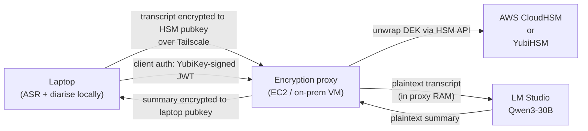
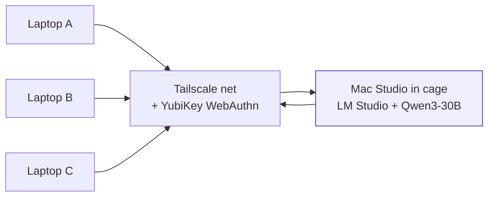
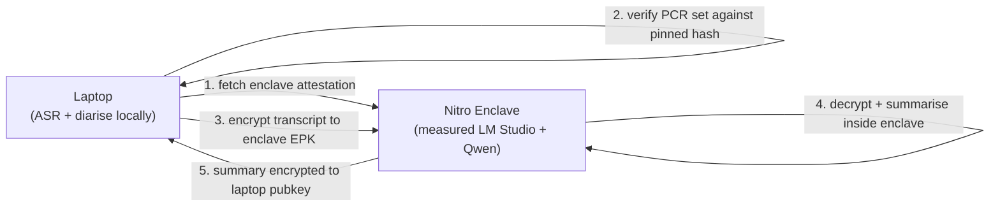
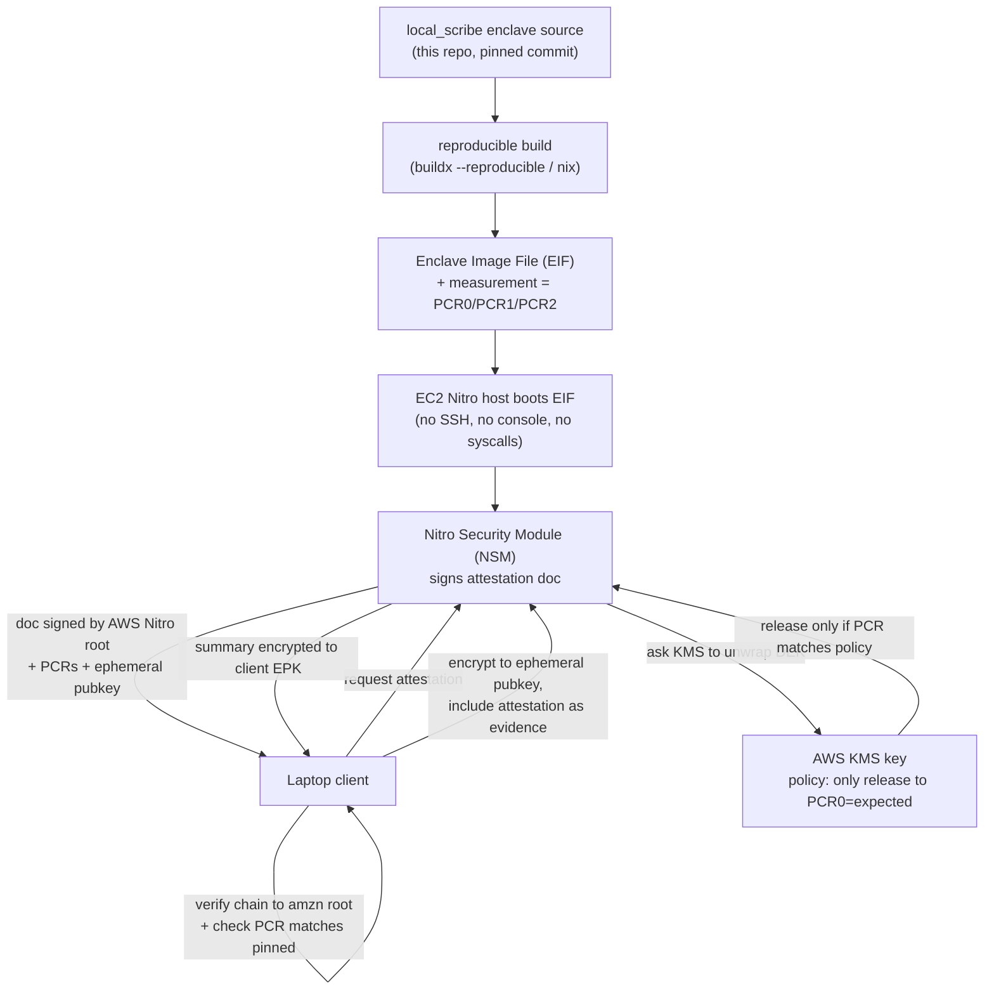

# TODO / Roadmap

Tracking enhancements that aren't in the current commit but are
worth doing. **Privacy items are P0** because the project's whole value
prop is "audio and transcripts never leave your laptop"; the work below
tightens that guarantee further.

Cross-reference: [§ Privacy and data locality](README.md#privacy-and-data-locality)
in the main README explains the current guarantees this list is
extending. The `CHAR_REVIEW.md` companion file enumerates every
network endpoint Char.app uses and how to block the ones we can't
toggle in-app — re-run its [§ Methodology](docs/CHAR_REVIEW.md#methodology)
sweep whenever `CHAR_KNOWN_GOOD_VERSION` is bumped.

## Privacy & security (P0)

- [ ] **Split-host hardware deployment: laptop + dedicated
      compute box with hardware-rooted key custody / attestation.**
      Captured as a full design exploration in
      [`docs/HARDWARE.md`](docs/HARDWARE.md) — the document is the
      deliverable for this round; the code work below is the
      follow-on if we decide to ship it.

      Decision tree, three recommendations, and full trade-off
      walkthrough live in the doc. Headline summary:

      * Mac Studio M4 Max 64–128 GB + YubiHSM 2 — pragmatic best
        for "ships today, MLX-accelerated, real TEE for keys".
        ~$3k.
      * Framework Desktop (Ryzen AI Max+ 395) 128 GB + YubiHSM 2 —
        Linux-native, compact, more memory at the price point.
        ~$2.5k.
      * Bare-metal AMD SEV-SNP or Intel TDX + dedicated GPU +
        YubiHSM 2 — the only configuration with real
        hardware-rooted remote attestation of the LLM-side
        code, at server-class cost and complexity. ~$5–15k.
      * Stand-alone YubiHSM 2 on the existing single-host laptop
        — the cheapest single security upgrade available
        (closes the `mach_vm_read` window without splitting
        hosts). ~$650.

      Code work this enables, sized for follow-up PRs:

      * `local_scribe.security.boot_integrity` — platform-discriminating
        wrapper around `sip_check` (macOS) and TPM 2.0 IMA +
        dm-verity (Linux). Lets the compute box assert "boot
        chain trustworthy" without macOS-specific assumptions.
      * `local_scribe.security.hsm_master` — PKCS#11 wrapper that
        makes the master key + HKDF derivations YubiHSM-2-side.
        Master never appears in Python heap; signed_config HMAC
        runs HSM-side. The single biggest reduction in the
        in-memory key-exposure window we can ship without
        rearchitecting; valuable independently of split-host.
      * `local_scribe.security.attestation` — verifier for
        SEV-SNP / TDX attestation reports. Egress proxy on the
        laptop side refuses to forward audio if the compute box
        doesn't present a fresh report over a pinned launch
        digest. Only useful on SEV-SNP / TDX hardware; gated
        behind a config flag so non-SEV deployments still work.
      * `./run.sh start --remote <host>` and
        `./run.sh start --service-only` flags. The laptop-side
        flag points Char + the egress proxy at a remote ASR /
        LM Studio endpoint; the compute-box-side flag brings up
        ASR + LM Studio + a scoped inspector without trying to
        manage Char.app.
      * A bootstrap UX that handles the two-host pairing ritual
        — `./run.sh bootstrap` on the laptop prints a one-time
        pairing code; `./run.sh bootstrap --pair <code>` on the
        compute box completes the ritual; both sides converge
        on a WireGuard tunnel + pinned mTLS certs.

      Open trade-offs (full list in the doc, condensed here):

      * Does Tailscale belong in the trust chain? (Probably:
        WireGuard for high-assurance, Tailscale for everyday
        convenience, never both at once.)
      * Should the encrypted vault live laptop-side, compute-box
        side, or mirrored? (Lean: laptop-side, with WireGuard
        rsync as a future option.)
      * Offline fallback to local ASR + small LLM on the laptop?
        (Lean: yes.)
      * How do we attest the compute box on
        non-SEV-SNP / non-TDX hardware? (Honest answer: we
        can't, hardware-style; software gates running on the
        compute box itself remain the only signal. SECURITY.md
        should call this out if/when the design lands.)

- [x] **Dev mode — explicit, loud SIP-gate bypass for development.** ✅
      Landed: a single documented operator override of Defense
      layer 0. `LOCAL_SCRIBE_DEV_MODE=1` (or `./run.sh start --dev`)
      lets `sip_check.enforce_or_die()`, `./run.sh sip_gate`, and
      every FastAPI service lifespan pass on a SIP-off / partially-off
      host. The bypass cannot be quiet: a long red banner emits to
      stderr once per process, every gate prints a one-line marker,
      doctor/status surface it at the top of their output, and the
      inspector renders a sticky non-dismissible red banner across
      every page (driven by `GET /api/dev_mode/status`, which is
      itself unauthenticated so the banner shows on the `/auth`
      cold-landing view before any token is typed). The strict
      variant `sip_check.enforce_or_die_strict()` ignores the env
      var — used by `key rotate` so an operator who forgot to
      `unset LOCAL_SCRIBE_DEV_MODE` cannot accidentally expose a
      brand-new master key through the bypass window.

      Sources:
      [`local_scribe/common/dev_mode.py`](local_scribe/common/dev_mode.py),
      [`local_scribe/security/sip_check.py`](local_scribe/security/sip_check.py),
      [`run.sh::sip_gate`](run.sh),
      [`local_scribe/asr/asr_server.py`](local_scribe/asr/asr_server.py),
      [`local_scribe/inspector/inspector_server.py`](local_scribe/inspector/inspector_server.py),
      tests in
      [`tests/common/test_dev_mode.py`](tests/common/test_dev_mode.py)
      and the new `EnforceDevModeBypassTests` class in
      [`tests/security/test_sip_check.py`](tests/security/test_sip_check.py),
      full threat-model walkthrough in
      [SECURITY.md § Dev mode](SECURITY.md#dev-mode--explicit-sip-bypass-for-development).

      Follow-ups (not blocking the shipped feature):

      * **Dev-mode telemetry in the inspector integrity tile.**
        When Phase B of the "Web UI as the full operator control
        surface" item below lands, surface dev-mode state in the
        same SSE-pushed integrity-status panel that shows
        script-integrity, char-integrity, and pinned-config
        verification. Today the banner is rendered from a 15-second
        poll; pushing it through the SSE channel cuts the worst-case
        "operator notices dev mode is on" latency to sub-second.
      * **CI test for the loud-on-every-surface contract.** Add a
        regression test that diff-checks the banner phrasing
        (literal "DEV MODE ACTIVE", "LOCAL_SCRIBE_DEV_MODE", and
        the canonical recovery steps) is intact across CLI, ASR
        logs, inspector logs, and `/api/dev_mode/status` JSON. A
        future refactor that silently breaks the per-surface loudness
        contract would otherwise only be caught by an operator
        reading their logs.
      * **Per-gate scope expansion.** If we ever add a "TEE-mode"
        path (per the TEE deprecation note in Defense layer 5/6),
        the dev-mode parser is the natural place to share the
        truthy/falsy table. Keep the `_OFF_VALUES` set and the
        run.sh shim parser in sync.

- [ ] **Web UI as the full operator control surface.** Today the
      operator drives the pipeline from `run.sh` (23 verbs across
      `start`, `stop`, `doctor`, `bootstrap`, `key`, `vault`,
      `firewall`, `char`, `config`, `yubikey`, `egress-proxy`,
      `logs`, `health`, `transcribe`, `redo-session`, …) and uses
      the inspector at `http://127.0.0.1:8001` for read-only
      session browsing, Char-audit display, and config GET/PUT.
      Goal: promote the inspector to the single user-facing entry
      point — install, configure, operate, and observe the entire
      stack — with the existing CLI kept as the scriptable /
      headless fallback and as the bootstrap path on first run.

      Why this is P0: a privacy-conscious operator cannot
      reliably verify "is my pipeline still untampered?" from a
      terminal scrollback. A live, auth-gated, integrity-aware UI
      surfaces drift in seconds. It also lets us add the
      tamper-alert + screenlock-auto-dismount items below
      (linked) without inventing a separate UI for each.

      **Phased plan** — sized so each phase is independently
      reviewable and shippable; later phases hard-depend on
      earlier ones but the operator gets a working slice after
      every phase:

      1. **Phase A — Inventory + scaffolding.** Enumerate every
         `cmd_*` verb in [`run.sh`](run.sh) into a Pydantic
         `OperatorAction` schema (verb, args, side effects, auth
         class, destructive-y/n, requires-touch-id-y/n,
         requires-yubikey-y/n, requires-sudo-y/n, rollback
         hint). Wire `/api/operator/actions` returning the
         catalog as JSON — FastAPI's auto-generated `/docs` +
         `/redoc` then double as the API reference the user
         asked for. No behaviour change yet; just makes the
         surface area machine-readable.
      2. **Phase B — Read-only telemetry.** Implement
         `/api/status` (current process states, ports,
         fingerprints), `/api/doctor` (the same checks as
         `./run.sh doctor`, JSON-shaped, cached 5 s),
         `/api/integrity/status` (the real-time integrity tile
         the user explicitly asked for — script_integrity_gate,
         char_integrity_gate, pinned_config_gate,
         signed_config gates, secret-scan-hook installed?), and
         `/api/logs/{service}` (tail of ASR / inspector /
         egress-proxy logs). Plus a `/api/events` SSE stream so
         the UI updates without polling.
      3. **Phase C — Service lifecycle.** `POST
         /api/services/start`, `/stop`, `/restart`, gated by
         Touch ID re-confirmation (delegated to the same
         `touchid-keychain` Swift helper that already drives
         `unlock_master_key`). Each call returns a streaming
         response with the same banner output as `./run.sh
         start` so the UI shows real-time progress. The
         inspector itself can't restart itself this way — that
         remains a `launchd`/CLI concern, see "Process model"
         below.
      4. **Phase D — Key + vault lifecycle.** Wraps the existing
         primitives in
         [`local_scribe/security/key_lifecycle.py`](local_scribe/security/key_lifecycle.py)
         and [`local_scribe/security/vault.py`](local_scribe/security/vault.py)
         with auth-gated endpoints: `POST /api/key/init`,
         `/rotate`, `/add-yubikey`, `/dr-backup`, `/dr-restore`,
         `POST /api/vault/init`, `/mount`, `/unmount`,
         `/rotate-password`. Each destructive op requires:
         (a) typed-confirm body (already used for session
         delete — see [`inspector_server.py`](local_scribe/inspector/inspector_server.py)),
         (b) fresh Touch ID, (c) where applicable, YubiKey
         insertion + tap with a clear "insert your YubiKey now"
         modal pinned until the operation completes.
      5. **Phase E — Char + firewall + sandbox controls.**
         `POST /api/char/install`, `/launch`, `/quit`,
         `/baseline-update`, `POST /api/firewall/enable`,
         `/disable`, `/mode`, `POST /api/sandbox/write`,
         `/validate`, `GET /api/sandbox/profile`. Surfaces the
         sandbox profile diff before applying so the operator
         can see exactly what's about to change. The handful of
         ops that need `sudo` (`firewall enable --mode system`
         writes `/etc/hosts`) intentionally surface a
         "this requires `sudo`, paste this into a terminal" hint
         rather than asking for the password — moving privilege
         escalation through a web UI multiplies the threat
         surface and isn't worth the convenience.
      6. **Phase F — Bootstrap wizard.** First-run UX. Two
         options on the table:
            a. *Keep CLI bootstrap, web UI thereafter.*
               `./run.sh bootstrap` remains the one-time CLI
               flow that gets the operator to a working state
               (venv, deps, master key, vault, models, Char
               install). The inspector takes over afterwards.
               **Simpler; probably the right answer.**
            b. *Bootstrap-mode inspector.* A slim inspector
               variant runs without auth/keys and walks the
               operator through the same flow. Has to gate its
               own `sudo` calls (Homebrew installs), juggle a
               pre-key auth model, and host its own dependency
               installer. **More complex; only worth it if user
               testing shows the CLI is a real friction
               point.**
         Default: go with (a). Capture (b) as a follow-up if
         someone files an issue.
      7. **Phase G — Polish.** Dark theme refinement (the
         existing `prefers-color-scheme: light` override stays
         opt-out via a user setting; default = dark, matching
         the project aesthetic). Mobile-responsive layout so
         the operator can see status on a phone. Accessibility
         (keyboard navigation, ARIA labels). Per-page API-doc
         tooltips pointing at the relevant `/docs` operation.
         Confirmation-modal copy review (every destructive op
         spells out exactly what it will and won't touch — same
         tone as `./run.sh key rotate`'s current banner).

      **Design notes** — settled trade-offs that bind future
      phases together:

      * **Auth model.** Existing per-service HKDF bearer cookie
        gates all `/api/*`. Destructive ops layer Touch ID
        re-confirmation on top: the endpoint calls
        `secret_store.unlock_master_key()` even though the
        caller already has the cookie, so a stolen cookie alone
        can't `key rotate` or `vault unmount`. YubiKey re-tap
        is only required where the underlying CLI op already
        requires it (DR backup/restore, add-yubikey, signed
        config sign).
      * **Process model.** The inspector is the always-on
        control plane; ASR + egress-proxy + LM Studio are the
        data plane the inspector starts/stops. The inspector
        itself is launched by `./run.sh start` (Phase C button
        invokes that path) and lives until the operator runs
        `./run.sh stop` from the terminal *or* clicks
        "Shutdown" in the UI (which schedules an
        `asyncio.create_task` that terminates the uvicorn
        worker after the response flushes). Chicken-and-egg
        avoided by keeping CLI start/stop as the always-working
        fallback.
      * **Real-time integrity status.** Reuses the existing
        gates' status APIs:
            - [`script_integrity.verify()`](local_scribe/security/script_integrity.py)
              → tracked-file SHA-256 vs baseline
            - [`char_integrity.collect_fingerprint()`](local_scribe/char/char_integrity.py)
              → Char CDHash / Team ID / Bundle ID / linked-libs
            - [`signed_config.status()`](local_scribe/security/signed_config.py)
              → pinned.json + char_baseline.json HMAC state
            - egress_proxy block log (count of last-N denied
              requests + timestamps)
            - service_auth bypass state
              (`LOCAL_SCRIBE_DISABLE_AUTH` set?)
        Each gate's status is read-only and side-effect-free;
        safe to render on every page load. SSE stream pushes
        deltas so the tile doesn't flicker between green/red on
        a polling boundary.
      * **API documentation.** FastAPI's `/docs` (Swagger UI)
        and `/redoc` (Redoc) come free; we just have to write
        accurate Pydantic models with `description=` fields.
        For each endpoint, the docstring lists: what changes,
        which Keychain items / files / processes it touches,
        whether it's idempotent, expected runtime, and the
        recovery path if it fails halfway.
      * **Confirmation pattern.** Inherits the typed-DELETE
        body convention already used for
        `DELETE /api/sessions/{id}/audio`: the destructive
        endpoint refuses unless the request body contains
        `{"confirm": "<expected-phrase>"}` where the phrase is
        op-specific (`"rotate-master-key"`,
        `"unmount-vault"`, etc.). UI generates and pre-fills
        the phrase, but the operator still has to click
        through the modal — no double-click footgun.
      * **Theme.** The dark default stays. Adds an
        operator-controlled "Light mode" toggle that overrides
        the existing `prefers-color-scheme` media query
        (persisted in `localStorage`; not security-sensitive,
        so no roundtrip).

      **Touch points outside `local_scribe/inspector/`** —
      changes will land in:

      * [`local_scribe/inspector/inspector_server.py`](local_scribe/inspector/inspector_server.py)
        — most new endpoints, the SSE stream, new HTML/CSS/JS.
      * [`local_scribe/cli/__main__.py`](local_scribe/cli/__main__.py)
        — refactor the existing CLI subcommand bodies into
        callable functions so the inspector imports the same
        Python entry points (no shelling out to `run.sh`).
      * [`run.sh`](run.sh) — unchanged for headless use,
        documented as the scriptable fallback. New help text
        points at the inspector for interactive operators.
      * [`README.md`](README.md) + [`docs/ARCHITECTURE.md`](docs/ARCHITECTURE.md)
        + [`SECURITY.md`](SECURITY.md) — operator workflow
        section gets the inspector-first framing, with a
        "headless / scripted use" subsection for the CLI.

      **Acceptance criteria** (definition-of-done for phase G):

      1. A fresh operator can finish `./run.sh bootstrap` once
         and never need to touch a terminal again for normal
         operation.
      2. Every destructive op shows a confirmation modal that
         names exactly what will change.
      3. The integrity-status tile turns red within 5 s of any
         gate going red (SSE push) and stays red until the
         operator re-blesses.
      4. `/docs` lists every endpoint with response schemas and
         the same "Touches:" / "Idempotent:" / "Recovery:"
         metadata blocks as the inline docstrings.
      5. Light/dark toggle works without a page reload.
      6. Existing CLI flows still work — the inspector is a
         second front-end, not a replacement.

      **Related work / dependencies**: this layer plugs into
      "Live signed-config watcher + inspector tile" (above) for
      the real-time integrity push; "Tamper-alert dispatch"
      (below) for cross-device notification; "Auto-dismount
      vault on screen lock" (below) for the lock-time data
      hygiene.

- [ ] **Tamper-alert dispatch (SMS / email / push) when the
      operator is away from the laptop.** Companion to the
      Web-UI layer above. Today an integrity-gate failure or an
      egress-proxy block surfaces in the doctor banner the next
      time the operator opens a terminal — useless if they're
      asleep, in a meeting, or out of the country with the
      laptop still on the kitchen table. Goal: deliver a
      time-stamped, signed alert to a *different* device the
      operator owns whenever any of the following fire:

      * Any integrity gate fails (script_integrity,
        char_integrity, pinned_config, signed_config — the same
        events the integrity-status tile renders red for).
      * The egress proxy logs a blocked request to a host that
        wasn't already on the allow-list (i.e. Char tried to
        reach a new third-party endpoint).
      * An unauthorised Char launch is detected (Dock /
        Spotlight launch outside the wrapper — already a
        watchdog TODO elsewhere in this doc; this layer just
        gets the existing event onto a different device).
      * Failed Touch ID attempts cross a threshold (default 3
        in 5 minutes).

      **Channel options + honest trade-offs** — none of these
      are obviously right; pick during design phase:

      | channel | pros | cons |
      |---|---|---|
      | **Twilio SMS** | universal reach, no app install on the receiving device | requires a Twilio API key on the laptop = a target for the same adversary that's tampering; per-message cost; SMS is unencrypted on the wire |
      | **SMTP email** | also universal, free with a personal mail server | same key-on-laptop concern; spam filters; latency uneven |
      | **macOS Mail.app via `osascript`** | no API key on disk | only fires if the user is at the laptop — defeats the entire purpose |
      | **APNs push** | encrypted, instant, Apple-native | needs an Apple Developer account, a server to relay through APNs, and an iOS app to receive |
      | **Signal-CLI** | end-to-end encrypted out-of-band | stateful (the device pair lives on disk), no upstream service guarantees |
      | **Discord / Slack webhook** | trivial to set up | webhook URL is bearer-style and lives on the laptop |
      | **Operator-hosted "alert sink"** (e.g. a $5/month VPS the operator runs that fans out to anything) | full control, defense-in-depth via geographic isolation, doesn't trust any third party | operator overhead; the VPS becomes part of the threat model |

      **The hard part — credential safety on the laptop.** Any
      provider above wants a credential (API key, webhook URL,
      app password). That credential lives on the same disk the
      attacker is tampering with. Mitigations to evaluate:

      * **HMAC-domain-separated subkey.** Wrap the credential
        with an HKDF-derived subkey of the master key
        (`info=b"alert-dispatch:v1"`), same pattern as
        signed-config. Tamper attacker who can read the
        credential can also zero the master key and revoke
        every key the laptop owns — net result: alert silenced
        but not forgeable.
      * **Pre-signed time-windowed alert tokens.** Instead of
        storing a long-lived API key, ship a sigstore-style
        bundle of single-use, ECDSA-signed alert envelopes
        (signed by an offline operator-controlled root). Local
        daemon picks one, fires it, never has the signing key
        on disk. Receiver validates against the public root.
        **Most-secure default; also most-complex to set up.**
      * **FIDO2 challenge-response per alert.** YubiKey signs
        each alert. Beautiful but the YubiKey isn't always
        present; defeats the "user is away" scenario.
      * **Accept the trade-off.** A tampering attacker can
        suppress alerts but cannot forge them as long as the
        receiver verifies a signature with a key never on the
        laptop. This is the realistic position; document it
        loudly.

      **Implementation sketch** (post-design):

      * New module
        `local_scribe/alerting/tamper_notifier.py` — fan-out
        dispatcher with per-channel adapters
        (`adapters/twilio.py`, `adapters/smtp.py`,
        `adapters/webhook.py`, etc.).
      * Hook the integrity gates: each gate's failure path
        emits a structured event onto an in-memory `asyncio`
        bus that the notifier consumes.
      * Operator config: `~/.config/local_scribe/alerting.yaml`
        — list of channels + credentials. Signed by the same
        HMAC layer as `pinned.json` and `char_baseline.json`
        (extend `_signed_files()` in
        [`local_scribe/cli/__main__.py`](local_scribe/cli/__main__.py)).
      * Rate-limiting: token bucket per channel, default 1
        alert / 5 min, configurable. Avoid SMS-spam on a
        flapping gate.
      * Quiet hours: optional `quiet: { from: "23:00", to:
        "07:00", local_tz: true }` — but a HIGH-severity event
        (signed_config drift, egress block) overrides quiet
        hours.
      * Inspector tile: "Tamper alerts — 2 channels configured
        (SMTP, Signal). Last test delivery: 14 minutes ago.
        Last real alert: never." with a "Send test alert" button
        gated by Touch ID.

      **Open questions** to settle in the design issue:

      1. Hosted relay or roll-your-own? A friction-reducing
         option would be a `local-scribe-cloud.example.com`
         relay that operators can opt into in exchange for
         giving up some metadata privacy (the relay sees
         "something fired"). Roll-your-own is the security
         default; hosted is the convenience default.
      2. Signed receipts? Should the receiver acknowledge each
         alert back to the laptop (over the same channel) so
         the operator knows the alert was delivered? Adds
         round-trip complexity but catches dropped alerts.
      3. Test schedule. Recommend nightly self-test (the
         notifier dispatches a low-severity heartbeat) so a
         broken integration is caught before a real event.

      **Related work**: depends on Phase B (integrity status
      API) of the web-UI item above for its event source.
      Operates orthogonally from the screen-lock auto-dismount
      item below — the two together give "passive defense
      while away from the laptop".

- [ ] **Auto-dismount the encrypted vault on screen lock;
      Touch-ID-gated remount on screen unlock and on Char
      restart.** Companion to the tamper-alert item above.
      Today the vault stays mounted from the time the operator
      runs `./run.sh start` until they run `./run.sh stop` or
      reboot. That's a multi-hour window where a coffee-shop
      shoulder-surf or an unattended-laptop scenario means the
      vault contents are readable by anyone who walks up to the
      keyboard before the screensaver kicks in — and *still*
      readable to any local process for as long as the
      screensaver alone gates physical access. Goal: tie vault
      mount state to screen-unlock state, so the data plane
      cycles down whenever the operator looks away.

      **Trigger surface** (events to react to):

      * `com.apple.screenIsLocked` distributed notification —
        unmount.
      * `com.apple.screenIsUnlocked` distributed notification +
        Touch ID re-prompt — remount.
      * `NSWorkspaceDidWakeNotification` after sleep — same as
        unlock (Touch ID required).
      * Char.app `terminate` / `relaunch` event — opportunity
        to re-prompt for Touch ID before remount.

      **Modes** — configurable in
      `~/.config/local_scribe/lock_policy.yaml` (HMAC-signed,
      same layer as `pinned.json`):

      | mode | behaviour on lock | behaviour on unlock |
      |---|---|---|
      | `soft` (default off) | log only, no actual unmount | n/a |
      | `cooperative` | wait for in-flight recordings to finish + Char to quit, then unmount | Touch ID + auto-remount |
      | `strict` | unmount immediately, recording loses last buffer | Touch ID + auto-remount |
      | `paranoid` | strict + zero the in-memory master key (forget()) so even a remount requires the full Touch-ID-plus-YubiKey unlock | Touch ID + YubiKey tap to remount |

      **Implementation sketch** (post-design):

      * Tiny Swift helper
        `bin/screenlock_watcher.swift` (sibling to
        `bin/touchid_keychain.swift`) observes the distributed
        notifications and `exec`s into the relevant Python
        primitive (`vault.unmount` / `vault.mount`).
      * Python side: extend
        [`local_scribe/security/vault.py`](local_scribe/security/vault.py)
        with `unmount(force: bool=False, drain_first: bool=True)`
        — `drain_first` cooperatively waits for ASR to finish
        any in-flight stream before issuing the `hdiutil
        detach`.
      * Char-quit integration: `cmd_char_launch` already wraps
        Char with sandbox+proxy; extend it to also register a
        `NSWorkspaceDidTerminateApplicationNotification`
        observer that fires `vault.unmount` (cooperative mode)
        when Char exits.
      * Inspector tile: "Vault lock policy: cooperative.
        Mounted since 09:14. Last lock event: 12:03 (remounted
        12:05 via Touch ID)." with mode selector + "test by
        locking screen now" button.

      **UX gotchas** — call out in design + docs:

      * **Active recording loss.** Strict / paranoid mode can
        lose the last few seconds of audio. Document loudly;
        default off; require explicit operator opt-in.
      * **Touch-ID prompt fatigue.** If the operator locks /
        unlocks the screen every 90 seconds (frequent context
        switches), they're going to get sick of Touch-ID
        prompts. Mitigations:
            - Grace period: skip the prompt if the unmount /
              remount cycle happens within N seconds (default
              60 s) — operator opt-in.
            - Combine with Apple-Watch unlock (already supported
              by macOS); Touch ID counts the watch as the
              second factor.
      * **Char crash on data-dir disappearance.** Char doesn't
        expect its data dir to vanish mid-session. Quit Char
        before unmount in cooperative mode; document that
        strict mode may crash Char (and that's intentional).
      * **Sleep vs lock semantics.** Lid-close on most macs
        triggers sleep without a lock event; sleep triggers a
        `NSWorkspaceDidSleepNotification` which we should
        treat as lock-equivalent for the unmount side, but
        gate remount on `WillWake` + Touch ID.

      **Threat model wins** (what this defends against that
      isn't already defended):

      * **Adversary #5 (physical access — unattended laptop,
        screen locked, vault still mounted).** Today an
        attacker who picks the lock with a stolen password
        can read the vault directly. Auto-dismount means the
        vault contents are encrypted-at-rest the moment the
        screensaver fires; the attacker needs the master key
        too, which means Touch ID + the YubiKey if
        `paranoid` mode is on.
      * **Adversary #4 (malware running as the operator's
        UID).** Today the malware has read access to the
        mounted vault for the entire session. Auto-dismount
        cuts that window to "while the screen is unlocked",
        which dramatically shrinks the exfiltration time
        budget.

      **Related work**: complements the tamper-alert item above
      (alerts surface what *was* read while mounted; this item
      shortens the window during which there's anything to
      read). Depends on Phase D of the web-UI item for the mode
      selector and the test-lock button.

- [ ] **Live signed-config watcher + inspector tile.** Follow-up to
      the landed signed-config layer below. Today the HMAC over
      `pinned.json` + `char_baseline.json` is verified at
      `./run.sh start` and re-verified on every doctor / status
      call, which is enough because the values aren't re-read during
      a session (any runtime tamper takes effect at next start and
      is caught by the gate then). The polish wins this would buy:
      1. **fsevents watcher** in `egress_proxy.py` (longest-lived
         daemon) that re-runs `signed_config.verify_file` on every
         write to `pinned.json` or the baseline. On mismatch, fire
         `osascript -e 'display alert "local_scribe pinned config
         changed — re-bless with ./run.sh config sign or restore
         from git" as critical'` so the operator sees it even when
         they're not in the terminal.
      2. **inspector tile** at `/api/config/status` showing the
         signature state (file present, sidecar present, key
         fingerprint match) for both governed files. Reuses the
         `signed_config.status()` API which doesn't unlock the
         master key, so the tile is safe to render on every
         inspector page load.
      3. **doctor row** for "pinned config signed" alongside the
         existing master-key + script-integrity rows.
- [x] **Repo-wide secret-material audit + pre-commit guardrail.** ✅
      Landed: full audit of the working tree, all 42 commits on
      `main`, and the loose object database via trufflehog regex +
      entropy layers AND a bespoke high-signal pattern sweep
      (PEM private-key blocks, age-secret-keys, `sk-…` / `sk-ant-…`
      / `AKIA…` / `ghp_…` / `xox[abprs]-…`, JWTs, generic
      `password=` / `secret=` assignments). Findings:

      * **0 high-signal matches** in current tree or full git
        history. No real API key, PAT, PEM, or age-secret-key
        was ever committed.
      * **12 entropy matches across history, all verified public**:
        2× Char DMG SHA-256s (pinned distribution hashes), Char
        binary CDHash, Sentry public DSN extracted from Char,
        4× `github.com/fastrepl/anarlog` URL fragments, 3× git
        commit SHAs from this project's own log.
      * **1 software smell remediated**: `_cli_rotate` in
        [`local_scribe/security/key_lifecycle.py`](local_scribe/security/key_lifecycle.py)
        emitted `master_key[:4].hex()` as a stdout fingerprint
        — a 32-bit leak of raw key material to shell scrollback.
        Replaced with `signed_config.fingerprint()` (HKDF-derived,
        leak-safe).

      Guardrails installed so this can't regress quietly:

      * Tightened
        [`.gitignore`](.gitignore) to reject `*.age`, `*.pem`,
        `*.key`, `*.p12`, `*.pfx`, `*.jks`, `id_rsa`, `id_ed25519`,
        `*.env`, `.envrc`, `credentials.json`, `.config/`,
        `.cache/`, `secrets/`, `keys/`, and the operator-state
        refactor scratchpad files.
      * [`tools/secret_scan.sh`](tools/secret_scan.sh) — bash
        scanner usable both as a `--staged` pre-commit hook and a
        manual `./tools/secret_scan.sh` full-repo audit. Trufflehog
        is invoked opportunistically if on `$PATH` but not
        required.
      * [`tools/install_git_hooks.sh`](tools/install_git_hooks.sh)
        — idempotent installer for `.git/hooks/pre-commit`. Called
        automatically from `./run.sh bootstrap` whenever a `.git/`
        directory is present, so contributors get the hook on
        every fresh clone.
      * Full threat model + allowlist rationale documented in
        [SECURITY.md § Defense layer 7](SECURITY.md#defense-layer-7--secret-scan-pre-commit-hook).

      What the audit doesn't cover (acknowledged limits):

      * Server-side push protection (GitHub Secret Scanning +
        push protection) is a separate org-level config; if this
        repo is ever pushed to a public remote, enable it there.
      * The hook is client-side and a malicious contributor can
        bypass it. Code review + post-merge audit are the
        organisational defenses.

- [x] **Signed pinned config (operator HMAC over distribution
      constants + Char baseline).** ✅ Landed: distribution-pinned
      constants (Char version, DMG SHA-256s, Team ID, Bundle ID,
      LM Studio version) moved out of `run.sh` + `char_integrity.py`
      into a single source of truth at
      [`local_scribe/common/pinned.json`](local_scribe/common/pinned.json).
      Plus an operator HMAC-SHA256 sidecar over both that file AND
      the operator-set `~/.config/local_scribe/char_baseline.json`,
      keyed by an HKDF-domain-separated subkey of the master key
      (`info=b"config-sign:v1"`). `./run.sh config sign` blesses both
      files with one Touch ID + YubiKey tap; `./run.sh start`
      hard-fails on signature drift via a new `pinned_config_gate`
      between `script_integrity_gate` and `char_integrity_gate`.
      Distinct exit codes (10 missing / 11 mismatch / 12 key fp
      rotated) so the banner can suggest the right recovery. See
      [SECURITY.md § Defense layer 6](SECURITY.md#defense-layer-6--signed-pinned-config),
      [`local_scribe/security/signed_config.py`](local_scribe/security/signed_config.py),
      and tests in
      [`tests/security/test_signed_config.py`](tests/security/test_signed_config.py)
      / [`tests/common/test_pinned.py`](tests/common/test_pinned.py).
- [x] **Two-factor master-key unlock (Option C split-key).** ✅
      Landed: `master_key = kc_half XOR yk_half`. `kc_half` in
      Keychain (Touch ID), `yk_half` in an `age` file encrypted to
      one or more enrolled YubiKeys (touch-policy=always). Either
      factor alone yields uniform random bytes. Optional
      passphrase-encrypted disaster-recovery backup for the
      lose-both-factors case. Operator surface:
      `./run.sh key {init|unlock|rotate|add-yubikey|dr-restore|migrate|destroy}`.
      Tests (in `tests/test_key_lifecycle.py`) assert the master key
      never appears on argv, never as plaintext on disk, and that
      both factors are required to unlock. See
      [SECURITY.md § Defense layer 4](SECURITY.md#defense-layer-4--option-c-split-key-touch-id-and-yubikey)
      and [ARCHITECTURE.md §4](docs/ARCHITECTURE.md#4-at-rest-encryption--option-c-split-key-implemented).
- [x] **Per-service bearer tokens never on argv.** ✅ Landed: the ASR
      token now reaches Char's `settings.json` via stdin to
      `python -m char_settings_writer` (was: argv[3] of an inline
      Python heredoc, which was both a leak AND silently broken). All
      remaining heredoc-with-pipe call sites in `run.sh` audited and
      converted to `python -m <module>` form.
- [x] **Key-mistake safety net.** ✅ Landed: every destructive
      `./run.sh key` operation (rotate, init --force, add-yubikey,
      dr-restore-over-live-v2, migrate, destroy) now requires a
      YubiKey tap on the current key BEFORE state changes, and writes
      a pre-flight snapshot of the about-to-be-replaced material to
      `~/.config/local_scribe/key-backups/<ts>-<op>/` so the op is
      reversible. Snapshots include yk_half.age, the recipients file,
      the DR file, and a copy of kc_half in a versioned Keychain
      backup account; manifest.json records fingerprints + a paste-
      able recovery cookbook. Snapshots NEVER auto-prune — the
      operator runs `./run.sh key backups prune <id>` (typed DELETE
      gate) to dispose of one. The only irreversible operation is
      `./run.sh key destroy --purge-everything`, which requires TWO
      typed confirmations. Also fixed an unrelated safety bug:
      `yubikey_backup.disable()` previously left `yk_half.age` on
      disk after `destroy`, defeating the cleanup. See
      [`KEY_SAFETY.md`](docs/KEY_SAFETY.md) for the full S1–S18
      enumeration.
- [x] **Encrypt audio at rest.** ✅ Landed: `vault.py` (AES-256
      sparse bundle) is wired end-to-end via `vault_unlock.py`,
      which derives the hdiutil passphrase from the Option C master
      key via HKDF-SHA256. Char's data dir is relocated INTO the
      mounted vault and replaced with a symlink so Char follows it
      transparently. Operator surface:
      `./run.sh vault {init,unlock,lock,status}`. The passphrase
      is never written to disk and never shown to the operator.
      **Enforcement (added 2026-05-11)**: `vault_relocation_gate`
      runs from `cmd_start` and refuses to launch the pipeline if
      Char's data dir is still plaintext on disk; bootstrap stage 4
      now does BOTH create-bundle AND mount+relocate so first-time
      operators end up with encrypted-at-rest by default;
      `./run.sh status` surfaces the relocation state under an
      explicit "Encryption at rest" header. Override:
      `LOCAL_SCRIBE_ALLOW_PLAINTEXT_CHAR_DATA=1` (loud-but-explicit).
      Rotating the master via `./run.sh key rotate` will rotate the
      vault envelope (see remaining work below).
- [x] **Encrypt transcripts and summaries at rest.** ✅ Falls out of
      the vault-mount work above: once Char's session dir is symlinked
      into the mounted ciphertext volume, every file Char writes
      (`transcript.json`, `_summary.md`, per-template notes) inherits
      the AES-256 envelope.
- [ ] **Hook `vault_unlock.rotate_vault_passphrase` into `./run.sh
      key rotate`.** Today `key rotate` regenerates the master but
      doesn't re-key the vault, which means the on-disk sparse bundle
      becomes unmountable until the operator manually runs
      `vault.rotate_password(old, new)`. The helper exists; the wiring
      is a five-line glue change in `key_lifecycle.rotate_master_key`
      that unmounts → rotates → leaves the vault locked.
- [ ] **Auto-mount the vault from `./run.sh start`.** Bootstrap
      now mounts the vault as part of stage 4, but `./run.sh start`
      requires the vault to be already mounted (via reboot/relock,
      the symlink dangles). Today the operator runs
      `./run.sh vault unlock` once after reboot;
      `vault_relocation_gate` refuses to start until they do. A
      future enhancement would have `start` lazily call
      `vault.mount` itself — gated on a "this isn't a hostile
      keyboard at the console" check — so the operator doesn't
      need the separate `vault unlock` step post-reboot.
- [ ] **Encrypt the local-scribe transcript cache** at
      `~/.cache/local_scribe/transcripts/`. Currently keyed by audio
      sha256 with the cached output stored as plain JSON. Either
      move it inside the vault mount or AES-GCM each entry with a
      key derived from the master via HKDF (`info=b"transcript_cache"`).
- [ ] **`./run.sh wipe`** — single command that finds and securely
      overwrites everything under Char's session directory + our
      transcript cache + Time Machine local snapshots that include
      them. Confirms with a typed phrase first ("yes, destroy") because
      there's no undo. Optional `--keep-config` flag to preserve
      `settings.json` so you can re-record without re-bootstrapping.
- [ ] **Auto-purge.** Env var `RETENTION_DAYS` (default unset =
      forever). Background task that deletes session directories older
      than the threshold and writes the deletion to a tamper-evident
      audit log.
- [ ] **Tighten `asr_server.py`'s default bind from `0.0.0.0:8000` to
      `127.0.0.1:8000`.** Add a deliberate `BIND_ALL=1` opt-in for the
      "I want my desktop to ASR for my phone over LAN" use case.
      Verify LM Studio is also localhost-only at start (it is by
      default, but `doctor` should confirm).
- [ ] **Disable LM Studio analytics by default at bootstrap.** Write
      whatever the canonical opt-out file is
      (`~/.lmstudio/preferences.json`?) and report which version it was
      set on, so a future LM Studio upgrade that resets it gets caught
      by `doctor`. Best-effort since LM Studio is closed-source.
- [x] **Disable Char PostHog analytics by default.** ✅ Landed:
      `./run.sh configure-char` writes
      `analytics: "{\"Disabled\":true}"` to
      `~/Library/Application Support/hyprnote/store.json`, which
      short-circuits `tauri_plugin_analytics::is_disabled()` before any
      event hits `us.i.posthog.com`. `doctor` now reports the toggle
      state. See [CHAR_REVIEW.md § PostHog deep dive](docs/CHAR_REVIEW.md#posthog-deep-dive).
- [x] **Block Char's auto-update endpoint.** ✅ Landed in two phases:
      (1) `--mode system` rewrites `/etc/hosts` to blackhole
      `desktop2.hyprnote.com` + `gateway.scarf.sh` + Sentry DSN +
      PostHog + every external STT/LLM provider Char ships plugins
      for (machine-wide; affects all apps; needs sudo). (2) `--mode
      process` (DEFAULT) implements per-Char filtering via
      `egress_proxy.py` (asyncio CONNECT proxy on `127.0.0.1:8889`
      consulting `firewall.BLOCK_CATALOG`) + `char_sandbox.py`
      (sandbox-exec profile that allows everything except
      network-outbound to anywhere except loopback). `./run.sh char
      launch` wraps Char in both layers so its only network path is
      our proxy. No sudo. Other apps on the machine are unaffected.
      Bootstrap step 10/10 writes + validates the SBPL profile; the
      proxy auto-starts from `./run.sh start`. Doctor reports both
      layers. Trade-off: Dock / Spotlight launches bypass the
      firewall (see follow-up below). See
      [SECURITY.md § Defense layer 1](SECURITY.md#defense-layer-1--network-egress-firewall)
      and [CHAR_REVIEW.md § Mitigations](docs/CHAR_REVIEW.md#mitigations).
- [x] **Add a runtime kill-switch for Char's Sentry DSN.** ✅ Landed
      via the same `firewall.BLOCK_CATALOG`: the Sentry DSN host
      (`o4506190168522752.ingest.us.sentry.io`) + the browser CDN
      (`browser.sentry-cdn.com`) are in the default telemetry category.
      Sentry SDK silently drops the queue on connect-refused, so the
      desktop binary keeps running normally — no need to fork
      `fastrepl/anarlog`. See [CHAR_REVIEW.md § Sentry deep dive](docs/CHAR_REVIEW.md#sentry-deep-dive).
- [ ] **Network Extension build for the per-Char firewall.** The
      current `--mode process` firewall has one gap: Char launched
      from the Dock / Spotlight inherits neither the sandbox nor
      `HTTPS_PROXY`, so its traffic is unfiltered. The fully-
      native fix is a `NEContentFilterProvider` (or
      `NETransparentProxyProvider`) System Extension that catches
      Char's traffic regardless of how it was launched. This needs:
      (a) an Apple Developer ID we sign with, (b) the gated
      `com.apple.developer.networking.networkextension` entitlement
      (applied for from Apple with justification, free but takes
      ~2 weeks), (c) a small Swift `.systemextension` bundle that
      filters on bundle ID + the same `BLOCK_CATALOG`, (d) user
      approval prompt in System Settings. Shippable from a fork
      with a Developer ID; not shippable from a vanilla
      open-source clone. Until then, document the Dock-launch gap
      prominently and rely on `./run.sh char firewall-status` to
      flag bypassed Char processes.
- [ ] **Spotlight exclusion.** `bootstrap` could optionally run
      `mdutil -i off ~/Library/Application\ Support/hyprnote/` so
      Spotlight doesn't index recordings into a separately-readable
      database (`~/Library/Metadata/CoreSpotlight/...`).
- [ ] **iCloud Drive / Time Machine awareness.** `doctor` could detect
      if `~/Library/Application Support/hyprnote/` is being synced
      anywhere off-device and warn (or refuse to proceed without a
      `--i-know-what-im-doing` flag).
- [ ] **Removable-media mount guard while the vault is unlocked.**
      The vault's "AES-256 at rest" guarantee only holds while the
      sparse bundle is *unmounted*. Once it's mounted, the bands on
      `~/Library/Application Support/local_scribe-vault/` are
      readable plaintext to anything running as the operator —
      including a USB stick that just got plugged in and an attacker
      with 30 seconds of physical access to the desk. Today the
      attack is: walk up to an unattended-but-logged-in Mac with the
      vault unlocked, plug in a thumb drive, drag the session folder
      across, unplug, walk away. None of our existing layers see it
      because the data plane is local and the operator's UID owns
      both ends of the copy. The defense is to refuse to mount *any*
      external mass-storage device while the vault is unlocked,
      surface a clear modal explaining why, and require a fresh
      Touch ID tap to override.

      **Mechanics on macOS.**

  - **The interception point** is the [`DiskArbitration`](https://developer.apple.com/documentation/diskarbitration)
    framework, specifically
    [`DARegisterDiskMountApprovalCallback`](https://developer.apple.com/documentation/diskarbitration/dadiskmountapproval).
    The callback runs *before* the kernel mounts the volume; it
    returns either `NULL` (allow) or a `DADissenterRef` (deny, with
    a localized reason that the Finder surfaces verbatim). This is
    Apple's only supported "block this mount" hook; lower-level
    IOKit notifications fire after the fact.
  - **The discriminator** is
    `kDADiskDescriptionDeviceInternalKey == false`
    AND `kDADiskDescriptionMediaRemovableKey == true` — that filter
    excludes the boot disk, FileVault auto-unlock, and the
    sparse-bundle vault itself (which we want to keep mounting),
    while catching USB sticks, SD cards, external SSDs, Thunderbolt
    drives, iPhones in Files transfer mode, network DMGs being
    auto-opened, and anything else Finder would auto-mount.
  - **The daemon** has to be long-lived because
    `DARegisterDiskMountApprovalCallback` only fires on registered
    sessions. A `LaunchAgent` plist at
    `~/Library/LaunchAgents/local.scribe.mountguard.plist` keeps a
    small Swift binary (`bin/mountguard`, sibling to
    `bin/touchid-keychain`) running for the duration of the user's
    login session.
  - **The Touch ID override** reuses the existing Swift Local
    Authentication helper. When the user clicks "Attach drive
    anyway" in the modal, we prompt
    `LAPolicyDeviceOwnerAuthenticationWithBiometrics` with a
    `localizedReason` of "A storage device is being attached while
    local_scribe transcripts are unlocked. Prove you're you to
    allow the mount." On success we re-call `DADiskMount` on the
    pending disk; on failure we keep the dissent in place.
  - **The "lock first" flow** is the safe default the modal points
    at: "Lock local_scribe before attaching" runs
    `./run.sh vault lock`, which detaches the sparse bundle and
    leaves Char's session folder pointing at an unmounted symlink.
    After the lock completes the modal automatically re-tries the
    mount and the dissent is lifted.

      **Edge cases worth getting right.**

  - **Startup sweep.** The daemon walks the currently-attached
    removable disks at first launch (the user might already have a
    USB stick plugged in from before login). For each one that's
    mounted AND external AND the vault is unlocked, surface the
    same modal, with "Eject" as the safe default.
  - **Pending mount queue.** The approval callback has to return
    quickly. If the user is away from the keyboard, holding the
    mount on a Touch ID prompt that can take minutes would freeze
    Finder's progress indicator. Pattern: deny immediately with
    "vault is unlocked — lock local_scribe first," surface the
    modal as a *separate* foreground prompt, and on the user's
    explicit "yes mount anyway" + successful Touch ID, *then* call
    `DADiskMount` directly on the disk.
  - **Audit trail.** Every block / allow decision lands in the
    tamper-evident audit log (see the "Tamper-evident audit log"
    item below), with the disk's `kDADiskDescriptionMediaUUIDKey`
    so a forensic review can answer "which drives were attached
    while the transcripts were unlocked?"
  - **Vault-locked → no-op.** When `vault.is_mounted()` returns
    False the daemon allows every mount through without prompting.
    The whole gate is conditional on the vault being open; there
    is no reason to inconvenience the user when the data is
    encrypted at rest.

      **Known limitations to call out in the doc.**

  - Doesn't block AirDrop *out*, iMessage attachments, `scp`, or
    any other network-borne exfiltration path. Those want
    [Crypto-4](CRYPTO.md#crypto-4-encrypt-the-local-scribe-transcript-cache)
    plus the Network Extension item below.
  - A SIP-disabled host can unload the LaunchAgent. We already
    refuse to start on such hosts; document the dependency.
  - Apple Configurator, Image Capture, and a couple of legacy
    third-party mount tools bypass DiskArbitration. We can't
    catch those without an Endpoint Security extension (which is
    gated behind an Apple-granted entitlement, same as the
    Network Extension item).
  - This is a *physical-access-while-unlocked* defense. An
    attacker with credential-level access does not need to plug
    in a drive — they `cat session.json` and walk away.

      **Cross-references.**
      [SECURITY.md § Defense layer 3](SECURITY.md#defense-layer-3--at-rest-encryption)
      (which the new control extends) and
      [Crypto-9](CRYPTO.md#crypto-9-ephemeral-x25519--hkdf-handshake-for-the-future-cloud-transport)
      (which addresses the *network* side of the same threat
      class). Track as `mountguard/*` issues; the Swift helper +
      LaunchAgent + Python integration are roughly the same size
      as the existing `bin/touchid_keychain.swift` setup, so
      ~1 week of work.
- [ ] **Per-process file-access notifier for the Char data bundle
      (BlockBlock / OverSight aesthetic).** Companion to the
      removable-media guard above. The threat: while the vault is
      unlocked, *any* user-space process running as the operator
      can `open(2)` a session's `transcript.json`, `audio.mp3`, or
      summary markdown. We have no signal today when that happens,
      and the threat is wider than just "USB drive being inserted":
      a Spotlight indexer plugin, a Stickies-style menu-bar app, a
      cloud-sync agent that just got installed, an OS-update
      post-install script, a Homebrew package's post-install hook,
      a curious `npm install` post-install script — *anything*
      running as the operator's UID can siphon the unlocked
      cleartext, and the existing defenses (Touch ID + YubiKey on
      *unlock*, mountguard on *physical-media attach*) don't see
      it. The goal is a small daemon, modelled on the Objective-See
      "discreet menu-bar agent, clear modal alert" aesthetic
      (BlockBlock for persistence and OverSight for camera/mic are
      the closest functional analogs; KnockKnock is the persistence
      *scanner* sibling) that tells the user **which process is
      trying to read which file**, with allow/deny + remember
      buttons.

      **Mechanics on macOS.**

  - **The correct primitive** is the [`EndpointSecurity`
    framework](https://developer.apple.com/documentation/endpointsecurity)
    (`EndpointSecurity.framework`, macOS 10.15+). The events we
    want are `ES_EVENT_TYPE_AUTH_OPEN` and `ES_EVENT_TYPE_AUTH_READDIR`
    — *authorization* events, where the kernel suspends the
    syscall pending an allow/deny decision from our ES client.
    Decisions are returned via `es_respond_auth_result()`. Every
    event carries a fully-resolved `es_process_t` (signing
    identity, Team ID, audit token, parent process, executable
    path, code-directory hash) which is *exactly* the per-process
    attribution we need — far richer than `lsof` or `fs_usage`
    can offer.
  - **The discriminator.** Build a deny-by-default policy for paths
    under the vault mount (`~/Library/Application
    Support/local_scribe-vault/` and the symlinked
    `hyprnote/sessions/`), with a short, signed allow-list of
    process identities matched on `es_process_t` fields:
    (a) **Char.app** by `cdhash` — the only app that should be
    reading session data routinely;
    (b) **our own Python venv** by `executable->path` plus a
    parent-PID-tree rooted in `run.sh` — ASR / Inspector /
    `transcribe_file.py` reads;
    (c) **the `bin/touchid-keychain` Swift helper** by `team_id`
    (once we have a signing identity) or path-equality — Touch ID
    gating;
    (d) **macOS-internal enumerators** (`mds`, `mdworker_shared`,
    `fseventsd`) when `is_platform_binary == true` AND the
    executable path starts with `/System/Library/` — Spotlight-
    style folder enumeration is allowed but **still logged** so a
    suspicious surge is auditable.
    Everything else hits the modal: "**`<process name>`** (signed
    by `<team_id>`, path `<exe path>`, parent `<parent process>`)
    is trying to read **`<session>/<file>`**. Allow once / Allow
    always / Deny once / Deny always."
  - **The daemon shape.** A signed System Extension
    (`com.apple.system-extension.endpoint-security`) running as a
    `LaunchDaemon` (root), loaded via `systemextensionsctl`.
    Source lives in `bin/charwatch.swift`. The system-extension
    bundle ships next to the Char binary and gets installed at
    `./run.sh bootstrap` time, exactly like the firewall's
    proposed `NEContentFilterProvider`.
  - **User-facing UX.** A small menu-bar agent (a regular
    `LaunchAgent` running as the user, IPC'd to the daemon via
    XPC) renders the modal. Always-on-top, non-dismissable
    without a choice, ⌘-W disabled. The modal shows the
    process's signing chain, Team ID, executable hash, and
    enough context (last-launched-by, parent process tree) for
    the user to make an informed call. Allow/Deny decisions are
    written to
    `~/.config/local_scribe/charwatch-policy.json` (signed +
    versioned so policy tampering is detectable on next start).

      **Why we can't ship this from the open-source repo today
      (same gate as the Network Extension item above).**
      Endpoint Security clients require:

  - the gated entitlement
    `com.apple.developer.endpoint-security.client`, applied for
    from Apple with a "what are you building" justification
    (free but takes ~2 weeks and is occasionally rejected);
  - an Apple Developer ID we sign with;
  - user approval in System Settings → Privacy & Security →
    Full Disk Access *and* a separate approval for the system
    extension itself.

      Shippable from a fork with a Developer ID and the
      entitlement; **not shippable from a vanilla open-source
      clone**. Document the gap prominently and offer the
      best-effort interim below.

      **Interim that does ship from the vanilla repo.** Until we
      have the entitlement we can offer a *detective* (not
      *preventive*) approximation:

  - **FSEvents tail.** Subscribe to `kFSEventStreamEventFlagItemModified`
    / `ItemCreated` events on the vault mount via
    `FSEventStreamCreate`. FSEvents gives us *path + flags* but
    *not* process attribution.
  - **lsof correlation.** When an event fires, immediately
    `lsof -F pfn <file>` and log every PID with the file
    currently open. Race-conditiony for fast `open/read/close`
    cycles (most file reads), but catches *sustained* accesses
    (a sync agent that maps the file, a curl backgrounded to
    upload it).
  - **Process-aware audit subsystem (`auditd` / OpenBSM).**
    macOS still ships `praudit` / `auditreduce`. Configure a
    predicate-filtered audit policy that records file-open
    events for the vault path with process attribution. Tail the
    `/var/audit/current` ring buffer. **Apple is deprecating
    `auditd` in favour of Endpoint Security**, so this is a
    short-lived bridge; documented as such.
  - The interim notifier prints to the inspector's "Recent
    access" tab and the structured log, but **does not block
    the access** — without the ES authorization event we can
    only observe, not intercept. Make this honestly clear in
    the UI: "Detective mode — local_scribe saw this, but could
    not stop it. To enable real-time blocking, fork the
    project, apply for the Endpoint Security entitlement, and
    re-sign."

      **Edge cases worth getting right.**

  - **Char's own session-list refresh** issues hundreds of file
    `open`s on every UI render (it walks `sessions/` to populate
    the grid). The allow-list must let Char through without
    prompting per file; the modal threshold is "non-allow-listed
    process opens a *contents* file inside a session directory."
  - **Time Machine** opens every file in the user's home tree
    for backup. We allow `backupd` and `backupd-helper` from
    `/System/Library/CoreServices/backupd.bundle/` as platform
    binaries by default, but **log the open** so the user can
    confirm Time Machine isn't backing the cleartext mount to
    an off-device target (related: the existing iCloud /
    Time Machine awareness item above).
  - **Spotlight indexers.** Same treatment as Time Machine —
    platform-binary, allow-listed by default, but logged. Pair
    with the existing "Spotlight exclusion" item to suppress
    indexing of the vault contents entirely if the user opts in.
  - **First-launch teaching mode.** The first hour after install
    (or after a major Char upgrade), default every prompt to
    "Allow once + show me what just happened" so the user can
    quickly build a baseline policy without 50 modals.
  - **Allow-list integrity.** The signed policy file is hashed
    into the [`script_integrity`](local_scribe/security/script_integrity.py) baseline
    so an attacker can't quietly add themselves to the
    allow-list. Policy changes require a Touch ID tap. *(This
    piggybacking on `script_integrity` may collapse into a single
    runtime attestation check if Apple Silicon ever exposes a
    userspace TEE — see [SECURITY.md § "Future direction — trusted
    execution environment"](SECURITY.md#future-direction--trusted-execution-environment).)*
  - **Audit trail.** Every prompt (allow / deny / allowed-by-
    allow-list) lands in the tamper-evident audit log with
    `(timestamp, process_path, team_id, cdhash, target_path,
    decision)`. Cross-link from the inspector's session detail
    so a user looking at a transcript can click "who touched
    this since recording?"

      **Known limitations to call out in the doc.**

  - A SIP-disabled host can `kextload` an MITM that bypasses ES.
    Same dependency as everything else; we already refuse to
    start on such hosts.
  - A root-equivalent attacker can `endpointsecurity` themselves
    and pre-empt our client. Mitigated by ES's per-extension
    isolation but not eliminated.
  - The interim FSEvents+lsof mode is *advisory only* — clear
    UX is essential so users don't think they have real-time
    blocking when they don't.
  - The allow-list is necessarily conservative; the *first*
    legitimate access by an OS-shipped utility we hadn't
    anticipated (a future macOS update introducing
    `XprotectRemediatorBlastdoor` reading transcripts to scan
    for malware-like patterns, say) will produce a modal the
    user has to triage.

      **Cross-references.**
      Companion to the
      [removable-media mount guard](#privacy--security-p0)
      immediately above (same threat family: "data sneaking off
      the unlocked vault");
      [SECURITY.md § Defense layer 3](SECURITY.md#defense-layer-3--at-rest-encryption)
      (the layer this control extends);
      shares the Apple-entitlement gate with the
      [Network Extension build item](#privacy--security-p0)
      earlier in this section;
      and [`FORK_CONSIDERATIONS.md`](docs/FORK_CONSIDERATIONS.md)
      enumerates what shipping this from a fork would cost.
      Track as `charwatch/*` issues; ES daemon + Swift menu-bar
      agent + Python integration is roughly the same shape as the
      `egress_proxy` + `char_sandbox` pairing, so ~2-3 weeks of
      work *once the entitlement is granted*; the interim
      FSEvents+lsof tail is ~3-4 days.
- [ ] **Char-launch watchdog — alert on Dock / Spotlight launches
      that bypass the wrapper.** Third in the watchdog family
      (companion to the [removable-media mount guard](#privacy--security-p0)
      and the [per-process file-access notifier](#privacy--security-p0)
      above), and
      the most user-visible because it fires the moment the
      operator forgets to launch through `./run.sh start`. Today
      the documented trade-off ([CHAR_REVIEW.md § Trade-off:
      Dock / Spotlight launches bypass the firewall](docs/CHAR_REVIEW.md)
      and [QUESTIONS.md Q11](docs/QUESTIONS.md)) is that
      a Char launched from the Dock, Spotlight, LaunchPad,
      `open -a Char`, or any AppleScript-driven relaunch path
      inherits neither the `sandbox-exec` containment nor the
      `HTTPS_PROXY` environment variables that route through
      `egress_proxy`. `./run.sh doctor` and `./run.sh char
      firewall-status` will surface the drift on the *next*
      poll, but a user who simply double-clicks Char.app gets a
      silent unwrapped session. The goal is a small,
      always-running, user-scoped daemon that detects unwrapped
      Char launches *the moment they happen* and pops a clear
      modal alert instructing the operator to kill Char and
      relaunch through the secure wrapper.

      **Mechanics on macOS.**

  - **Detection primitive (no special entitlement needed).**
    [`NSWorkspaceDidLaunchApplicationNotification`](https://developer.apple.com/documentation/appkit/nsworkspace/1530940-didlaunchapplicationnotification),
    posted on the shared `NSWorkspace` notification centre
    every time a GUI app launches. The notification's
    `userInfo` carries an `NSRunningApplication` exposing
    `bundleIdentifier`, `processIdentifier`, and
    `executableURL`. We filter for Char's bundle ID
    (`com.fastrepl.hyprnote` per the
    [`char_audit.py`](local_scribe/char/char_audit.py) discovery code) and
    proceed to classify the launch. Unlike Endpoint Security,
    NSWorkspace requires zero entitlement — it ships from a
    vanilla open-source clone today.
  - **Wrapped-vs-unwrapped classification.** For each detected
    Char launch:
    1. Walk `pid → ppid` via `ps -o ppid= -p <pid>` (or
       `sysctl kern.proc.pid.<pid>`) up to PID 1. If any
       ancestor is `/usr/bin/sandbox-exec`, the launch was
       **wrapped** by `./run.sh char launch`.
    2. Defense-in-depth cross-check: `ps eww -p <pid>` on our
       own user's processes exposes the launched environment;
       if `HTTPS_PROXY=http://127.0.0.1:8889` is set, the
       launch is wrapped. (Reading another user's env requires
       being that user; for our threat model — operator's own
       processes — we have the permission we need.)
    3. If neither signal is present after a ~500 ms settle
       (the parent-chain check can briefly miss
       `sandbox-exec` during very fast exec(2) sequences),
       the launch is **unwrapped** and the alert fires.
  - **Daemon shape.** Ship as a launchd-managed
    [LaunchAgent](https://developer.apple.com/library/archive/documentation/MacOSX/Conceptual/BPSystemStartup/Chapters/CreatingLaunchdJobs.html)
    at `~/Library/LaunchAgents/sh.local_scribe.charwatch.plist`
    with `RunAtLoad=true`, `KeepAlive=true`, and
    `LimitLoadToSessionType=Aqua` (user-scoped, restarts on
    crash, only loaded in the GUI session). Recommended
    implementation: a small native Swift binary
    (`bin/charwatch.swift`, peer of
    [`bin/touchid_keychain.swift`](bin/touchid_keychain.swift))
    so we don't add `pyobjc-framework-Cocoa` to the runtime
    baseline — `bootstrap` already compiles Swift helpers via
    the same `swiftc` invocation. Python + PyObjC is the
    backup plan if the Swift route ever hits a wall.
  - **Cold-start scan.** On every charwatch boot, immediately
    enumerate
    `NSRunningApplication.runningApplicationsWithBundleIdentifier_("com.fastrepl.hyprnote")`
    and run the same wrapped-vs-unwrapped classification on
    each, so already-running unwrapped instances at login
    don't escape the gate just because the notification was
    posted before our subscription was live.

      **Allow-list / policy.**

  - **ALLOW** Char as a child of `/usr/bin/sandbox-exec`
    (the `./run.sh char launch` path).
  - **ALLOW** Char with `HTTPS_PROXY=http://127.0.0.1:8889`
    in its environment (belt + suspenders).
  - **ALLOW with a single info-level log line** Char as a
    child of `lldb`, `Xcode.app`, or `Instruments.app` —
    developers debugging Char shouldn't get nagged, but the
    bypass is still recorded to
    `~/.cache/local_scribe/charwatch.log` for audit.
  - **DENY (alert)** anything else — Dock, Spotlight, Alfred,
    Raycast, `open -a Char`, `osascript -e 'tell application
    "Char" to launch'`, `launchctl bsexec`, AppleScript-
    driven relaunches, any unforeseen path.

      **UX.**

  - Modal alert rendered via `osascript -e 'display dialog …'`
    with `with title "local_scribe"`, `with icon caution`, and
    two buttons. Same "every privileged prompt explains
    itself" rule as [SECURITY.md § Privileged-prompt UX](SECURITY.md#privileged-prompt-ux-every-password-request-explains-itself).
    Suggested copy:

    > Char was just launched outside the secure
    > local_scribe workflow (Dock / Spotlight / `open`
    > rather than `./run.sh start`). In this state the
    > network firewall and process sandbox are inactive —
    > Char's outbound traffic is unfiltered and recordings
    > could reach external transcription providers. Kill
    > Char and relaunch it through the secure wrapper?

  - Button 1 (default): **"Kill Char and relaunch securely"** —
    watchdog runs `pkill -x Char`, then hands off to a real
    shell via `osascript -e 'tell application "Terminal" to
    do script "cd <repo> && ./run.sh start"'`. The Terminal
    handoff is deliberate: Touch ID and YubiKey prompts must
    land in a foreground operator context, not a launchd-
    daemon context where they may fail to render or get
    routed away from the user.
  - Button 2: **"Continue anyway (insecure)"** — recorded to
    the audit log with `(timestamp, decision="bypass",
    bundle_id, pid, ppid, ppid_exec_path)`. Don't mark this
    as the default and don't offer a "remember this choice"
    checkbox; every bypass should be a fresh deliberate
    decision the operator owns.
  - Inspector's "Char audit" tab surfaces a count of
    accepted bypasses in the last 7 days so the operator can
    see drift in their own habits.

      **Edge cases worth getting right.**

  - **Debounce the relaunch handoff.** After the operator
    clicks "Kill Char and relaunch", suppress further alerts
    on the same bundle ID for 3 seconds so the relaunch
    sequence doesn't fire a spurious second prompt.
  - **`./run.sh start` already running.** If the wrapper
    process is already alive (PID file present and
    responsive), the "Kill and relaunch" button should only
    `pkill -x Char` and let the existing wrapper supervise
    the relaunch rather than spawning a second
    `./run.sh start`.
  - **Char crash + macOS "reopen windows on launch".** A
    crashed Char that macOS auto-relaunches at next login
    arrives unwrapped — the watchdog catches this naturally
    because every fresh exec posts a fresh launch
    notification. No special case needed.
  - **Watchdog killed by a malicious local process.**
    `pkill -x charwatch` is possible from any user-level
    process. Mitigation: `KeepAlive=true` in the LaunchAgent
    plist respawns within seconds, and
    [`./run.sh doctor`](run.sh) red-flags a missing-or-dead
    watchdog so the gap is bounded. Long-term, plumb the
    daemon's heartbeat into the script-integrity baseline
    ([`script_integrity.py`](local_scribe/security/script_integrity.py)) so a
    watchdog that's been quietly killed shows up as drift.
    *(The script-integrity-baseline half of this plumbing may be
    superseded by hardware attestation if Apple Silicon eventually
    exposes a userspace TEE — see [SECURITY.md § "Future
    direction — trusted execution
    environment"](SECURITY.md#future-direction--trusted-execution-environment).
    The heartbeat-into-doctor half stays useful either way.)*

      **Limitations.**

  - **Detection, not prevention.** An unwrapped Char can fire
    network requests in the 500–1500 ms between launch and
    alert dismissal. The only true *preventive* fix is the
    Network Extension item tracked in
    [`FORK_CONSIDERATIONS.md § 9.3`](docs/FORK_CONSIDERATIONS.md)
    (Apple Developer ID + System Extension entitlement
    required); this watchdog is the *detective* fallback for
    users without that signing setup.
  - **Phishing surface.** A malicious app running as the
    operator could pop its own fake "Char launched insecurely"
    dialog that runs an attacker-controlled command on click.
    Mitigation: pin the real dialog's title to "local_scribe"
    and the icon to `caution`; long-term, ship the watchdog
    signed so the alert can render an OS-trusted "verified by
    …" badge that fake dialogs can't forge. Document the
    residual risk in
    [SECURITY.md § Privileged-prompt UX](SECURITY.md#privileged-prompt-ux-every-password-request-explains-itself).
  - **Bundle-ID hard-coding.** Today the watchdog assumes
    `com.fastrepl.hyprnote`. If we ever swap Char for a
    different recorder (tracked in
    [TODO "why our own ASR pipeline rather than Char's
    Custom STT plugin?"](#documentation)), the allowed bundle
    IDs must move into [`config.py`](local_scribe/common/config.py) as a list,
    not stay hard-coded in the Swift helper.
  - **Won't catch a `mv Char.app` rename.** An attacker who
    renames a malicious binary to `com.fastrepl.hyprnote`'s
    bundle would pass the filter. Mitigation: cross-check
    against [`char_integrity.py`](local_scribe/char/char_integrity.py)'s pinned
    `cdhash` before allowing — refuse to allow-list a binary
    that doesn't match the audited CDHash even if its bundle
    ID looks right.

      **Cross-references.**
  - Lifts the current "Trade-off accepted" UX from passive
    (you have to run `./run.sh doctor`) to active (the
    watchdog tells you, in real time). See
    [CHAR_REVIEW.md § Trade-off: Dock / Spotlight launches
    bypass the firewall](docs/CHAR_REVIEW.md) and
    [QUESTIONS.md Q11](docs/QUESTIONS.md) — both should be edited
    to point at this TODO as the planned active fix.
  - Companion to
    [removable-media mount guard](#privacy--security-p0)
    and
    [per-process file-access notifier](#privacy--security-p0)
    above. All three are macOS-only user-space watchdogs; a
    future unified menu-bar agent could host all three.
  - The eventual *preventive* replacement is the Network
    Extension build tracked in
    [`FORK_CONSIDERATIONS.md § 9.3`](docs/FORK_CONSIDERATIONS.md);
    this watchdog is the right thing to ship from a vanilla
    open-source clone in the meantime.
  - Implementation rough estimate: native Swift agent (~150
    LoC) + LaunchAgent plist + Python integration glue + 2
    `./run.sh` subcommands (`charwatch {install,status}`) +
    docs + tests ≈ 2–3 days of focused work. No external
    deps beyond what `bootstrap` already installs.
- [ ] **Sandbox the ASR server.** A `sandbox-exec` profile that
      restricts `asr_server.py` to its working dirs (no
      `~/Documents`, no `~/Library/Mail`, no Keychain). Cuts the
      blast radius if a model dependency ever gets a remote-code-
      execution vuln through specially-crafted audio.
- [ ] **Tamper-evident audit log.** Every transcription / summary /
      deletion appends a hash-chained line to
      `~/.local_scribe/audit.log` (each line includes a hash of the
      previous line). Lets you verify no entries have been retroactively
      tampered with.
- [ ] **Encrypt or refuse to save the Char OpenAI key backup.** Today
      `configure-char` saves a real OpenAI API key it found to
      plaintext at `~/.config/local_scribe/char-openai-key.<ts>.txt`
      (chmod 600). Better: encrypt it to a Keychain-backed item, or
      just push the user to revoke + rotate at platform.openai.com
      instead of saving a plaintext copy locally.
- [ ] **Refuse to start when screen-sharing / SSH is active.** Detect
      active screen-recording (Apple's TCC database) or SSH sessions
      (`who | grep pts`) and either refuse to launch or warn loudly.
      Nice-to-have, hard to do robustly.
- [ ] **Revoke real OpenAI keys you previously had in Char.** A
      `./run.sh revoke-saved-keys` that walks
      `~/.config/local_scribe/char-openai-key.*.txt`, prints each key
      masked, and offers to open `platform.openai.com/api-keys` so you
      can revoke them — then deletes the local backup.

## Crypto improvements (design tracked in [CRYPTO.md](CRYPTO.md))

The full rationale for every primitive in use today and the trade-off
discussion behind each item below lives in [`CRYPTO.md`](CRYPTO.md).
This list is the engineering tracker — the design doc is the
authoritative source for *why* each item exists.

- [ ] **Crypto-1: Argon2id-wrap the disaster-recovery passphrase.**
      Today `age -p` uses scrypt (RFC 7914, `logN=18`); strong but
      ~10–100× weaker per guess than Argon2id at the same memory
      footprint. Pre-wrap the master with `argon2-cffi` before handing
      it to `age -p`. ~10 LoC in
      [`disaster_recovery.py`](local_scribe/security/disaster_recovery.py); one new
      well-maintained dep. Closes the "stolen DR file + weak
      passphrase" gap. See
      [CRYPTO.md § Crypto-1](CRYPTO.md#crypto-1-argon2id-for-the-disaster-recovery-passphrase).
- [ ] **Crypto-2: BIP-39 wordlist as an alternative DR artefact.**
      24 words = 256 bits of entropy, no passphrase to forget, easy to
      write on paper. Plus a `--bip39` flag on `./run.sh key init` and
      `./run.sh key dr-restore`. ~80 LoC, zero deps (the word list is
      public domain). See
      [CRYPTO.md § Crypto-2](CRYPTO.md#crypto-2-bip-39-wordlist-dr-backup-as-an-alternative-to-passphrase).
- [ ] **Crypto-3: Hybrid post-quantum wrap for `yk_half`.** Today
      `yk_half.age` is X25519-wrapped to a YubiKey PIV slot. A
      Cryptographically Relevant Quantum Computer breaks X25519 in
      polynomial time → "harvest now, decrypt later" risk. Once the
      age ecosystem ships stable hybrid-recipient support (ML-KEM /
      Kyber + X25519 combined via HKDF), add a second recipient line.
      Currently blocked on age plugin maturity — track
      [`age-plugin-pq`](https://github.com/keisentraut/age-plugin-pq)
      and equivalents. See
      [CRYPTO.md § Crypto-3](CRYPTO.md#crypto-3-hybrid-post-quantum-wrapping-for-yk_half).
- [ ] **Crypto-4: AEAD-wrap the transcript cache.** Today
      `~/.cache/local_scribe/transcripts/` is keyed by audio SHA-256
      with cached JSON written in plaintext. If the vault is locked,
      cache entries still leak. ChaCha20-Poly1305 per entry with a
      key derived from the master via HKDF(info=b"transcript_cache.v1").
      Already partly captured under [§ Privacy & security
      (P0)](#privacy--security-p0) as "Encrypt the local-scribe
      transcript cache"; CRYPTO.md gives the construction detail. See
      [CRYPTO.md § Crypto-4](CRYPTO.md#crypto-4-encrypt-the-local-scribe-transcript-cache).
- [ ] **Crypto-5: Sigstore- or GPG-signed git tags for script
      integrity.** Today
      [`script_integrity.py`](local_scribe/security/script_integrity.py) compares working-
      tree blob hashes (SHA-1) against `HEAD`. A maintainer-account
      compromise + a malicious commit slips through silently.
      Maintainer signs release tags with
      [Sigstore](https://www.sigstore.dev) keyless (OIDC-bound, no
      long-lived signing keys) or GPG as a fallback;
      `./run.sh start` runs `cosign verify-blob` / `gpg --verify`
      against the tag-signed manifest of expected blob hashes *before*
      trusting `git hash-object`. ~150 LoC plus a CI workflow that
      signs tags on release. See
      [CRYPTO.md § Crypto-5](CRYPTO.md#crypto-5-sigstore--or-gpg-signed-git-tags-for-script-integrity).

      > **May be deprecated by a trusted execution environment.**
      > Both this enhancement and the underlying script-integrity gate
      > are software-only stand-ins for hardware-rooted remote
      > attestation of the running binary. If Apple Silicon ever
      > exposes a userspace-attestable TEE (today's Secure Enclave
      > covers keys but not general-purpose code; macOS has no
      > equivalent of TPM remote-attestation;
      > [Private Cloud Compute](https://security.apple.com/documentation/private-cloud-compute/)
      > proves Apple *can* build attestable enclaves), file-hash
      > baselines + tag signatures become redundant — the runtime
      > itself attests to what it is. Until then, this Crypto-5 work
      > remains the right next step on the userspace path. See
      > [SECURITY.md § "Future direction — trusted execution
      > environment"](SECURITY.md#future-direction--trusted-execution-environment)
      > for the full framing.
- [ ] **Crypto-6: Memory-lock the master key bytes.** macOS doesn't
      page on M-series by default (memory compression), but a
      hibernate-on-low-battery + cold-boot scenario could in
      principle land bytes on disk swap. `mlock(2)`-backed
      `bytearray` for the master via `ctypes` (or a tiny C
      extension), `RLIMIT_MEMLOCK` is 64 KB by default which is
      ample for 32 bytes. Marginal real-world win on Apple Silicon,
      cheap defense-in-depth. See
      [CRYPTO.md § Crypto-6](CRYPTO.md#crypto-6-memory-lock-the-master-key-bytes).
- [ ] **Crypto-7: Subprocess-isolated key operations.** Long-lived
      Python processes (ASR :8000, Inspector :8001) keep the master
      reconstituted in their address space for many minutes. A
      `task_for_pid()` attack against either process during that
      window dumps the master. Move every key op to a short-lived
      `python -m key_lifecycle hold-and-yield` subprocess that
      unlocks, performs the op, exits. Address-space reclamation on
      `exit(2)` is a strictly stronger guarantee than any Python
      `zero_bytes()` we can do in-process. ~500 LoC + careful IPC
      tests. See
      [CRYPTO.md § Crypto-7](CRYPTO.md#crypto-7-subprocess-isolated-key-operations).
- [ ] **Crypto-8: m-of-n threshold via Shamir Secret Sharing.**
      Today the split-key is strict 2-of-2 (Touch ID AND YubiKey).
      Generalise to m-of-n across (Touch ID, YubiKey #1, YubiKey #2,
      printed BIP-39 card, …) so the operator can survive losing any
      single factor without falling back to the DR passphrase.
      Shamir over GF(256) is well-vetted ~50 LoC of crypto; the real
      cost is UX (operator picks threshold + remembers it; each
      share backed up separately). See
      [CRYPTO.md § Crypto-8](CRYPTO.md#crypto-8-m-of-n-threshold-via-shamir-secret-sharing).
- [ ] **Crypto-9: Ephemeral X25519 + HKDF handshake for the future
      cloud transport.** When the multi-tenant cloud path ships (see
      [§ Multi-tenant](#multi-tenant--org-deployments-future-exploratory)),
      Tailscale already gives per-tunnel forward secrecy via the
      WireGuard Noise handshake. Layer on a per-*request* ephemeral
      X25519 keypair with HKDF-derived ChaCha20-Poly1305 keys so a
      compromised tunnel key six months from now does not
      retroactively decrypt today's recorded traffic. Pattern is
      conceptually X3DH-from-Signal without ratcheting (we have no
      long-lived session). Requires `libsodium` via `pynacl`. See
      [CRYPTO.md § Crypto-9](CRYPTO.md#crypto-9-ephemeral-x25519--hkdf-handshake-for-the-future-cloud-transport).
- [ ] **Crypto-10: Move HKDF behind
      `cryptography.hazmat.primitives.kdf.hkdf.HKDF`.** Today we
      hand-roll HKDF in ~15 LoC of [`service_auth.py`](local_scribe/security/service_auth.py)
      against `hmac.new(_, _, hashlib.sha256).digest()`; tests cover
      the RFC 5869 vectors. Replacing with `pyca/cryptography` would
      shrink our cryptographic surface area at the cost of one large
      dep (~14 MB wheels, Rust toolchain at build time, OpenSSL ABI).
      Status: deliberately *not* done today; revisit when we adopt
      `cryptography` for any other primitive (e.g. the AEAD work in
      [Crypto-4](CRYPTO.md#crypto-4-encrypt-the-local-scribe-transcript-cache)).
      The doc captures both sides of the argument. See
      [CRYPTO.md § Crypto-10](CRYPTO.md#crypto-10-move-hkdf-behind-cryptographyhazmatprimitiveskdfhkdfhkdf).
- [ ] **Crypto-11: AEAD-wrap the Char OpenAI key backup.** Today
      `./run.sh configure-char` writes any real OpenAI API key it
      finds to
      `~/.config/local_scribe/char-openai-key.<ts>.txt` (`chmod 600`,
      plaintext). Wrap with `age -r <master-derived-recipient>` so
      the backup is bound to the master like every other secret. Or
      better: refuse to write the backup at all and surface a
      "please revoke this key at platform.openai.com" workflow.
      Overlaps with the existing "Encrypt or refuse to save the
      Char OpenAI key backup" item above; CRYPTO.md gives the
      construction. See
      [CRYPTO.md § Crypto-11](CRYPTO.md#crypto-11-aead-wrap-the-char-openai-key-backup).

## UX / features

- [x] **Web inspector at `:8001`** — ✅ Landed: `inspector_server.py`
      (FastAPI + single-page vanilla JS, no build step), wired into
      `./run.sh inspector {start|stop|status|open|logs}` and auto-started
      by `./run.sh start`. Sessions tab lists every Char session with
      audio playback, diarised transcript, and per-template notes;
      Config tab edits `~/.config/local_scribe/config.json`; Char audit
      tab runs `char_audit.audit()` with one-click `configure-char` fix.
      Loopback only by default; the validator refuses non-loopback bind
      without an `inspector.auth_token` set.
- [x] **`config.json` as the source of truth.** ✅ Landed: `config.py`
      layers defaults <- `~/.config/local_scribe/config.json` <- env vars,
      so `LM Studio on another Mac` is now `llm.host = "..."` in the
      inspector UI (no env-var dance). Existing scripts that set
      `ASR_PORT=...` etc. keep working unchanged.
- [x] **Char audit module** that flags drift toward non-local providers.
      ✅ Landed: `char_audit.py` reads `settings.json` + `store.json`,
      surfaces `ok` / `warn` / `info` / `miss` per check, masks any real
      OpenAI key it finds, lists `settings.json.bak.*` + saved-key
      backups so a restore is a `cp` away. Surfaced in both
      `./run.sh doctor` and the inspector's Char Audit tab.
- [ ] **`./run.sh retranscribe SESSION_ID`** that re-runs ASR on an
      existing recording and overwrites `transcript.json`. Useful when
      you switch ASR backend, fix a diarization bug, or pull a better
      model. Inspector page would expose this as a button.
- [ ] **Per-session delete from the inspector.** Currently read-only;
      adding `DELETE /api/sessions/{id}` (with a typed-confirmation
      modal in the UI) would round out the "what Char has" tab.
- [ ] **Restore an OpenAI key backup from the inspector UI.** Surface
      the `~/.config/local_scribe/char-openai-key.*.txt` list (already
      shown in the Char audit tab) with a "restore this key into Char"
      button that re-writes `settings.json` and prompts for a Char
      relaunch. Useful for the rollback story when someone wants to go
      back to real OpenAI temporarily.
- [ ] **Calendar-aware participant prefill.** When a session has a
      linked calendar event, prefill `transcript.speaker_hints` with
      the attendees so the LLM speaker-naming pass starts from real
      names instead of `Speaker N`.
- [ ] **`transcribe_file.py --watch DIR`** — daemon mode that watches a
      folder and auto-transcribes any new audio dropped in.
- [ ] **Faster-whisper as a tested non-English path.** Currently
      second-class. Smoke-test on Mandarin / Japanese / German
      recordings and document accuracy/speed trade-offs.
- [ ] **Smaller LLM presets** (Qwen3-1.7B for 8 GB Macs?) so the
      "Minimum" hardware tier isn't ASR-only.

## Observability / dev

- [ ] **Structured JSON logs** from `asr_server.py` behind a
      `LOG_FORMAT=json` env var. Easier to grep, easier to ship to
      local-only observability.
- [ ] **Per-step latency in the streaming response.** Already logged
      server-side; expose in the SSE `transcript.text.done` payload so
      Char's UI could surface "ASR 86s, diar skipped, total 87s" as a
      subtitle on the transcript.
- [ ] **CI smoke test on `macos-latest`** (GitHub Actions): `./run.sh
      doctor`, run unit tests, exercise `transcribe_file.py` against a
      tiny bundled audio fixture. Won't cover Parakeet / Qwen / Char
      end-to-end, but covers FastAPI plumbing + import correctness.
- [ ] **Pin Python wheels with hashes** in `requirements.txt`.
      Currently uses unpinned versions which are reproducible-ish but
      not byte-reproducible.
- [ ] **`./run.sh logs --json`** — when the structured logging lands,
      add a tail flag that reformats existing JSON lines as a pretty
      colourised table.

## Documentation

- [ ] Mermaid sequence diagram of the data flow when Char calls our
      streaming endpoint (Char → POST `/v1/audio/transcriptions` →
      Parakeet → SSE heartbeats → `transcript.text.done` → Char
      writes `transcript.json` → LM Studio → note).
- [ ] "Why not Granola?" comparison table for prospective users.
- [ ] **Document "why our own ASR pipeline rather than Char's Custom
      STT plugin?" as a new question in
      [`QUESTIONS.md`](docs/QUESTIONS.md) (next free slot, probably
      Q5.5 / between current Q5 and Q6).** The full reasoning to
      capture, paste-ready when the doc is written:

      *We're aware Char has a "Custom" STT provider and ships with
      `whisper.cpp` via its `owhisper-client` crate; the obvious
      design would have been to expose our backend through that
      plugin contract. We deliberately route through the OpenAI
      `/v1/audio/transcriptions` and Deepgram `/v1/listen` API
      shapes instead, on `127.0.0.1`. Eight reasons, ordered by
      load-bearing:*

  - **Model swap-ability.** We want to run Parakeet-TDT 0.6B v3
    via MLX (Apple-Silicon-native, materially faster + lower
    WER on English than `whisper.cpp` of comparable size),
    fall back to `faster-whisper` for multilingual, and
    upgrade to whatever beats them next without renegotiating
    a plugin contract. The OpenAI/Deepgram shapes are stable;
    Char's internal plugin shape is not.
  - **Apple Silicon native.** MLX is Apple's own ML framework
    with unified-memory zero-copy access to the GPU.
    Parakeet-MLX on an M3 Max transcribes ~3× faster than
    `whisper.cpp` at the same accuracy band, with materially
    lower peak memory. We can't get that perf out of Char's
    bundled stack.
  - **Diarization splice.** Our pipeline inlines
    `sherpa-onnx` speaker diarization plus an LLM speaker-
    naming pass on top of raw ASR output. Char's STT plugin
    contract is "audio in, text out" — there's no clean place
    to splice in diarization between ASR and the saved
    `transcript.json`. By owning the whole pipeline behind a
    shim that quacks like OpenAI, we get to do this work
    without Char knowing.
  - **Stable wire contract = no fork fragility.** OpenAI's
    `/v1/audio/transcriptions` and Deepgram's `/v1/listen`
    are *external public APIs* Char already speaks fluently
    (because it ships with the real cloud providers as
    options). Char's *internal* Custom-STT plugin contract
    can change between Char releases; binding to it would
    re-introduce the upgrade fragility we explicitly avoided
    by not forking — see [`FORK_CONSIDERATIONS.md`](docs/FORK_CONSIDERATIONS.md)
    on the upstream-contract-stability trade-off.
  - **Recorder independence.** We may want to swap Char for a
    different recorder later — a hypothetical Char fork we
    don't control, [Wispr Flow](https://wisprflow.ai), a
    future open-source Granola alternative, a recorder the
    user writes themselves, anything that can be configured
    to POST to a custom STT URL. Because our ASR endpoint
    speaks *the literal external OpenAI/Deepgram contract*,
    *any* such recorder talks to us with zero glue — point
    its provider URL at `127.0.0.1:8000`, done. A Char-plugin
    binding would have forced us to re-implement against the
    new recorder's plugin contract every time.
  - **Test surface.** We can `curl` our endpoints, run the
    `pytest` suite without Char being installed, test against
    the official OpenAI Python SDK as a real client, and
    write fixtures against well-known third-party API shapes.
    Char-plugin tests would require running Char (which
    isn't even open about its plugin loader's
    test-harness story).
  - **Observability.** `asr_server.py` is ~2000 LoC of
    Python *we wrote and can step through*. Char's
    `whisper.cpp` plugin runs in Char's address space — when
    something goes wrong (a model OOMs, diarization mis-aligns,
    a timestamp drifts) we have no debugger access. Owning the
    process means owning the logs.
  - **It's the same trade-off as everything else in this
    project: don't fork Char.** We made the explicit "don't
    fork" decision documented in
    [`README.md` § Status — proof of concept](README.md#status--proof-of-concept)
    and [`FORK_CONSIDERATIONS.md`](docs/FORK_CONSIDERATIONS.md).
    Using Char's plugin would be a half-fork: we'd inherit
    Char's plugin-API stability constraints without
    inheriting any of the upside of full-fork control. The
    OpenAI-connector hijack avoids that whole class of
    coupling.

      *Cost of the design: Char doesn't always pick the
      OpenAI batch endpoint optimally — we work around the
      model-name routing wart documented in [README.md §
      "The model-name shadow"](README.md#the-model-name-shadow).
      Net positive but document the wart so future engineers
      know it exists.*

      **Slot.** Probably new Q5.5 in the "Architectural choices"
      section of `QUESTIONS.md`, between the existing Q5 (Why
      Parakeet TDT 0.6B by default?) and Q6 (Why is everything
      in one repo?). Update the section index at the top of
      `QUESTIONS.md` to match. Cross-link from
      [`README.md` § "How the STT contracts plug together"](README.md)
      (or wherever the OpenAI-connector hijack is currently
      explained inline — that paragraph should point at the
      new Q&A for the rationale).
- [ ] Short screencast of the bootstrap → first-recording loop.
- [ ] Document the actual disk layout under
      `~/Library/Application Support/hyprnote/` (sessions, app.db,
      humans, chats, search_index) so users know what to back up vs.
      what they can safely delete.

## Multi-tenant / org deployments (future, exploratory)

### Problem statement

The current architecture assumes one laptop = one full pipeline:
ASR + diarisation + Qwen3-30B summarisation all running locally.
That works for an individual but **does not scale to an
organisation**. A 200-person company that wants every laptop to
hold its own copy of a 17 GB MLX-quantised Qwen3-30B (plus the
working set the LLM needs during inference, plus Parakeet, plus
the sherpa-onnx diarisation models) is committing to ~25 GB of
disk + 20+ GB of resident RAM during inference on every machine.
On a fleet of mid-tier MacBook Airs this is not feasible. Even on
M-series Pros it's an absurd amount of wasted GPU sitting idle
between meetings.

What we want for org deployments: **users keep audio recording +
ASR + diarisation on their own laptop** (small models, every byte
of the recording stays on the device that captured it), but the
**summarisation LLM lives in one or a few central places** that
the fleet can reach over the network. The architectural challenge
is to preserve the "audio and transcripts never leave the trusted
boundary" guarantee when "trusted boundary" stops being a single
laptop.

### The user's proposed architecture

> *"Tailscale tunnel from laptop → encryption proxy → submit
> encrypted transcripts for summarisation to a service that uses
> keys stored in AWS CloudHSM (cloud) or YubiHSM (on-prem) before
> decrypting and sending to the LM Studio instance, returning the
> summary over Tailscale in encrypted format where it is decrypted
> on the end user's machine."*

This has the right *shape* for the problem and the **transit
story is solid**: WireGuard via Tailscale gives mutual auth +
confidentiality on the wire, YubiKey-signed JWTs (with WebAuthn
or `ssh-agent`-style challenge-response) prove the device's
identity to the proxy. ACLs in Tailscale stop one user's laptop
from talking to another user's laptop.

The **part that needs more thought is what the HSM actually
buys**, because there's a common misconception worth surfacing
explicitly here.

### What HSMs do and don't do

> **HSMs protect *keys*. They do not protect *data in use*.**

CloudHSM and YubiHSM both expose APIs like "wrap this DEK with
the master key I'm holding", "sign this challenge", "decrypt this
small payload". You cannot run an LLM **inside** an HSM. The
biggest YubiHSM 2 has 128 KB of total non-volatile storage and
the AWS CloudHSM cluster's PKCS#11 surface gives you key
operations, not arbitrary compute.

So the flow in the diagram above necessarily has a step where:

1. The proxy asks the HSM to unwrap the per-message DEK.
2. The proxy decrypts the transcript payload using the unwrapped
   DEK *in the proxy's RAM*.
3. The plaintext transcript flows through the proxy's TCP
   socket to LM Studio (also in plaintext over loopback,
   or whatever pipe you wire up).
4. LM Studio's process memory holds the plaintext during
   inference.

**Anyone who lands code-execution on that proxy, or on the
LM Studio host, or who can read either process's memory, has the
transcript.** The HSM is irrelevant to that attack: the key it's
protecting was already used to decrypt the payload before the
attacker landed. The HSM stops *key theft*, not *plaintext theft
during processing*. This is the same lesson as
[Defense layer 0](SECURITY.md#defense-layer-0--system-integrity-protection-mandatory)
just one stack-frame up: the LLM still needs cleartext to read,
so wherever inference happens is the trust boundary, and the
encryption you stack in front of it doesn't change that.

This is fine **if you trust the proxy + LLM host**. The pattern
becomes "single-tenant org datacentre, hardened, audited, no
shell access for ops" — basically the same threat model as the
single-laptop case scaled up to one machine in a cage. But it's
*not* equivalent to "the cloud operator can't read your
transcripts." That requires a stronger primitive.

### Better-or-equal alternatives that actually meet the stated guarantee

Listed cheapest-to-most-secure, with the trade-offs called out.

#### Option A — Self-hosted Mac Studio appliance (the boring + correct answer for most orgs)

One M3 Ultra Mac Studio (96 GB unified memory, ~$5k) in the
office serves the whole org's summarisation. Single-tenant —
same trust boundary as one laptop, just shared. Tailscale subnet
router for transit, YubiKey WebAuthn for client auth.

- **Pros**: same hardware story you already trust on the laptop;
  no cross-tenant risk; one-time capex; no recurring cloud bill;
  the whole pipeline is auditable Apple Silicon you can put
  hands on.
- **Cons**: capacity planning is on you; if it's down the org's
  summarisation is down; ops cost (electricity, network,
  someone replacing a failed SSD).
- **What HSM/YubiHSM adds**: stores the org-wide auth signing
  key + maybe per-tenant audit-log signing keys. Doesn't touch
  transcript payloads.
- **Closes the gap?**: For ~95% of orgs whose threat model is
  "we don't want this in a SaaS database somewhere" — **yes,
  completely**.

#### Option B — Confidential compute (the right answer if you can't self-host)

Run the summarisation LLM inside **AWS Nitro Enclaves** (or
Azure Confidential VMs / GCP Confidential Space / Apple Private
Cloud Compute, if Apple ever opens that surface). The enclave:

- has no SSH, no debugger, no persistent storage,
- attests to its measured runtime via a signed PCR set the
  client verifies *before* sending plaintext,
- receives requests encrypted to the enclave's ephemeral public
  key (which is bound to that attestation),
- runs inference in EPC / hardware-isolated memory the host
  kernel cannot read,
- destroys all state on shutdown.

This is materially stronger than the HSM-based design because
the data itself never appears in cleartext outside the enclave
boundary. Cloud operator compromise → enclave attestation fails
→ client refuses to send.

- **Pros**: real "cloud operator can't see the transcript"
  property; pay-per-use; no capex; scales horizontally.
- **Cons**: Nitro Enclaves don't have GPU passthrough — you'd be
  running Qwen3 on CPU, which is too slow for 30B. AWS
  announced *Nitro Enclaves with GPUs* in late 2024 (H100
  partitioned via NVIDIA Confidential Compute); availability +
  pricing still moving. NVIDIA H100 Confidential Compute mode is
  ~30% perf overhead. So this is the right pattern but the
  hardware is only just becoming production-ready for LLM
  workloads.
- **What HSM/YubiHSM adds**: optional, for attestation root-of-
  trust signing keys. Not on the data path.
- **Closes the gap?**: **Yes, properly.** This is what Apple is
  doing with [Private Cloud Compute](https://security.apple.com/documentation/private-cloud-compute).

#### Option C — Hybrid: small local LLM for first-pass, central for polish

Keep a 4B-class model on the laptop (Qwen3-4B fits in 4 GB
quantised; runs fine on every M-series Mac). It does a first
pass: bullet-point summary, participant extraction, draft. Only
that already-summarised, much smaller payload goes to the
central instance for a polish step ("rewrite the bullets in our
house style", "extract action items in JSON shape X"). The raw
transcript never leaves the laptop.

- **Pros**: best of both worlds — most of the privacy benefit of
  fully-local, ~10x less data leaves the device than the
  send-full-transcript approach, and the central instance can be
  *much* smaller (an 8B polishing model on a Mac mini is plenty)
  because it doesn't have to comprehend a 90-minute meeting from
  scratch.
- **Cons**: two LLM passes = slightly worse end-to-end quality
  than one shot through the 30B model. Probably acceptable in
  practice; needs measurement.
- **What HSM/YubiHSM adds**: same as Option A.
- **Closes the gap?**: **Yes** — and reduces the blast radius
  even on the central side because the central instance never
  sees raw audio-derived text.

#### Option D — The user's proposal as drafted (HSM-mediated, plaintext in proxy RAM)

Documented here as a starting point. Workable for orgs whose
threat model is "we trust our own ops team to run a Linux box,
we want a clean key story for compliance auditors." Adds value
over plain TLS because the wrapping-key lifecycle is
independently auditable + recoverable, and key rotation is a
PKCS#11 call rather than a service restart.

- **What HSM/YubiHSM adds**: real, but bounded — protects
  against backup-image theft, accidental key checkin to git,
  insider misuse of a long-lived signing key.
- **What HSM/YubiHSM does *not* add**: protection against
  proxy/LLM-host RCE during a live request. **The
  guarantee in this design is "ops at the same level of trust
  as a self-hosted box," not "even the cloud operator
  can't read your data."** Document that explicitly so users
  don't read the HSM brochure and assume more than it gives.

### Other invariants to preserve regardless of which option

These hold across all four designs and need to be in the
implementation when we get there:

1. **Forward secrecy on the wire.** Each transcript submission
   uses an ephemeral client-side keypair (X25519 + HKDF). A
   compromise of the long-lived org key six months from now
   does not decrypt transcripts captured today.
2. **Client-side attestation pinning.** For Option B, the client
   verifies a *pinned* enclave measurement (PCR hash) — not just
   "any attestation signed by AWS." The pin is updated through a
   signed manifest the org distributes.
3. **YubiKey-bound device identity.** WebAuthn or
   `age-plugin-yubikey`-style challenge-response. The proxy
   refuses requests whose JWT isn't signed by an enrolled
   YubiKey. Enrolment is mediated by the same `./run.sh key`
   flow the laptop already uses today.
4. **No persistent state on the central side.** Summaries are
   returned and not stored. If audit logging is needed, it
   captures *only* `{request_id, client_id, byte_count, latency,
   model_version}` — never any payload bytes. Hash-chained,
   appendable, no edit surface.
5. **Per-tenant network isolation.** Each org gets its own
   Tailscale tailnet (in cloud-managed) or its own VLAN (on-
   prem). Cross-tenant requests are dropped at L3, not just at
   the app layer.
6. **Plain Tailscale is transit, not a trust boundary.**
   Document this prominently. Tailscale ACLs stop laptops from
   `curl`-ing each other, but the *server's* compromise is
   exactly as bad with Tailscale as without it.
7. **Refuse to start on SIP-disabled clients.** Same gate as
   today's
   [Defense layer 0](SECURITY.md#defense-layer-0--system-integrity-protection-mandatory).
   A SIP-off laptop is a hostile client; the proxy can verify
   client SIP state during attestation and refuse to issue a
   per-session key.

### Recommended phased path

If we actually build this:

1. **Phase 1 (cheapest, biggest win):** Option A — document the
   single-Mac-Studio org appliance pattern. Ship a `./run.sh
   serve` mode that runs only the LM Studio frontend (no Char,
   no ASR) and a `./run.sh client --upstream tailscale-host`
   mode on laptops. Add per-request encryption + YubiKey-signed
   JWTs. ~3-4 weeks of work. Solves the resource problem for
   95% of teams.
2. **Phase 2 (if needed for compliance):** Add a hardware-backed
   key story on top of Phase 1. The org's signing key lives in
   a YubiHSM 2 (~$650) plugged into the appliance. Same flow,
   just with auditable key custody.
3. **Phase 3 (if confidential compute matures):** Migrate the
   central tier into Nitro Enclaves with confidential GPUs once
   pricing is reasonable. This is the only design that gives a
   real "cloud operator can't read your transcripts" guarantee
   — Phases 1 and 2 give you "your own ops team can't snoop
   without leaving fingerprints," which is the right answer for
   most threat models but not all.
4. **Phase 4 (orthogonal):** Option C hybrid on the client side.
   First-pass summary stays on the laptop using a small Qwen.
   Polish step goes to whichever central tier (Phase 1/2/3) is
   deployed.

Tracking issues / decisions get filed under a `multi-tenant`
label as the design firms up.

### Phase 3 deep-dive: how TEE attestation actually enforces "no code has changed"

The reason confidential compute is the *only* design that gives
a real "you don't have to trust the cloud operator" guarantee is
that **the trust anchor moves from policy to cryptography**. With
a normal VM you trust the cloud operator's promise that they
haven't logged into your instance. With a TEE you cryptographically
verify the running code's identity before sending it any plaintext.

Concretely, the chain we want for AWS Nitro Enclaves:

The four properties this stack gives you, none of which the
HSM-only design gives:

1. **The running code is cryptographically identified.** PCR0
   measures the EIF (kernel + initramfs + application);
   PCR1 measures the application boot; PCR2 measures the
   image hash. The Nitro Security Module signs an attestation
   document containing those PCRs *plus* an ephemeral public
   key the enclave just generated. The signature chains to
   AWS's published Nitro root CA. There is no other way to
   produce a valid attestation than to actually be running
   that code on a real Nitro host.
2. **The client verifies *before* sending plaintext.** Our
   client library ships a pinned PCR set (e.g.
   `~/.config/local_scribe/enclave_pin.json` with the SHA-384
   of the EIF we audited). Mismatch → connection refused.
   This is the same pattern as cert pinning, applied to code.
3. **KMS policy can be attestation-bound.** AWS KMS supports
   `kms:RecipientAttestation:ImageSha384` and
   `kms:RecipientAttestation:PCR0` condition keys. We write
   the org's data-encryption key policy so KMS *will not
   release* the key unless the request comes from an enclave
   matching the pinned measurement. The cloud operator
   physically cannot extract that key because they would have
   to forge an attestation, which requires the Nitro root
   private key, which Amazon doesn't have access to either.
4. **CloudHSM still buys you key custody.** It's not on the
   data path (the actual transcript decrypt still happens
   inside the enclave's memory), but it's where the long-lived
   *signing* keys live: the org's CA that signs the pinned PCR
   manifest distributed to laptops, the audit-log signing key,
   and the WebAuthn relying-party verification key.

### TODO: ship a Terraform manifest that stands this whole thing up

- [ ] **`local_scribe-aws/` Terraform module.** A pinned-version,
      tested, single-`terraform apply` deployment that an org can
      fork to get a working confidential-compute pipeline on AWS.
      Composed of these sub-modules with their boundaries called
      out so it's obvious what's load-bearing:

  - `network/` — VPC with private + public subnets, NAT gateway
    only on egress for AWS API calls. Security groups for the
    Nitro host that **only** allow inbound from the Tailscale
    subnet router; no IGW-facing surface. VPC flow logs to S3
    with object-lock retention.
  - `tailscale/` — Tailscale subnet router on a tiny t4g instance
    in the public subnet. ACLs scoped so per-laptop tags can only
    reach the enclave-host's RPC port; cross-laptop traffic
    denied at L3. Auth keys provisioned via Tailscale's
    Terraform provider, rotated by a Lambda on schedule.
  - `cloudhsm/` — CloudHSM cluster (2 HSMs across AZs for HA),
    cluster CA bootstrap automated, HSM users + roles created
    via the `aws_cloudhsm_v2_*` resources. Costs called out in
    the README: ~$1.45/hr/HSM = ~$2k/mo minimum. Optional
    `single_hsm = true` variable for dev/staging at half the
    cost (no HA).
  - `kms/` — Customer-managed KMS key with key policy bound to
    the enclave's expected `ImageSha384`. Key rotation enabled.
    Aliases per environment (`prod`, `staging`, `dev`) so the
    same Terraform plan can run against multiple stacks.
  - `enclave_build/` — CodeBuild project that builds the EIF
    reproducibly: `docker buildx build --provenance=mode=max
    --sbom=true`, then `nitro-cli build-enclave`, then publishes
    `(eif_blob, pcr0, pcr1, pcr2, source_commit)` to a versioned
    S3 bucket with object lock. Output is **the SBOM + the PCR
    triple + the signed manifest** the laptops will pin against.
  - `enclave_host/` — EC2 launch template for an enclave-capable
    instance type (`m6i.16xlarge` / `r6i.24xlarge`; GPU variants
    pending wider H100-CC availability). User data installs only
    `nitro-cli`, `tailscaled`, and our `enclave_runner` sidecar.
    No SSH key, no Systems Manager agent in interactive mode.
    Cloud-init refuses to proceed if SSH is enabled (defense in
    depth — Nitro itself prevents host → enclave access, but
    we also want to be loud about the host's posture).
  - `webauthn_enrollment/` — Lambda-backed enrollment endpoint
    behind API Gateway. The first time a laptop connects, it
    posts a WebAuthn registration; the resulting attestation
    and public key are stored in a DynamoDB table whose KMS CMK is
    *also* enclave-attestation-bound. Subsequent requests sign
    a per-session challenge with the registered YubiKey; the
    enclave verifies the signature *and* the WebAuthn
    authenticator AAGUID against an allowlist (so a YubiKey 5
    is accepted but a software authenticator is not).
  - `audit_log/` — S3 bucket with Object Lock in compliance
    mode, KMS-encrypted, lifecycle policy that NEVER expires.
    Lambda subscribes to enclave stdout and writes
    `{request_id, client_id, pcr_set, byte_count, latency}` —
    never payload bytes. Each line is hash-chained to the
    previous; the chain root is anchored daily into the
    AWS Certificate Manager Private CA's audit log.

- [ ] **`local_scribe-aws-onprem/`** companion module for the
      "we want the same architecture but on-prem" use case.
      Same shape but: CloudHSM → YubiHSM 2 plugged into the
      appliance host; KMS → on-host attestation verifier using
      AMD SEV-SNP or Intel TDX measurements (production-ready
      today, GPU passthrough story improving); Tailscale →
      either Tailscale tailnet or self-hosted Headscale.

- [ ] **Reproducible build verification harness.** A CLI
      command (`./run.sh enclave verify-pin`) that takes the
      laptop's pinned manifest and re-builds the EIF from the
      same source commit, asserting the PCR triple matches. Lets
      a paranoid org's security team audit the deployment end-
      to-end. Builds run in a clean Docker-in-Docker without
      network so the build environment can't influence the
      output.

- [ ] **Client-side attestation library.** New module
      `enclave_client.py` that handles: fetching the attestation
      document over the Tailscale RPC, verifying the chain to
      the AWS Nitro root CA, comparing PCRs against the laptop's
      pinned manifest, deriving the per-request shared secret
      with the enclave's ephemeral public key via X25519+HKDF,
      and refusing the session if any step fails. Tests use a
      bundled test-vector attestation document (AWS publishes
      these) so CI never has to actually stand up Nitro.

- [ ] **Pin-rotation flow.** When the org rebuilds the enclave
      (security update, model upgrade), the new PCR triple needs
      to land on every laptop *before* the deployment cuts over.
      Distribute via the YubiKey-signed manifest: org admin
      signs `(new_pcr_triple, valid_after_timestamp)` with the
      CloudHSM-stored org signing key; laptops accept the new
      pin once their wall clock passes the timestamp AND they've
      verified the signature against the public key they pinned
      at enrollment. Avoids the "atomically update 200 laptops"
      problem.

- [ ] **Honest cost + capability disclosure.** The Terraform's
      README must lead with: (a) baseline cost (~$2k/mo for
      CloudHSM HA + ~$0.50-3/hr for the enclave host depending
      on size); (b) the *current* GPU-in-enclave story — CPU
      Nitro is GA, GPU Nitro (H100 Confidential Compute) is in
      narrow preview as of late 2025 with materially higher
      pricing. Until then, the deployable target is a smaller
      LLM (8B–14B class) running on CPU, or
      [Option C](#option-c--hybrid-small-local-llm-for-first-pass-central-for-polish)
      hybrid where the central instance only does polish.

- [ ] **Threat-model deltas for AWS deployment.** Companion
      `SECURITY-aws.md` document distilling what's different
      from the laptop-only model: the attestation chain becomes
      the new defense layer 0; AWS root key compromise (or
      coercion via a court order targeting AWS) is the new
      "out of scope"; subpoena resistance is a *real* property
      of the design because AWS literally cannot decrypt the
      payloads — they can be subpoenaed for the encrypted
      bytes but not for keys that can decrypt them.

The end state: an org clones this repo, edits
`terraform.tfvars` with their account ID + Tailscale auth key,
runs `terraform apply`, gets a working pipeline back, and has
*cryptographic* evidence — not just policy promises — that the
running code matches what they audited. That's the only path
that scales to "I want my own private LLM summarisation pipeline
in the cloud, and I don't have to trust AWS to keep its
operators out of my data."
