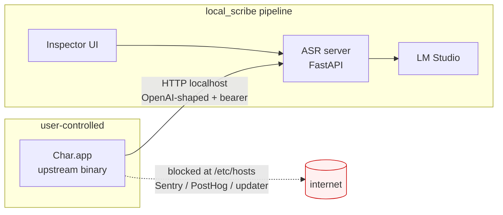
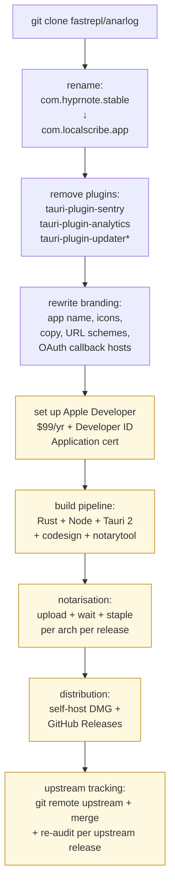
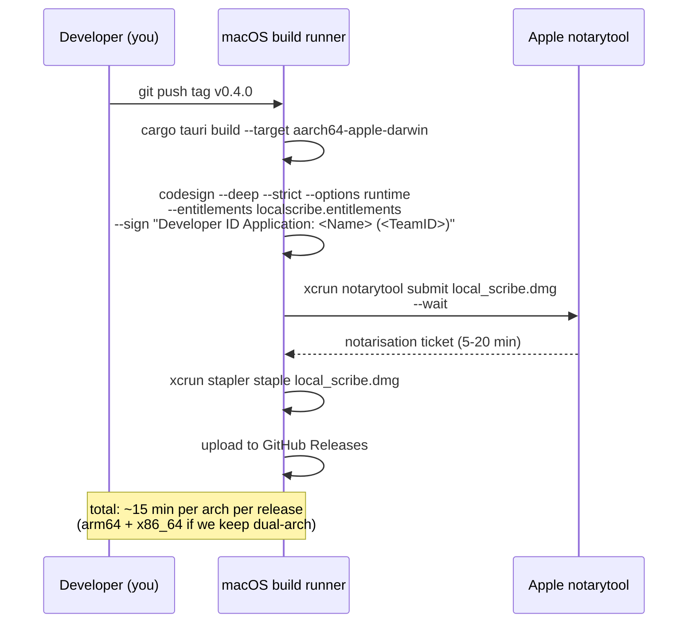
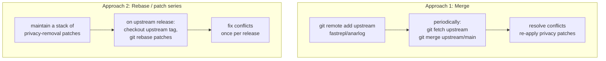

# Fork considerations — `local_scribe` vs. forking anarlog/Char

> **Status:** analysis only. No fork exists. This document captures
> the trade-off so future-us doesn't relitigate it from cold every
> 6 months.
>
> **TL;DR:** forking gets us compile-time removal of every privacy
> concern enumerated in [`CHAR_REVIEW.md`](CHAR_REVIEW.md), at the
> cost of an Apple Developer account ($99/yr), notarization
> tooling, our own auto-updater (or none), a Rust + Tauri 2
> + Svelte build pipeline, rename / rebrand work (we can't ship
> something called "Char" — the name + logo are Fastrepl's, only
> the MIT-licensed *code* is reusable), and an indefinite
> upstream-tracking job. Whether that's worth doing is mostly
> about how much we trust the firewall + bearer-gate + binary-
> integrity *audit* stack we've already built. Today the
> sidecar gives us **belt-and-braces parity** with a fork on
> data exfiltration (no plaintext touches the wire, no telemetry
> reaches Sentry / PostHog / the updater while the firewall is
> on, no bearer token without a live `./run.sh start`) at a
> fraction of the maintenance cost — but the fork is the only
> way to **remove** these capabilities rather than block them.
> Recommendation at the end.

Companion docs:

- [`CHAR_REVIEW.md`](CHAR_REVIEW.md) — what Char actually does and
  the network-egress + on-disk catalog this analysis is grounded
  in.
- [`SECURITY.md`](../SECURITY.md) — current defense-in-depth posture
  the sidecar gives us, defense-layer by defense-layer.
- [`ARCHITECTURE.md`](ARCHITECTURE.md) — the diagrammed system
  architecture; relevant deep-dives in this fork analysis hang
  off those.

---

## 1. Current architecture (sidecar) — the baseline



**What we control today:**

| Lever | Mechanism | Limit |
|---|---|---|
| Inbound to ASR | Per-service HKDF bearer + Layer C launch-session gate | Char must speak HTTP first; we can't intercept its outbound directly |
| Outbound from Char | `/etc/hosts` block list (firewall.py) | Char keeps the *code* to phone home; we just blackhole the destinations |
| Char's settings | `char_settings_writer.py` patches `settings.json` | Anything Char re-syncs at runtime overrides us |
| Char's binary | `char_integrity.py` (codesign + spctl + linked-Mach-O hashes + DYLD\_\* injection refusal) | Audit-only — we refuse to *issue tokens* if Char is tampered, but we can't refuse to launch Char itself |
| Char's data on disk | `vault.py` (encrypted sparse bundle, Option C key) | Mount lives only while `./run.sh start` is alive |

**What we still trust upstream Char to honour:**

1. The `base_url` we wrote into `settings.json` actually routes
   audio there (vs. an undocumented hardcoded fallback).
2. The `analytics.Disabled` toggle we set in `store.json` is
   actually honoured by `tauri-plugin-analytics`.
3. The auto-updater doesn't silently re-enable Sentry / PostHog
   after a quiet upgrade.
4. Char doesn't ship a *new* egress vector in the next release
   that we haven't audited yet.

Each of those is a **policy** Fastrepl makes per release; if they
flip, our firewall + bearer-gate stops the data but not the *intent*.

---

## 2. What "fork" means concretely

Forking is not a button-click. Even with an MIT-licensed
upstream, shipping a notarised, hardened-runtime macOS app under
a *different bundle id* requires:



Boxes in yellow are the *recurring* costs; the rest is one-time.

---

## 3. What the fork actually buys

This is where it gets interesting. The reason to fork is the
*delta* between "audit + block" and "remove + replace":

| Concern (from CHAR_REVIEW.md) | Sidecar today | Fork would let us |
|---|---|---|
| Sentry DSN baked at compile time via `option_env!("SENTRY_DSN")` | **Firewall block** of `sentry.io` (and ingress mirrors) | Remove `tauri-plugin-sentry` entirely; the binary literally has no `libsentry` symbols. No firewall dependency. |
| PostHog DSN baked at compile time | **Write `analytics.Disabled=true`** in store.json + **firewall block** of `app.posthog.com` | Remove `tauri-plugin-analytics`. The hashed `IOPlatformUUID` is never computed in the first place. |
| Auto-updater polls `desktop2.hyprnote.com` periodically | **Firewall block** | Remove `tauri-plugin-updater` + `tauri-plugin-updater2`. App version + arch never leaves the device. |
| OAuth flows for calendar / Linear via `api.char.com` | We don't use them; firewall blocks the host | Remove `tauri-plugin-auth` and the calendar / todo plugins entirely. No `api.char.com` reference anywhere in the binary. |
| AWS Bedrock plugin | We don't use it; can't be invoked unless configured | Remove `tauri-plugin-bedrock`. |
| Cactus VLM (541 MB of bundled model weights) | Sit on disk unused | Either keep (if we want local vision) or delete — 540 MB smaller DMG. |
| Settings UI surfaces "OpenAI provider, base_url, api_key" — confusing for our use case | We hide the confusion in `configure-char` | Settings UI shows "Local Scribe pipeline" with no provider dropdown. |
| Binary integrity baseline drifts on every upstream release | We chase it via `./run.sh char baseline-update` | We **are** the upstream; baseline drift only happens when we ship a release ourselves. |
| Char-launch gating relies on **token suffix** (Layer C) — Char can still *start*, just can't use the API | The pipeline refuses tokens, but Char's process runs and shows an error dialog | We could refuse to launch the GUI at all when `launch.lock` is absent — implemented in Rust before the WebView spawns. |
| Char's `tauri-plugin-store2` writes `analytics.Disabled` as a JSON-string — has bitten us before when Char changes the format | We pattern-match it best-effort | Settings format is whatever we make it; we own the schema. |

**Less-obvious wins:**

- **Native Touch ID / YubiKey integration in Rust** — we could
  call `LAContext` and `age-plugin-yubikey` directly from a Tauri
  plugin instead of shelling out to `bin/touchid-keychain` and
  `python -m key_lifecycle`. ~1 fewer subprocess-spawn per unlock,
  no per-spawn SIP-prompt amplification.
- **No `DYLD_*` defense-in-depth needed** — we can refuse to load
  the Rust + WebView host with our own integrity checks before
  the main binary's `_main` returns, so injection has to defeat
  a *signed* binary's own check rather than `char_integrity.py`'s
  post-hoc audit.
- **Custom URL scheme** — `localscribe://session/<uuid>` for
  copy-pasteable deep links into the inspector UI.
- **No "Char might phone home" footnote in SECURITY.md** — entire
  section disappears.

---

## 4. The Apple Developer reality check

This is the bit the user instinctively flinched at, and rightly.
The complete reality:

### 4.1 Account + cost

- **Apple Developer Program membership** — $99/yr, paid by an
  individual or organisation. Organisation requires a D-U-N-S
  number and a legal entity (LLC, ltd, etc.) — the personal
  account is easier but ties the cert to one human.
- **Developer ID Application certificate** — generated via
  Xcode or the developer portal. Valid 5 years. Different
  certificate from a Mac App Store cert (which we don't need
  for direct distribution).
- **Developer ID Installer certificate** — only needed if we
  ship `.pkg` installers; for a `.dmg` we don't.
- **Apple ID + app-specific password** — for `notarytool`
  submissions. Trivial to generate.

If we accidentally let the cert expire, **every previously-
shipped build keeps working** (notarisation tickets are stapled
and stable), but we can't sign new ones. Renewal is a $99
charge.

### 4.2 Entitlements we'd inherit + ones we might trim

Char's current entitlements (from CHAR_REVIEW.md):

```xml
com.apple.security.cs.allow-jit                        = true   <!-- V8/WKWebView -->
com.apple.security.cs.allow-unsigned-executable-memory = true   <!-- V8/WKWebView -->
com.apple.security.device.audio-input                  = true   <!-- microphone -->
com.apple.security.personal-information.addressbook    = true   <!-- contacts -->
com.apple.security.personal-information.calendars      = true   <!-- calendar -->
```

A `local_scribe`-branded fork could:

- **Keep** `allow-jit`, `allow-unsigned-executable-memory`,
  `device.audio-input` — non-negotiable for a Tauri/WebView app
  that records audio.
- **Drop** `personal-information.addressbook` if we cut
  contacts integration.
- **Drop** `personal-information.calendars` if we cut calendar
  sync. Most users of `local_scribe`-style flows don't need it.
- **Add** `com.apple.security.cs.disable-library-validation =
  false` (i.e. enforce library validation strictly). Char ships
  with the default (which means non-strict). Strict mode means
  any unsigned `.dylib` loaded into our process aborts launch
  — extra protection over our Layer B / DYLD\_\* defense.
- **Add** `com.apple.security.app-sandbox = true` would be
  ideal — but Tauri's `tauri-plugin-fs` arbitrary-path access
  isn't compatible with sandboxing without `com.apple.security.
  files.user-selected.read-write` and a redesign of how Char
  stores audio. We'd inherit the *unsandboxed* default. (We
  could partially sandbox by writing all audio under
  `~/Library/Containers/com.localscribe.app/Data/` — Tauri
  supports this, but the rest of the codebase assumes
  `~/Library/Application Support/hyprnote/` paths. Non-trivial
  refactor.)
- **Set** `LSUIElement = false`, keep the dock icon. (No
  change from Char.)
- **Drop** `NSLocalNetworkUsageDescription` if we don't do
  LAN discovery of remote ASR servers (current `local_scribe`
  is loopback-only).

### 4.3 Notarisation workflow



Per-release reality:

- **Apple ID + app-specific password + Team ID** sit in a
  GitHub Actions secret.
- **Notarisation can fail** for non-obvious reasons (an embedded
  `.dylib` is missing `--options runtime`, an entitlement is
  rejected, the JSON-RPC service Apple uses for notarisation has
  an outage). Build pipeline needs to retry + alert.
- **Stapling makes the DMG portable** — once stapled the user's
  Mac doesn't need internet to validate Gatekeeper.

### 4.4 Distribution

The two viable models:

| Model | Cost | UX |
|---|---|---|
| GitHub Releases (current Char model) | $0 | User downloads a DMG, drags to Applications, sees Gatekeeper prompt once, accepts. |
| Sparkle auto-updater | small dev time | Users get in-app update prompts. Sparkle expects an XML feed signed with an Ed25519 key we host. |

Char today uses Tauri's built-in `tauri-plugin-updater` which
talks to `desktop2.hyprnote.com`. If we keep auto-updates we'd
either:

- **Bundle Sparkle** + serve the appcast from GitHub Pages /
  S3 / wherever, signed with our own key.
- **Bundle `tauri-plugin-updater` pointed at our own host**.
  Same shape as upstream, just our endpoint. Means we operate
  an "updates" host the firewall would have to allow.
- **No auto-updater**. The user runs `./run.sh update` which
  checks GitHub Releases via curl and downloads the next DMG
  manually. Zero network footprint outside our `./run.sh`
  command, no signing key for the appcast, no separate
  infrastructure — but users get stale builds.

For a privacy-first product, **option 3 + a "new version
available" banner in the inspector UI** is probably the right
trade-off. It mirrors what `./run.sh` already does today.

---

## 5. Engineering burden inventory

What we'd take on, in rough hours-per-month for a single
maintainer:

| Activity | Effort | Notes |
|---|---|---|
| Upstream merge (`git fetch upstream && git merge`) | **4-12 h / month** | Anarlog moves fast. Tauri config changes, Rust plugin interface drift, new strings/types. Most merges are mechanical; ~1-in-4 has a real conflict. |
| Re-audit on every upstream release | **2-4 h per release** | We need to keep CHAR_REVIEW.md honest — diff the new strings table, hash any new bundled binaries, check for new `tauri::Builder` entries. |
| Tauri + Rust ecosystem churn | **1-3 h / month** | `tauri-cli` bumps, `wry`/`tao` semver breaks, Cargo lockfile churn. |
| macOS toolchain churn | **1-2 h / month** | New Xcode breaks signing, new notarytool flags, Big-Sur-era certificates expiring, etc. |
| Build pipeline maintenance | **0.5-2 h / month** | GitHub Actions macOS runners get slow, secrets rotate, notarisation outage handling. |
| User support for "why doesn't Char-the-original work after I installed local_scribe?" | **variable** | If we rebrand cleanly this is small; if we share install paths it's big. |
| **Total** | **~8-20 h / month** | Single maintainer; doubles if we do dual-arch builds. |

Compare to current sidecar maintenance:

- **Upstream tracking:** ~30 min per upstream Char release to
  update `CHAR_KNOWN_GOOD_VERSION`, re-audit any new
  `tauri::Builder` plugins (we already do this), and run
  `./run.sh char baseline-update`.
- **Firewall catalog upkeep:** ~30 min per Char release if a
  new endpoint appears.
- **Total:** ~1-2 h per upstream Char release, i.e. ~1-2 h / month.

**Rough multiplier: fork is 5-10× the maintenance cost of the
sidecar.**

---

## 6. Brand + UX considerations

The MIT license lets us reuse the *code*. It does **not** let us:

- Call the app "Char" (Fastrepl trademark; their docs explicitly
  ask people not to). New name: `local_scribe` is the natural
  choice for parity with the pipeline name, but it might be too
  unix-y for a desktop app. `Scribe`, `LocalScribe`, `Loquor`,
  `Verba`, etc.
- Use the Char logo. Fastrepl owns the trademark + design files.
  We'd commission or sketch a new one.
- Use `com.hyprnote.stable` as our bundle id. New bundle id
  needed (e.g. `com.localscribe.app`). This means our app
  installs alongside the upstream Char rather than replacing it
  — users could have *both*.
- Use `char://` URL scheme. We'd take e.g. `localscribe://`.

**Co-existence story:** if a user already has Char installed and
configured (the normal flow today), installing the fork doesn't
replace it. We'd need an installer step that:

1. Detects an existing Char.app.
2. Asks "migrate Char's settings + recordings to local_scribe?".
3. If yes: copies `~/Library/Application Support/hyprnote/` to
   `~/Library/Application Support/local_scribe/`, rewrites
   bundle-id references in store.json, mounts the vault.
4. Leaves Char.app untouched — user can uninstall it themselves.

That migration script is its own ~200-line project.

---

## 7. License + trademark

| Asset | License | Forkable as-is? |
|---|---|---|
| Rust source under `apps/desktop/src-tauri/` | MIT | Yes |
| Svelte / TypeScript source under `apps/desktop/src/` | MIT | Yes |
| Char logo + icon | Trademark Fastrepl | **No** — must replace |
| App name "Char" | Trademark Fastrepl | **No** — must rename |
| Bundle id `com.hyprnote.stable` | Apple namespace tied to Fastrepl's Team ID | **No** — must reissue |
| Cactus VLM model weights (`Resources/models/cactus/`) | unclear (Cactus is Apache-2.0 but the weights aren't always) | **Maybe** — check |
| Sounds / animations | bundled assets, license per asset | **Audit needed** |
| Char.com API stubs (in `tauri-plugin-auth`) | server-side, not in the source | irrelevant — we'd cut the plugin |

License compliance is **easy** (MIT + attribution in `NOTICE`).
Trademark + rebranding is **moderate** (rename + redesign +
asset audit).

---

## 8. Upstream-tracking strategy if we do fork

Two viable approaches:



**Approach 1 (merge)** keeps history readable for tooling but
each merge creates a merge commit; the privacy-removal lives
inline with upstream changes.

**Approach 2 (rebase / patch series)** is cleaner — privacy
removal is a discrete patch stack, easy to audit ("here are the
14 commits we apply to a stock upstream release"). Cost is
rebase pain on big upstream restructures.

For a privacy-focused fork, **Approach 2 is significantly
better for auditability**: a reviewer can read 14 numbered
commits and say "yes, this fork removes Sentry, PostHog, the
updater, the auth plugin, and pins to local-only ASR; no
other behavioural changes." That's a much stronger statement
than the current "this 130-page CHAR_REVIEW.md surveys the
binary".

---

## 9. Hybrid alternatives (worth considering before forking)

### 9.1 Upstream PRs to Fastrepl

Anarlog is on GitHub. We could submit:

1. **`tauri.conf` toggle for telemetry plugins** — gate
   `tauri-plugin-sentry` + `tauri-plugin-analytics` behind a
   Cargo feature flag so a build with `--no-default-features`
   strips them at compile time. Build-time pure.
2. **`HYPRNOTE_DISABLE_UPDATER=1` env var** — short-circuit
   `tauri-plugin-updater` if set. Doesn't remove the code, but
   removes the network call.
3. **Document the `analytics.Disabled` write-after-launch
   contract** — make it explicit that overriding the store
   value at process start is supported and won't be silently
   overwritten by the next signed-in sync.
4. **Add a `--local-only` flag to `char-cli`** — skips
   PostHog `cli_command_invoked`.

PRs cost us 1-3 h each plus review cycles. Fastrepl is friendly
to the local-only use case (they ship `tauri-plugin-local-stt`
and `tauri-plugin-local-llm`); these are likely to land.

**Net effect:** ~60-80% of the privacy delta we'd get from
forking, at ~1% of the cost.

### 9.2 Tauri plugin we publish ourselves

Tauri's plugin system lets a *third-party plugin* hook into a
host application's runtime. We could publish
`tauri-plugin-localscribe-gate` (Rust crate) that, when
included in a Tauri build:

- Refuses to initialise if `launch.lock` is absent or stale
  (Layer C, in-process).
- Refuses to initialise if the running binary's
  `SecCodeCopySelf()` CDHash isn't on a whitelist (Layer B,
  in-process).
- Refuses if `DYLD_INSERT_LIBRARIES` is set (Layer B2, in-
  process — the binary checks its own env at startup).

This **doesn't help us today** because we can't add a plugin to
upstream Char without forking. But if Fastrepl accepts our
upstream PR #1 (the feature-flag PR), our plugin becomes a
*recommended dependency* people can opt-into without us
maintaining a binary fork.

### 9.3 macOS NetworkExtension (system-level egress filter)

Even without forking, we could ship a small macOS
NetworkExtension (system extension that filters per-app egress)
that enforces "Char.app can only reach 127.0.0.1". This is
materially stronger than `/etc/hosts`:

- DNS bypass impossible (NE sees post-resolution syscalls).
- Per-app, not per-host.
- Survives a `/etc/hosts` reset.

**Catch:** NetworkExtension requires its own Apple Developer
account + System Extension entitlement + user approval at
install time (with a system pref-pane prompt). And it requires
the extension to be signed with the *same Team ID* as the
provisioning profile — we'd need the Apple Developer cert
anyway. So this option has 70% of the signing overhead of a
fork but with none of the binary-removal benefits.

### 9.4 Run Char inside a sandbox (Mac-native)

`sandbox-exec` (deprecated but still works) or running Char
under a custom seatbelt profile would let us forbid network
access to anything except loopback at the kernel level, no
matter what the binary tries. Like NetworkExtension, this is a
real defense — but `sandbox-exec` is undocumented, deprecated
by Apple, and breaks Char's calendar / audio entitlements in
ways we'd have to debug.

---

## 10. Decision matrix

| Goal | Sidecar (today) | Sidecar + upstream PRs (9.1) | NetworkExtension (9.3) | Fork |
|---|---|---|---|---|
| Block Sentry exfil | Firewall ✅ | Compile-time strip ✅✅ | Egress filter ✅✅ | Compile-time strip ✅✅ |
| Block PostHog exfil | Firewall + store toggle ✅ | Compile-time strip ✅✅ | Egress filter ✅✅ | Compile-time strip ✅✅ |
| Block auto-updater | Firewall ✅ | Compile-time strip ✅✅ | Egress filter ✅✅ | Removed entirely ✅✅ |
| Char-launch gating | Token Layer C ✅ | Token Layer C ✅ | Token Layer C ✅ | Native, pre-WebView ✅✅✅ |
| Tamper detection | Layer B audit ✅ | Layer B audit ✅ | Layer B audit ✅ | Self-check inside the binary ✅✅✅ |
| 540 MB unused VLM weights | Sit on disk ❌ | Sit on disk ❌ | Sit on disk ❌ | Removed ✅✅ |
| First-party Touch ID / YubiKey UX | External via Swift helper ✅ | External via Swift helper ✅ | External via Swift helper ✅ | Native UI ✅✅ |
| Settings UI clarity | Patched via writer ⚠️ | Patched via writer ⚠️ | Patched via writer ⚠️ | First-party ✅✅✅ |
| Upstream feature parity | Free (same binary) ✅✅✅ | Free ✅✅✅ | Free ✅✅✅ | Manual merging ⚠️ |
| Apple Developer Program cost | $0 | $0 | $99/yr | $99/yr |
| Maintainer hours / month | 1-2 | 1-3 | 4-8 | 8-20 |
| Bus factor risk | Low | Low | Med | High (we own a desktop app) |

### Reading the matrix

The fork only "wins" on two dimensions: **removing capabilities
rather than blocking them** (Sentry/PostHog/updater code is gone,
not just unreachable) and **first-party UX** (settings, key
management, launch gating). On every other dimension, either the
sidecar already matches it, or one of the hybrid options matches
it more cheaply.

The fork **loses** on every cost dimension and on parity-with-
upstream (every Char release becomes a merge job for us).

---

## 11. Recommended path forward

In **decreasing order of value per hour**:

1.  **Submit upstream PRs (§9.1)** — 8 h total of effort, ~70%
    of the privacy delta of a fork. Even if Fastrepl rejects
    them all, we've made the upstream maintainer's intent
    explicit and have something to point to in
    `SECURITY.md`.
2.  **Land the in-flight Layer A / B / C work** — finish
    wiring `script_integrity_gate`, `char_integrity_gate`,
    `launch_session_*` into `./run.sh start`. This is the
    sidecar reaching its asymptote: we won't get *more*
    protection out of it without changing approaches.
3.  **Evaluate option 9.3 (NetworkExtension)** — needs the
    Apple Developer account anyway, but pays back as a
    *kernel-enforced* egress block. Useful if firewall.py's
    `/etc/hosts` approach turns out to have holes (it has
    one already: an attacker who can write `/etc/hosts` can
    also remove our block).
4.  **Re-evaluate forking in 6 months.** If Fastrepl rejects
    the upstream PRs and ships a release that materially
    expands telemetry (e.g. adds a new analytics provider
    whose ingestion we can't blackhole reliably), the case
    for forking gets stronger. Until then, the marginal
    benefit is too small for the maintenance cost.
5.  **If we do fork**, commit to it for ≥12 months. A fork
    that goes 6 months without merges is a fork the user
    will (correctly) be told to abandon by the next security
    audit.

**The hard ratchet question:** "is there a class of attack the
sidecar provably can't defend against, that the fork can?"
Today the answer is roughly **no for data exfiltration** (the
firewall handles it) and **yes for capability-removal** (we
can't remove `tauri-plugin-sentry` without changing the binary).

That's a real distinction, but it's a *posture* distinction
("we *can't* phone home" vs "we *won't* phone home, and you
can verify the firewall is on"), not a *result* distinction.
The user's privacy outcome is identical when the firewall is
on. The fork's value is in the **assertion strength**, not the
data-flow outcome.

If we ever ship `local_scribe` to non-technical users, the
assertion-strength argument becomes a marketing fact: "this
build has Sentry deleted at compile time; here's the commit
that removed it." That's an easier sell than "this build has
Sentry, but our firewall blocks it; here's how to verify the
firewall."

For now, **stay on the sidecar + push upstream**, with the
fork plan parked here as a fully-costed Option D we can
execute on demand.

---

## 12. Open questions

These are things we'd answer before committing to a fork:

1.  **Is Fastrepl receptive to upstream PRs?** Quick recon: do
    they have a CONTRIBUTING.md? Are there similar telemetry-
    toggling PRs in their merged history? Is their CLA
    permissive?
2.  **What's our deployment surface?** A fork is wildly
    different from a single-developer / single-machine use
    case vs. a team of N people each running it.
3.  **Do we want auto-updates?** If yes, we operate an "updates"
    endpoint, which is itself a privacy footprint (per-install
    polling).
4.  **Dual-arch (arm64 + x86_64) or arm64-only?** Halves the
    notarisation time, doubles the user-coverage drop.
5.  **CI runner — GitHub Actions macOS or self-hosted?**
    GitHub Actions macOS minutes are 10× the cost of Linux.
    A small self-hosted Mac mini works fine but is one more
    box to maintain.
6.  **Does the fork have a single maintainer or several?** A
    bus factor of 1 is fine for a sidecar; for a fork it's
    dangerous (the day the maintainer steps away the project
    accumulates technical debt very quickly).

---

## 13. Crib sheet — if/when we pull the trigger

For posterity, the day-one fork checklist:

```bash
# 1. Clone + rename
git clone https://github.com/fastrepl/anarlog local_scribe_app
cd local_scribe_app
git remote rename origin upstream
git remote add origin git@github.com:<you>/local_scribe_app

# 2. Rename bundle id everywhere
rg -l 'com\.hyprnote\.stable' | xargs sed -i '' \
  's/com\.hyprnote\.stable/com.localscribe.app/g'
rg -l 'hyprnote' | xargs sed -i '' 's/hyprnote/localscribe/g'
# (review the diff carefully — some hyprnote strings are
#  intentional, e.g. Cactus model paths)

# 3. Strip telemetry plugins
$EDITOR apps/desktop/src-tauri/src/lib.rs
# remove from the Builder chain:
#   tauri_plugin_sentry::init(...)
#   tauri_plugin_analytics::init(...)
#   tauri_plugin_updater::init(...)
#   tauri_plugin_updater2::init(...)
#   tauri_plugin_auth::init(...)
#   tauri_plugin_calendar::init(...)
#   tauri_plugin_todo::init(...)
#   tauri_plugin_bedrock::init(...)
$EDITOR apps/desktop/src-tauri/Cargo.toml
# remove the corresponding [dependencies] entries

# 4. Strip embedded model weights (we don't use VLM)
rm -rf apps/desktop/src-tauri/Resources/models/cactus/char-vlm

# 5. Apple Developer setup
xcrun notarytool store-credentials "localscribe-notary" \
  --apple-id "<your@apple.id>" \
  --team-id "<YOUR_TEAM_ID>" \
  --password "<app-specific-password>"

# 6. Build + sign
pnpm tauri build --target aarch64-apple-darwin
codesign --deep --strict --options runtime \
  --entitlements src-tauri/entitlements.plist \
  --sign "Developer ID Application: <Name> (<TeamID>)" \
  src-tauri/target/aarch64-apple-darwin/release/bundle/macos/LocalScribe.app

# 7. Notarise + staple
xcrun notarytool submit \
  src-tauri/target/aarch64-apple-darwin/release/bundle/dmg/LocalScribe.dmg \
  --keychain-profile "localscribe-notary" --wait
xcrun stapler staple \
  src-tauri/target/aarch64-apple-darwin/release/bundle/dmg/LocalScribe.dmg

# 8. Apply our integrity layers as a patch series
# (rebase Layer A/B/C atop our trimmed upstream + ship)
```

Expected first-fork bring-up: **2-4 days** of focused work to
get a signed, notarised, locally-installable `.dmg`. Most of
that is fighting Apple's tooling, not anything Tauri-specific.

---

*Reviewed against `CHAR_REVIEW.md` (binary inventory),
`SECURITY.md` § defense layers, and the in-flight Layer A / B / C
work in `script_integrity.py`, `char_integrity.py`,
`launch_session.py`. Last updated alongside the Char-launch
hardening pass.*
